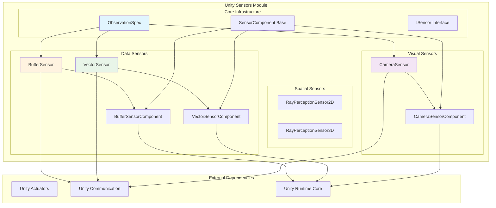
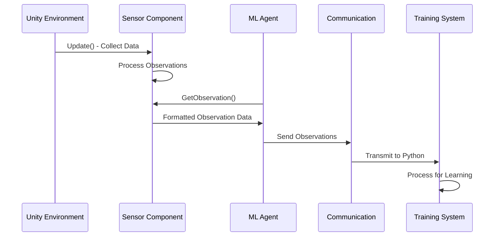

# Unity ML-Agents Sensors Module

## Overview

The Unity Sensors module is a critical component of the Unity ML-Agents framework that provides various sensor implementations for collecting environmental observations. This module enables agents to perceive their environment through different modalities including visual, spatial, and custom data streams, forming the foundation for intelligent decision-making in machine learning applications.

## Purpose

The sensors module serves as the primary interface between Unity environments and ML agents, responsible for:

- **Environmental Perception**: Converting Unity scene data into structured observations
- **Multi-modal Sensing**: Supporting visual, spatial, and custom sensor types
- **Data Processing**: Handling observation compression, stacking, and formatting
- **Flexible Integration**: Providing component-based architecture for easy sensor attachment

## Architecture Overview

The unity_sensors module follows a component-based architecture that integrates seamlessly with Unity's GameObject system and the broader ML-Agents framework.

## Module Dependencies

The unity_sensors module has key relationships with other modules in the ML-Agents ecosystem:

- **[unity_runtime_core](unity_runtime_core.md)**: Integrates with Agent components for observation collection
- **[unity_actuators](unity_actuators.md)**: Provides complementary action execution capabilities
- **[unity_communication](unity_communication.md)**: Transmits sensor data to training environments
- **[unity_policies](unity_policies.md)**: Supplies observation data for policy decision-making

## Core Components

### Observation Specification System
- **ObservationSpec**: Defines the structure, dimensions, and properties of sensor observations
- Supports vector, visual, and variable-length observation types
- Handles dimension properties for neural network optimization

### Visual Sensing Capabilities
- **CameraSensor**: Captures visual observations from Unity Camera components
- **CameraSensorComponent**: Unity component wrapper for easy camera sensor integration
- Supports RGB and grayscale image capture with configurable compression

### Spatial Perception Systems
- **RayPerceptionSensorComponent2D/3D**: Implements ray-casting for spatial awareness
- Provides distance and object detection capabilities in 2D and 3D environments
- Configurable ray patterns and detection parameters

### Data Collection Infrastructure
- **VectorSensor**: Handles numerical observation data
- **BufferSensor**: Manages variable-length observation sequences
- Component wrappers for Unity Inspector integration

## Sub-modules

Based on the complexity and functionality, the unity_sensors module is organized into the following specialized sub-modules:

### 1. Visual Sensors
Handles camera-based visual observations including image capture, processing, and compression. This sub-module provides the core visual perception capabilities for ML agents through Unity's camera system.

**Key Components:**
- CameraSensor: Core visual observation capture
- CameraSensorComponent: Unity component integration
- Visual observation processing and compression

For detailed information, see [Visual Sensors Documentation](visual_sensors.md)

### 2. Spatial Sensors  
Manages ray-casting and spatial perception capabilities for 2D and 3D environments. Enables agents to perceive spatial relationships and detect objects through configurable ray-casting patterns.

**Key Components:**
- RayPerceptionSensorComponent2D: 2D spatial sensing
- RayPerceptionSensorComponent3D: 3D spatial sensing with vertical offset support
- Configurable ray patterns and detection parameters

For detailed information, see [Spatial Sensors Documentation](spatial_sensors.md)

### 3. Data Sensors
Provides vector and buffer-based data collection for numerical and variable-length observations. Supports both fixed-size numerical data and dynamic sequences of observations.

**Key Components:**
- VectorSensorComponent: Fixed-size numerical observations
- BufferSensor & BufferSensorComponent: Variable-length observation sequences
- Observation stacking and data management

For detailed information, see [Data Sensors Documentation](data_sensors.md)

### 4. Sensor Infrastructure
Contains core interfaces, specifications, and base components that support all sensor types. Provides the foundational architecture for observation specification and sensor integration.

**Key Components:**
- ObservationSpec: Defines observation structure and properties
- Core sensor interfaces and base classes
- Observation type definitions and dimension properties

For detailed information, see [Sensor Infrastructure Documentation](sensor_infrastructure.md)

## Key Features

### Multi-Modal Observation Support
- **Visual Observations**: RGB/Grayscale image capture from cameras
- **Spatial Observations**: Ray-casting for distance and collision detection
- **Vector Observations**: Numerical data arrays for custom metrics
- **Buffer Observations**: Variable-length sequences for dynamic environments

### Performance Optimization
- **Observation Compression**: PNG compression for visual data transmission
- **Observation Stacking**: Temporal observation aggregation for improved learning
- **Efficient Memory Management**: Proper resource cleanup and disposal patterns

### Unity Integration
- **Component-Based Design**: Easy drag-and-drop sensor attachment
- **Inspector Configuration**: Runtime parameter adjustment through Unity Editor
- **GameObject Lifecycle**: Proper initialization, update, and cleanup integration

## Data Flow Architecture

## Integration Points

### With Unity Runtime Core
- Sensors integrate with Agent components through the ISensor interface
- DecisionRequester triggers sensor updates during decision cycles
- Agent parameters configure sensor behavior and observation handling

### With Unity Communication
- Sensor observations are transmitted through the communication layer
- Compression specifications optimize data transfer efficiency
- Observation metadata supports proper data interpretation

### With Training Systems
- Sensor specifications inform neural network architecture
- Observation types guide training algorithm selection
- Dimension properties enable optimization techniques like convolution

## Usage Patterns

### Basic Sensor Setup
1. Attach sensor component to GameObject
2. Configure sensor parameters in Unity Inspector
3. Sensor automatically integrates with attached Agent
4. Observations flow to training system during episodes

### Advanced Configuration
- Custom observation specifications for specialized use cases
- Observation stacking for temporal awareness
- Compression settings for bandwidth optimization
- Multi-sensor combinations for rich environmental perception

## Performance Considerations

- **Visual Sensors**: Consider resolution vs. performance trade-offs
- **Ray Sensors**: Balance ray count with computational overhead  
- **Buffer Sensors**: Manage memory usage with appropriate size limits
- **Observation Stacking**: Monitor memory impact of temporal aggregation

## Future Extensibility

The modular design supports:
- Custom sensor implementations through ISensor interface
- New observation types via ObservationSpec extensions
- Additional compression formats for specialized use cases
- Integration with emerging Unity rendering and physics systems