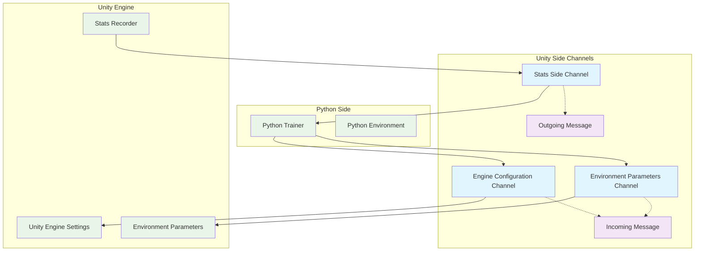
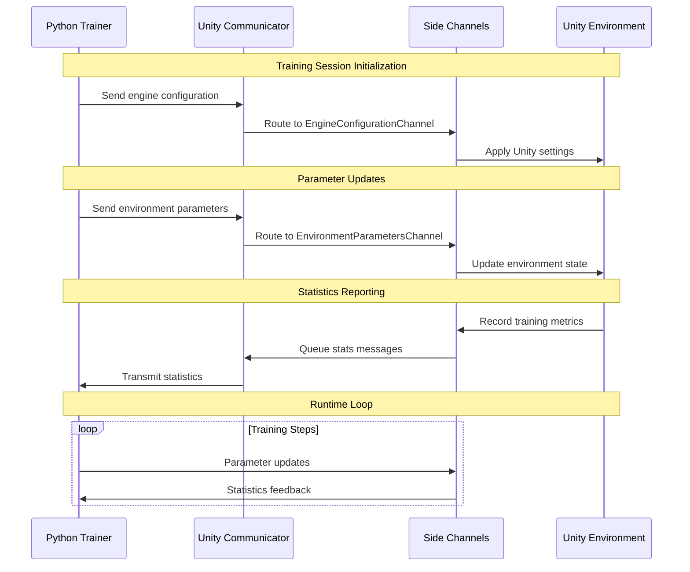

# Unity Side Channels Module

## Overview

The Unity Side Channels module provides a bidirectional communication system between Unity environments and external Python training processes in the ML-Agents framework. This module enables real-time parameter exchange, environment configuration, and statistics reporting during training and inference phases.

## Purpose

Side channels serve as auxiliary communication pathways that complement the main agent observation-action loop. They allow:

- **Environment Configuration**: Dynamic adjustment of Unity engine settings from Python
- **Parameter Management**: Runtime modification of environment parameters and hyperparameters  
- **Statistics Reporting**: Real-time transmission of training metrics and performance data
- **Flexible Data Exchange**: Bidirectional communication using structured message protocols

## Architecture Overview

The module implements a message-based communication system with specialized channels for different data types and purposes:



## Core Components

The Unity Side Channels module is organized into two main sub-modules:

### Communication Channels
Specialized channel implementations for different types of data exchange between Unity and Python environments. This sub-module includes three distinct channels, each optimized for specific communication patterns and data types.

**Key Features:**
- Engine configuration management from Python
- Dynamic environment parameter updates with callback support
- Real-time statistics reporting to training systems
- Type-specific message handling and validation

For detailed information, see [Communication Channels Documentation](communication_channels.md).

### Message Infrastructure
Core messaging system providing serialization and deserialization capabilities for all side channel communications. This sub-module implements the fundamental building blocks for type-safe, efficient data exchange.

**Key Features:**
- Binary serialization with type safety
- Stream-based processing for memory efficiency
- Support for primitives, strings, and collections
- Robust error handling and resource management

For detailed information, see [Message Infrastructure Documentation](message_infrastructure.md).

## Data Flow Architecture



## Integration with ML-Agents Ecosystem

The Unity Side Channels module integrates seamlessly with other ML-Agents components:

### Communication Layer
- **Dependency**: [unity_communication.md](unity_communication.md) - Provides the underlying RPC communication infrastructure
- **Integration**: Side channels are registered with and managed by the main communicator

### Training Infrastructure  
- **Dependency**: [training_core.md](training_core.md) - Consumes statistics and provides parameter updates
- **Integration**: Training algorithms use side channels for hyperparameter tuning and metric collection

### Python Environment
- **Dependency**: [python_side_channels.md](python_side_channels.md) - Provides Python-side channel implementations
- **Integration**: Bidirectional channel pairing for complete communication pipeline

## Key Features

### Type Safety
- Strongly typed message serialization/deserialization
- Default value handling for robust communication
- Comprehensive error handling and validation

### Performance Optimization
- Efficient binary encoding for minimal overhead
- Stream-based processing for memory efficiency
- Lazy evaluation for parameter sampling

### Extensibility
- Abstract base classes for custom channel implementation
- Flexible message format supporting various data types
- Plugin architecture for domain-specific channels

### Configuration Management
- Runtime engine parameter modification
- Statistical sampler support for parameter randomization
- Callback system for reactive parameter handling

## Usage Patterns

### Engine Configuration
```csharp
// Automatically handled by EngineConfigurationChannel
// Python sends configuration commands
// Unity applies settings to engine systems
```

### Environment Parameters
```csharp
// Register parameter callbacks
environmentChannel.RegisterCallback("learning_rate", (value) => {
    // Handle parameter update
});

// Get parameters with defaults
float speed = environmentChannel.GetWithDefault("agent_speed", 1.0f);
```

### Statistics Reporting
```csharp
// Report training metrics
statsChannel.AddStat("episode_reward", reward, StatAggregationMethod.Average);
statsChannel.AddStat("success_rate", successRate, StatAggregationMethod.Most_Recent);
```

## Technical Specifications

### Message Format
- **Encoding**: Binary serialization using BinaryReader/BinaryWriter
- **Endianness**: Platform-dependent (typically little-endian)
- **String Encoding**: ASCII with length prefixes
- **Collection Format**: Length-prefixed arrays

### Channel Identification
- **Engine Configuration**: `e951342c-4f7e-11ea-b238-784f4387d1f7`
- **Environment Parameters**: `534c891e-810f-11ea-a9d0-822485860400`  
- **Statistics**: `a1d8f7b7-cec8-50f9-b78b-d3e165a78520`

### Supported Data Types
- **Primitives**: Boolean, Int32, Float32
- **Strings**: ASCII-encoded with length prefixes
- **Collections**: Float arrays/lists with count prefixes
- **Complex**: Statistical samplers (Uniform, Gaussian, MultiRangeUniform)

## Error Handling

The module implements comprehensive error handling:

- **Version Compatibility**: Warnings for unknown message types
- **Data Validation**: Type checking and bounds validation
- **Resource Management**: Proper disposal of streams and readers
- **Graceful Degradation**: Default values when data is unavailable

## Performance Considerations

- **Memory Efficiency**: Stream-based processing minimizes allocations
- **CPU Optimization**: Binary encoding reduces serialization overhead
- **Network Efficiency**: Compact message format reduces bandwidth usage
- **Threading**: Thread-safe message queuing and processing