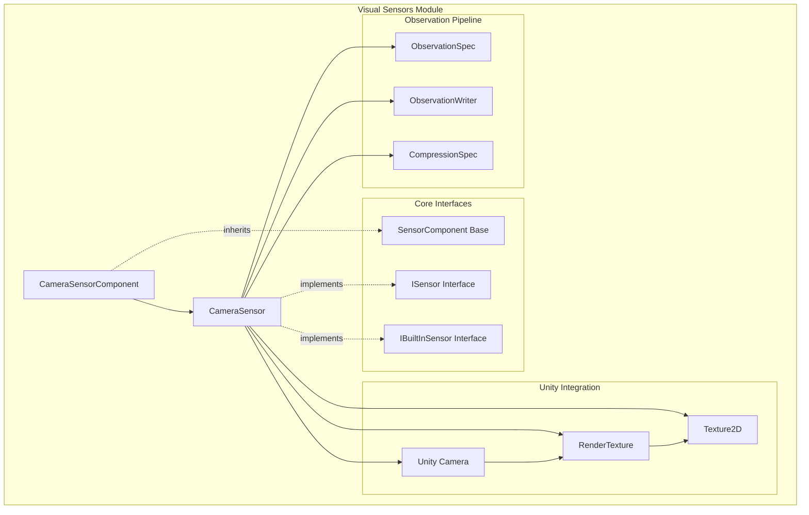
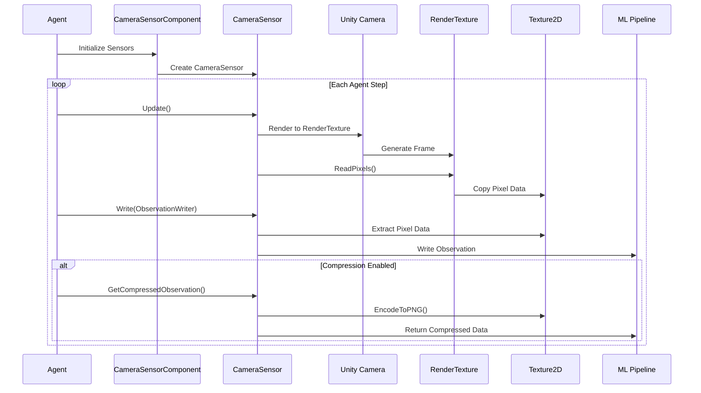
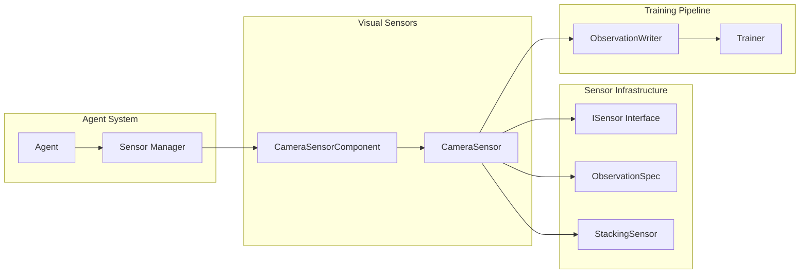
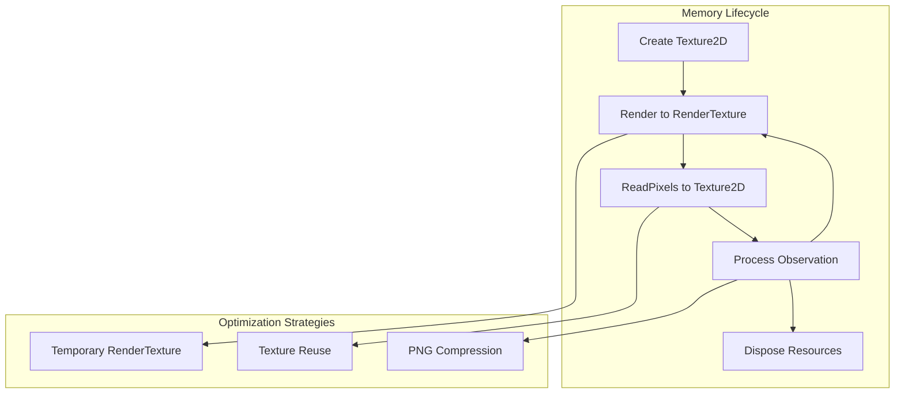

# Visual Sensors Module

The visual_sensors module provides camera-based observation capabilities for Unity ML-Agents, enabling agents to perceive their environment through visual input. This module is part of the broader [unity_sensors](unity_sensors.md) system and specializes in capturing and processing visual observations from Unity Camera components.

## Overview

Visual sensors transform Unity Camera outputs into structured observations that can be consumed by machine learning models. The module handles image capture, format conversion, compression, and integration with the ML-Agents observation pipeline. It supports both color and grayscale observations with configurable resolution and compression settings.

## Architecture



## Core Components

### CameraSensor

The `CameraSensor` class is the primary component that wraps a Unity Camera to generate visual observations.

**Key Features:**
- **Camera Integration**: Direct integration with Unity Camera components
- **Format Support**: Both color (RGB) and grayscale observations
- **Compression**: PNG compression for efficient data transmission
- **Resolution Control**: Configurable width and height for observations
- **Performance Optimization**: Efficient texture rendering and memory management

**Core Methods:**
- `Update()`: Captures current camera frame to internal texture
- `Write(ObservationWriter)`: Writes uncompressed observation data
- `GetCompressedObservation()`: Returns PNG-compressed image data
- `ObservationToTexture()`: Static utility for camera-to-texture rendering

### CameraSensorComponent

The `CameraSensorComponent` provides Unity Editor integration and configuration management for camera sensors.

**Configuration Options:**
- **Camera Reference**: Target Unity Camera component
- **Resolution**: Width and height of captured observations
- **Color Mode**: Grayscale or color (RGB) output
- **Compression**: PNG compression settings
- **Observation Stacking**: Support for temporal observation stacking
- **Runtime Control**: Enable/disable camera during runtime for performance

## Data Flow



## Integration with Unity ML-Agents

### Sensor Infrastructure Integration

The visual sensors module integrates with the broader sensor infrastructure:



### Observation Specification

Visual sensors use the `ObservationSpec.Visual()` factory method to define their observation characteristics:

- **Shape**: `[channels, height, width]` where channels = 1 (grayscale) or 3 (RGB)
- **Dimension Properties**: Translational equivariance for height and width dimensions
- **Observation Type**: Default or goal-based observations

## Performance Considerations

### Memory Management



### Performance Optimizations

1. **Temporary RenderTexture Usage**: Uses `RenderTexture.GetTemporary()` for efficient memory allocation
2. **Camera State Management**: Preserves and restores camera settings during rendering
3. **Conditional Camera Enabling**: Runtime camera control for performance optimization
4. **Compression Support**: PNG compression reduces data transmission overhead

## Configuration Examples

### Basic Camera Sensor Setup

```csharp
// Create camera sensor with standard settings
var cameraSensor = new CameraSensor(
    camera: myCamera,
    width: 84,
    height: 84,
    grayscale: false,
    name: "CameraSensor",
    compression: SensorCompressionType.PNG
);
```

### Component Configuration

```csharp
// Configure CameraSensorComponent in Unity Editor
cameraSensorComponent.Camera = myCamera;
cameraSensorComponent.Width = 128;
cameraSensorComponent.Height = 128;
cameraSensorComponent.Grayscale = true;
cameraSensorComponent.CompressionType = SensorCompressionType.PNG;
cameraSensorComponent.ObservationStacks = 4; // Stack 4 frames
```

## Dependencies

### Internal Dependencies
- **[sensor_infrastructure](sensor_infrastructure.md)**: Core sensor interfaces and specifications
- **[unity_runtime_core](unity_runtime_core.md)**: Agent integration and lifecycle management

### Unity Dependencies
- **UnityEngine.Camera**: Core camera functionality
- **UnityEngine.RenderTexture**: Render target management
- **UnityEngine.Texture2D**: Texture data processing
- **UnityEngine.Rendering**: Graphics pipeline integration

### External Dependencies
- **System.IDisposable**: Resource cleanup interface
- **PNG Encoding**: Built-in Unity texture compression

## Related Modules

- **[spatial_sensors](spatial_sensors.md)**: Ray-based perception sensors
- **[data_sensors](data_sensors.md)**: Vector and buffer-based sensors
- **[unity_actuators](unity_actuators.md)**: Action execution system
- **[training_core](training_core.md)**: Model training pipeline

## Best Practices

### Camera Setup
1. **Resolution Selection**: Balance observation quality with computational cost
2. **Color vs Grayscale**: Use grayscale for simpler environments to reduce data size
3. **Camera Positioning**: Ensure camera captures relevant environmental information
4. **Lighting Considerations**: Maintain consistent lighting for stable observations

### Performance Optimization
1. **Runtime Camera Control**: Disable cameras when not needed for training
2. **Observation Stacking**: Use temporal stacking for motion-dependent tasks
3. **Compression Usage**: Enable PNG compression for network training scenarios
4. **Resolution Tuning**: Start with lower resolutions and increase as needed

### Integration Guidelines
1. **Sensor Naming**: Use consistent, descriptive names for deterministic sensor ordering
2. **Multiple Cameras**: Consider multiple camera angles for complex environments
3. **Observation Types**: Use appropriate observation types for goal-conditioned tasks
4. **Memory Management**: Properly dispose of sensors to prevent memory leaks

The visual_sensors module provides a robust foundation for visual perception in Unity ML-Agents, enabling agents to learn from rich visual information while maintaining performance and flexibility in diverse training scenarios.