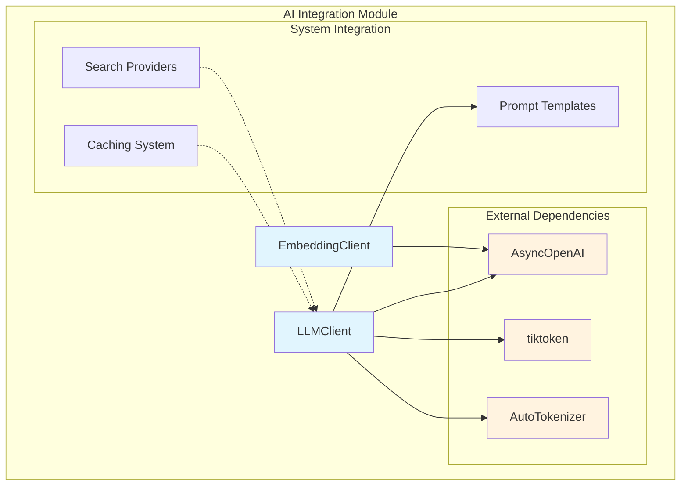
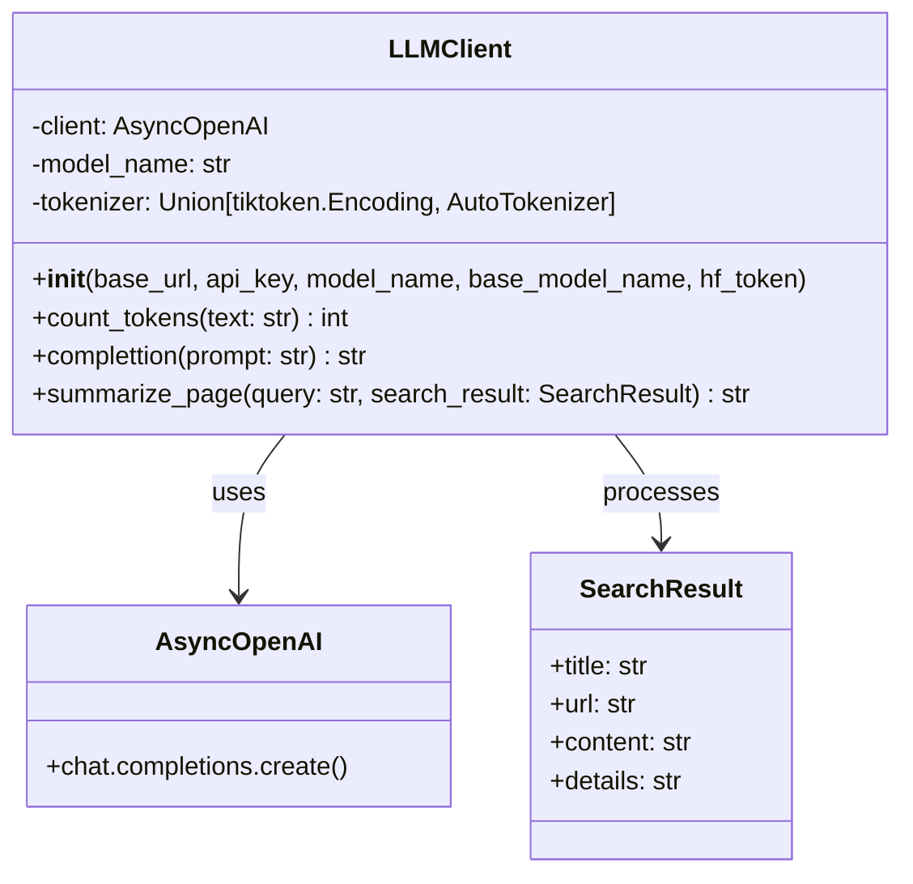
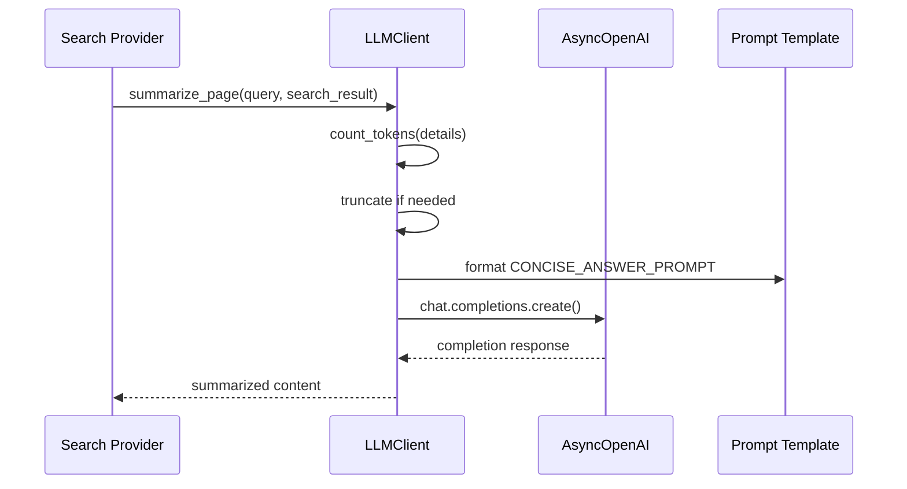
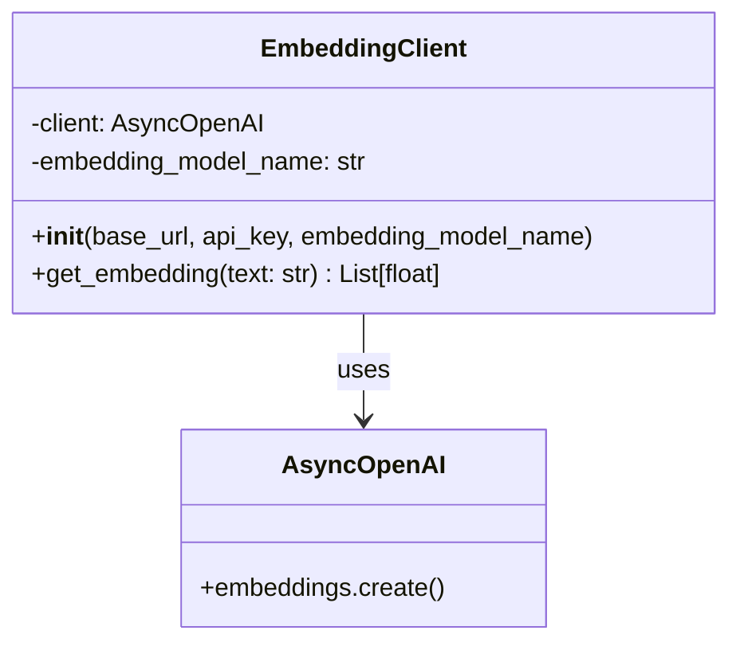
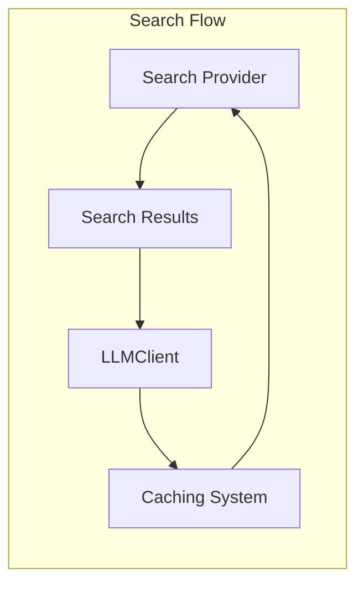
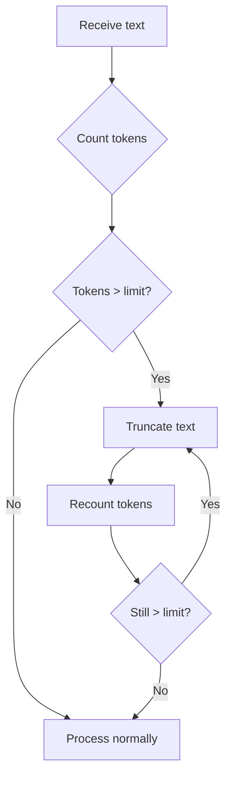
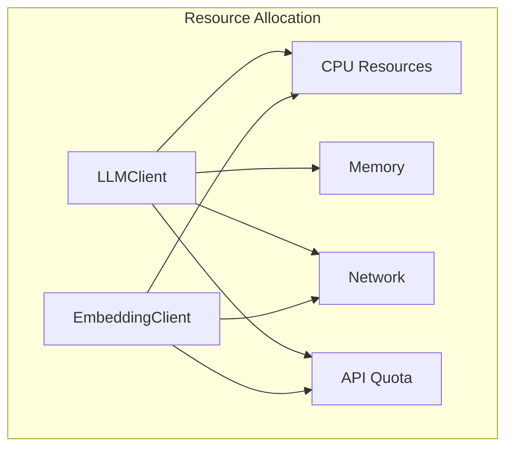

# AI Integration Module Documentation

## Introduction

The AI Integration module serves as the core intelligence layer of the search system, providing LLM-powered text processing and embedding capabilities. This module abstracts the complexity of interacting with various AI models and provides a unified interface for text generation, summarization, and semantic understanding through embeddings.

The module consists of two primary components: `LLMClient` for language model operations and `EmbeddingClient` for generating text embeddings. These components work together to enable intelligent search result processing and semantic analysis capabilities throughout the system.

## Architecture Overview



## Core Components

### LLMClient

The `LLMClient` is the primary interface for interacting with Large Language Models. It provides comprehensive text processing capabilities including token counting, text completion, and intelligent page summarization.

#### Key Features
- **Multi-tokenizer Support**: Automatically selects between tiktoken and Hugging Face tokenizers based on model availability
- **Async Operations**: Fully asynchronous implementation for non-blocking operations
- **Token Management**: Intelligent token counting and truncation to stay within model limits
- **Content Summarization**: Specialized page summarization with context-aware truncation

#### Architecture



#### Data Flow



### EmbeddingClient

The `EmbeddingClient` provides a streamlined interface for generating text embeddings, enabling semantic analysis and similarity comparisons across the system.

#### Key Features
- **Async Embedding Generation**: Non-blocking embedding creation for optimal performance
- **OpenAI Compatibility**: Works with any OpenAI-compatible embedding API
- **Simple Interface**: Clean API for converting text to vector representations

#### Architecture



## Integration with System Components

### Search Provider Integration

The AI Integration module works closely with [search-providers.md](search-providers.md) to process and enhance search results:



### Caching System Integration

The module leverages the [caching-system.md](caching-system.md) for performance optimization:

- **Short-term caching**: Caches LLM responses for frequently asked queries
- **Long-term caching**: Stores embeddings for persistent semantic analysis
- **Cache invalidation**: Smart cache management based on content freshness

## Configuration and Usage

### LLMClient Configuration

```python
# Initialize LLMClient
llm_client = LLMClient(
    base_url="https://api.openai.com/v1",
    api_key="your-api-key",
    model_name="gpt-3.5-turbo",
    base_model_name="gpt-3.5-turbo",
    hf_token="optional-huggingface-token"
)

# Summarize a search result
summary = await llm_client.summarize_page(
    query="climate change effects",
    search_result=search_result
)
```

### EmbeddingClient Configuration

```python
# Initialize EmbeddingClient
embedding_client = EmbeddingClient(
    base_url="https://api.openai.com/v1",
    api_key="your-api-key",
    embedding_model_name="text-embedding-ada-002"
)

# Generate embedding
embedding = await embedding_client.get_embedding("text to embed")
```

## Error Handling and Resilience

### Token Limit Management

The LLMClient implements intelligent token management:



### Fallback Mechanisms

- **Tokenizer Fallback**: Automatically falls back to Hugging Face tokenizer if tiktoken fails
- **API Error Handling**: Implements retry logic for transient API failures
- **Content Truncation**: Graceful degradation when content exceeds limits

## Performance Considerations

### Optimization Strategies

1. **Async Operations**: All API calls are asynchronous to prevent blocking
2. **Token Pre-counting**: Pre-calculates tokens to avoid API rejections
3. **Smart Truncation**: Truncates at line boundaries to maintain context
4. **Model Selection**: Uses appropriate models for different tasks

### Resource Management



## Security and Privacy

### API Key Management
- Keys are passed during initialization, not stored in code
- Supports environment variable configuration
- Implements secure transmission protocols

### Data Privacy
- No persistent storage of user queries or responses
- Optional local tokenization for sensitive data
- Compliant with data protection regulations

## Monitoring and Observability

### Key Metrics
- **Token Usage**: Track token consumption per operation
- **API Latency**: Monitor response times from AI providers
- **Error Rates**: Track failures and retry attempts
- **Cache Hit Rates**: Monitor caching effectiveness

### Logging Strategy
- Structured logging for all API interactions
- Error logging with context for debugging
- Performance metrics for optimization insights

## Future Enhancements

### Planned Features
1. **Multi-model Support**: Support for additional LLM providers
2. **Batch Processing**: Efficient batch embedding generation
3. **Streaming Responses**: Real-time response streaming for better UX
4. **Custom Models**: Support for fine-tuned and custom models

### Scalability Improvements
- **Connection Pooling**: Efficient connection management
- **Rate Limiting**: Intelligent rate limiting strategies
- **Load Balancing**: Distribute requests across multiple endpoints

## Dependencies

### External Dependencies
- **openai**: AsyncOpenAI client for API interactions
- **tiktoken**: Efficient token counting for OpenAI models
- **transformers**: Hugging Face tokenizer support

### Internal Dependencies
- **schemas**: SearchResult data structure
- **prompt_template**: CONCISE_ANSWER_PROMPT template
- **constants**: Configuration constants

## Conclusion

The AI Integration module provides a robust, scalable foundation for incorporating AI capabilities into the search system. Through careful abstraction and async design, it enables efficient text processing and semantic analysis while maintaining flexibility for future enhancements. The module's integration with caching and search components creates a cohesive system that delivers intelligent, context-aware search results.