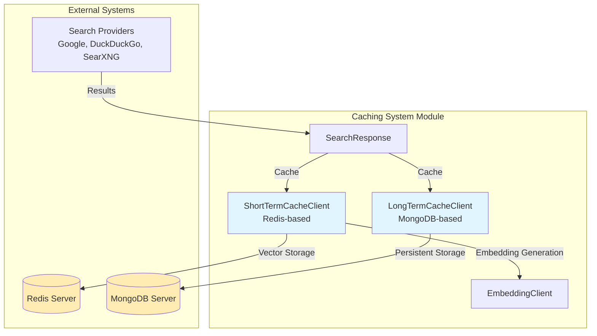
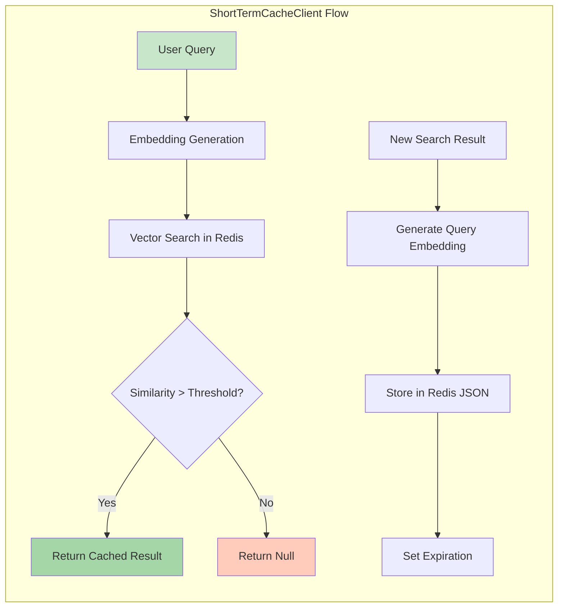
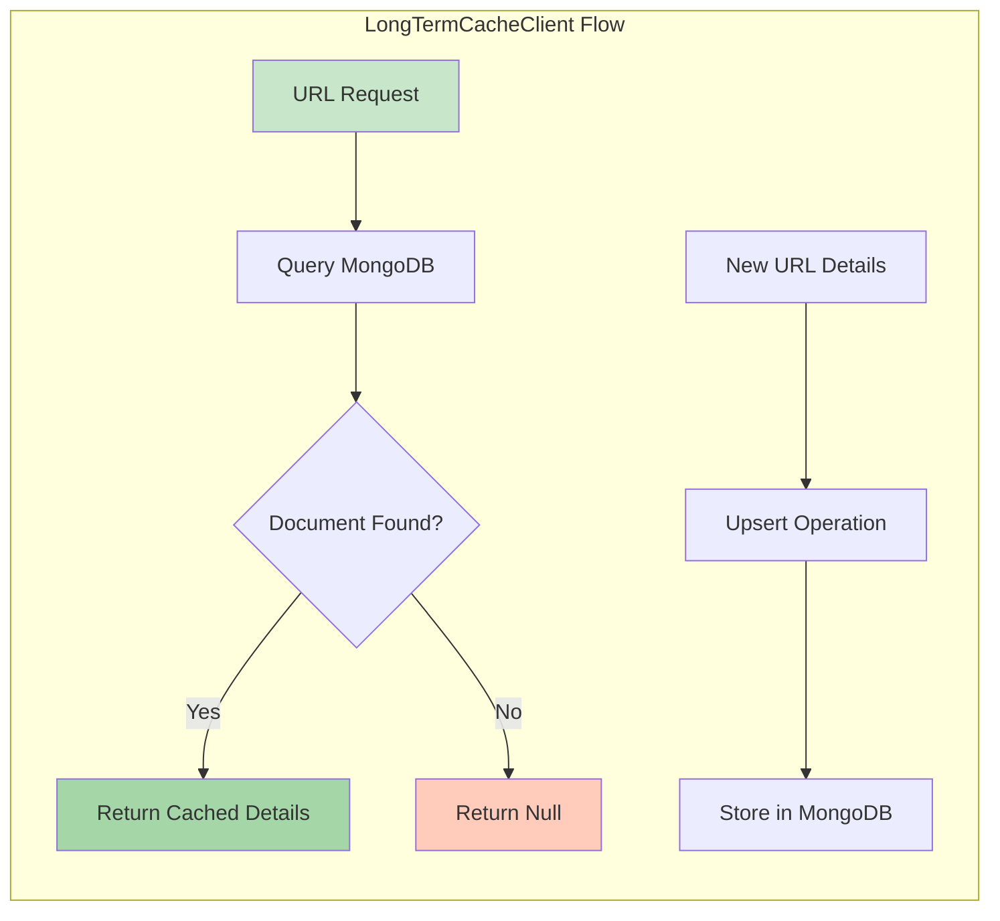
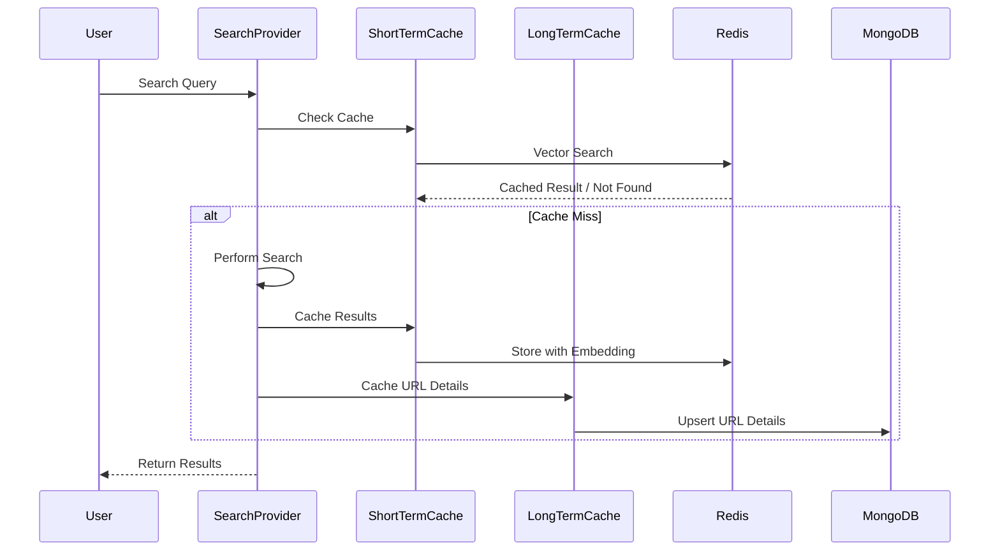
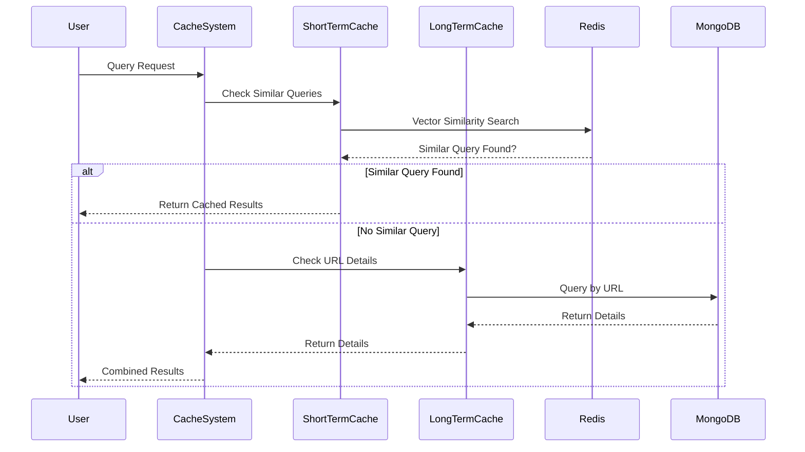
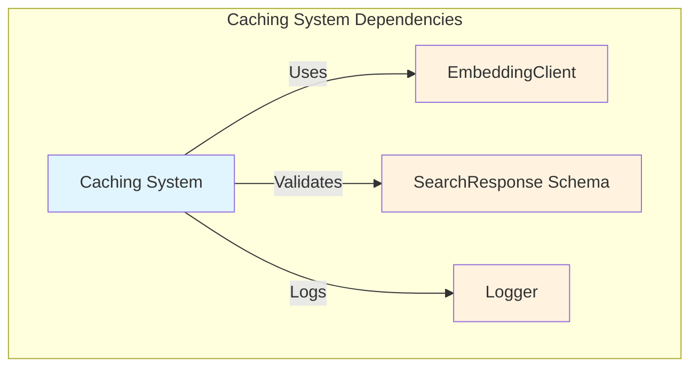
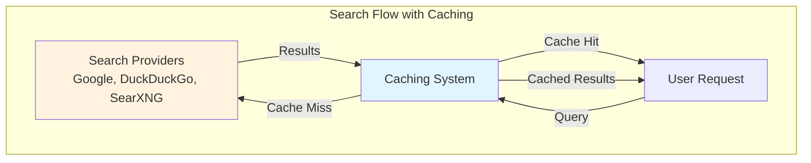

# Caching System Module Documentation

## Introduction

The caching-system module provides a dual-layer caching mechanism for search results, implementing both short-term and long-term storage strategies. This module is designed to optimize search performance by storing frequently accessed data and reducing redundant API calls to external search providers.

The caching system consists of two main components:
- **ShortTermCacheClient**: A Redis-based cache with vector similarity search capabilities for query-based caching
- **LongTermCacheClient**: A MongoDB-based cache for persistent storage of URL-specific details

## Architecture Overview



## Core Components

### ShortTermCacheClient

The `ShortTermCacheClient` implements a sophisticated caching mechanism using Redis as the backend storage. It provides vector similarity search capabilities, allowing the system to find cached results for semantically similar queries.

#### Key Features:
- **Vector Similarity Search**: Uses Redis RediSearch with vector fields to find similar queries
- **Time-based Expiration**: Configurable expiration time for cache entries
- **Semantic Matching**: Employs cosine similarity for vector comparison
- **JSON Storage**: Utilizes Redis JSON for structured data storage

#### Architecture:



#### Implementation Details:

```python
# Index Configuration
index_name = "idx:search_vss"
schema = VectorField(
    "$.query_embedding",
    "FLAT",
    {
        "TYPE": "FLOAT32",
        "DIM": embedding_dim,
        "DISTANCE_METRIC": "COSINE",
    },
    as_name="vector"
)
```

The client creates a Redis search index with vector fields that enable K-nearest neighbor (KNN) searches. When a query is received, it:

1. Generates an embedding for the query using the `EmbeddingClient`
2. Performs a KNN search to find the most similar cached query
3. Checks if the similarity score exceeds the configured threshold
4. Returns the cached result if found, or `None` if no suitable match exists

### LongTermCacheClient

The `LongTermCacheClient` provides persistent caching capabilities using MongoDB as the backend storage. It focuses on caching detailed information associated with specific URLs, making it ideal for storing scraped content or detailed page information that doesn't change frequently.

#### Key Features:
- **URL-based Indexing**: Unique index on URL field for fast lookups
- **Persistent Storage**: MongoDB provides durable, long-term storage
- **Upsert Operations**: Efficient update-or-insert operations
- **Detail Caching**: Specifically designed for caching URL-specific details

#### Architecture:



#### Implementation Details:

The client creates a unique index on the URL field to ensure fast lookups and prevent duplicate entries. The caching strategy is particularly effective for:
- Web scraping results
- Page metadata
- URL-specific content that remains relatively static
- Detailed information that complements search results

## Data Flow

### Search Result Caching Process



### Cache Retrieval Process



## Dependencies

### Internal Dependencies

The caching-system module depends on several internal components:



- **[EmbeddingClient](embedding-client.md)**: Used by `ShortTermCacheClient` to generate vector embeddings for queries
- **[SearchResponse Schema](schemas.md)**: Validates and structures cached data
- **[Logger](logs.md)**: Provides logging functionality for cache operations

### External Dependencies

- **Redis Server**: Required for `ShortTermCacheClient` operations
- **MongoDB Server**: Required for `LongTermCacheClient` operations
- **Redis-py**: Python Redis client library
- **PyMongo**: Python MongoDB driver
- **NumPy**: For vector operations

## Integration with Search Providers

The caching system integrates seamlessly with the [search-providers](search-providers.md) module:



The caching system acts as an intermediary layer between users and search providers, significantly reducing response times for repeated or similar queries while maintaining data freshness through configurable expiration policies.

## Configuration

### ShortTermCacheClient Configuration

- **redis_url**: Connection string for Redis instance
- **expire_time**: Cache expiration time in seconds
- **sim_threshold**: Similarity threshold for vector matching (0.0 to 1.0)
- **embedding_dim**: Dimension of vector embeddings
- **embedding_client**: Instance of EmbeddingClient for vector generation

### LongTermCacheClient Configuration

- **mongo_url**: Connection string for MongoDB instance
- **db_name**: Name of the MongoDB database
- **collection_name**: Name of the collection for cache storage

## Best Practices

1. **Cache Key Strategy**: Use consistent hashing for cache keys to ensure uniform distribution
2. **Similarity Threshold**: Set appropriate similarity thresholds based on your use case (higher for stricter matching)
3. **Expiration Policies**: Configure expiration times based on data volatility and update frequency
4. **Index Management**: Monitor Redis and MongoDB index performance and optimize as needed
5. **Error Handling**: Implement proper error handling for cache misses and connection failures

## Performance Considerations

- **Vector Search Performance**: Redis vector search performance depends on embedding dimensions and dataset size
- **Memory Usage**: Monitor Redis memory usage for vector storage
- **MongoDB Indexing**: Ensure proper indexing for optimal query performance
- **Network Latency**: Consider co-locating cache servers with application servers to minimize latency

## Monitoring and Maintenance

- Monitor cache hit rates to evaluate effectiveness
- Track Redis memory usage and implement eviction policies if necessary
- Monitor MongoDB query performance and optimize indexes
- Set up alerts for cache server connectivity issues
- Regular cleanup of expired entries (handled automatically by Redis TTL)