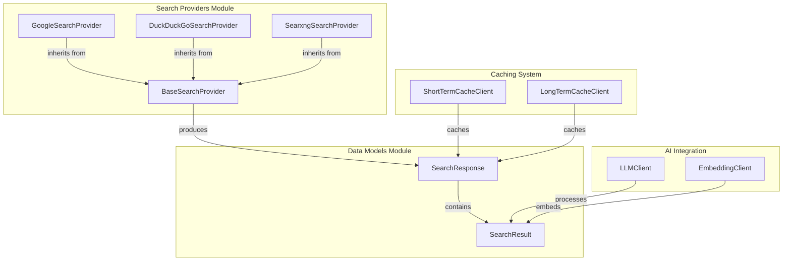
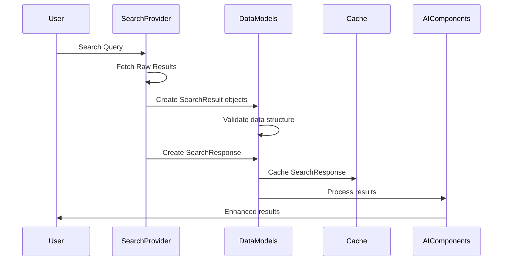
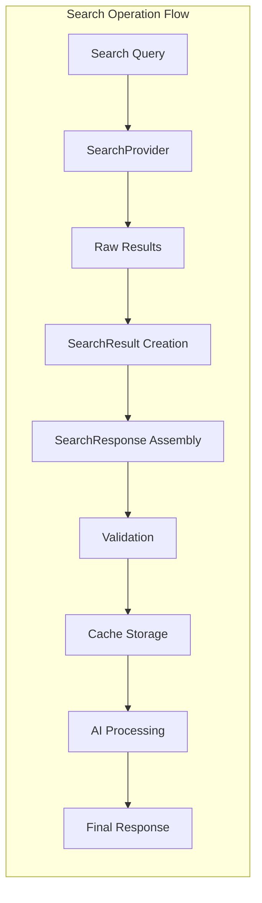

# Data Models Module Documentation

## Introduction

The data-models module serves as the foundational schema layer for the search system, providing standardized data structures that facilitate consistent data exchange between different components. This module defines the core data models used throughout the system to represent search results and responses, ensuring type safety and data integrity across the entire application.

## Module Overview

The data-models module is a lightweight but critical component that establishes the contract for how search data is structured and validated. By leveraging Pydantic's BaseModel, it provides automatic validation, serialization, and deserialization capabilities that are essential for maintaining data consistency across the system's distributed architecture.

## Core Components

### SearchResult

The `SearchResult` class represents individual search results returned by various search providers. It encapsulates all essential metadata about a search result, including the title, URL, content summary, and optional fields for additional details and direct answers.

**Key Features:**
- **Title**: The display title of the search result
- **URL**: The direct link to the source content
- **Content**: A summary or snippet of the relevant content
- **Details**: Optional field for additional metadata or extended descriptions
- **Answer**: Optional field for direct answers extracted from the content

**Usage Context:**
This model is used by all search providers ([search-providers.md](search-providers.md)) to standardize the format of search results before they are processed by downstream components. The optional fields provide flexibility for different search providers to include additional context when available.

### SearchResponse

The `SearchResponse` class aggregates multiple search results into a cohesive response structure. It represents the complete output of a search operation, linking the original query with its corresponding results.

**Key Features:**
- **Query**: The original search query string
- **Results**: A list of `SearchResult` objects containing the search findings
- **Default Factory**: Ensures results list is initialized as empty by default

**Usage Context:**
This model serves as the primary interface between the search providers and the rest of the system, providing a consistent format that other components can reliably consume and process.

## Architecture

## Data Flow

## Component Interactions

## Integration Points

### With Search Providers
The data models serve as the standard output format for all search providers. Each provider implementation in the [search-providers.md](search-providers.md) module must convert its specific API responses into the standardized `SearchResult` and `SearchResponse` formats. This ensures consistency regardless of the underlying search engine being used.

### With Caching System
The [caching-system.md](caching-system.md) module utilizes these data models to determine cache keys and store structured search responses. The consistent format enables efficient caching strategies and cache invalidation policies based on query strings and result content.

### With AI Integration
The [ai-integration.md](ai-integration.md) module processes the structured data provided by these models. The `LLMClient` can analyze the `content` and `answer` fields for natural language processing tasks, while the `EmbeddingClient` can generate vector representations of the search results for similarity matching and clustering operations.

## Data Validation and Type Safety

The use of Pydantic BaseModel provides several advantages:

1. **Automatic Validation**: All fields are validated against their declared types
2. **Serialization Support**: Easy conversion to/from JSON for API responses
3. **Documentation**: Self-documenting field definitions
4. **IDE Support**: Enhanced autocomplete and type checking

## Extension Points

The modular design allows for future extensions:

- **Additional Fields**: New optional fields can be added to `SearchResult` without breaking existing implementations
- **New Models**: Additional data models can be created for specialized use cases
- **Validation Rules**: Custom validators can be added for business logic requirements

## Best Practices

1. **Consistent Usage**: Always use these models when passing search data between components
2. **Validation First**: Let Pydantic handle validation rather than implementing custom checks
3. **Optional Fields**: Use optional fields judiciously to maintain backward compatibility
4. **Documentation**: Document any custom validators or additional models created

## Dependencies

- **pydantic**: Core dependency for data validation and serialization
- **typing**: Standard library for type hints

## Future Considerations

- **Performance**: Consider implementing custom validators for large-scale operations
- **Schema Evolution**: Plan for versioning if significant changes are needed
- **Internationalization**: Consider how multilingual content should be handled in the schema
- **Analytics**: Potential addition of metadata fields for tracking and analytics purposes