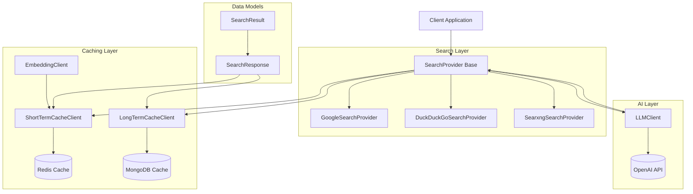
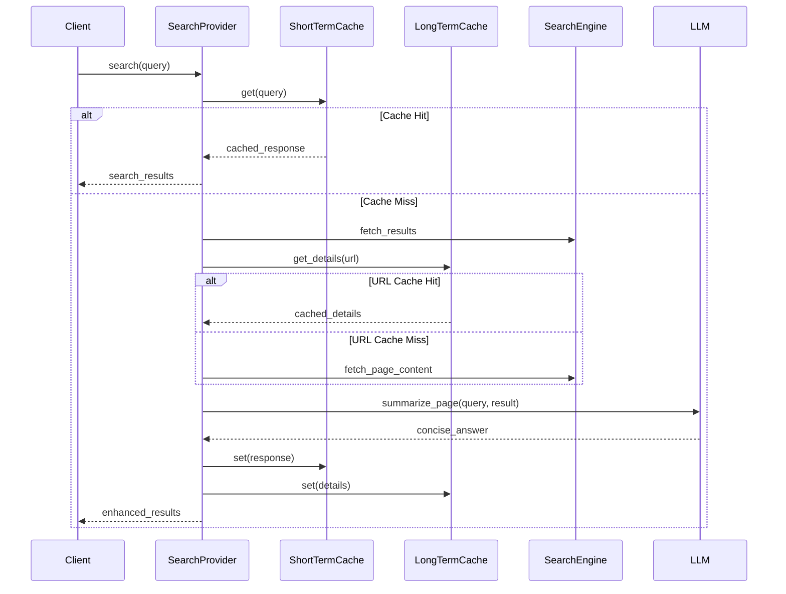

# anhnh2002--titan-sight Module Documentation

## Overview

The anhnh2002--titan-sight module is a comprehensive search aggregation and intelligent caching system that provides unified access to multiple search providers while implementing sophisticated caching mechanisms for improved performance. The module integrates various search engines (Google, DuckDuckGo, SearXNG) with AI-powered content summarization and vector-based similarity caching.

## Architecture



## Core Functionality

### 1. Multi-Provider Search Aggregation
The module provides a unified interface to multiple search providers through the `SearchProvider` base class, allowing seamless switching between different search engines while maintaining consistent response formats.

### 2. Intelligent Caching System
Implements a two-tier caching mechanism:
- **Short-term cache**: Redis-based vector similarity search for query-level caching
- **Long-term cache**: MongoDB-based storage for URL-level content caching

### 3. AI-Powered Content Enhancement
Integrates LLM capabilities to generate concise answers and summaries from search results, providing users with more relevant and digestible information.

## Sub-modules

### Search Providers
- **[Search Providers](search-providers.md)**: Unified interface for Google, DuckDuckGo, and SearXNG search providers

### Caching System
- **[Caching System](caching-system.md)**: Redis-based short-term and MongoDB-based long-term caching

### AI Integration
- **[AI Integration](ai-integration.md)**: LLM and embedding clients for AI-powered content enhancement

### Data Models
- **[Data Models](data-models.md)**: Core data structures and schemas

## Key Features

1. **Unified Search Interface**: Single API for multiple search providers
2. **Intelligent Caching**: Vector-based similarity search with Redis and persistent storage with MongoDB
3. **Content Enhancement**: AI-powered summarization and answer generation
4. **Asynchronous Processing**: Full async/await support for high performance
5. **Configurable Timeouts**: Flexible timeout management for different operations
6. **Error Handling**: Robust error handling with fallback mechanisms

## Data Flow



## Configuration

The module requires configuration for:
- Search provider API keys and endpoints
- Redis connection settings
- MongoDB connection settings
- OpenAI API credentials
- Embedding model configuration
- Cache expiration times and similarity thresholds

## Dependencies

- **httpx**: Async HTTP client for API requests
- **redis**: Redis client for caching
- **pymongo**: MongoDB client for persistent storage
- **openai**: OpenAI API client
- **trafilatura**: Web content extraction
- **duckduckgo_search**: DuckDuckGo search integration
- **pydantic**: Data validation and serialization
- **tiktoken**: Token counting for LLM interactions
- **transformers**: Hugging Face tokenizer support

## Usage Example

```python
# Initialize search provider
google_provider = GoogleSearchProvider(api_key="your_key", search_engine_id="your_id")

# Perform search with caching
results = await google_provider.search_in_cache(
    query="python async programming",
    max_num_result=10,
    newest_first=True,
    sumup_page_timeout=30
)

# Access enhanced results
for result in results.results:
    print(f"Title: {result.title}")
    print(f"URL: {result.url}")
    print(f"Summary: {result.content}")
    print(f"AI Answer: {result.answer}")
    print(f"Details: {result.details[:200]}...")
```

## Performance Considerations

- **Async Processing**: All operations are asynchronous for optimal performance
- **Timeout Management**: Configurable timeouts prevent hanging operations
- **Batch Processing**: Multiple results processed concurrently
- **Caching Strategy**: Two-tier caching minimizes redundant API calls
- **Error Recovery**: Graceful degradation when services are unavailable

## Error Handling

The module implements comprehensive error handling:
- Timeout management for all external calls
- Graceful fallback when cache services are unavailable
- Partial result delivery when some operations fail
- Detailed logging for debugging and monitoring

## Security Considerations

- API keys are stored securely and not logged
- Input validation using Pydantic models
- Rate limiting considerations for external APIs
- Secure connections to external services