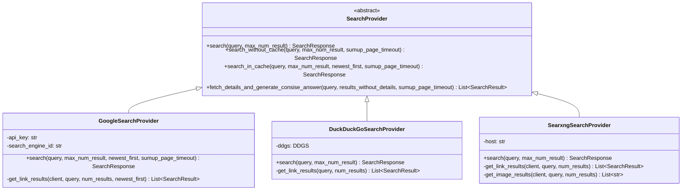
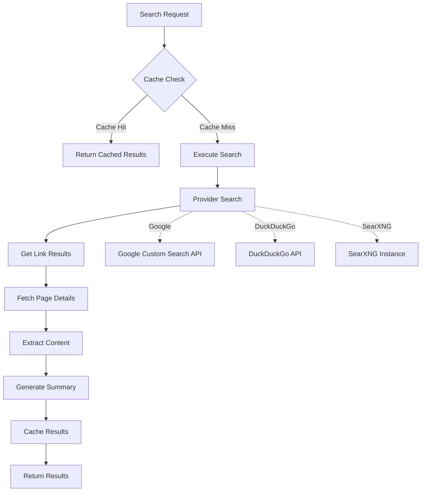
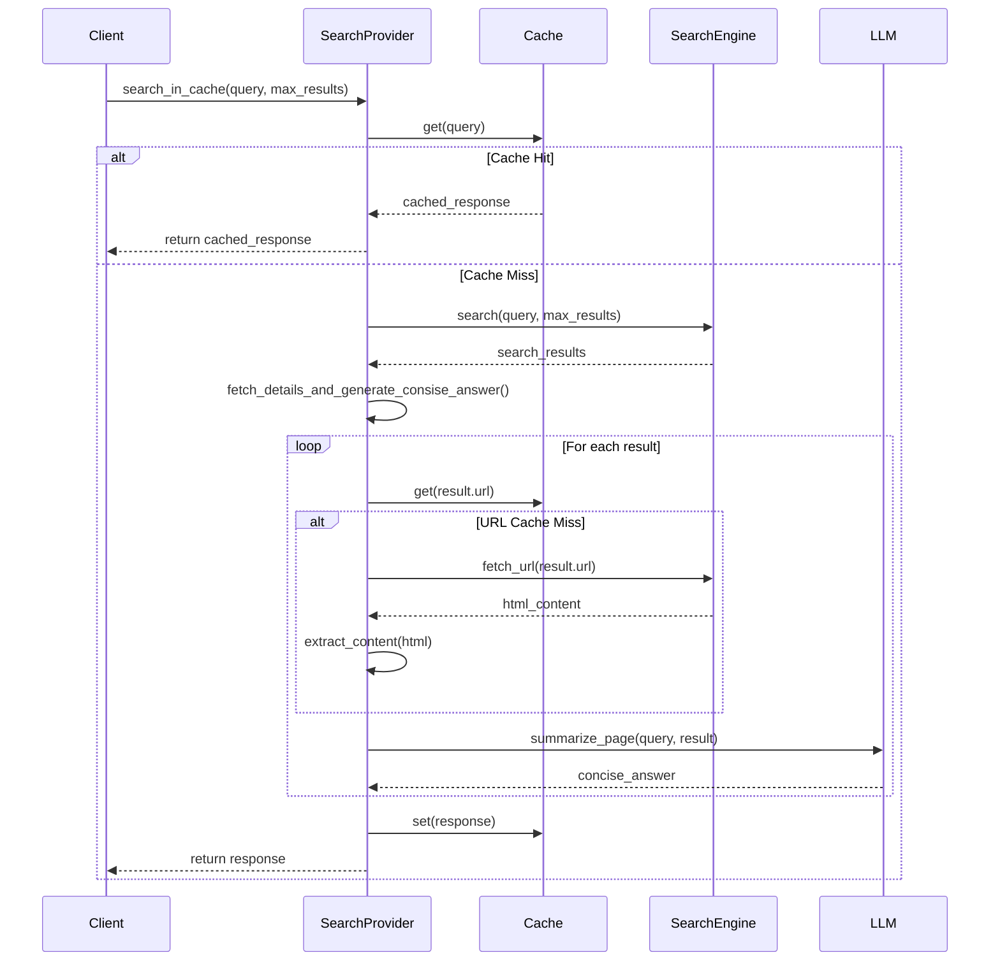
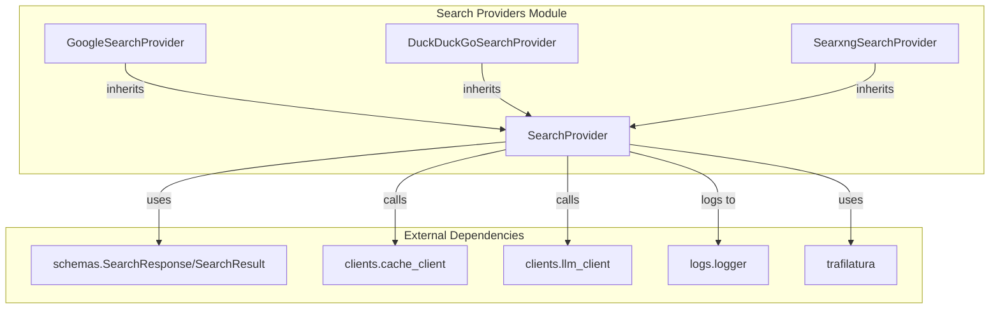

# Search Providers Module Documentation

## Introduction

The search-providers module implements a pluggable architecture for web search functionality across multiple search engines. It provides a unified interface for performing searches, caching results, and generating concise answers from web content using various search providers including Google Custom Search, DuckDuckGo, and SearXNG.

## Architecture Overview

The module follows a strategy pattern with an abstract base class defining the common interface and concrete implementations for each search provider. This design allows for easy extension with new search engines while maintaining consistent behavior across all providers.



## Component Details

### SearchProvider (Abstract Base Class)

The `SearchProvider` abstract class defines the contract that all search providers must implement. It provides both the core search functionality and common utility methods for caching and content processing.

**Key Responsibilities:**
- Define the abstract `search()` method that must be implemented by all providers
- Provide caching mechanisms through `search_in_cache()` and `search_without_cache()`
- Implement content fetching and summarization via `fetch_details_and_generate_consise_answer()`

**Key Dependencies:**
- [schemas](schemas.md) - For `SearchResponse` and `SearchResult` data structures
- [clients](clients.md) - For caching (`short_term_cache_client`, `long_term_cache_client`) and LLM services (`llm_client`)
- [logs](logs.md) - For logging operations
- [constants](constants.md) - For configuration settings

### Concrete Search Providers

#### GoogleSearchProvider

Implements search functionality using Google Custom Search JSON API. Supports date-based sorting and provides access to Google's comprehensive web index.

**Configuration Requirements:**
- API key for Google Custom Search
- Custom Search Engine ID

**Features:**
- Date-based sorting with `newest_first` parameter
- Configurable result limits
- Integration with Google's snippet system

#### DuckDuckGoSearchProvider

Implements search functionality using DuckDuckGo's search API. Provides privacy-focused search capabilities without requiring API keys.

**Features:**
- No API key requirements
- Privacy-focused search
- Simple integration with DuckDuckGo's search results

#### SearxngSearchProvider

Implements search functionality using a self-hosted SearXNG instance. Provides meta-search capabilities aggregating results from multiple search engines.

**Features:**
- Self-hosted deployment flexibility
- Meta-search across multiple engines
- Additional image search capabilities
- JSON API support

## Data Flow Architecture



## Process Flow

### Search with Caching



## Component Interactions



## Key Features

### 1. Multi-Provider Support
The module supports multiple search providers through a unified interface, allowing applications to switch between different search engines or use multiple providers simultaneously.

### 2. Intelligent Caching
Implements a two-tier caching system:
- **Short-term cache**: Stores complete search responses for quick retrieval
- **Long-term cache**: Stores individual page content to avoid redundant fetches

### 3. Content Processing Pipeline
Automatically fetches and processes web content:
- Downloads page content using Trafilatura
- Extracts clean text from HTML
- Generates concise summaries using LLM services
- Handles timeouts and errors gracefully

### 4. Asynchronous Operations
All operations are implemented asynchronously for optimal performance, with configurable timeouts for different operations:
- Cache lookup: 5 seconds
- URL fetching: 10 seconds
- Content extraction: 5 seconds
- LLM summarization: Configurable via `sumup_page_timeout`

## Error Handling

The module implements comprehensive error handling:
- Timeout protection for all external operations
- Graceful degradation when individual results fail
- Detailed logging for debugging and monitoring
- Exception isolation to prevent cascade failures

## Configuration

Each provider requires specific configuration:

### GoogleSearchProvider
```python
provider = GoogleSearchProvider(
    api_key="your_google_api_key",
    search_engine_id="your_search_engine_id"
)
```

### DuckDuckGoSearchProvider
```python
provider = DuckDuckGoSearchProvider()  # No configuration required
```

### SearxngSearchProvider
```python
provider = SearxngSearchProvider(
    host="https://your-searxng-instance.com"
)
```

## Usage Examples

### Basic Search
```python
# Initialize provider
provider = GoogleSearchProvider(api_key="key", search_engine_id="id")

# Perform search
results = await provider.search_in_cache(
    query="python async programming",
    max_num_result=10,
    newest_first=True,
    sumup_page_timeout=30
)
```

### Direct Search without Cache
```python
results = await provider.search_without_cache(
    query="machine learning",
    max_num_result=5,
    sumup_page_timeout=20
)
```

## Integration Points

The module integrates with several other system components:

- **[schemas](schemas.md)**: Defines the data structures for search responses and results
- **[clients](clients.md)**: Provides caching and LLM client services
- **[logs](logs.md)**: Handles logging and monitoring
- **[constants](constants.md)**: Supplies configuration parameters

## Performance Considerations

1. **Caching Strategy**: The two-tier caching system significantly reduces redundant API calls and web scraping operations
2. **Async Operations**: All I/O operations are asynchronous to maximize throughput
3. **Timeout Management**: Configurable timeouts prevent hanging operations
4. **Batch Processing**: Results are processed in parallel where possible
5. **Error Isolation**: Failed individual results don't affect the entire search operation

## Security Considerations

1. **API Key Management**: Provider credentials should be securely stored and managed
2. **Rate Limiting**: Consider implementing rate limiting for search API calls
3. **Content Filtering**: The module relies on search engines' content filtering capabilities
4. **Timeout Protection**: Prevents potential DoS through hanging connections

## Future Enhancements

Potential areas for improvement:
- Additional search provider implementations (Bing, Yahoo, etc.)
- Advanced filtering and ranking options
- Support for specialized search types (images, videos, news)
- Enhanced caching strategies with TTL management
- Metrics and analytics integration
- Retry mechanisms for failed operations
- Bulk search operations support