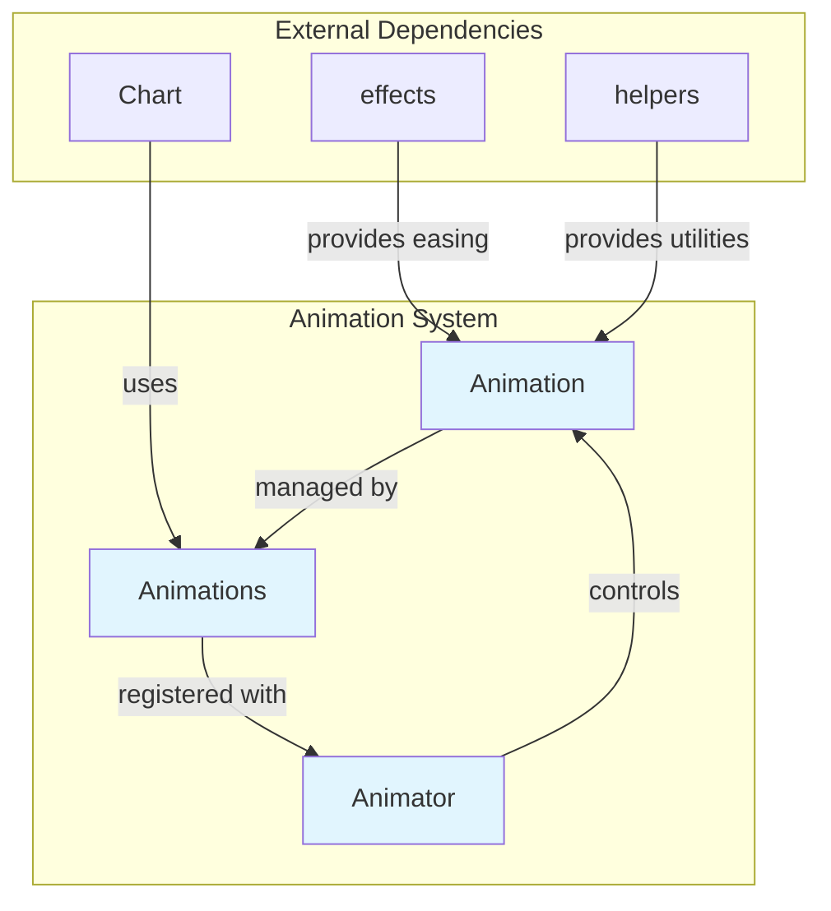
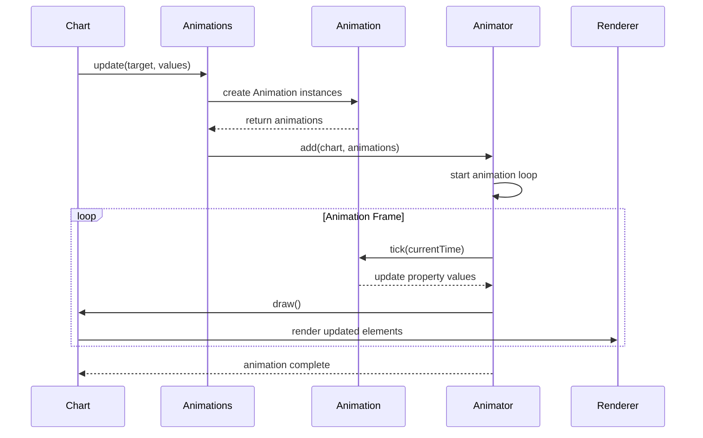
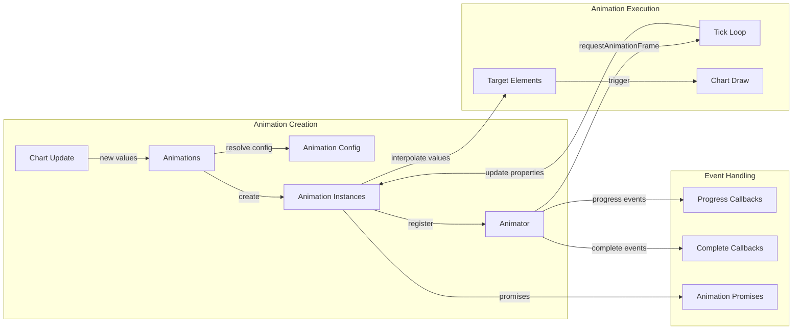
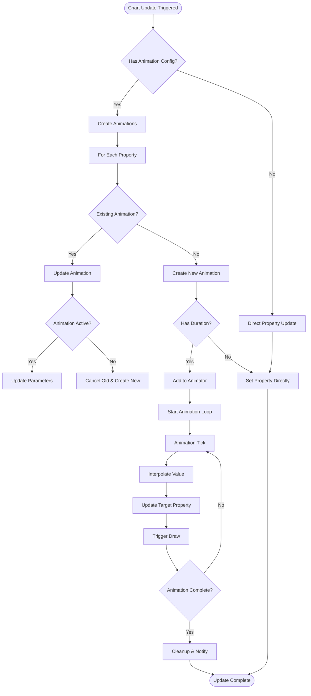
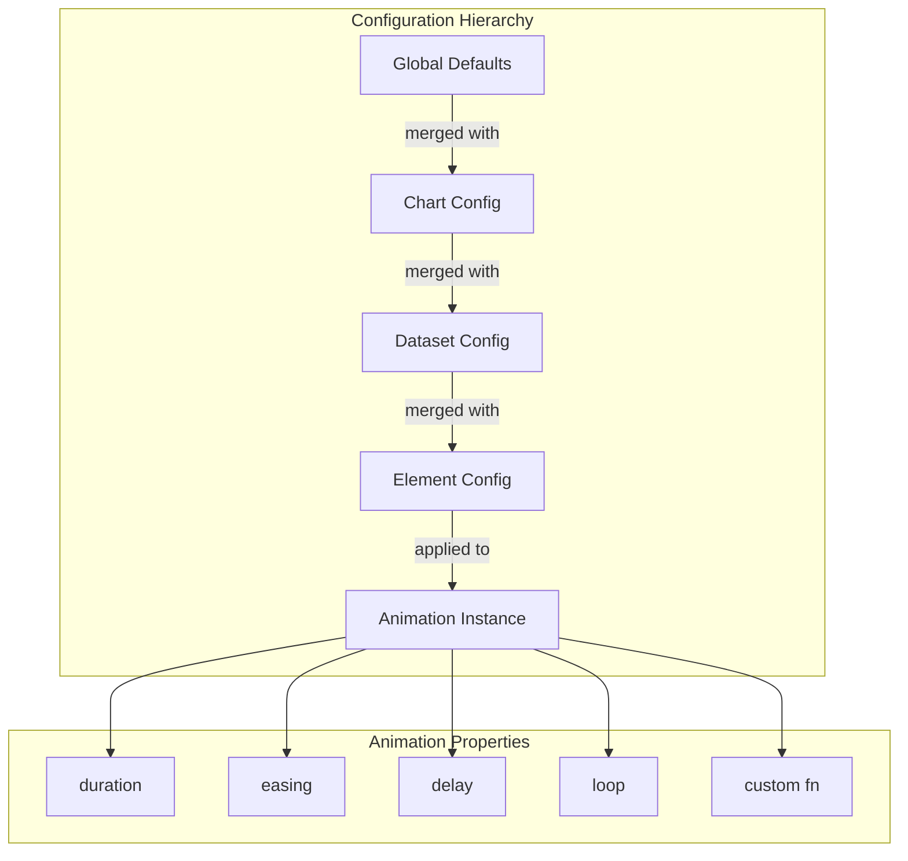
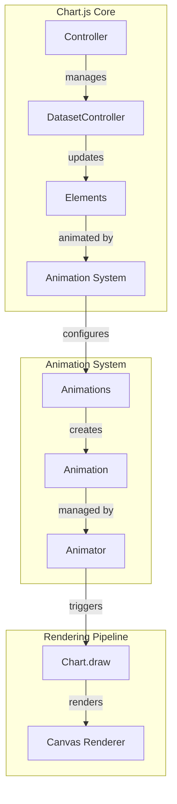

# Animation System Module

## Introduction

The animation-system module is the core animation engine of Chart.js, responsible for managing and executing smooth transitions and animations across all chart elements. It provides a comprehensive framework for animating chart properties, handling timing, easing functions, and coordinating multiple simultaneous animations.

## Architecture Overview

The animation system is built around three main components that work together to provide a complete animation solution:



## Core Components

### 1. Animation Class

The `Animation` class represents a single animated property transition. It handles the interpolation of values over time using various easing functions and interpolation strategies.

**Key Responsibilities:**
- Property interpolation (boolean, color, number)
- Timing and duration management
- Easing function application
- Animation state tracking
- Promise-based completion handling

**Supported Interpolation Types:**
- **Boolean**: Simple threshold-based interpolation
- **Color**: Smooth color transitions with alpha blending
- **Number**: Linear interpolation between numeric values

### 2. Animations Class

The `Animations` class manages collections of animations for chart elements. It coordinates multiple property animations and handles configuration resolution.

**Key Responsibilities:**
- Animation configuration management
- Multiple property coordination
- Shared options handling
- Animation lifecycle management
- Target property updates

### 3. Animator Class

The `Animator` class is the central animation controller that manages all active animations across multiple charts. It uses requestAnimationFrame for smooth rendering.

**Key Responsibilities:**
- Global animation scheduling
- Chart-level animation coordination
- Progress and completion events
- Resource management
- Animation queue management

## Data Flow Architecture



## Component Interactions



## Animation Process Flow



## Configuration System

The animation system supports flexible configuration through multiple layers:



## Key Features

### 1. Interpolation Support
- **Color Interpolation**: Smooth transitions between colors with proper alpha blending
- **Numeric Interpolation**: Linear interpolation for numbers
- **Boolean Interpolation**: Threshold-based transitions

### 2. Easing Functions
The system integrates with Chart.js easing functions to provide various animation curves:
- Linear
- Ease-in, Ease-out, Ease-in-out
- Custom easing functions

### 3. Promise-based Completion
Animations return promises that resolve when complete, enabling:
- Sequential animation chains
- Animation completion callbacks
- Error handling

### 4. Shared Options Support
The system efficiently handles shared configuration objects across multiple elements.

## Integration with Chart.js

The animation system integrates seamlessly with the broader Chart.js architecture:



## Performance Considerations

### 1. Animation Batching
Multiple animations are batched together and updated in a single requestAnimationFrame cycle.

### 2. Efficient Property Updates
The system only updates properties that have actually changed, minimizing DOM/canvas operations.

### 3. Memory Management
Completed animations are automatically cleaned up to prevent memory leaks.

### 4. Frame Rate Optimization
The animator automatically adjusts to maintain smooth 60fps animations.

## Usage Patterns

### Basic Animation
```javascript
// Animations are automatically created when updating chart data
chart.data.datasets[0].data = newData;
chart.update(); // Triggers animations
```

### Custom Animation Configuration
```javascript
chart.options.animation = {
  duration: 2000,
  easing: 'easeInOutQuart'
};
```

### Animation Events
```javascript
chart.options.animation = {
  onProgress: function(animation) {
    console.log('Animation progress:', animation.currentStep);
  },
  onComplete: function() {
    console.log('Animation complete');
  }
};
```

## Dependencies

The animation system relies on several helper modules:

- **[helpers.easing](helpers.md)**: Provides easing function implementations
- **[helpers.color](helpers.md)**: Handles color interpolation and blending
- **[helpers.options](helpers.md)**: Resolves configuration options
- **[helpers.extras](helpers.md)**: Provides requestAnimFrame utility

## Type Definitions

The animation system exports TypeScript definitions for:
- `Animation`: Single animation instance
- `Animations`: Animation collection manager
- `Animator`: Global animation controller
- `AnimationEvent`: Animation event data

These types are used throughout the Chart.js ecosystem to ensure type safety and provide IDE support.

## Conclusion

The animation-system module provides a robust, performant, and flexible animation framework that enhances the user experience of Chart.js visualizations. Its modular design allows for easy extension and customization while maintaining smooth performance across different chart types and configurations.