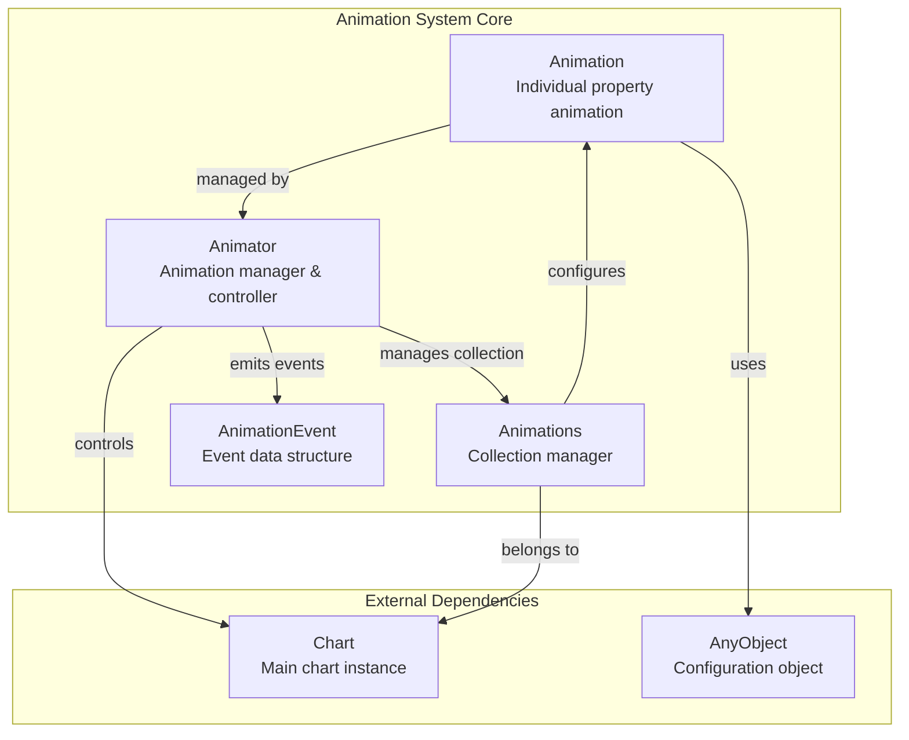
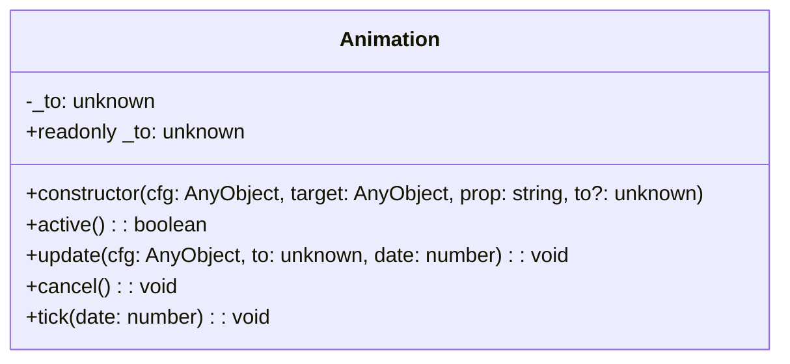
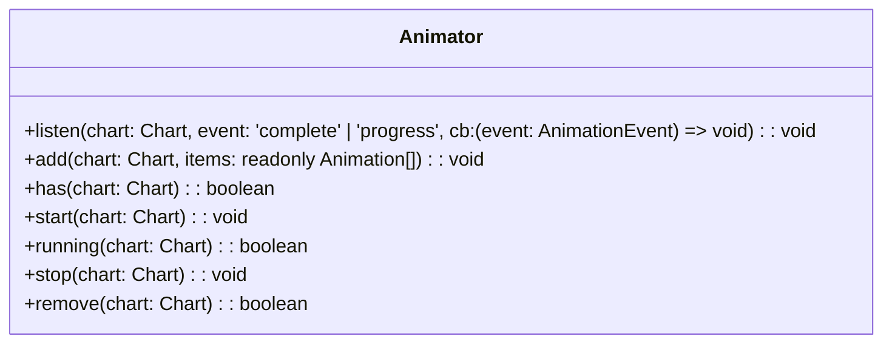
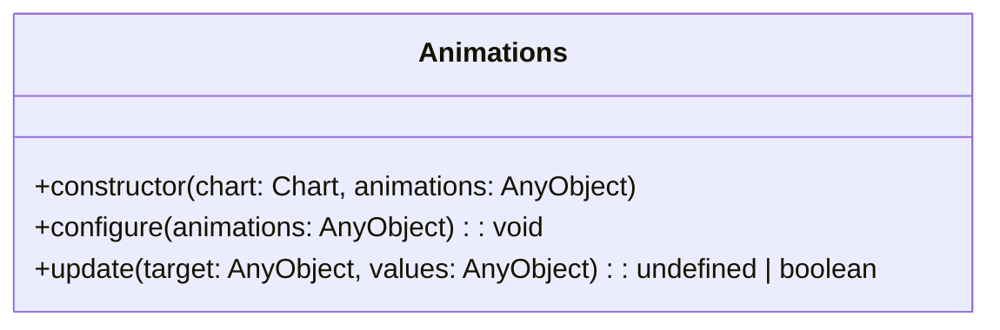
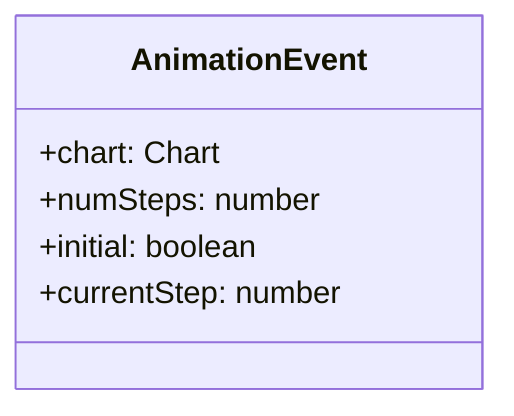
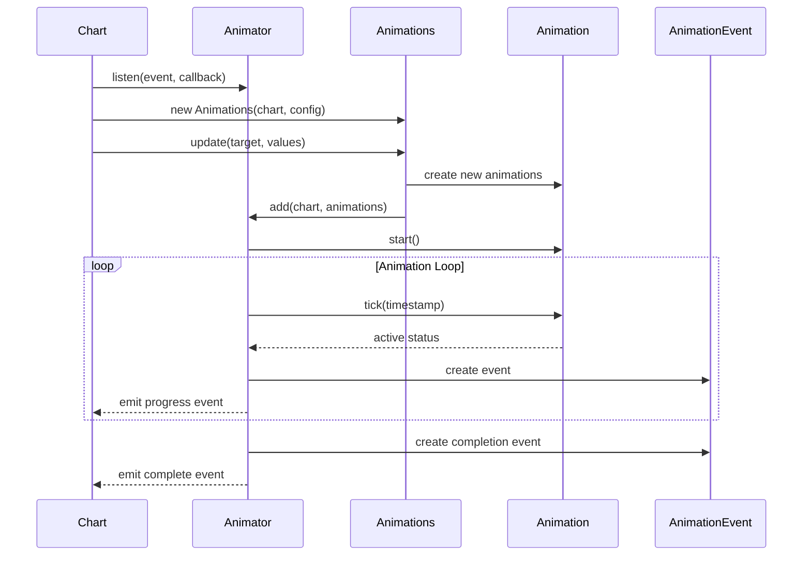
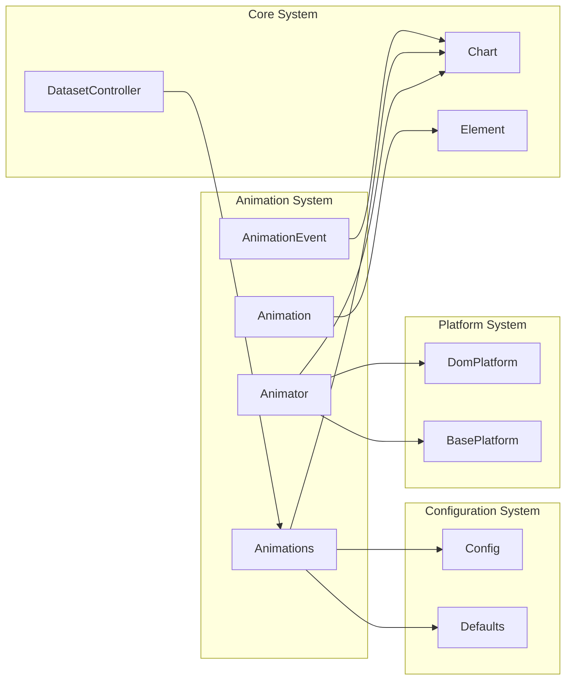

# Animation System Documentation

## Introduction

The animation.d module defines the core TypeScript interfaces and classes for Chart.js's animation system. This module provides the foundation for creating smooth, configurable animations for chart transitions, updates, and interactions. The animation system is built around a flexible architecture that supports both individual property animations and complex multi-property transitions.

## Architecture Overview

The animation system consists of four main components that work together to provide comprehensive animation capabilities:



## Core Components

### Animation Class

The `Animation` class represents a single animated property transition. It handles the interpolation between values and manages the animation lifecycle for individual properties.



**Key Responsibilities:**
- **Property Animation**: Animates a single property from its current value to a target value
- **Lifecycle Management**: Tracks whether the animation is active or complete
- **Value Interpolation**: Handles smooth transitions between values over time
- **Configuration Updates**: Allows dynamic updates to animation parameters
- **Cancellation**: Provides ability to stop animations mid-transition

**Constructor Parameters:**
- `cfg`: Animation configuration object containing timing and easing parameters
- `target`: The object whose property is being animated
- `prop`: The name of the property to animate
- `to`: Optional target value (if not provided, uses configuration)

### Animator Class

The `Animator` class serves as the central animation manager, coordinating multiple animations across charts and providing event-driven animation updates.



**Key Responsibilities:**
- **Event Management**: Provides subscription mechanism for animation events
- **Animation Coordination**: Manages multiple animations for multiple charts
- **Lifecycle Control**: Starts, stops, and monitors animation states
- **Chart Association**: Links animations to specific chart instances
- **Resource Management**: Handles cleanup and removal of animations

**Event Types:**
- `complete`: Fired when all animations for a chart finish
- `progress`: Fired during animation execution with progress information

### Animations Class

The `Animations` class manages collections of animations for a specific chart, handling configuration and batch updates.



**Key Responsibilities:**
- **Configuration Management**: Handles animation configuration objects
- **Batch Updates**: Processes multiple property updates simultaneously
- **Chart Binding**: Associates animation collections with specific charts
- **Update Coordination**: Manages the update process for animated properties

### AnimationEvent Interface

The `AnimationEvent` interface defines the structure of events emitted during animation lifecycle.



**Properties:**
- `chart`: Reference to the chart instance generating the event
- `numSteps`: Total number of steps in the animation sequence
- `initial`: Flag indicating if this is the initial animation
- `currentStep`: Current step number in the animation sequence

## Data Flow Architecture



## Integration with Chart.js System

The animation system integrates with several other Chart.js modules:



## Usage Patterns

### Basic Animation Setup

```typescript
// Create animation configuration
const animationConfig = {
    duration: 1000,
    easing: 'easeOutQuart',
    delay: 0
};

// Initialize animations for a chart
const animations = new Animations(chart, animationConfig);

// Update with animated properties
animations.update(dataset, {
    backgroundColor: 'rgba(255, 99, 132, 0.5)',
    borderWidth: 2
});
```

### Event Handling

```typescript
// Listen for animation events
animator.listen(chart, 'progress', (event: AnimationEvent) => {
    console.log(`Animation progress: ${event.currentStep}/${event.numSteps}`);
});

animator.listen(chart, 'complete', (event: AnimationEvent) => {
    console.log('Animation completed!');
});
```

## Performance Considerations

1. **Animation Batching**: Multiple property updates are batched to reduce rendering overhead
2. **Event Throttling**: Progress events are throttled to maintain smooth performance
3. **Memory Management**: Animations are automatically cleaned up when complete
4. **Chart Isolation**: Each chart's animations are managed independently to prevent interference

## Type Safety

The module provides strong TypeScript typing for:
- Animation configuration objects through `AnyObject`
- Chart references ensuring type safety across the animation system
- Event callback signatures for compile-time checking

## Related Documentation

- [Chart Configuration System](config.md) - For animation configuration options
- [Chart Core System](core.md) - For understanding Chart class integration
- [Element System](elements.md) - For animated element properties
- [Platform System](platform.md) - For rendering platform integration

## API Reference

### Animation Class Methods

| Method | Description | Parameters | Returns |
|--------|-------------|------------|---------|
| `constructor` | Creates new animation instance | `cfg: AnyObject, target: AnyObject, prop: string, to?: unknown` | Animation |
| `active` | Checks if animation is active | None | boolean |
| `update` | Updates animation configuration | `cfg: AnyObject, to: unknown, date: number` | void |
| `cancel` | Cancels the animation | None | void |
| `tick` | Advances animation by one frame | `date: number` | void |

### Animator Class Methods

| Method | Description | Parameters | Returns |
|--------|-------------|------------|---------|
| `listen` | Subscribes to animation events | `chart: Chart, event: 'complete' \| 'progress', cb: (event: AnimationEvent) => void` | void |
| `add` | Adds animations to chart | `chart: Chart, items: readonly Animation[]` | void |
| `has` | Checks if chart has animations | `chart: Chart` | boolean |
| `start` | Starts animations for chart | `chart: Chart` | void |
| `running` | Checks if chart animations are running | `chart: Chart` | boolean |
| `stop` | Stops animations for chart | `chart: Chart` | void |
| `remove` | Removes animations from chart | `chart: Chart` | boolean |

### Animations Class Methods

| Method | Description | Parameters | Returns |
|--------|-------------|------------|---------|
| `constructor` | Creates animations manager | `chart: Chart, animations: AnyObject` | Animations |
| `configure` | Updates animation configuration | `animations: AnyObject` | void |
| `update` | Updates animated properties | `target: AnyObject, values: AnyObject` | undefined \| boolean |