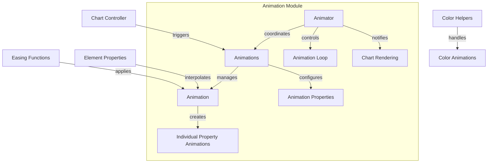
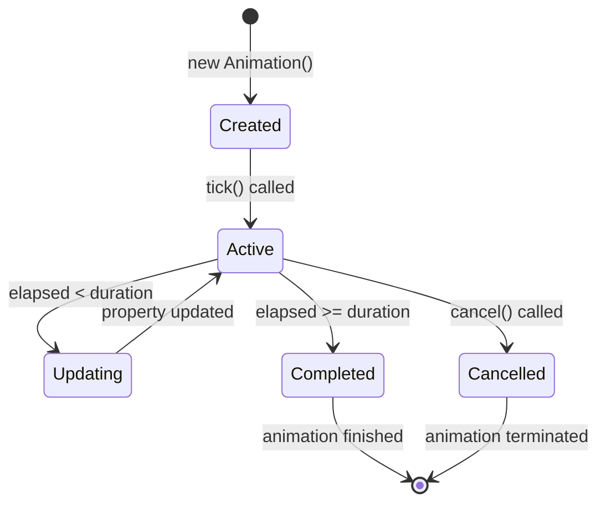
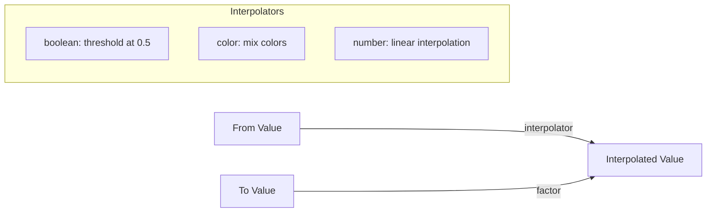
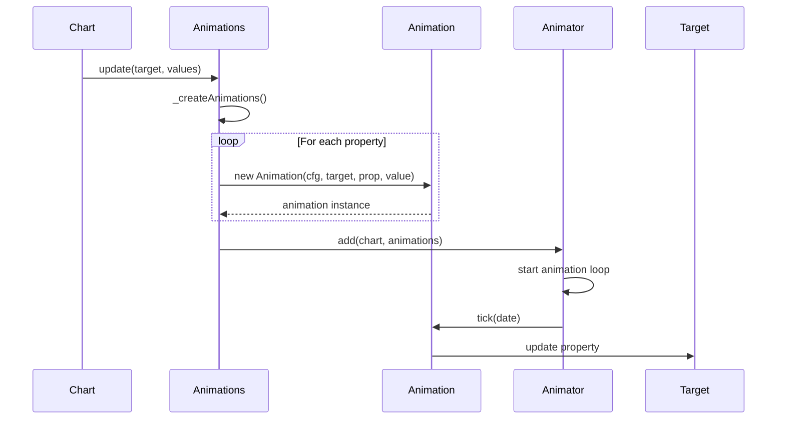
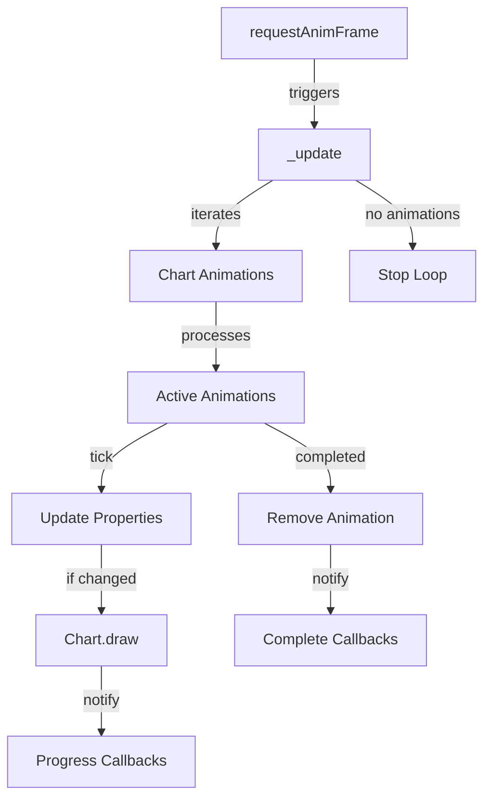
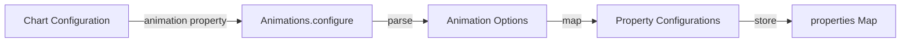
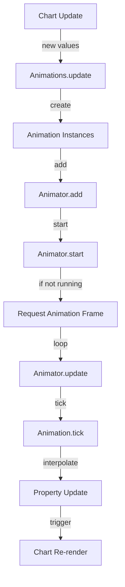
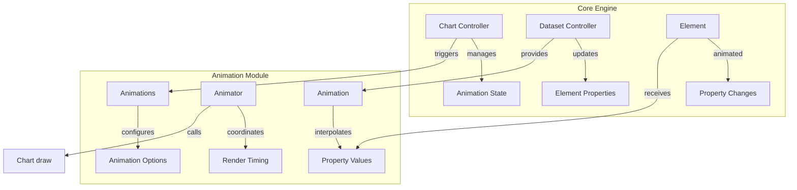
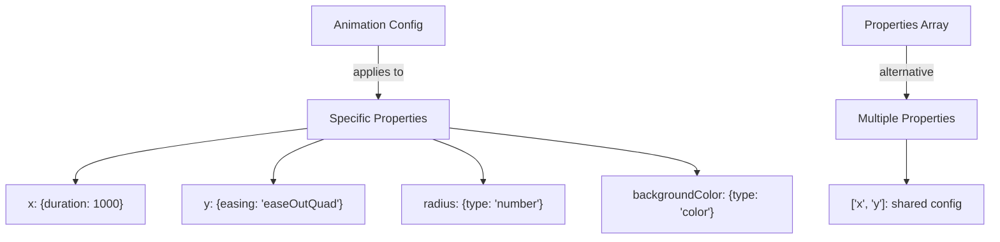
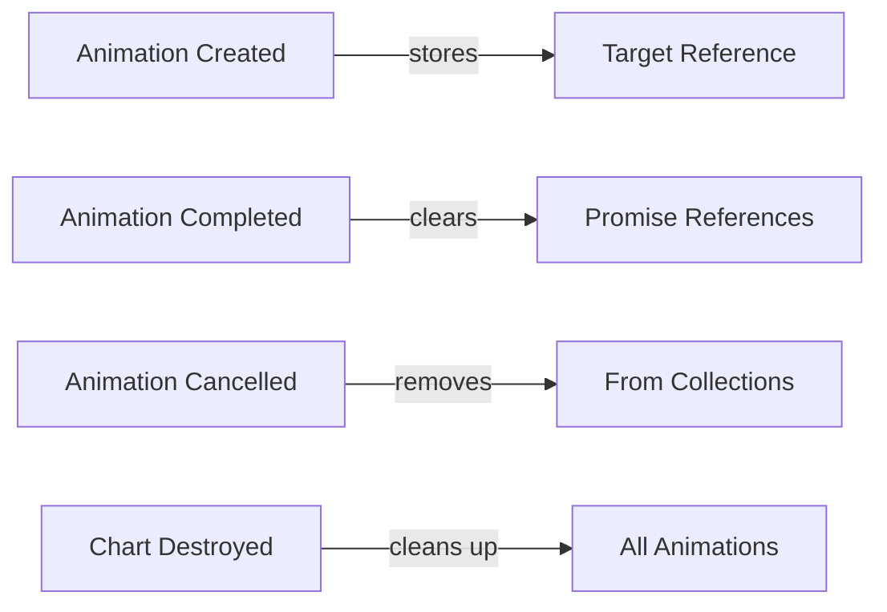

# Animation Module Documentation

## Introduction

The Animation module is a core component of Chart.js that provides smooth, configurable animations for chart transitions and updates. It manages the lifecycle of individual animations, coordinates multiple animations, and ensures efficient rendering through optimized animation loops. The module is designed to handle complex animation scenarios including property interpolation, easing effects, and animation queuing.

## Architecture Overview

The Animation module consists of three primary components that work together to provide a complete animation system:

### Core Components

1. **Animation** - Individual animation instances that handle property interpolation
2. **Animations** - Collection manager that creates and coordinates multiple animations
3. **Animator** - Global animation loop manager that handles timing and rendering

### Architecture Diagram



## Component Details

### Animation Class

The `Animation` class represents a single animated property transition. It handles the interpolation between start and end values over a specified duration using various easing functions.

#### Key Features:
- **Property Interpolation**: Supports boolean, color, and number interpolation
- **Easing Functions**: Integrates with easing effects for smooth transitions
- **Loop Support**: Can loop animations continuously
- **Promise Support**: Provides wait capabilities for animation completion
- **Dynamic Updates**: Allows mid-animation configuration changes

#### Animation Lifecycle:



#### Interpolation Types:



### Animations Class

The `Animations` class manages collections of animations for chart elements. It handles the creation, configuration, and coordination of multiple simultaneous animations.

#### Key Responsibilities:
- **Property Mapping**: Maps animation configurations to target properties
- **Animation Creation**: Instantiates Animation objects based on configuration
- **Shared Options**: Manages shared animation options across elements
- **Batch Updates**: Handles multiple property updates simultaneously

#### Animation Management Flow:



### Animator Class

The `Animator` class serves as the global animation coordinator, managing the animation loop for all charts and ensuring efficient rendering.

#### Key Features:
- **Singleton Pattern**: Single instance manages all chart animations
- **Request Animation Frame**: Uses browser's RAF for smooth 60fps animations
- **Chart Isolation**: Maintains separate animation states per chart
- **Event System**: Provides progress and completion callbacks
- **Performance Optimization**: Efficiently manages multiple concurrent animations

#### Animation Loop Architecture:



## Data Flow

### Animation Configuration Flow



### Animation Execution Flow



## Integration with Core Engine

The Animation module integrates closely with the core engine components:

### Dependencies

- **[core.defaults](core.md)**: Provides default animation configurations
- **[helpers.easing](helpers.md)**: Supplies easing function implementations
- **[helpers.color](helpers.md)**: Handles color interpolation
- **[helpers.options](helpers.md)**: Resolves animation option values
- **[helpers.extras](helpers.md)**: Provides requestAnimFrame wrapper

### Integration Points



## Configuration System

### Animation Properties

Animations can be configured with the following properties:

```javascript
{
  duration: number,        // Animation duration in milliseconds
  easing: string,          // Easing function name
  delay: number,           // Delay before animation starts
  loop: boolean,           // Whether to loop the animation
  fn: function,            // Custom interpolation function
  type: string,            // Interpolation type ('number', 'color', 'boolean')
  from: any,               // Start value (optional)
  to: any                  // End value (optional)
}
```

### Property-Specific Configuration



## Performance Considerations

### Optimization Strategies

1. **Batch Processing**: Multiple animations are processed in a single frame
2. **Early Termination**: Completed animations are removed immediately
3. **Shared Options**: Common configurations are shared across elements
4. **Efficient Removal**: Uses swap-and-pop for O(1) animation removal
5. **Conditional Rendering**: Only redraws charts when properties actually change

### Memory Management



## Event System

The animation module provides a comprehensive event system for monitoring animation progress:

### Event Types

- **progress**: Fired on each frame during animation
- **complete**: Fired when all animations for a chart complete

### Event Data Structure

```javascript
{
  chart: Chart,           // Reference to the chart
  initial: boolean,       // Whether this is the initial animation
  numSteps: number,       // Total animation duration
  currentStep: number     // Current animation progress
}
```

## Error Handling

The animation module implements robust error handling:

1. **Graceful Degradation**: Falls back to immediate property assignment if animation fails
2. **Validation**: Validates animation configurations before processing
3. **Cancellation**: Properly handles animation cancellation and cleanup
4. **Promise Rejection**: Handles promise rejections in animation completion

## Usage Examples

### Basic Animation Configuration

```javascript
// Configure animations for a chart
chart.options.animation = {
  duration: 1000,
  easing: 'easeInOutQuart'
};
```

### Property-Specific Animation

```javascript
// Animate specific properties with different settings
chart.options.animation = {
  x: {
    duration: 800,
    easing: 'easeOutBounce'
  },
  y: {
    duration: 1200,
    easing: 'easeInOutQuad'
  },
  radius: {
    duration: 600,
    delay: 200
  }
};
```

### Animation Events

```javascript
// Listen for animation events
chart.options.animation = {
  onProgress: function(animation) {
    console.log(`Animation progress: ${animation.currentStep}/${animation.numSteps}`);
  },
  onComplete: function(animation) {
    console.log('Animation completed!');
  }
};
```

## Related Documentation

- [Core Engine](core.md) - Core chart functionality and configuration
- [Controllers](controllers.md) - Chart type controllers that use animations
- [Elements](elements.md) - Visual elements that can be animated
- [Helpers](helpers.md) - Utility functions used by the animation system
- [Plugins](plugins.md) - Plugin system that may trigger animations

## API Reference

For detailed API documentation, refer to the TypeScript definitions and inline JSDoc comments in the source files. The animation module exports the following main classes:

- `Animation` - Individual animation instances
- `Animations` - Animation collection manager  
- `Animator` - Global animation coordinator (singleton)

Each class provides methods for configuration, control, and monitoring of animations within the Chart.js framework.