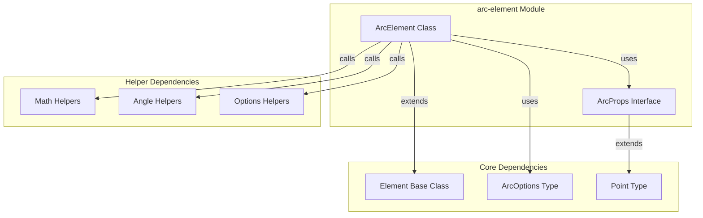
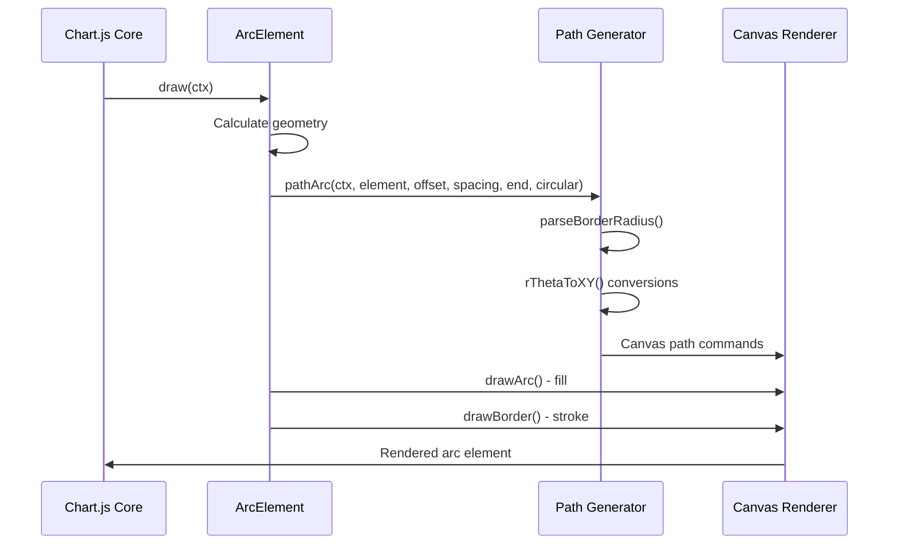
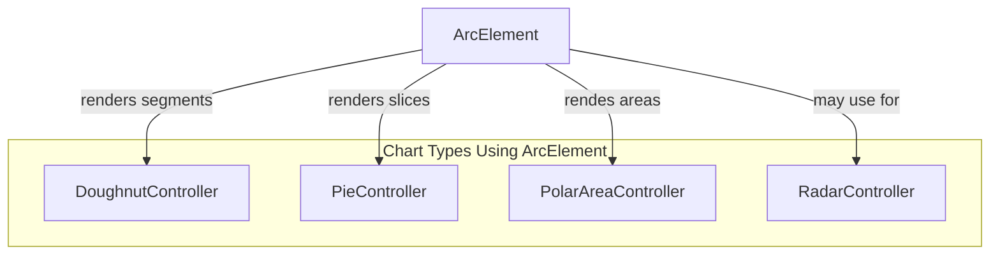

# Arc Element Module Documentation

## Introduction

The arc-element module provides the fundamental building block for rendering circular and arc-shaped visual elements in Chart.js. This module implements the `ArcElement` class, which is responsible for drawing arcs, circles, doughnut segments, pie slices, and polar area chart segments. It extends the base `Element` class and provides specialized functionality for handling circular geometry, border rendering, and interactive hit detection.

## Architecture Overview

The arc-element module is built around two primary components that work together to provide comprehensive arc rendering capabilities:

### Core Components

1. **ArcProps Interface** - Defines the geometric properties required for arc rendering
2. **ArcElement Class** - The main element class that handles arc drawing, hit detection, and styling

### Module Dependencies

The arc-element module integrates with several other Chart.js modules:

- **Core Module**: Extends `Element` base class for fundamental element behavior
- **Helpers Module**: Utilizes mathematical utilities for angle calculations and geometric operations
- **Types Module**: Leverages type definitions for `ArcOptions` and `Point` interfaces



## Component Details

### ArcProps Interface

The `ArcProps` interface defines the essential geometric properties needed to describe an arc element:

```typescript
interface ArcProps extends Point {
  startAngle: number;      // Starting angle in radians
  endAngle: number;        // Ending angle in radians
  innerRadius: number;     // Inner radius (for doughnut charts)
  outerRadius: number;     // Outer radius
  circumference: number;   // Total arc length in radians
}
```

### ArcElement Class

The `ArcElement` class is the core implementation that handles all arc-related functionality:

#### Static Properties

- **`id`**: 'arc' - Element type identifier
- **`defaults`**: Default styling options including border properties, colors, and spacing
- **`defaultRoutes`**: Color routing configuration
- **`descriptors`**: Scriptable and indexable property definitions

#### Instance Properties

- **Geometric Properties**: `circumference`, `startAngle`, `endAngle`, `innerRadius`, `outerRadius`
- **Rendering Properties**: `pixelMargin`, `fullCircles`
- **Inherited Properties**: `x`, `y` coordinates from base Element class

## Data Flow and Rendering Process

The arc rendering process follows a sophisticated pipeline that handles geometry calculation, path generation, and visual styling:



## Key Features and Capabilities

### 1. Advanced Border Rendering

The module implements sophisticated border handling with multiple alignment options:

- **Border Alignment**: 'center', 'inner' positioning
- **Border Radius**: Support for rounded corners on arc segments
- **Border Join Styles**: 'round', 'bevel', 'miter' options
- **Self-Join Handling**: Special clipping for closed circular shapes

### 2. Circular Geometry Support

Comprehensive support for various circular chart types:

- **Full Circles**: Automatic detection and rendering of complete circles
- **Partial Arcs**: Precise angle-based segment rendering
- **Doughnut Charts**: Inner/outer radius support
- **Polar Areas**: Variable radius along angular segments

### 3. Interactive Features

Built-in support for user interaction:

- **Hit Detection**: `inRange()` method for mouse/touch interaction
- **Center Point Calculation**: `getCenterPoint()` for tooltip positioning
- **Tooltip Integration**: `tooltipPosition()` for consistent user experience

## Rendering Algorithms

### Arc Path Generation

The `pathArc()` function implements a complex algorithm that handles border radius and circular geometry:


### Clipping Strategies

The module implements multiple clipping techniques for different rendering scenarios:

1. **Self Clipping**: `clipSelf()` for closed circular shapes
2. **Arc Clipping**: `clipArc()` for inner border rendering
3. **Complex Fill**: Support for 'evenodd' fill rules

## Integration with Chart Types

The arc-element module serves as the foundation for multiple chart types:



## Configuration and Customization

### Default Options

The module provides extensive default configuration:

```javascript
{
  borderAlign: 'center',      // Border alignment
  borderColor: '#fff',        // Border color
  borderWidth: 2,             // Border thickness
  borderRadius: 0,            // Corner rounding
  offset: 0,                  // Radial offset
  spacing: 0,                 // Segment spacing
  circular: true,             // Circular interpolation
  selfJoin: false             // Self-join handling
}
```

### Scriptable Properties

Most properties support scriptable contexts for dynamic styling based on data values, dataset properties, or chart state.

## Performance Considerations

### Optimization Strategies

1. **Pixel Margin Calculation**: Minimizes anti-aliasing artifacts
2. **Path Caching**: Efficient path generation for similar arcs
3. **Clipping Optimization**: Selective clipping based on geometry
4. **Angle Normalization**: Consistent angle handling across all operations

### Memory Management

- Efficient property access through `getProps()` method
- Minimal object creation during rendering
- Reusable geometric calculations

## Error Handling and Edge Cases

The module handles various edge cases:

- **Zero Circumference**: Graceful handling of invisible arcs
- **Negative Radii**: Prevents invalid geometry
- **Large Border Radius**: Automatic limitation to prevent visual artifacts
- **Angle Wrapping**: Proper handling of angles > 2π

## Related Documentation

For comprehensive understanding of the arc-element module, refer to these related modules:

- [core-element](core-element.md) - Base element class and fundamental behaviors
- [doughnut-controller](doughnut-controller.md) - Chart controller that utilizes ArcElement
- [pie-controller](pie-controller.md) - Pie chart implementation using ArcElement
- [polar-area-controller](polar-area-controller.md) - Polar area charts with ArcElement
- [helpers-math](helpers-math.md) - Mathematical utilities used by ArcElement

## API Reference

### ArcElement Methods

- **`draw(ctx: CanvasRenderingContext2D)`**: Renders the arc element
- **`inRange(chartX: number, chartY: number, useFinalPosition: boolean)`**: Hit detection
- **`getCenterPoint(useFinalPosition: boolean)`**: Calculates arc center
- **`tooltipPosition(useFinalPosition: boolean)`**: Returns tooltip position

### Static Properties

- **`ArcElement.id`**: 'arc'
- **`ArcElement.defaults`**: Default configuration object
- **`ArcElement.defaultRoutes`**: Color routing configuration
- **`ArcElement.descriptors`**: Property descriptors for scripting

This documentation provides a comprehensive overview of the arc-element module, its architecture, and its role within the Chart.js ecosystem. The module's sophisticated handling of circular geometry, border rendering, and interactive features makes it a crucial component for creating visually appealing and interactive circular chart types.