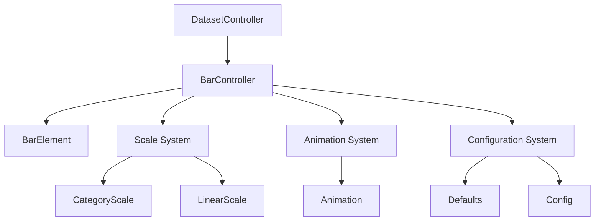
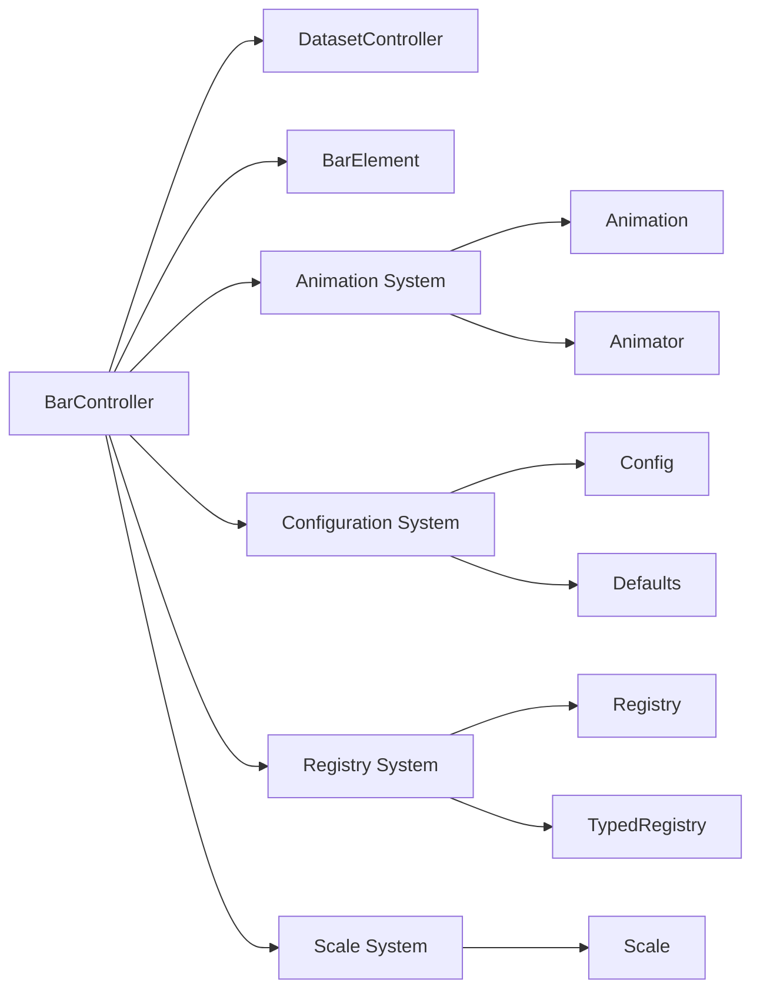
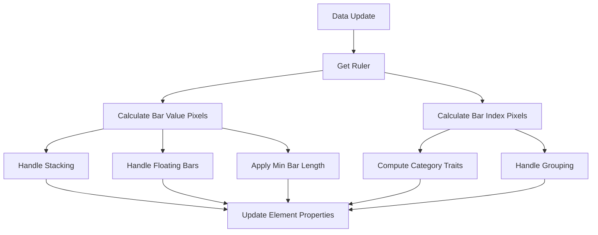
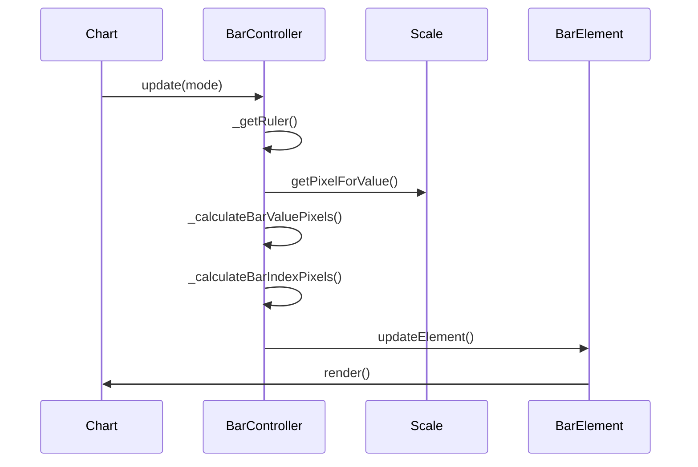
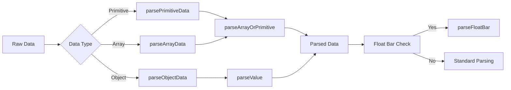

# Bar Controller Module Documentation

## Overview

The Bar Controller module is a specialized dataset controller responsible for managing bar chart visualizations in the Chart.js library. It extends the base `DatasetController` class and provides comprehensive functionality for rendering, positioning, and managing bar elements, including support for grouped bars, stacked bars, and floating bars.

## Purpose and Core Functionality

The Bar Controller serves as the central orchestrator for bar chart data visualization, handling:

- **Data Parsing**: Converts raw data into bar-specific formats, including support for floating bars (range values)
- **Bar Positioning**: Calculates optimal bar placement, sizing, and spacing
- **Stacking Logic**: Manages vertical and horizontal stacking of bar datasets
- **Visual Properties**: Controls bar dimensions, borders, and styling
- **Animation Support**: Coordinates bar animations and transitions
- **Scale Integration**: Works with category and linear scales for proper positioning

## Architecture

### Component Hierarchy



### Core Dependencies



## Key Components

### BarController Class

The main controller class that extends `DatasetController` with bar-specific functionality:

- **ID**: `'bar'`
- **Defaults**: Configures bar-specific options like `categoryPercentage`, `barPercentage`, and grouping
- **Scale Overrides**: Automatically configures category scales for the index axis and linear scales for the value axis

### Data Parsing System

The controller implements three specialized parsing methods:

1. **parsePrimitiveData**: Handles primitive data arrays
2. **parseArrayData**: Processes array-based data structures
3. **parseObjectData**: Manages object-based data with configurable axis keys

All parsers support the unique "float bar" feature, allowing bars to represent ranges `[start, end]` rather than single values.

### Bar Positioning Algorithm

The positioning system uses a sophisticated ruler-based approach:



### Stacking Mechanism

The controller implements intelligent stacking logic:

- **Stack Detection**: Automatically identifies which datasets should be stacked
- **Stack Indexing**: Manages multiple stacks and their visual arrangement
- **Visual Value Calculation**: Computes stacked values for proper rendering
- **Null Value Handling**: Skips null/undefined values in stacking calculations

## Data Flow

### Update Process Flow



### Data Parsing Flow



## Configuration and Options

### Default Configuration

The Bar Controller comes with sensible defaults:

```javascript
{
  datasetElementType: false,
  dataElementType: 'bar',
  categoryPercentage: 0.8,
  barPercentage: 0.9,
  grouped: true,
  animations: {
    numbers: {
      type: 'number',
      properties: ['x', 'y', 'base', 'width', 'height']
    }
  }
}
```

### Scale Configuration

Automatically configures scales based on the chart orientation:

- **Index Axis**: Category scale with offset enabled
- **Value Axis**: Linear scale beginning at zero

## Advanced Features

### Floating Bars

Supports range-based bars where each bar represents a range rather than a single value:

```javascript
// Example data format for floating bars
data: [[10, 20], [15, 25], [5, 30]]
```

### Bar Grouping and Spacing

Implements sophisticated spacing algorithms:

- **Category Percentage**: Controls space allocation for each category
- **Bar Percentage**: Controls space allocation within each category
- **Flex Mode**: Dynamically adjusts bar width based on neighboring categories
- **Fixed Mode**: Uses consistent bar thickness

### Border and Styling

Advanced border handling including:

- **Border Skipping**: Conditionally hides borders based on stack position
- **Border Radius**: Applies rounded corners when appropriate
- **Inflate Amount**: Controls bar inflation for better visual appearance

## Integration with Other Systems

### Scale System Integration

The Bar Controller works closely with:

- **Category Scales**: For positioning bars along the index axis
- **Linear Scales**: For determining bar heights/lengths
- **Scale Caching**: Utilizes scale caching mechanisms for performance

### Animation System Integration

Coordinates with the animation system to provide smooth transitions for:

- Bar position changes
- Height/width modifications
- Color and styling updates
- Data value transitions

### Element System Integration

Manages `BarElement` instances with:

- Property updates
- Style resolution
- Rendering coordination
- Event handling

## Performance Considerations

### Optimization Strategies

1. **Caching**: Utilizes scale caching to avoid redundant calculations
2. **Ruler System**: Pre-calculates positioning information
3. **Stack Detection**: Efficiently identifies relevant stacks
4. **Pixel Calculation**: Minimizes scale API calls

### Memory Management

- Reuses parsed data structures
- Efficiently manages element pools
- Minimizes object creation during updates

## Error Handling

The controller includes robust error handling for:

- **Invalid Data**: Gracefully handles malformed data entries
- **Scale Issues**: Manages missing or misconfigured scales
- **Stacking Errors**: Handles edge cases in stacking calculations
- **Rendering Issues**: Manages visual edge cases

## Usage Examples

### Basic Bar Chart

```javascript
const config = {
  type: 'bar',
  data: {
    labels: ['A', 'B', 'C'],
    datasets: [{
      label: 'Dataset 1',
      data: [10, 20, 30]
    }]
  }
};
```

### Grouped Bar Chart

```javascript
const config = {
  type: 'bar',
  data: {
    labels: ['A', 'B', 'C'],
    datasets: [
      { label: 'Dataset 1', data: [10, 20, 30] },
      { label: 'Dataset 2', data: [15, 25, 35] }
    ]
  },
  options: {
    grouped: true
  }
};
```

### Floating Bar Chart

```javascript
const config = {
  type: 'bar',
  data: {
    labels: ['A', 'B', 'C'],
    datasets: [{
      label: 'Range Data',
      data: [[10, 20], [15, 25], [5, 30]]
    }]
  }
};
```

## Related Documentation

- [Dataset Controller Module](dataset-controller.md) - Base controller functionality
- [Scale System](scale-system.md) - Scale configuration and management
- [Animation System](animation-system.md) - Animation and transition handling
- [Configuration System](configuration-system.md) - Configuration management
- [Bar Element](bar-element.md) - Individual bar element documentation

## API Reference

For detailed API information, see the [Chart.js API documentation](https://www.chartjs.org/docs/latest/api/).