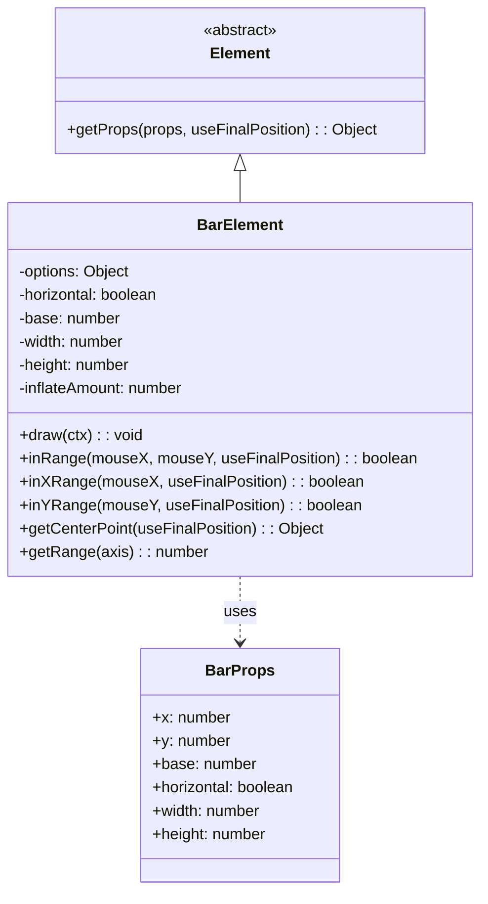
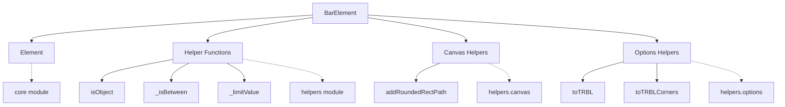
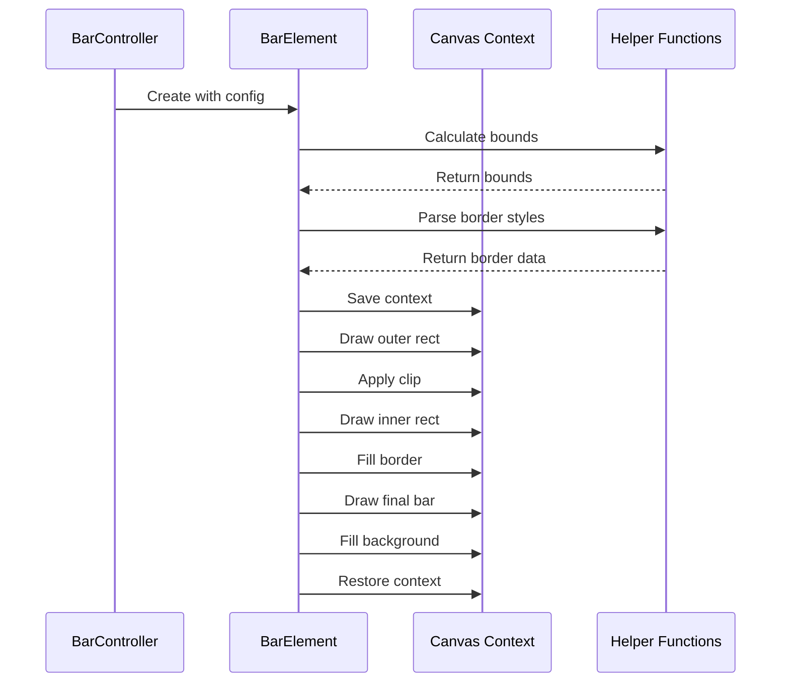
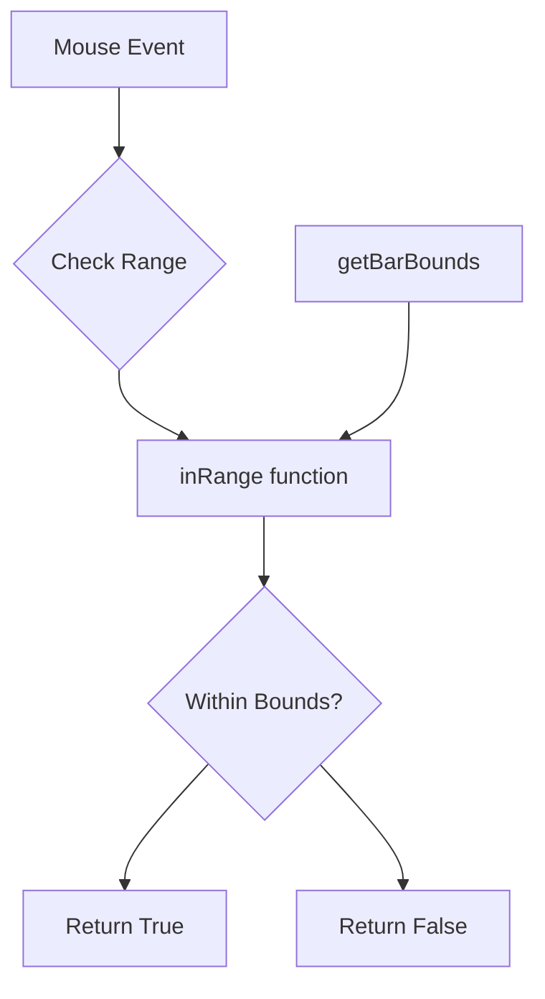
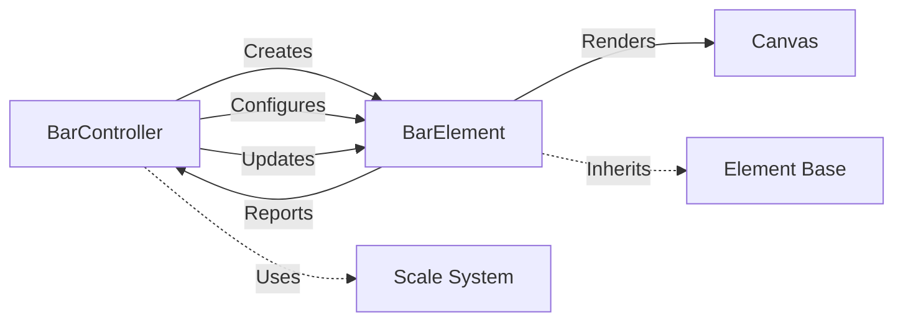

# Bar Element Module

## Introduction

The bar-element module provides the core visual representation for bar charts in Chart.js. It defines the `BarElement` class, which is responsible for rendering individual bar elements, handling their geometric properties, and managing visual styling such as borders, border radius, and background colors. This module serves as the foundation for all bar-based chart types including vertical bar charts, horizontal bar charts, and stacked bar charts.

## Architecture

### Core Component Structure



### Module Dependencies



## Component Details

### BarElement Class

The `BarElement` class extends the base `Element` class and provides specialized functionality for bar chart elements. It handles both vertical and horizontal bar orientations and manages complex visual properties including border radius and inflation effects.

#### Key Properties

- **horizontal**: Boolean flag indicating bar orientation
- **base**: The baseline value for the bar (bottom for vertical, left for horizontal)
- **width/height**: Dimensions of the bar element
- **inflateAmount**: Controls bar inflation for visual effects
- **options**: Styling options including colors, borders, and border radius

#### Static Configuration

```javascript
static defaults = {
    borderSkipped: 'start',
    borderWidth: 0,
    borderRadius: 0,
    inflateAmount: 'auto',
    pointStyle: undefined
};

static defaultRoutes = {
    backgroundColor: 'backgroundColor',
    borderColor: 'borderColor'
};
```

### Helper Functions

#### Geometry Management

**getBarBounds()**: Calculates the bounding box of a bar element regardless of orientation

```javascript
function getBarBounds(bar, useFinalPosition) {
  // Returns {left, top, right, bottom} bounds
  // Handles both horizontal and vertical orientations
}
```

**boundingRects()**: Computes inner and outer rectangles for rendering

```javascript
function boundingRects(bar) {
  // Returns {outer, inner} rectangle objects
  // Accounts for borders and border radius
}
```

#### Border Handling

**parseBorderWidth()**: Processes border width configuration with skip logic

**parseBorderRadius()**: Handles border radius with orientation-aware constraints

#### Range Detection

**inRange()**: Determines if coordinates fall within bar bounds

```javascript
function inRange(bar, x, y, useFinalPosition) {
  // Supports partial range checking (x-only, y-only, or both)
  // Uses final position for animation support
}
```

## Data Flow

### Rendering Process



### Interaction Detection



## Integration with Chart System

### Controller Relationship

The `BarElement` works closely with the [BarController](bar-controller.md) which manages the data-to-visual mapping and coordinates multiple bar elements.



### Scale System Integration

Bar elements integrate with the [scale-system](core.md#scale-system) to determine their positioning and dimensions based on data values and scale configurations.

## Visual Styling

### Border Radius Support

The module supports complex border radius configurations:

- **Uniform radius**: Single value applied to all corners
- **Individual corners**: Object with topLeft, topRight, bottomLeft, bottomRight
- **Orientation-aware**: Different behavior for horizontal vs vertical bars
- **Border interaction**: Radius adjusted based on border widths

### Inflation Effects

The `inflateAmount` property allows bars to appear larger than their actual data bounds:

- **'auto'**: Automatic inflation based on bar size
- **Number**: Specific pixel amount
- **Disabled**: Set to 0 for exact data representation

## Performance Considerations

### Rendering Optimization

- **Path caching**: Border radius paths are calculated once per render
- **Clip regions**: Efficient clipping for border effects
- **Even-odd filling**: Optimized fill operations for complex shapes

### Memory Management

- **Property access**: Uses `getProps()` for efficient property retrieval
- **Object reuse**: Minimizes object creation during calculations
- **Context save/restore**: Proper canvas state management

## Usage Examples

### Basic Bar Element

```javascript
const barElement = new BarElement({
    x: 100,
    y: 200,
    base: 300,
    width: 50,
    height: 100,
    horizontal: false,
    options: {
        backgroundColor: 'rgba(54, 162, 235, 0.5)',
        borderColor: 'rgb(54, 162, 235)',
        borderWidth: 2,
        borderRadius: 5
    }
});
```

### Horizontal Bar with Custom Styling

```javascript
const horizontalBar = new BarElement({
    x: 150,
    y: 100,
    base: 50,
    width: 120,
    height: 30,
    horizontal: true,
    options: {
        backgroundColor: 'rgba(255, 99, 132, 0.5)',
        borderColor: 'rgb(255, 99, 132)',
        borderWidth: {top: 0, right: 2, bottom: 0, left: 2},
        borderRadius: {topLeft: 15, topRight: 0, bottomLeft: 15, bottomRight: 0}
    }
});
```

## Related Modules

- **[Bar Controller](bar-controller.md)**: Manages bar element creation and data binding
- **[Core Element](core.md#element)**: Base class providing core element functionality
- **[Canvas Helpers](helpers.md#canvas)**: Utility functions for canvas operations
- **[Options Helpers](helpers.md#options)**: Configuration parsing utilities

## API Reference

### Constructor

```javascript
new BarElement(cfg)
```

**Parameters:**
- `cfg` (Object): Configuration object with bar properties

### Methods

#### draw(ctx)
Renders the bar element on the provided canvas context.

**Parameters:**
- `ctx` (CanvasRenderingContext2D): Canvas rendering context

#### inRange(mouseX, mouseY, useFinalPosition)
Determines if the given coordinates are within the bar bounds.

**Parameters:**
- `mouseX` (number): X coordinate to test
- `mouseY` (number): Y coordinate to test
- `useFinalPosition` (boolean): Use final animation position

**Returns:** (boolean) True if coordinates are within bar bounds

#### getCenterPoint(useFinalPosition)
Calculates the center point of the bar element.

**Parameters:**
- `useFinalPosition` (boolean): Use final animation position

**Returns:** (Object) Object with x and y coordinates

#### getRange(axis)
Gets the range (half width or height) along the specified axis.

**Parameters:**
- `axis` (string): 'x' or 'y'

**Returns:** (number) Range value

## Type Definitions

### BarProps

```javascript
{
  x: number,           // X coordinate
  y: number,           // Y coordinate  
  base: number,        // Baseline value
  horizontal: boolean, // Orientation flag
  width: number,       // Bar width
  height: number       // Bar height
}
```