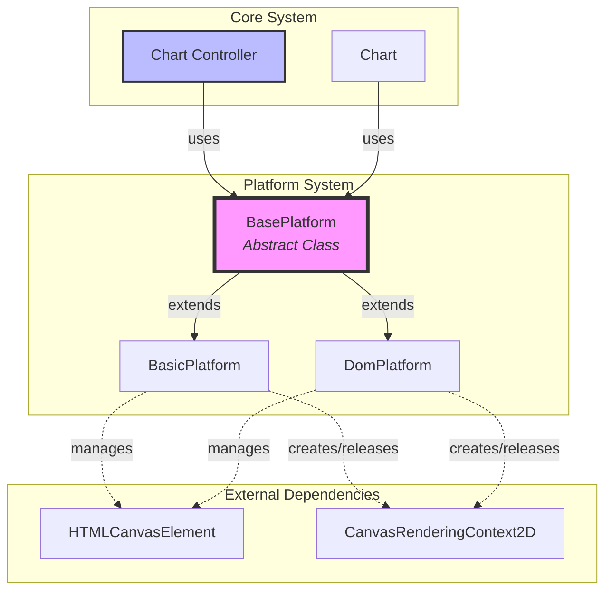
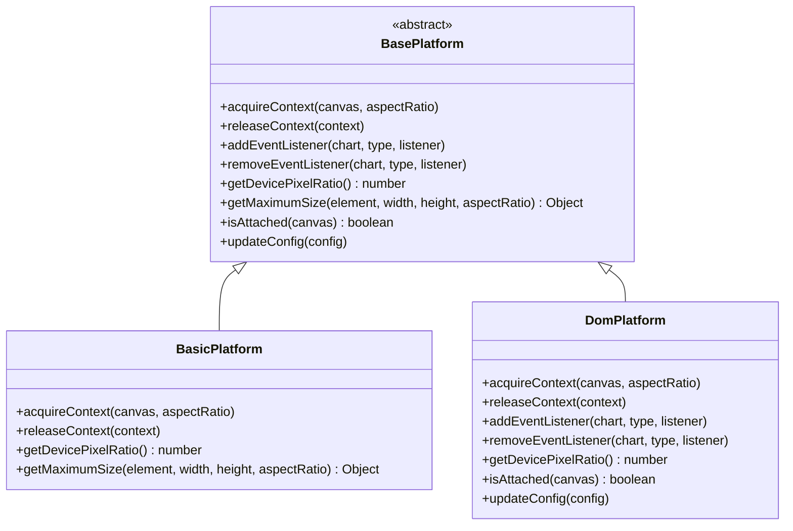
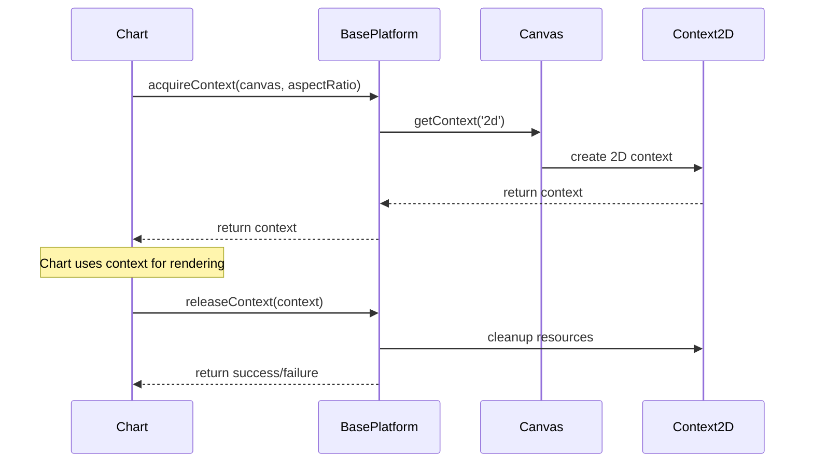
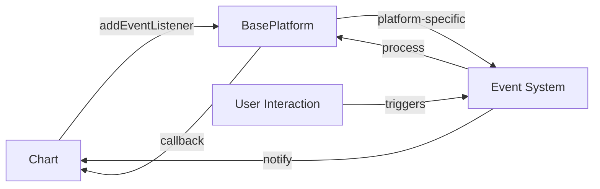
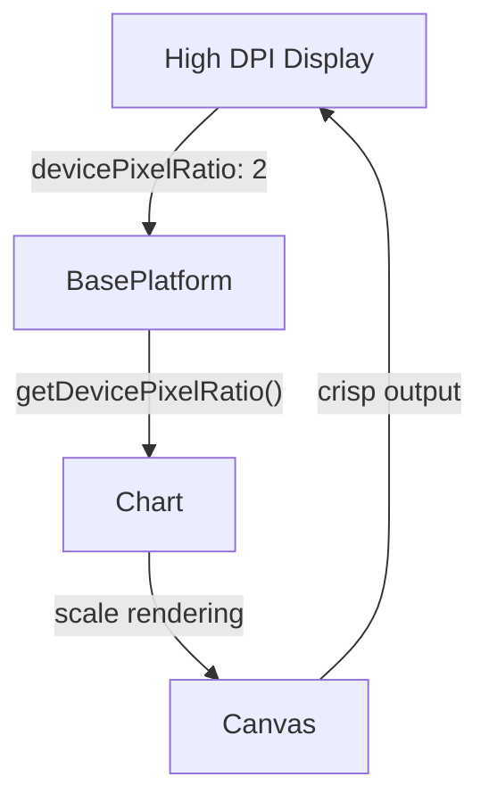
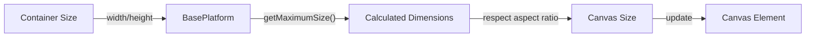
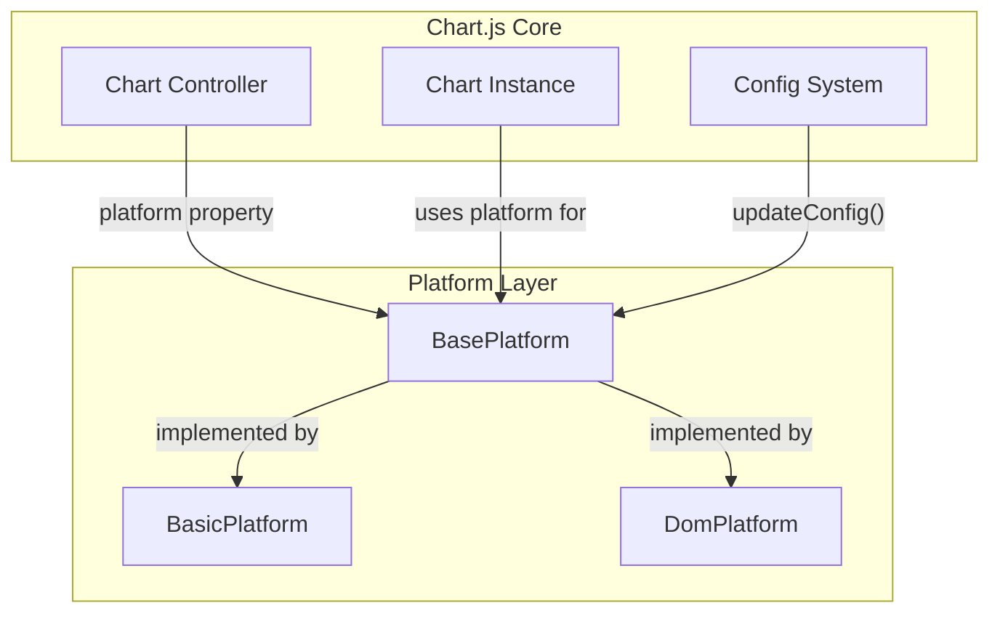
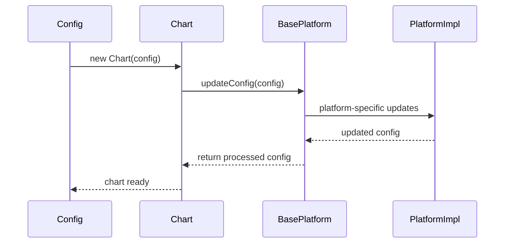

# Base Platform Module Documentation

## Introduction

The base-platform module provides the foundational abstraction layer for platform-specific operations in Chart.js. It defines the `BasePlatform` abstract class that serves as the contract for all platform implementations, enabling the charting library to work across different environments (browser DOM, Node.js, etc.) while maintaining consistent behavior.

## Module Overview

The base-platform module is part of the larger platform system within Chart.js, which includes:
- [base-platform](base-platform.md) (current module) - Abstract base class
- [basic-platform](basic-platform.md) - Basic platform implementation
- [dom-platform](dom-platform.md) - DOM-specific platform implementation

## Core Architecture

### BasePlatform Class

The `BasePlatform` class is an abstract class that defines the interface for platform-specific operations. It acts as a bridge between the chart library and the underlying platform, abstracting away differences between environments.

```javascript
export default class BasePlatform {
  // Canvas context management
  acquireContext(canvas, aspectRatio) {}
  releaseContext(context) {}
  
  // Event handling
  addEventListener(chart, type, listener) {}
  removeEventListener(chart, type, listener) {}
  
  // Device and sizing utilities
  getDevicePixelRatio() { return 1; }
  getMaximumSize(element, width, height, aspectRatio) {}
  isAttached(canvas) { return true; }
  
  // Configuration updates
  updateConfig(config) {}
}
```

## Component Relationships

### Architecture Diagram



### Platform Hierarchy



## Key Responsibilities

### 1. Canvas Context Management
The platform is responsible for acquiring and releasing 2D rendering contexts from canvas elements:



### 2. Event Handling Abstraction
Provides a consistent interface for event management across different platforms:



### 3. Device Pixel Ratio Management
Handles high-DPI displays by providing device pixel ratio information:



### 4. Canvas Sizing
Manages canvas dimensions while maintaining aspect ratios:



## Integration with Core System

### Chart Controller Integration

The BasePlatform integrates with the core chart system through the Chart controller:



### Configuration Flow



## Platform-Specific Implementations

### BasicPlatform
- Minimal platform implementation
- Suitable for server-side rendering
- Basic canvas context management
- No event handling capabilities

### DomPlatform  
- Full browser DOM implementation
- Complete event handling system
- DOM-specific optimizations
- High-DPI display support
- Canvas attachment detection

## Usage Patterns

### Platform Selection
```javascript
// The chart automatically selects the appropriate platform
const chart = new Chart(ctx, {
  type: 'line',
  data: data,
  options: options
});

// Platform is accessed internally via chart.platform
```

### Custom Platform Implementation
```javascript
class CustomPlatform extends BasePlatform {
  acquireContext(canvas, aspectRatio) {
    // Custom context acquisition logic
  }
  
  // Implement other required methods...
}
```

## Dependencies

### Internal Dependencies
- [Chart Controller](core.md#chart-controller) - Uses platform for rendering operations
- [Config System](configuration-system.md) - Integrates with platform configuration
- [Registry System](registry-system.md) - Platform registration and management

### External Dependencies
- W3C Canvas 2D Context API standard
- Platform-specific canvas implementations
- Event system APIs (DOM or custom)

## Error Handling

The BasePlatform defines the contract but leaves error handling to implementations:

- `acquireContext()` should return `null` or throw on failure
- `releaseContext()` returns boolean success status
- `isAttached()` provides canvas state verification

## Performance Considerations

### Memory Management
- Context acquisition/release cycles must be properly managed
- Event listeners should be cleaned up to prevent memory leaks
- Canvas resources should be released when charts are destroyed

### Optimization Strategies
- Device pixel ratio caching for performance
- Efficient event delegation patterns
- Minimal overhead in base implementation

## Testing Considerations

### Mock Implementations
Test environments often use mock platform implementations:

```javascript
class MockPlatform extends BasePlatform {
  acquireContext() { return mockContext; }
  releaseContext() { return true; }
  // Other mock implementations...
}
```

### Platform-Specific Testing
- DOM platform requires browser environment
- Basic platform suitable for Node.js testing
- Custom platforms need comprehensive testing

## Future Extensibility

The BasePlatform design supports future platform implementations:

- WebGL platforms for 3D rendering
- Mobile-specific platforms
- Server-side rendering optimizations
- Virtual canvas implementations

## Related Documentation

- [Basic Platform](basic-platform.md) - Minimal platform implementation
- [DOM Platform](dom-platform.md) - Browser-specific platform implementation
- [Core System](core.md) - Main chart controller and core components
- [Configuration System](configuration-system.md) - Configuration management integration