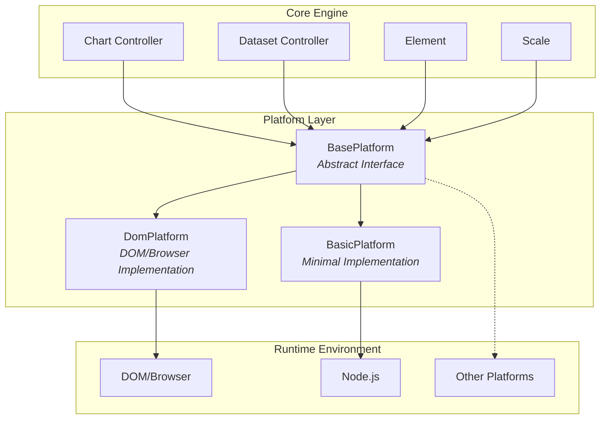
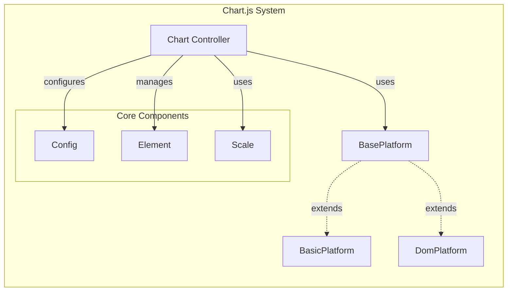
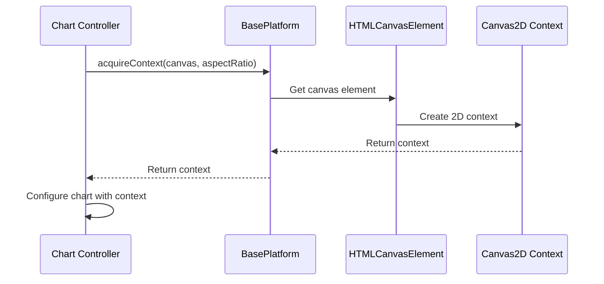
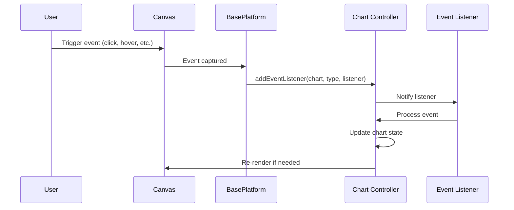

# Base Platform Module Documentation

## Introduction

The base_platform module provides the foundational abstraction layer for platform-specific operations in the Chart.js library. It defines the `BasePlatform` abstract class that serves as a contract for platform implementations, enabling the chart library to work across different environments (web browsers, Node.js, etc.) without tight coupling to platform-specific APIs.

## Module Overview

The base_platform module is located at `src/platform/platform.base.js` and contains the core `BasePlatform` class. This module is part of the platform layer that sits between the core chart engine and the actual runtime environment, providing a clean separation of concerns and enabling cross-platform compatibility.

## Core Components

### BasePlatform Class

The `BasePlatform` class is an abstract base class that defines the interface for platform-specific implementations. It provides methods for:

- Canvas context management
- Event handling
- Device pixel ratio detection
- Canvas sizing calculations
- Platform attachment verification
- Configuration updates

## Architecture

### Platform Layer Architecture



### Component Relationships



## Data Flow

### Platform Context Acquisition Flow



### Event Handling Flow



## Method Specifications

### acquireContext(canvas, aspectRatio)
- **Purpose**: Acquire a 2D rendering context from a canvas element
- **Parameters**: 
  - `canvas`: HTMLCanvasElement - The canvas element
  - `aspectRatio`: number (optional) - The desired aspect ratio
- **Returns**: CanvasRenderingContext2D - The 2D context for rendering

### releaseContext(context)
- **Purpose**: Release resources associated with a context
- **Parameters**: 
  - `context`: CanvasRenderingContext2D - The context to release
- **Returns**: boolean - Success status

### addEventListener(chart, type, listener)
- **Purpose**: Register an event listener for chart events
- **Parameters**: 
  - `chart`: Chart - The chart instance
  - `type`: string - Event type to listen for
  - `listener`: function - Event handler function

### removeEventListener(chart, type, listener)
- **Purpose**: Remove a previously registered event listener
- **Parameters**: 
  - `chart`: Chart - The chart instance
  - `type`: string - Event type
  - `listener`: function - Event handler function to remove

### getDevicePixelRatio()
- **Purpose**: Get the device's pixel ratio for high-DPI displays
- **Returns**: number - The device pixel ratio (default: 1)

### getMaximumSize(element, width, height, aspectRatio)
- **Purpose**: Calculate the maximum size for a canvas element
- **Parameters**: 
  - `element`: HTMLCanvasElement - The canvas element
  - `width`: number (optional) - Parent width
  - `height`: number (optional) - Parent height  
  - `aspectRatio`: number (optional) - Aspect ratio to maintain
- **Returns**: Object - Maximum width and height

### isAttached(canvas)
- **Purpose**: Check if a canvas is attached to the platform
- **Parameters**: 
  - `canvas`: HTMLCanvasElement - The canvas to check
- **Returns**: boolean - Attachment status (default: true)

### updateConfig(config)
- **Purpose**: Update configuration with platform-specific requirements
- **Parameters**: 
  - `config`: Config - The configuration object to update

## Integration with Other Modules

### Core Engine Integration
The BasePlatform is integrated with the [core_engine](core_engine.md) module, specifically with the Chart Controller which uses the platform for all canvas and rendering operations.

### Platform Implementations
The BasePlatform serves as the parent class for:
- [basic_platform](basic_platform.md): Minimal implementation for non-browser environments
- [dom_platform](dom_platform.md): Full-featured implementation for browser DOM environments

### Configuration System
The platform works with the [core_engine](core_engine.md) configuration system through the `updateConfig` method, allowing platform-specific configuration adjustments.

## Usage Patterns

### Platform Selection
```javascript
// Platform is automatically selected based on environment
// In browser: DomPlatform is used
// In Node.js: BasicPlatform is used
const platform = getPlatform(); // Returns appropriate platform instance
```

### Context Management
```javascript
// Acquire context for rendering
const context = platform.acquireContext(canvas, aspectRatio);
// Use context for chart rendering
// Release when done
platform.releaseContext(context);
```

### Event Handling
```javascript
// Register event listeners
platform.addEventListener(chart, 'click', handleClick);
platform.addEventListener(chart, 'mousemove', handleHover);

// Remove when no longer needed
platform.removeEventListener(chart, 'click', handleClick);
```

## Platform Abstraction Benefits

1. **Cross-Platform Compatibility**: Charts work seamlessly across different environments
2. **Testability**: Platform dependencies can be mocked for testing
3. **Maintainability**: Platform-specific code is isolated
4. **Extensibility**: New platforms can be added by extending BasePlatform
5. **Performance**: Platform-specific optimizations can be implemented

## Default Implementations

The BasePlatform provides sensible defaults for all methods:
- `getDevicePixelRatio()`: Returns 1 (standard DPI)
- `isAttached()`: Returns true (assumes attachment)
- `releaseContext()`: Returns false (no-op)
- `updateConfig()`: No operation

These defaults allow basic functionality in minimal environments while specific platforms can override for enhanced features.

## Error Handling

The BasePlatform methods are designed to fail gracefully:
- Context acquisition failures should be handled by the implementation
- Event listener registration failures are silently ignored
- Invalid parameters should be validated by the implementation
- Platform-specific errors should be wrapped in appropriate error types

## Performance Considerations

- Context acquisition and release should be optimized for the platform
- Event listeners should be managed efficiently to prevent memory leaks
- Device pixel ratio calculations should be cached when possible
- Canvas sizing operations should minimize DOM reflows

## Future Extensibility

The BasePlatform design allows for future enhancements:
- WebGL context support
- OffscreenCanvas support
- Worker thread rendering
- Mobile-specific optimizations
- Accessibility features integration