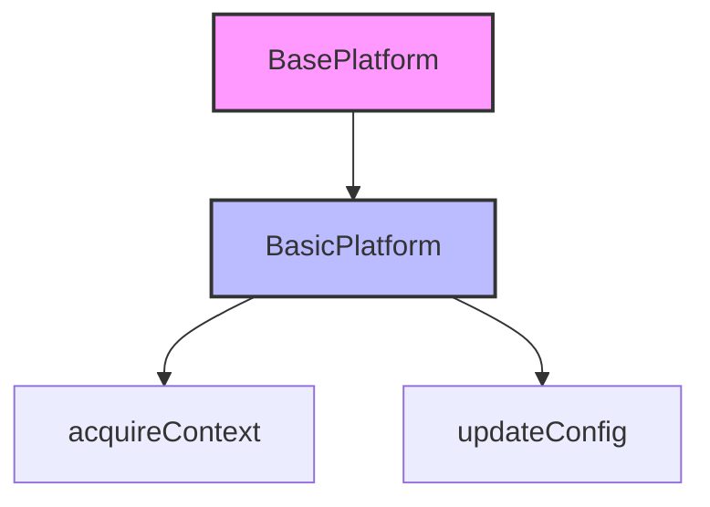
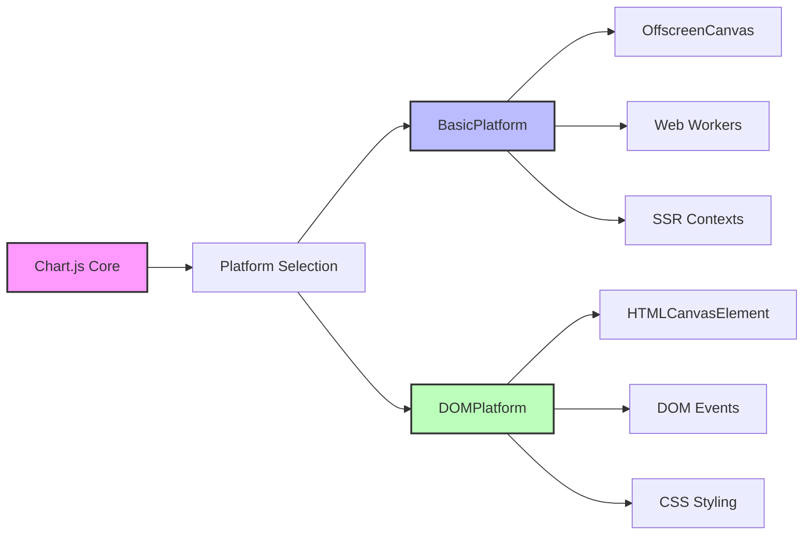
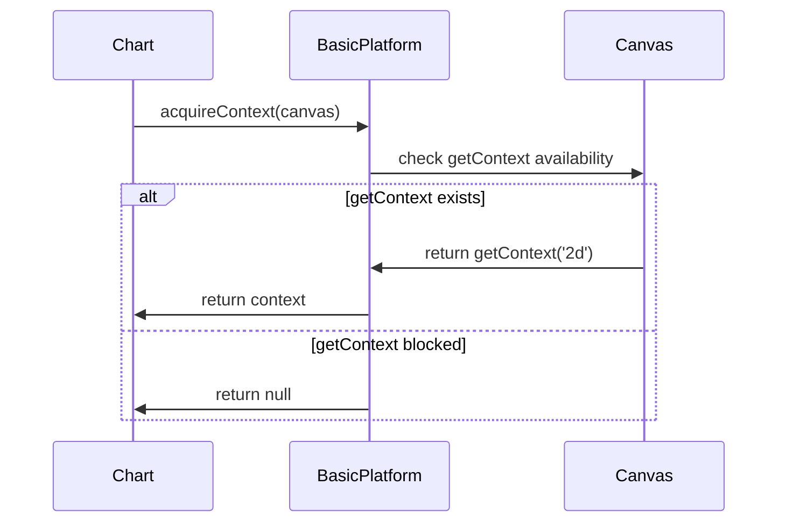
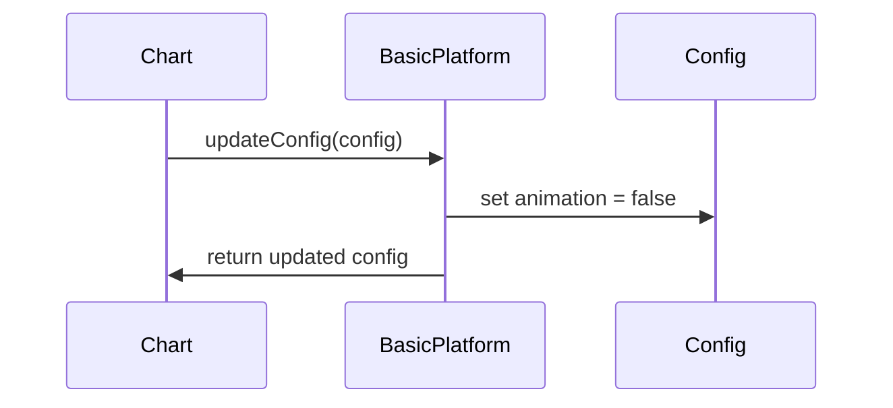

# Basic Platform Module

## Introduction

The basic-platform module provides a minimal platform implementation for Chart.js that enables chart rendering in environments without DOM access. This platform serves as a fallback implementation for charts rendered on OffscreenCanvas elements, making it essential for web workers, server-side rendering, and other non-DOM contexts.

## Purpose and Core Functionality

The BasicPlatform class extends the [BasePlatform](base-platform.md) to provide essential canvas context acquisition and configuration management for charts operating in constrained environments. Its primary responsibilities include:

- **Canvas Context Acquisition**: Safely obtaining 2D rendering contexts from canvas elements
- **Security Compliance**: Handling canvas fingerprinting prevention measures
- **Configuration Management**: Disabling animations for optimal performance in non-DOM environments
- **Minimal Platform Interface**: Providing the essential platform API without DOM dependencies

## Architecture

### Component Hierarchy



### Platform Integration



## Core Components

### BasicPlatform Class

The `BasicPlatform` class is the main component of this module, extending `BasePlatform` with minimal functionality for non-DOM environments.

#### Key Methods

**acquireContext(item)**
- **Purpose**: Safely acquires a 2D rendering context from a canvas element
- **Security Consideration**: Handles cases where `getContext` method may be undefined due to canvas fingerprinting prevention add-ons
- **Parameters**: `item` - The canvas element (typically OffscreenCanvas)
- **Returns**: Canvas 2D context or `null` if unavailable

**updateConfig(config)**
- **Purpose**: Updates chart configuration for optimal performance in basic platform environments
- **Behavior**: Disables animations by setting `config.options.animation = false`
- **Rationale**: Animations are typically unnecessary in non-interactive contexts like server-side rendering

## Data Flow

### Context Acquisition Process



### Configuration Update Flow



## Dependencies and Relationships

### Inheritance Chain
- **Extends**: [BasePlatform](base-platform.md) - Provides the foundational platform interface
- **Used by**: Chart.js core for platform detection and context management

### Related Modules
- **[base-platform](base-platform.md)**: Parent class defining the platform interface
- **[dom-platform](dom-platform.md)**: Alternative platform implementation for DOM environments
- **[core.config](configuration-system.md)**: Configuration system that interacts with platform-specific settings

## Usage Contexts

### OffscreenCanvas Rendering
The BasicPlatform is automatically selected when Chart.js detects an OffscreenCanvas element, enabling chart rendering in:
- Web Workers for background processing
- Server-side rendering environments
- Headless browser contexts

### Security-Conscious Environments
Handles canvas fingerprinting prevention by gracefully managing cases where the `getContext` method may be undefined by privacy-focused browser extensions.

## Performance Considerations

### Animation Disabling
By automatically disabling animations, the BasicPlatform ensures:
- Reduced computational overhead
- Faster initial rendering
- Lower memory consumption
- Optimal performance in non-interactive contexts

### Minimal Overhead
The platform implementation provides only essential functionality, avoiding:
- DOM manipulation costs
- Event handling overhead
- Style computation expenses
- Layout calculation requirements

## Error Handling

### Context Acquisition Failures
The platform gracefully handles:
- Missing `getContext` method (canvas fingerprinting protection)
- Invalid canvas elements
- Context creation failures

### Fallback Behavior
When context acquisition fails, the platform returns `null`, allowing Chart.js to handle the error appropriately at a higher level.

## Extension Points

While the BasicPlatform is designed for minimal functionality, it can be extended for specific use cases:

- **Custom Context Acquisition**: Override `acquireContext` for specialized canvas handling
- **Configuration Modification**: Extend `updateConfig` for platform-specific optimizations
- **Error Handling**: Add custom error recovery mechanisms

## Best Practices

### When to Use BasicPlatform
- Rendering charts in Web Workers
- Server-side chart generation
- Headless testing environments
- Privacy-focused applications with canvas fingerprinting protection

### When to Avoid
- Interactive chart applications requiring user input
- Charts needing DOM event handling
- Applications requiring CSS styling integration
- Scenarios where animations are desired

## Integration Example

```javascript
// The platform is automatically selected based on canvas type
const canvas = new OffscreenCanvas(800, 600);
const chart = new Chart(canvas, {
    type: 'line',
    data: data,
    options: {
        // Animation is automatically disabled by BasicPlatform
        animation: false
    }
});
```

This automatic platform selection ensures optimal performance and compatibility across different deployment environments without requiring manual configuration.