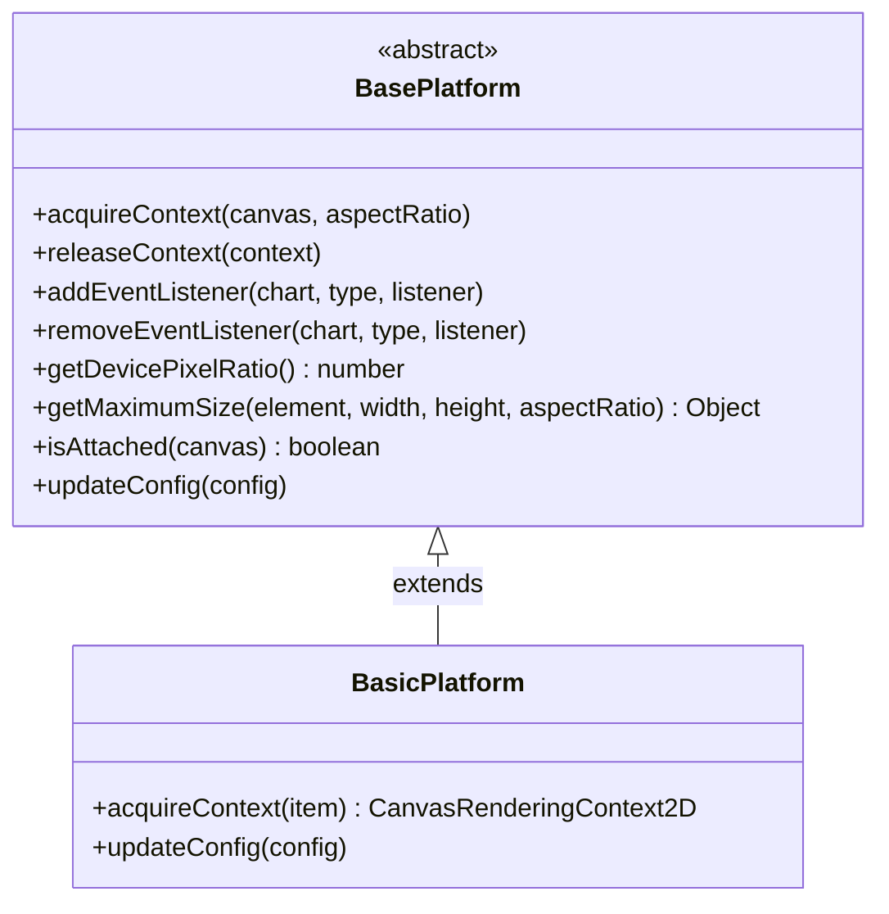
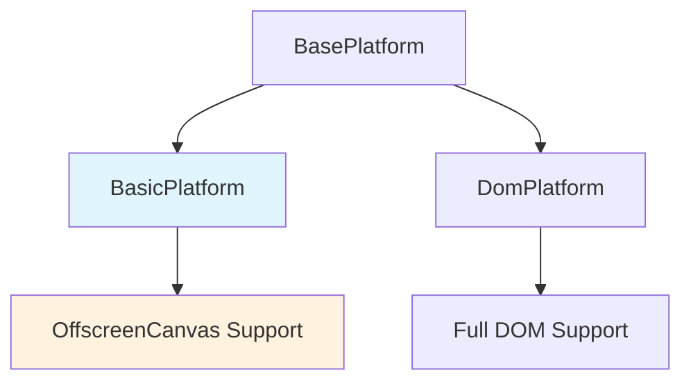
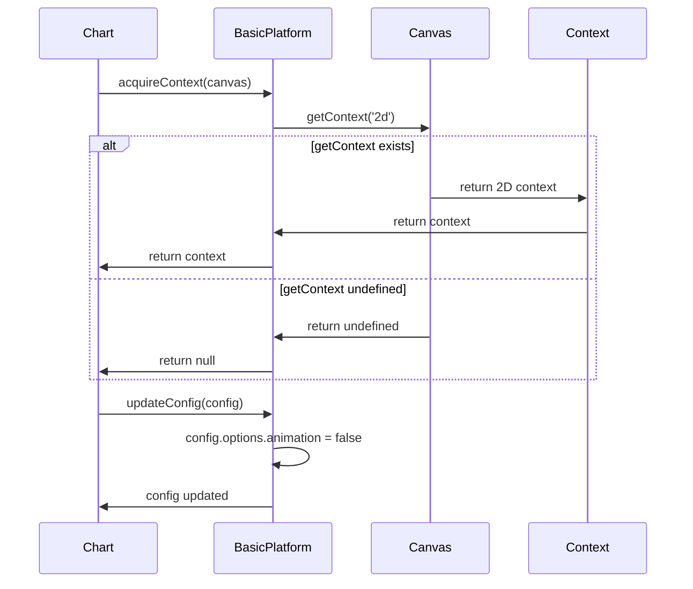
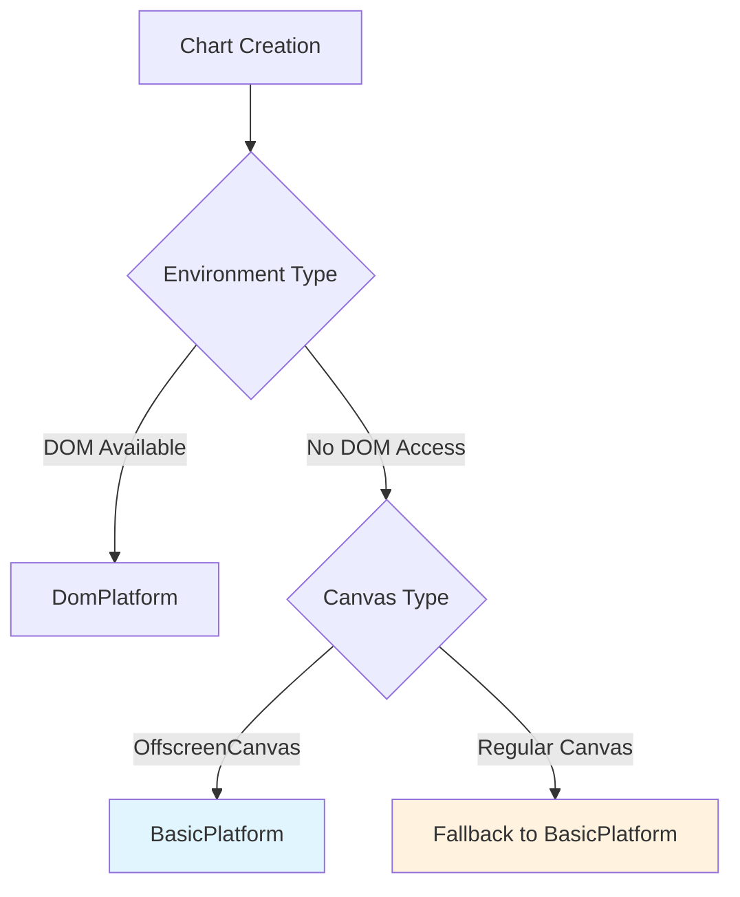
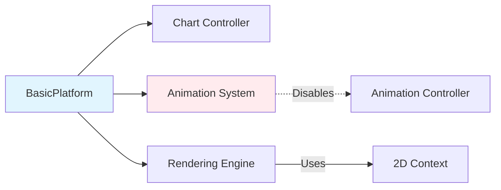

# Basic Platform Module

## Introduction

The `basic_platform` module provides a minimal platform implementation for Chart.js that enables chart rendering in environments without DOM access or full element properties. This platform serves as a fallback implementation for charts rendered on OffscreenCanvas elements, making Chart.js compatible with web workers and other constrained environments.

## Overview

The BasicPlatform class extends the BasePlatform to provide essential functionality for chart rendering in minimal environments. It focuses on the core requirement of acquiring a 2D rendering context while disabling animations to ensure optimal performance in resource-constrained scenarios.

## Architecture

### Component Structure



### Platform Hierarchy



## Core Components

### BasicPlatform Class

The `BasicPlatform` class is the primary component of this module, providing minimal platform functionality for chart rendering.

**Key Features:**
- **Context Acquisition**: Safely acquires 2D rendering context from canvas elements
- **Canvas Fingerprinting Protection**: Handles cases where `getContext` method is undefined
- **Animation Optimization**: Automatically disables animations for better performance
- **OffscreenCanvas Support**: Specifically designed for web worker environments

**Methods:**

#### `acquireContext(item)`
- **Purpose**: Acquires a 2D rendering context from the provided canvas element
- **Parameters**: `item` - The canvas element (typically OffscreenCanvas)
- **Returns**: Canvas 2D rendering context or null
- **Special Handling**: Includes protection against canvas fingerprinting add-ons that may undefine the getContext method

#### `updateConfig(config)`
- **Purpose**: Updates chart configuration with platform-specific optimizations
- **Parameters**: `config` - The chart configuration object
- **Behavior**: Disables animations by setting `config.options.animation = false`

## Data Flow



## Platform Selection Process



## Integration with Core System

### Relationship to Core Components



The BasicPlatform integrates with the core Chart.js system by:

1. **Providing Rendering Context**: Supplies the essential 2D context required by the [core.controller.Chart](core_engine.md) for rendering operations
2. **Animation Control**: Interfaces with the [animation system](animation.md) by disabling animations to optimize performance
3. **Configuration Management**: Works with the [core.config.Config](core_engine.md) to apply platform-specific settings

## Usage Scenarios

### Web Worker Implementation
```javascript
// In a web worker
import { Chart, BasicPlatform } from 'chart.js';

// Create an OffscreenCanvas
const offscreenCanvas = new OffscreenCanvas(800, 600);

// Chart automatically uses BasicPlatform for OffscreenCanvas
const chart = new Chart(offscreenCanvas, {
  type: 'line',
  data: chartData,
  options: {
    // Animations are automatically disabled
  }
});
```

### Fallback for Constrained Environments
```javascript
// BasicPlatform is automatically selected when DOM is not available
const canvas = document.createElement('canvas');
// If DOM methods are restricted, BasicPlatform provides minimal functionality
const chart = new Chart(canvas, config);
```

## Platform Comparison

| Feature | BasicPlatform | DomPlatform |
|---------|---------------|-------------|
| DOM Access | ❌ | ✅ |
| Event Handling | ❌ | ✅ |
| Animation Support | ❌ (disabled) | ✅ |
| Device Pixel Ratio | Fixed (1.0) | Dynamic |
| Canvas Attachment Check | Always true | Actual check |
| Use Case | OffscreenCanvas, Web Workers | Standard browser environment |

## Error Handling

The BasicPlatform implements defensive programming practices:

1. **Context Acquisition Safety**: Checks for existence of `getContext` method before calling it
2. **Null Context Handling**: Returns null instead of throwing errors when context cannot be acquired
3. **Graceful Degradation**: Continues operation even with limited functionality

## Performance Considerations

### Optimization Strategies
- **Animation Disabling**: Automatically disables animations to reduce computational overhead
- **Minimal Overhead**: Implements only essential methods without additional processing
- **Memory Efficiency**: No event listeners or DOM references to clean up

### Resource Management
- No resource cleanup required (releaseContext returns false)
- No event listeners to manage
- Minimal memory footprint

## Dependencies

### Internal Dependencies
- [BasePlatform](base_platform.md): Extends the abstract base platform class
- [Core Configuration](core_engine.md): Interfaces with chart configuration system

### External Dependencies
- Canvas 2D Context API: Requires browser support for Canvas 2D rendering context
- OffscreenCanvas API: Used when available for web worker compatibility

## Future Considerations

### Potential Enhancements
- WebGL context support for performance-critical applications
- Configurable animation settings (currently hardcoded to false)
- Enhanced error reporting for debugging in constrained environments

### Compatibility Notes
- Designed for Chart.js v3.0+ architecture
- Maintains backward compatibility with canvas fingerprinting protection
- Future-proofed for emerging web standards like WebGPU

## Related Documentation
- [Base Platform Module](base_platform.md) - Abstract platform interface
- [DOM Platform Module](dom_platform.md) - Full-featured platform implementation
- [Core Engine Module](core_engine.md) - Core chart functionality and configuration
- [Animation Module](animation.md) - Animation system integration