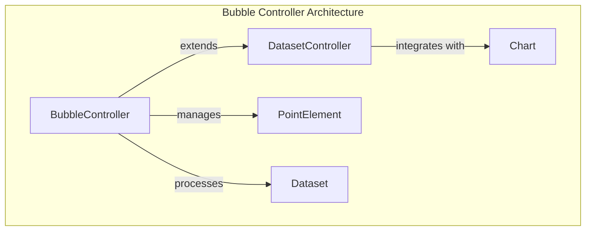
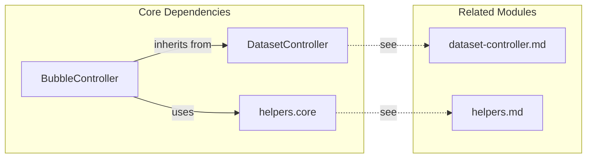
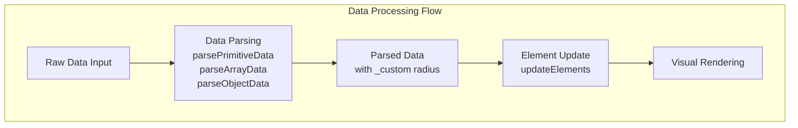
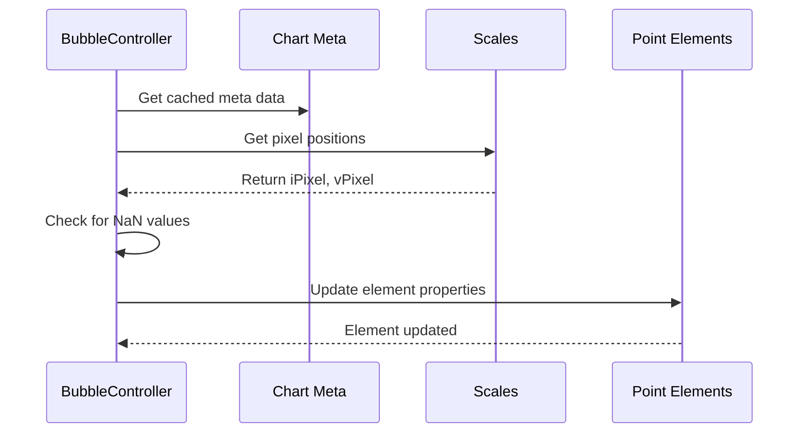
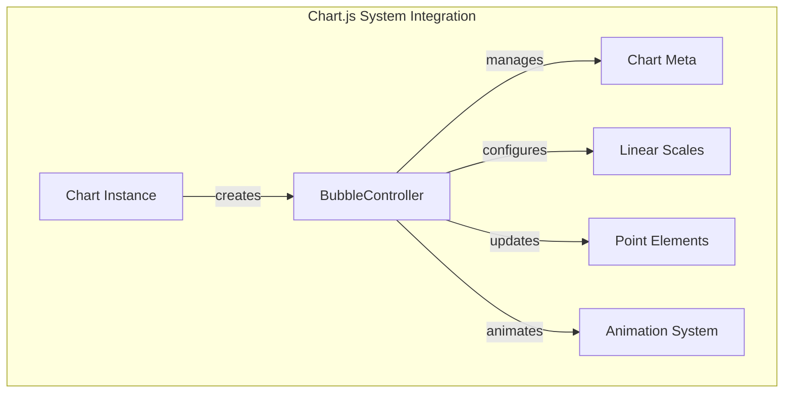

# Bubble Controller Module Documentation

## Introduction

The Bubble Controller module is a specialized chart controller within the Chart.js ecosystem that handles the creation and management of bubble charts. Bubble charts are a variation of scatter plots where each data point is represented as a circle (bubble) with three dimensions of data: x-position, y-position, and radius size. This controller extends the base DatasetController to provide bubble-specific functionality for data parsing, element updates, and visual rendering.

## Architecture Overview

The BubbleController serves as the central component for managing bubble chart datasets, inheriting core functionality from the DatasetController while implementing bubble-specific behaviors for data processing and element management.



## Component Dependencies

The BubbleController has several key dependencies within the Chart.js architecture:



## Core Components

### BubbleController Class

The `BubbleController` class is the primary component of this module, extending the base `DatasetController` to provide bubble chart functionality.

**Key Properties:**
- `id`: 'bubble' - Unique identifier for this controller type
- `defaults`: Configuration defaults specific to bubble charts
- `overrides`: Scale type overrides (linear scales for both x and y axes)

**Key Methods:**
- `initialize()`: Sets up option sharing and calls parent initialization
- `parsePrimitiveData()`, `parseArrayData()`, `parseObjectData()`: Data parsing methods for different input formats
- `updateElements()`: Updates visual elements based on data and mode
- `resolveDataElementOptions()`: Resolves styling options for individual data points

## Data Flow Architecture



## Data Parsing Process

The BubbleController supports three data formats, each handled by a specific parsing method:

### 1. Primitive Data Format
```javascript
// Array of numbers
[10, 20, 30, 40]
```
- Uses `parsePrimitiveData()` method
- Radius is resolved from element options

### 2. Array Data Format
```javascript
// Array of [x, y, radius] tuples
[[10, 20, 5], [30, 40, 10], [50, 60, 8]]
```
- Uses `parseArrayData()` method
- Third element (index 2) represents radius
- Falls back to element options if radius not provided

### 3. Object Data Format
```javascript
// Array of objects with x, y, r properties
[{x: 10, y: 20, r: 5}, {x: 30, y: 40, r: 10}]
```
- Uses `parseObjectData()` method
- `r` property represents radius
- Falls back to element options if radius not provided

## Element Update Process



## Configuration and Defaults

### Default Configuration
```javascript
{
  datasetElementType: false,    // No dataset-level element
  dataElementType: 'point',     // Uses PointElement for rendering
  animations: {
    numbers: {
      type: 'number',
      properties: ['x', 'y', 'borderWidth', 'radius']
    }
  }
}
```

### Scale Overrides
```javascript
{
  scales: {
    x: { type: 'linear' },      // Linear x-axis
    y: { type: 'linear' }       // Linear y-axis
  }
}
```

## Integration with Chart System



## Key Features

### 1. Multi-dimensional Data Support
- Handles x, y coordinates plus radius dimension
- Supports various data input formats
- Automatic radius resolution from data or options

### 2. Scale Integration
- Automatically configures linear scales for both axes
- Handles pixel-to-value conversions
- Supports proper data positioning

### 3. Animation Support
- Animates x, y positions and radius changes
- Supports border width animations
- Integrates with Chart.js animation system

### 4. Element Management
- Creates and manages PointElement instances
- Handles element updates during chart interactions
- Supports active/hover state styling

## Usage Patterns

### Basic Bubble Chart Configuration
```javascript
const config = {
  type: 'bubble',
  data: {
    datasets: [{
      label: 'Bubble Dataset',
      data: [
        {x: 10, y: 20, r: 5},
        {x: 30, y: 40, r: 10},
        {x: 50, y: 60, r: 8}
      ]
    }]
  },
  options: {
    scales: {
      x: { type: 'linear' },
      y: { type: 'linear' }
    }
  }
};
```

## Performance Considerations

### Overflow Calculation
The controller implements `getMaxOverflow()` to calculate the maximum bubble radius for proper chart layout and clipping calculations.

### Option Sharing
Enables option sharing (`enableOptionSharing = true`) to optimize memory usage when multiple elements share the same styling options.

### Data Caching
Utilizes Chart.js caching mechanisms to avoid redundant data parsing and option resolution.

## Error Handling

### NaN Value Handling
The controller checks for invalid pixel positions and marks elements with `skip: true` to prevent rendering issues.

### Radius Validation
Implements proper radius validation and fallback mechanisms to ensure valid bubble sizes.

## Related Documentation

- [Dataset Controller](dataset-controller.md) - Base controller functionality
- [Point Element](point-element.md) - Element used for bubble rendering
- [Linear Scale](linear-scale.md) - Scale type used for bubble charts
- [Animation System](animation-system.md) - Animation functionality
- [Configuration System](configuration-system.md) - Configuration management

## API Reference

### Methods

#### `parsePrimitiveData(meta, data, start, count)`
Parses primitive array data and adds radius information.

#### `parseArrayData(meta, data, start, count)`
Parses array data format `[x, y, radius]` and extracts radius values.

#### `parseObjectData(meta, data, start, count)`
Parses object data format `{x, y, r}` and extracts radius values.

#### `updateElements(points, start, count, mode)`
Updates visual properties of bubble elements based on current data and mode.

#### `resolveDataElementOptions(index, mode)`
Resolves styling options for individual data points, including radius calculation.

#### `getMaxOverflow()`
Calculates the maximum bubble radius for layout calculations.

#### `getLabelAndValue(index)`
Generates human-readable labels for tooltips and legends.

### Properties

#### Static Properties
- `id`: Controller type identifier ('bubble')
- `defaults`: Default configuration object
- `overrides`: Scale configuration overrides

#### Instance Properties
- `enableOptionSharing`: Boolean flag for option sharing optimization