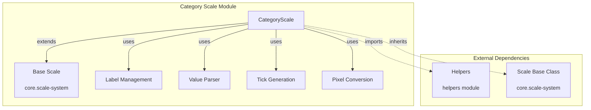
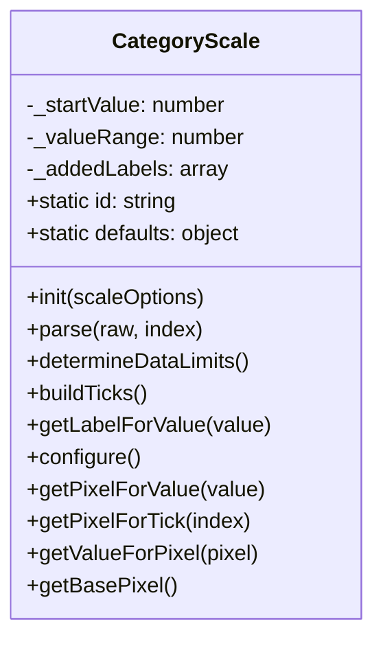
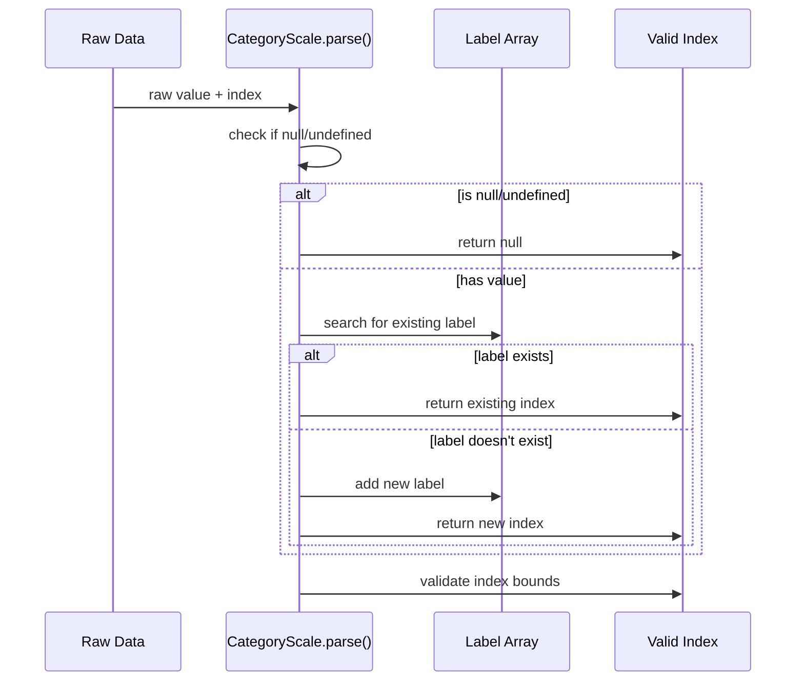
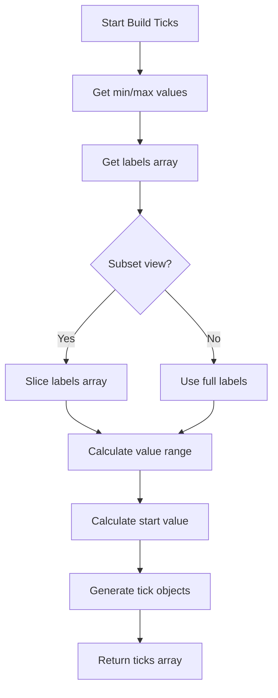
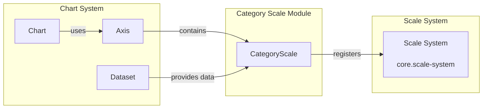

# Category Scale Module Documentation

## Introduction

The Category Scale module provides categorical axis scaling functionality for Chart.js, enabling charts to display discrete, non-numerical data along an axis. This module is essential for bar charts, line charts with categorical labels, and any visualization that requires text-based or discrete positioning along an axis.

## Architecture Overview

The Category Scale module is built around the `CategoryScale` class, which extends the base `Scale` class from the core scale system. It provides specialized handling for categorical data, including label management, value parsing, and pixel-to-value conversions.



## Core Components

### CategoryScale Class

The `CategoryScale` class is the primary component of this module, providing categorical scaling capabilities with the following key features:

- **Label Management**: Handles dynamic label addition and lookup
- **Value Parsing**: Converts raw data into categorical indices
- **Tick Generation**: Creates appropriate ticks for categorical data
- **Pixel Conversion**: Maps between pixel positions and categorical values



## Data Flow

### Value Parsing Flow



### Tick Building Process



## Key Features

### 1. Dynamic Label Management

The Category Scale supports dynamic label addition during data parsing. When new categorical values are encountered, they are automatically added to the label array.

```javascript
// Example: Automatic label addition
const scale = new CategoryScale({
  data: ['Apple', 'Banana', 'Orange', 'Apple']
});
// Labels: ['Apple', 'Banana', 'Orange']
// Duplicate 'Apple' is handled correctly
```

### 2. Value Parsing and Indexing

The scale converts raw categorical values into numerical indices for internal processing:

- **String values**: Added to labels array and assigned an index
- **Existing labels**: Reuse existing index
- **Invalid values**: Return null
- **Index validation**: Ensure indices are within bounds

### 3. Tick Generation

Ticks are generated based on the data range and label array:

- **Full range**: All labels are used as ticks
- **Subset range**: Only relevant labels are included
- **Offset handling**: Adjusts for axis offset options
- **Value range calculation**: Determines the scale's value range

### 4. Pixel Conversion

The scale provides bidirectional conversion between pixel positions and categorical values:

- **Value to pixel**: `getPixelForValue()` converts categorical index to pixel position
- **Pixel to value**: `getValueForPixel()` converts pixel position to categorical index
- **Tick to pixel**: `getPixelForTick()` gets pixel position for specific tick

## Configuration

### Default Configuration

```javascript
CategoryScale.defaults = {
  ticks: {
    callback: function(value) {
      return this.getLabelForValue(value);
    }
  }
};
```

### Available Options

- **bounds**: Controls how min/max values are determined ('ticks' or 'data')
- **offset**: Whether to offset the scale by 0.5 units
- **ticks.callback**: Function to generate tick labels

## Integration with Chart System



## Usage Examples

### Basic Usage

```javascript
const config = {
  type: 'bar',
  data: {
    labels: ['January', 'February', 'March'],
    datasets: [{
      data: [10, 20, 30]
    }]
  },
  options: {
    scales: {
      x: {
        type: 'category'
      }
    }
  }
};
```

### Dynamic Labels

```javascript
const config = {
  data: {
    datasets: [{
      data: [
        { x: 'Product A', y: 100 },
        { x: 'Product B', y: 200 },
        { x: 'Product C', y: 150 }
      ]
    }]
  }
};
// Labels are automatically extracted: ['Product A', 'Product B', 'Product C']
```

## Performance Considerations

### Label Lookup Optimization

- **First/Last Index**: Uses `indexOf()` and `lastIndexOf()` for efficient lookup
- **Duplicate Handling**: Special logic for handling duplicate labels
- **Added Labels Tracking**: Maintains separate array for newly added labels

### Memory Management

- **Label Array Slicing**: Avoids creating unnecessary copies when possible
- **Added Labels Cleanup**: Removes temporary labels during initialization
- **Index Validation**: Prevents invalid indices from being stored

## Error Handling

### Null/Undefined Values

The scale gracefully handles null or undefined values by returning null from the parse method.

### Invalid Indices

Indices are validated and limited to valid ranges using the `_limitValue` helper function.

### Duplicate Labels

Duplicate labels are handled correctly by returning the first occurrence's index.

## Dependencies

### Internal Dependencies

- **[core.scale-system](core.scale-system.md)**: Inherits from base Scale class
- **[helpers module](helpers.md)**: Uses utility functions for value handling

### Related Modules

- **[linear-scale](linear-scale.md)**: Alternative scale type for numerical data
- **[time-scale](time-scale.md)**: Scale type for temporal data
- **[bar-controller](bar-controller.md)**: Commonly used with category scales

## Testing Considerations

### Key Test Scenarios

1. **Label Addition**: Verify new labels are added correctly
2. **Duplicate Handling**: Ensure duplicate labels return correct indices
3. **Null Handling**: Test behavior with null/undefined values
4. **Range Calculation**: Verify min/max values are determined correctly
5. **Pixel Conversion**: Test bidirectional pixel-value conversion
6. **Tick Generation**: Verify ticks are generated for various ranges

### Edge Cases

- Empty dataset
- Single label
- All duplicate labels
- Mixed data types
- Large number of labels
- Non-contiguous indices

## Future Enhancements

### Potential Improvements

1. **Label Sorting**: Option to automatically sort labels
2. **Custom Label Ordering**: Allow custom label ordering beyond data order
3. **Label Filtering**: Support for filtering/hiding specific labels
4. **Performance Optimization**: Faster lookup for large label sets
5. **Internationalization**: Better support for internationalized labels

## Conclusion

The Category Scale module provides robust categorical axis scaling for Chart.js, handling the complexities of discrete data representation while maintaining performance and flexibility. Its integration with the broader scale system and support for dynamic label management make it a essential component for categorical data visualization.