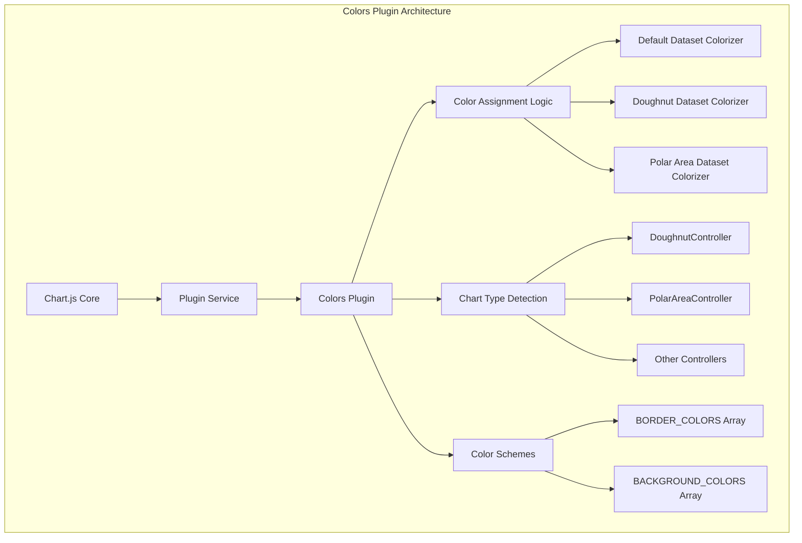
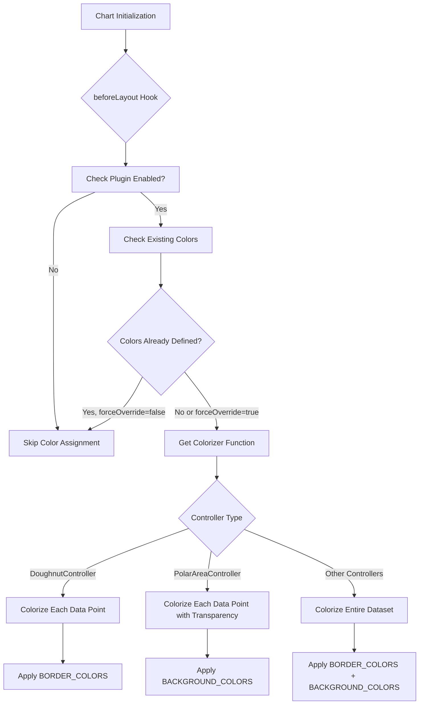
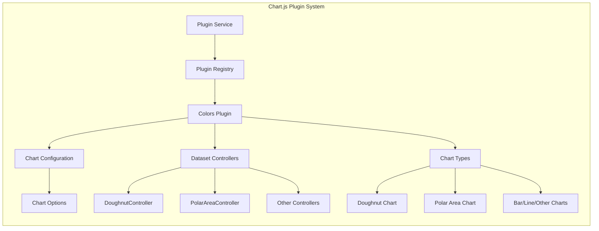

# Colors Plugin Module

## Introduction

The colors-plugin module is a core Chart.js plugin that provides automatic color assignment for chart datasets. It intelligently applies default color schemes to datasets that don't have explicit color definitions, ensuring visually distinct and appealing charts without manual color configuration.

## Architecture Overview

The colors-plugin operates as a Chart.js plugin that hooks into the chart rendering lifecycle. It analyzes datasets and applies predefined color schemes based on the chart type and controller, ensuring consistent and visually appealing color assignments across different chart types.



## Core Components

### ColorsPluginOptions Interface

Defines the configuration options for the colors plugin:

```typescript
interface ColorsPluginOptions {
  enabled?: boolean;      // Enable/disable the plugin (default: true)
  forceOverride?: boolean; // Force color override even if colors are defined (default: false)
}
```

### ColorsDescriptor Interface

Describes color properties for chart elements:

```typescript
interface ColorsDescriptor {
  backgroundColor?: unknown;
  borderColor?: unknown;
}
```

## Color Assignment Strategy

The plugin employs different colorization strategies based on the chart controller type:



## Color Schemes

The plugin uses predefined color palettes:

### Border Colors
- Blue: `rgb(54, 162, 235)`
- Red: `rgb(255, 99, 132)`
- Orange: `rgb(255, 159, 64)`
- Yellow: `rgb(255, 205, 86)`
- Green: `rgb(75, 192, 192)`
- Purple: `rgb(153, 102, 255)`
- Grey: `rgb(201, 203, 207)`

### Background Colors
Border colors with 50% transparency (rgba with 0.5 alpha).

## Integration with Chart.js Ecosystem



## Dependencies

The colors plugin depends on several core Chart.js components:

- **[DoughnutController](doughnut-controller.md)**: For handling doughnut chart colorization
- **[PolarAreaController](polar-area-controller.md)**: For handling polar area chart colorization
- **[Defaults](configuration-system.md)**: For accessing default color values
- **[Chart](types.md)**: Core chart type definitions
- **[ChartDataset](types.md)**: Dataset type definitions

## Plugin Lifecycle

The colors plugin operates during the `beforeLayout` phase of the chart rendering pipeline:

1. **Initialization**: Plugin loads with default options
2. **beforeLayout Hook**: Plugin analyzes chart configuration
3. **Color Detection**: Checks for existing color definitions
4. **Color Assignment**: Applies appropriate colors based on chart type
5. **Chart Rendering**: Colors are used in subsequent rendering phases

## Usage Examples

### Basic Usage (Automatic Colors)
```javascript
const chart = new Chart(ctx, {
  type: 'bar',
  data: {
    datasets: [{
      data: [10, 20, 30]
      // Colors will be automatically assigned
    }]
  }
});
```

### Disable Plugin
```javascript
const chart = new Chart(ctx, {
  type: 'bar',
  data: { /* ... */ },
  options: {
    plugins: {
      colors: {
        enabled: false
      }
    }
  }
});
```

### Force Color Override
```javascript
const chart = new Chart(ctx, {
  type: 'bar',
  data: {
    datasets: [{
      data: [10, 20, 30],
      backgroundColor: 'red' // Will be overridden
    }]
  },
  options: {
    plugins: {
      colors: {
        forceOverride: true
      }
    }
  }
});
```

## Color Assignment Logic

The plugin's color assignment follows a systematic approach:

1. **Chart Type Detection**: Identifies the controller type for each dataset
2. **Color Strategy Selection**: Chooses appropriate colorization method
3. **Cyclic Color Application**: Uses modulo operation to cycle through color arrays
4. **Transparency Handling**: Applies appropriate transparency for background colors

## Performance Considerations

- The plugin only processes datasets during the `beforeLayout` phase
- Color arrays are pre-defined and reused across charts
- The plugin skips processing if colors are already defined (unless `forceOverride` is true)
- Uses pure functions for color generation to enable optimization

## Extension Points

The plugin can be extended or customized by:

1. **Custom Color Arrays**: Modifying the `BORDER_COLORS` and `BACKGROUND_COLORS` arrays
2. **Additional Controllers**: Adding support for new controller types in the `getColorizer` function
3. **Color Assignment Logic**: Implementing custom colorization strategies
4. **Plugin Options**: Adding new configuration options to `ColorsPluginOptions`

## Related Documentation

- [Plugin Service](core.md#plugin-service) - Core plugin management system
- [Configuration System](configuration-system.md) - Chart configuration and defaults
- [Chart Types](types.md) - Type definitions for charts and datasets
- [Dataset Controllers](controllers.md) - Controller implementations for different chart types