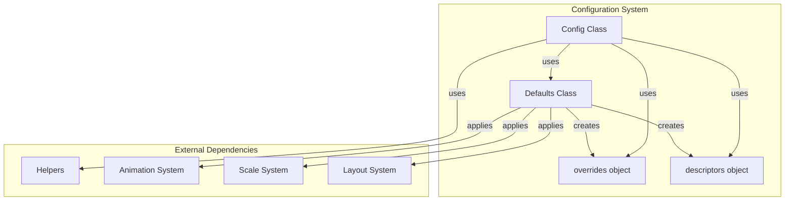
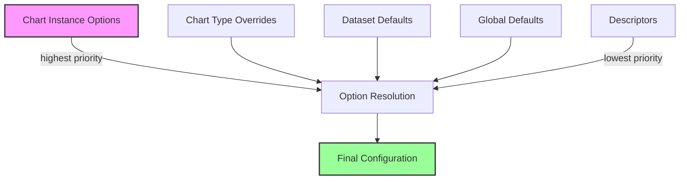
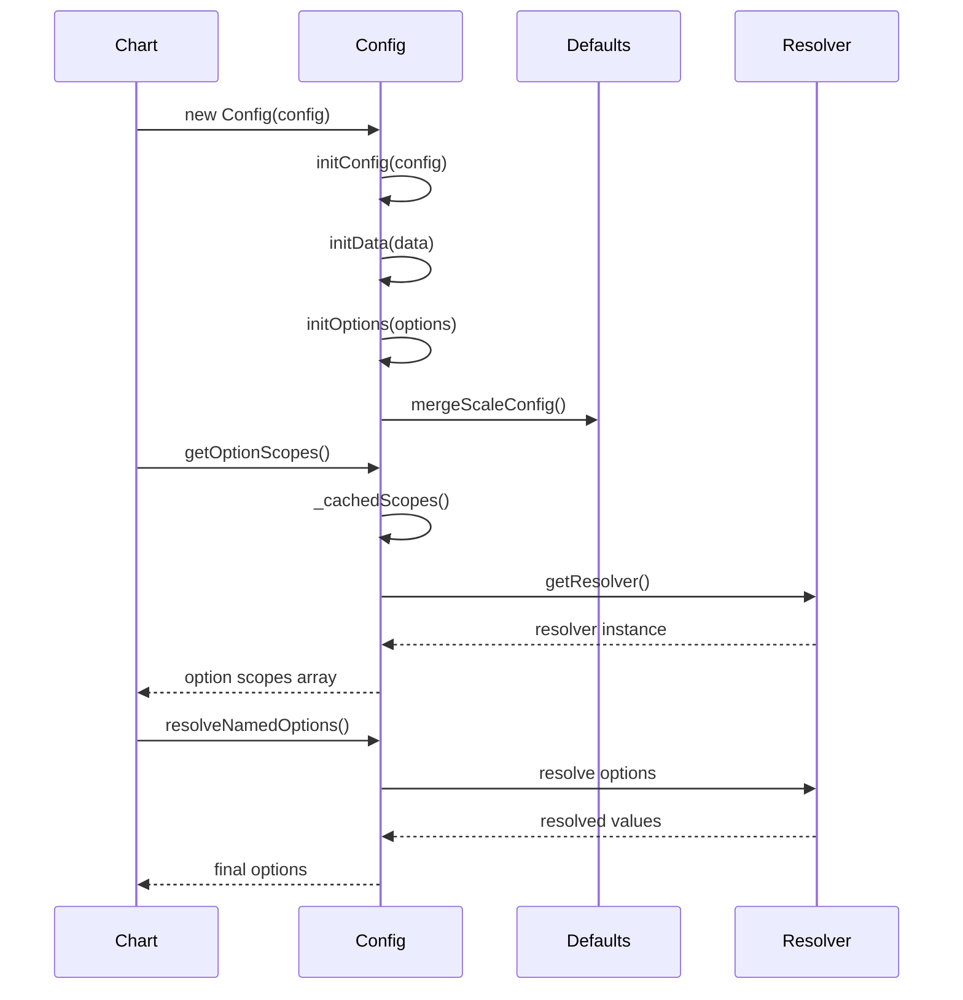
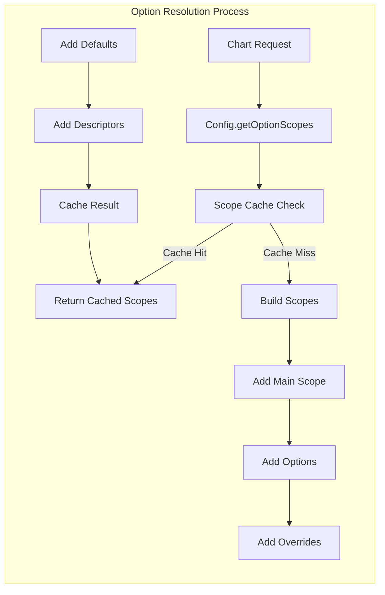
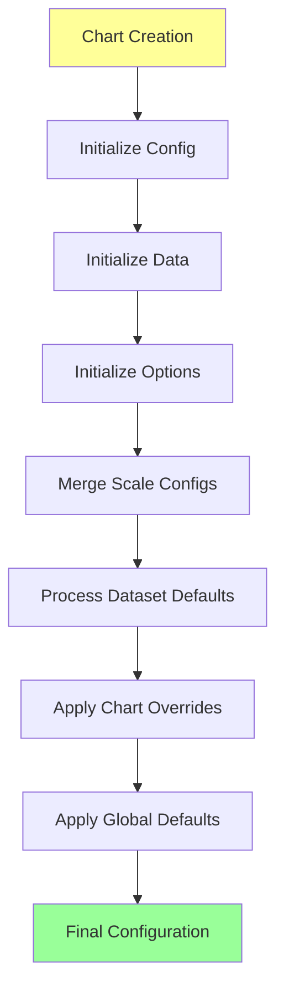

# Configuration System Module

## Introduction

The configuration system module is the central configuration management system for Chart.js. It provides a hierarchical configuration structure that handles chart defaults, overrides, and dynamic option resolution. This module ensures consistent behavior across all chart types while allowing flexible customization at multiple levels.

## Core Components

### Config Class (`src.core.core.config.Config`)
The main configuration manager that handles chart configuration initialization, option resolution, and caching mechanisms.

### Defaults Class (`src.core.core.defaults.Defaults`)
The global defaults manager that provides default values for all chart properties and manages the defaults hierarchy.

## Architecture



## Configuration Hierarchy



## Data Flow



## Component Interactions



## Key Features

### 1. Hierarchical Configuration
The system supports multiple levels of configuration with clear precedence:
- Chart instance options (highest priority)
- Chart type-specific overrides
- Dataset-level defaults
- Global defaults
- Descriptor defaults (lowest priority)

### 2. Dynamic Option Resolution
Options are resolved dynamically using a sophisticated caching mechanism that considers:
- Scriptable options (functions that receive context)
- Indexable options (arrays that map to data indices)
- Nested option structures

### 3. Scale Configuration Management
Specialized handling for scale configurations including:
- Automatic axis detection from position and ID
- Dataset-specific scale overrides
- Default scale option merging
- Index axis determination

### 4. Caching System
Multiple levels of caching for performance:
- Scope cache for option resolution contexts
- Resolver cache for option resolvers
- Key cache for scope key generation

## Configuration Process Flow



## Integration with Other Systems

### Animation System
The configuration system provides animation defaults and handles animation-specific option resolution. See [animation-system.md](animation-system.md) for details.

### Scale System
Manages scale configurations and provides scale-specific defaults. Scale options are merged from multiple sources including dataset defaults and chart type overrides.

### Plugin System
Handles plugin option resolution through dedicated scope keys and supports plugin-specific option routing.

## API Reference

### Config Class Methods

#### `getOptionScopes(mainScope, keyLists, resetCache)`
Returns an array of option scopes for resolution based on the provided key lists.

#### `resolveNamedOptions(scopes, names, context, prefixes)`
Resolves named options from the provided scopes, handling scriptable and indexable options.

#### `createResolver(scopes, context, prefixes, descriptorDefaults)`
Creates a resolver for the given scopes and context.

#### `datasetScopeKeys(datasetType)`
Returns scope keys for resolving dataset options.

#### `datasetAnimationScopeKeys(datasetType, transition)`
Returns scope keys for resolving dataset animation options.

### Defaults Class Methods

#### `set(scope, values)`
Sets default values for the specified scope.

#### `get(scope)`
Gets default values for the specified scope.

#### `describe(scope, values)`
Sets descriptor defaults for the specified scope.

#### `override(scope, values)`
Sets override values for the specified scope.

#### `route(scope, name, targetScope, targetName)`
Routes a property to fallback to another scope when not defined locally.

## Usage Examples

### Basic Configuration
```javascript
const config = new Config({
  type: 'line',
  data: {
    datasets: [{
      data: [1, 2, 3]
    }]
  },
  options: {
    responsive: true
  }
});
```

### Option Resolution
```javascript
const scopes = config.getOptionScopes(dataset, [
  ['datasets.line', ''],
  ['elements.point', '']
]);
const options = config.resolveNamedOptions(scopes, ['backgroundColor', 'borderColor'], context);
```

### Default Configuration
```javascript
defaults.set('scales.linear', {
  ticks: {
    maxTicksLimit: 11
  }
});
```

## Performance Considerations

1. **Caching Strategy**: The system uses aggressive caching to avoid repeated option resolution
2. **Lazy Resolution**: Options are resolved only when needed
3. **Scope Optimization**: Scope keys are cached to minimize lookup overhead
4. **Memory Management**: Cache clearing mechanisms prevent memory leaks

## Error Handling

The configuration system includes several validation mechanisms:
- Invalid scale configurations are logged as errors
- Proxy warnings prevent resolver conflicts
- Axis determination throws descriptive errors for invalid configurations

## Extension Points

The system is designed for extensibility through:
- Custom option scopes
- Plugin-specific configuration
- Dynamic defaults application
- Custom descriptor definitions