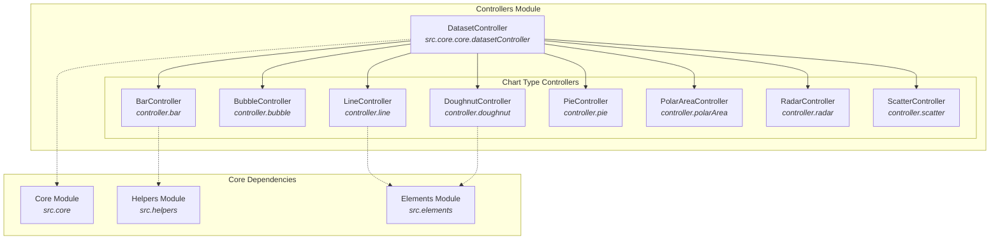
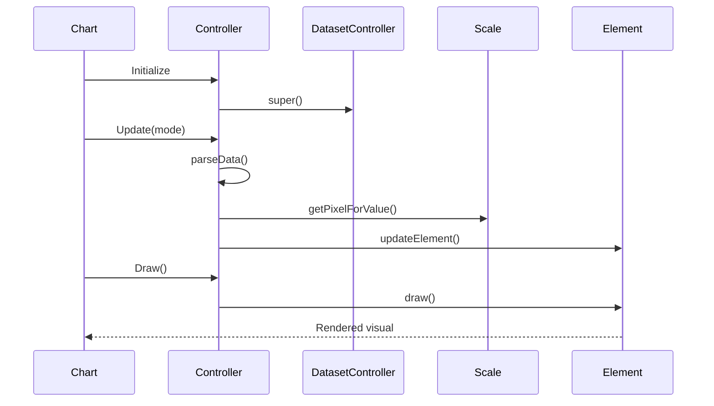

# Controllers Module Documentation

## Overview

The Controllers module is a core component of Chart.js that manages the rendering and behavior of different chart types. Each controller is responsible for handling specific chart types (bar, line, pie, etc.) and defines how data should be parsed, processed, and rendered as visual elements.

## Architecture



## Core Functionality

### Base Architecture

All controllers extend from `DatasetController` ([dataset-controller.md](dataset-controller.md)), which provides the foundational functionality for:
- Data parsing and processing
- Element lifecycle management
- Scale integration
- Animation support
- Event handling

### Controller Types

The module implements eight distinct chart controllers, each specialized for different data visualization needs:

#### 1. Bar Controller
- **Purpose**: Renders vertical and horizontal bar charts
- **Key Features**: 
  - Support for grouped and stacked bars
  - Float bar support (bars with custom start/end values)
  - Flexible bar thickness and spacing options
  - Category-based axis handling
- **Detailed Documentation**: [bar-controller.md](bar-controller.md)

#### 2. Bubble Controller
- **Purpose**: Creates bubble charts with variable point sizes
- **Key Features**:
  - Three-dimensional data representation (x, y, radius)
  - Custom radius calculation from data
  - Linear scale integration
- **Detailed Documentation**: [bubble-controller.md](bubble-controller.md)

#### 3. Doughnut Controller
- **Purpose**: Renders doughnut and pie charts
- **Key Features**:
  - Circular data representation
  - Configurable cutout percentage
  - Arc-based rendering
  - Legend integration for data toggling
- **Detailed Documentation**: [doughnut-controller.md](doughnut-controller.md)

#### 4. Line Controller
- **Purpose**: Creates line and area charts
- **Key Features**:
  - Continuous data visualization
  - Support for gaps and spans
  - Point and line element combination
  - Decimation support for large datasets
- **Detailed Documentation**: [line-controller.md](line-controller.md)

#### 5. Pie Controller
- **Purpose**: Specialized doughnut chart with no cutout
- **Key Features**:
  - Extends DoughnutController
  - Zero cutout default configuration
  - Full circular data representation
- **Detailed Documentation**: [doughnut-controller.md](doughnut-controller.md) (extends DoughnutController)

#### 6. Polar Area Controller
- **Purpose**: Renders polar area charts
- **Key Features**:
  - Radial data representation
  - Angle-based data distribution
  - Radial linear scale integration
  - Variable arc angles
- **Detailed Documentation**: [polar-area-controller.md](polar-area-controller.md)

#### 7. Radar Controller
- **Purpose**: Creates radar/spider charts
- **Key Features**:
  - Multi-dimensional data comparison
  - Radial scale integration
  - Line and point combination
  - Closed loop visualization
- **Detailed Documentation**: [radar-controller.md](radar-controller.md)

#### 8. Scatter Controller
- **Purpose**: Renders scatter plots
- **Key Features**:
  - X-Y coordinate data representation
  - Optional line connection
  - Linear scale integration
  - Point-based visualization
- **Detailed Documentation**: [scatter-controller.md](scatter-controller.md)

## Data Flow Architecture



## Key Design Patterns

### 1. Template Method Pattern
All controllers follow a consistent lifecycle pattern inherited from DatasetController:
- `initialize()`: Setup and configuration
- `parseData()`: Data processing and validation
- `updateElements()`: Element property calculation
- `draw()`: Rendering execution

### 2. Strategy Pattern
Each controller implements chart-specific algorithms for:
- Data parsing strategies
- Element positioning calculations
- Scale integration methods
- Animation properties

### 3. Factory Pattern
Controllers act as factories for creating and managing:
- Data elements (points, bars, arcs)
- Dataset elements (lines, areas)
- Chart-specific configurations

## Integration Points

### Scale Integration
Controllers work closely with the [scale-system.md](scale-system.md) module to:
- Convert data values to pixel coordinates
- Handle axis configuration
- Manage scale ranges and ticks

### Element Integration
Controllers create and manage elements from the [elements.md](elements.md) module:
- Point elements for scatter/bubble charts
- Arc elements for doughnut/pie charts
- Line elements for line/radar charts
- Bar elements for bar charts

### Animation Integration
Controllers define animation properties that integrate with the [animation-system.md](animation-system.md):
- Element-specific animation configurations
- Property transition definitions
- Animation timing and easing

## Configuration System

Each controller provides default configurations that can be overridden:

```javascript
// Example: BarController defaults
{
  datasetElementType: false,
  dataElementType: 'bar',
  categoryPercentage: 0.8,
  barPercentage: 0.9,
  grouped: true,
  animations: {
    numbers: {
      type: 'number',
      properties: ['x', 'y', 'base', 'width', 'height']
    }
  }
}
```

## Performance Considerations

### Data Processing Optimization
- Controllers implement efficient data parsing algorithms
- Caching mechanisms for repeated calculations
- Selective updates based on change detection

### Rendering Performance
- Element reuse and recycling
- Visible element optimization
- Animation frame management

### Memory Management
- Proper cleanup of cached data
- Element lifecycle management
- Event listener cleanup

## Error Handling

Controllers implement robust error handling for:
- Invalid data formats
- Missing scale configurations
- Rendering edge cases
- Animation failures

## Extension Points

The controller architecture supports extension through:
- Custom controller creation
- Method overriding
- Configuration extension
- Plugin integration

## Testing Strategy

Controllers are tested for:
- Data parsing accuracy
- Element positioning correctness
- Scale integration functionality
- Animation behavior
- Edge case handling

## Future Considerations

The controller system is designed to accommodate:
- New chart types
- Enhanced animation capabilities
- Performance optimizations
- Accessibility improvements
- Mobile-specific adaptations