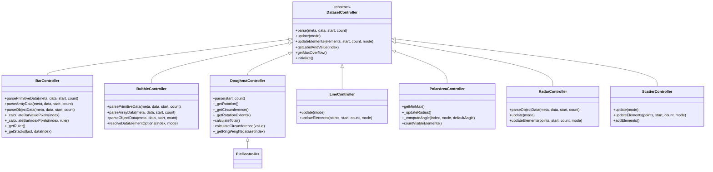
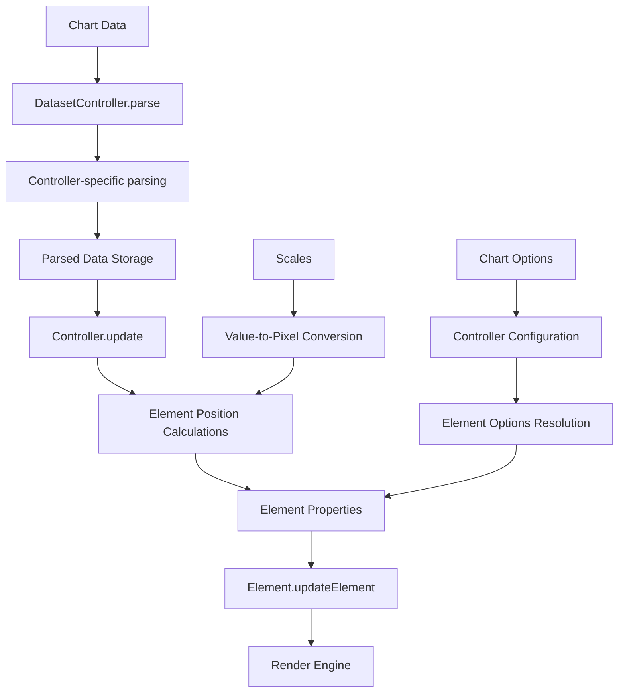
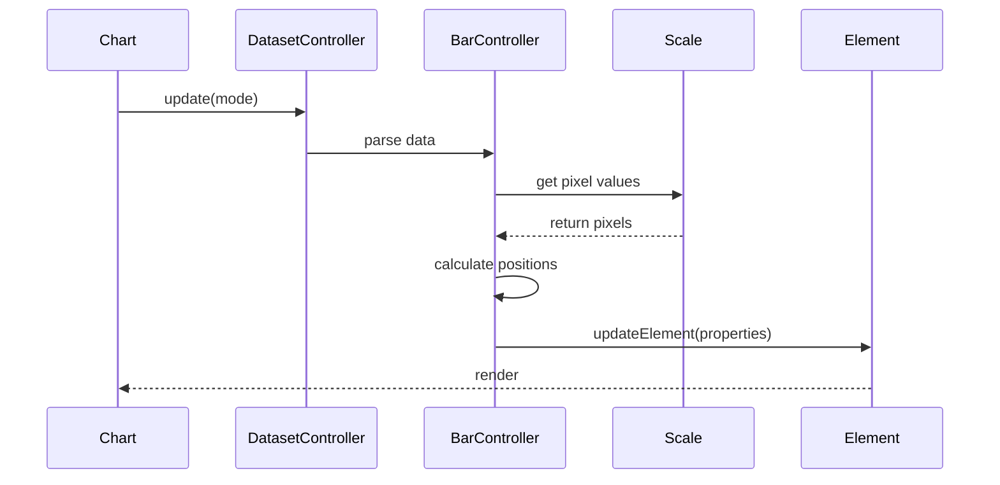

# Controllers Module Documentation

## Introduction

The Controllers module is a fundamental component of Chart.js that provides specialized dataset controllers for different chart types. Each controller is responsible for managing the data parsing, element creation, positioning, and rendering logic specific to its chart type. The module implements a consistent interface through inheritance from the base `DatasetController` class while allowing each chart type to override behaviors as needed.

## Architecture Overview

The Controllers module follows an object-oriented design pattern where each chart type has its own controller class that extends the base `DatasetController`. This architecture provides a clean separation of concerns while maintaining consistency across different chart types.

```mermaid
classDiagram
    class DatasetController {
        <<abstract>>
        +parse(meta, data, start, count)
        +update(mode)
        +updateElements(elements, start, count, mode)
        +getLabelAndValue(index)
        +getMaxOverflow()
        +initialize()
    }
    
    class BarController {
        +parsePrimitiveData(meta, data, start, count)
        +parseArrayData(meta, data, start, count)
        +parseObjectData(meta, data, start, count)
        +_calculateBarValuePixels(index)
        +_calculateBarIndexPixels(index, ruler)
        +_getRuler()
        +_getStacks(last, dataIndex)
    }
    
    class BubbleController {
        +parsePrimitiveData(meta, data, start, count)
        +parseArrayData(meta, data, start, count)
        +parseObjectData(meta, data, start, count)
        +resolveDataElementOptions(index, mode)
    }
    
    class DoughnutController {
        +parse(start, count)
        +_getRotation()
        +_getCircumference()
        +_getRotationExtents()
        +calculateTotal()
        +calculateCircumference(value)
        +_getRingWeight(datasetIndex)
    }
    
    class LineController {
        +update(mode)
        +updateElements(points, start, count, mode)
    }
    
    class PieController {
        
    }
    
    class PolarAreaController {
        +getMinMax()
        +_updateRadius()
        +_computeAngle(index, mode, defaultAngle)
        +countVisibleElements()
    }
    
    class RadarController {
        +parseObjectData(meta, data, start, count)
        +update(mode)
        +updateElements(points, start, count, mode)
    }
    
    class ScatterController {
        +update(mode)
        +updateElements(points, start, count, mode)
        +addElements()
    }
    
    DatasetController <|-- BarController
    DatasetController <|-- BubbleController
    DatasetController <|-- DoughnutController
    DatasetController <|-- LineController
    DoughnutController <|-- PieController
    DatasetController <|-- PolarAreaController
    DatasetController <|-- RadarController
    DatasetController <|-- ScatterController
```

## Core Components

### BarController

The `BarController` manages bar chart datasets and handles the complex positioning calculations required for bar charts, including stacked bars, grouped bars, and floating bars.

**Key Features:**
- Supports horizontal and vertical bar orientations
- Handles grouped and stacked bar configurations
- Manages floating bars (bars with custom start/end values)
- Calculates optimal bar thickness and spacing
- Supports multiple axes

**Key Methods:**
- `parseArrayOrPrimitive()`: Handles mixed data formats for floating bars
- `_calculateBarValuePixels()`: Calculates bar height/width and base position
- `_calculateBarIndexPixels()`: Calculates bar horizontal/vertical position
- `_getRuler()`: Computes bar layout metrics including thickness and spacing

### BubbleController

The `BubbleController` manages bubble chart datasets where each data point has x, y coordinates and a radius value.

**Key Features:**
- Supports three-dimensional data (x, y, radius)
- Handles different data formats: primitives, arrays, and objects
- Manages bubble radius scaling
- Provides overflow calculations for proper chart sizing

**Key Methods:**
- `parsePrimitiveData()`: Handles simple numeric data
- `parseArrayData()`: Handles array-based data with radius as third element
- `parseObjectData()`: Handles object-based data with explicit radius property
- `resolveDataElementOptions()`: Resolves radius values with fallback logic

### DoughnutController

The `DoughnutController` manages doughnut and pie chart datasets, handling circular layout calculations and arc positioning.

**Key Features:**
- Supports configurable cutout percentage for doughnut charts
- Manages rotation and circumference settings
- Handles arc spacing and border calculations
- Supports weighted datasets
- Calculates optimal radius based on chart area

**Key Methods:**
- `_getRotationExtents()`: Calculates rotation range across all datasets
- `calculateTotal()`: Computes the sum of all visible data values
- `calculateCircumference()`: Converts data values to angle measurements
- `_getRingWeightOffset()`: Calculates radius offset for multi-dataset charts

### LineController

The `LineController` manages line chart datasets and handles the creation and updating of line elements and data points.

**Key Features:**
- Supports line and point elements
- Handles gap spanning configurations
- Manages decimation for large datasets
- Supports stacked line charts
- Handles segment-based styling

**Key Methods:**
- `update()`: Coordinates line and point updates
- `updateElements()`: Updates individual point positions and properties
- `getMaxOverflow()`: Calculates overflow for proper chart padding

### PieController

The `PieController` extends `DoughnutController` with pie-specific defaults (zero cutout).

### PolarAreaController

The `PolarAreaController` manages polar area chart datasets where data is represented as sectors of a circle.

**Key Features:**
- Radial layout with angle-based positioning
- Supports configurable start angles
- Handles sector-based data representation
- Manages radius calculations based on data values

**Key Methods:**
- `getMinMax()`: Calculates data range for proper scaling
- `_updateRadius()`: Computes inner and outer radius values
- `_computeAngle()`: Calculates sector angles for each data point
- `countVisibleElements()`: Counts visible data elements

### RadarController

The `RadarController` manages radar chart datasets with data points positioned along radial axes.

**Key Features:**
- Radial point positioning
- Supports line and point elements
- Handles circular data layout
- Manages angle-based positioning

**Key Methods:**
- `parseObjectData()`: Handles radial scale data parsing
- `update()`: Coordinates line and point updates
- `updateElements()`: Updates point positions along radial axes

### ScatterController

The `ScatterController` manages scatter chart datasets with x-y coordinate data points.

**Key Features:**
- Linear scale support for both axes
- Optional line connection between points
- Handles large datasets with decimation
- Supports gap spanning configurations

**Key Methods:**
- `update()`: Manages point and optional line updates
- `updateElements()`: Updates scatter point positions
- `addElements()`: Conditionally adds line elements

## Data Flow Architecture

```mermaid
flowchart TD
    A[Chart Data] --> B[DatasetController.parse]
    B --> C[Controller-specific parsing]
    C --> D[Parsed Data Storage]
    D --> E[Controller.update]
    E --> F[Element Position Calculations]
    F --> G[Element Properties]
    G --> H[Element.updateElement]
    H --> I[Render Engine]
    
    J[Chart Options] --> K[Controller Configuration]
    K --> L[Element Options Resolution]
    L --> G
    
    M[Scales] --> N[Value-to-Pixel Conversion]
    N --> F
```

## Component Interactions

```mermaid
sequenceDiagram
    participant Chart
    participant DatasetController
    participant BarController
    participant Scale
    participant Element
    
    Chart->>DatasetController: update(mode)
    DatasetController->>BarController: parse data
    BarController->>Scale: get pixel values
    Scale-->>BarController: return pixels
    BarController->>BarController: calculate positions
    BarController->>Element: updateElement(properties)
    Element-->>Chart: render
```

## Configuration and Defaults

Each controller provides specific defaults and overrides that define the behavior and appearance of their respective chart types:

### BarController Defaults
- `categoryPercentage`: 0.8 - Percentage of category width for bar groups
- `barPercentage`: 0.9 - Percentage of available width for individual bars
- `grouped`: true - Enable bar grouping
- Default scales: category for x-axis, linear for y-axis

### BubbleController Defaults
- Default scales: linear for both x and y axes
- Animation properties include radius, borderWidth

### DoughnutController Defaults
- `cutout`: '50%' - Percentage of radius for inner cutout
- `rotation`: 0 - Starting angle for first segment
- `circumference`: 360 - Total angle span
- `radius`: '100%' - Outer radius percentage

### LineController Defaults
- `showLine`: true - Display connecting lines
- `spanGaps`: false - Handle null data points
- Default scales: category for x-axis, linear for y-axis

## Integration with Core Components

The Controllers module integrates with several core Chart.js components:

- **[DatasetController](core.md#datasetcontroller)**: Base class providing common functionality
- **[Scales](scales.md)**: Coordinate system and value-to-pixel conversion
- **[Elements](elements.md)**: Visual representation of data points
- **[Animation](animation.md)**: Smooth transitions and updates

## Error Handling and Edge Cases

The controllers implement robust error handling for various edge cases:

- **Null/Undefined Data**: Graceful handling of missing data points
- **Mixed Data Types**: Support for different data formats within the same dataset
- **Invalid Scale Values**: Protection against NaN and infinite values
- **Empty Datasets**: Proper initialization with no data
- **Hidden Elements**: Management of data visibility states

## Performance Considerations

The controllers implement several performance optimizations:

- **Caching**: Scale values and layout calculations are cached when possible
- **Lazy Evaluation**: Complex calculations are performed only when necessary
- **Batch Updates**: Multiple element updates are batched together
- **Decimation**: Support for data decimation in line and scatter charts
- **Visible Range Optimization**: Only visible elements are updated

## Extension Points

The controller architecture provides several extension points for customization:

- **Custom Parsing**: Override parsing methods for specialized data formats
- **Element Options**: Customize visual properties through option resolution
- **Layout Calculations**: Override positioning logic for custom layouts
- **Animation Behavior**: Customize transition behaviors
- **Data Validation**: Add custom validation logic in parsing methods

This modular design allows developers to create custom chart types by extending existing controllers or implementing new ones while maintaining compatibility with the broader Chart.js ecosystem.