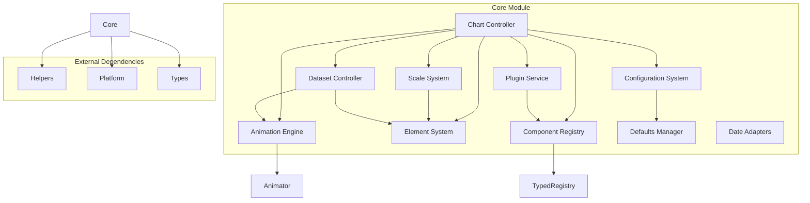
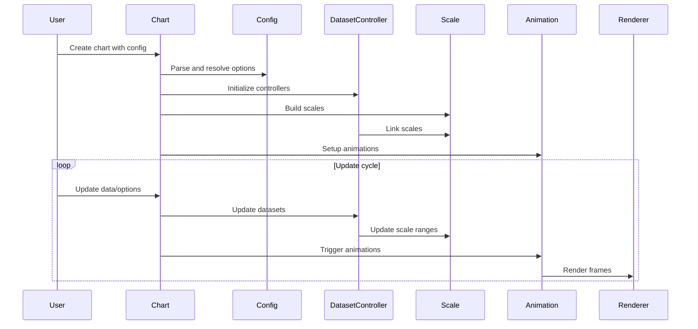

# Core Module Documentation

## Overview

The Core module is the foundational layer of Chart.js, providing essential infrastructure and base functionality for chart creation, configuration, animation, and data management. It serves as the central orchestrator that coordinates between various subsystems including rendering, animation, scaling, and plugin management.

## Architecture

## Core Components

### 1. Chart Controller (`core.controller.js`)
The central orchestrator that manages the entire chart lifecycle, from initialization to destruction. It coordinates all other core components and handles the main rendering loop.

**Key Responsibilities:**
- Chart initialization and configuration
- Event handling and user interaction
- Rendering coordination
- Scale and dataset management
- Plugin lifecycle management

### 2. Configuration System ([`configuration-system.md`](configuration-system.md))
Manages chart configuration, options resolution, and default value handling. Provides a sophisticated scoping system for option inheritance.

**Key Features:**
- Hierarchical option resolution
- Scale configuration management
- Dataset-specific options
- Plugin configuration

### 3. Animation Engine ([`animation-system.md`](animation-system.md))
Comprises three main components that work together to provide smooth animations:

#### Animation (`core.animation.js`)
Individual animation instances that handle property interpolation over time.

#### Animations (`core.animations.js`)
Collection manager that coordinates multiple animations and handles shared options.

#### Animator (`core.animator.js`)
Global animation scheduler that manages the animation loop across all charts.

### 4. Scale System ([`scale-system.md`](scale-system.md))
Provides the foundation for all chart axes, handling tick generation, label positioning, and value-to-pixel conversion.

**Core Functionality:**
- Tick generation and formatting
- Label rotation and positioning
- Grid line rendering
- Value-to-pixel mapping

### 5. Element System (`core.element.ts`)
Base class for all visual elements in charts, providing common functionality for positioning, styling, and animation.

### 6. Component Registry ([`registry-system.md`](registry-system.md))
Central registration system for all Chart.js components including controllers, elements, scales, and plugins.

### 7. Dataset Controller ([`dataset-controller.md`](dataset-controller.md))
Base class for dataset-specific controllers that manage data parsing, element creation, and rendering for different chart types.

### 8. Plugin Service (`core.plugins.js`)
Manages the plugin lifecycle and provides hooks for extending chart functionality.

### 9. Defaults System ([`configuration-system.md`](configuration-system.md))
Manages default configurations and provides mechanisms for overriding and extending default values.

### 10. Date Adapters (`core.adapters.ts`)
Provides a pluggable system for date/time handling, allowing integration with different date libraries.

## Data Flow

## Integration with Other Modules

The Core module serves as the foundation for all other Chart.js modules:

- **[Controllers](../controllers.md)**: Extend DatasetController for specific chart types
- **[Elements](../elements.md)**: Extend Element base class for visual components
- **[Scales](../scales.md)**: Extend Scale base class for different axis types
- **[Plugins](../plugins.md)**: Integrate with PluginService for extended functionality
- **[Platform](../platform.md)**: Use platform-specific rendering capabilities
- **[Helpers](../helpers.md)**: Utilize utility functions throughout
- **[Types](../types.md)**: Define TypeScript interfaces and types

## Key Design Patterns

### 1. Registry Pattern
The Registry class provides a centralized system for component registration and discovery, enabling extensibility and modularity.

### 2. Observer Pattern
The plugin system uses an observer pattern to allow external code to hook into chart lifecycle events.

### 3. Strategy Pattern
Different scale types, element types, and controllers implement common interfaces while providing specialized behavior.

### 4. Factory Pattern
The registry acts as a factory for creating appropriate component instances based on configuration.

### 5. Template Method Pattern
Base classes like DatasetController and Scale define the overall algorithm while allowing subclasses to override specific steps.

## Performance Considerations

- **Animation Optimization**: The animation system uses requestAnimationFrame for smooth 60fps animations
- **Caching**: Extensive caching of computed values like label sizes and tick positions
- **Lazy Evaluation**: Components are initialized and updated only when necessary
- **Memory Management**: Proper cleanup of event listeners and references to prevent memory leaks

## Extension Points

The Core module provides several ways to extend functionality:

1. **Custom Controllers**: Extend DatasetController for new chart types
2. **Custom Scales**: Extend Scale for specialized axis behavior
3. **Custom Elements**: Extend Element for new visual components
4. **Plugins**: Use the plugin system for cross-cutting concerns
5. **Date Adapters**: Implement custom date handling logic
6. **Platform**: Override platform-specific behavior

## Error Handling

The Core module implements robust error handling:
- Validation of configuration options
- Graceful degradation when components are missing
- Clear error messages for common misconfigurations
- Fallback behaviors for unsupported features

## Best Practices

1. **Configuration**: Always provide explicit configuration rather than relying on defaults
2. **Performance**: Use appropriate animation settings for your use case
3. **Memory**: Properly destroy charts when no longer needed
4. **Extensions**: Follow established patterns when creating custom components
5. **Updates**: Batch multiple updates when possible to avoid unnecessary re-renders