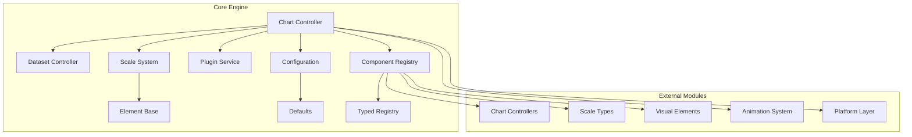
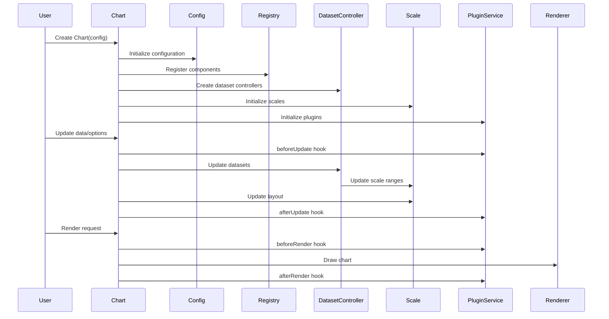

# Core Engine Module Documentation

## Overview

The `core_engine` module is the central orchestration system of Chart.js, responsible for managing chart lifecycle, data processing, rendering, and interactivity. It provides the foundational architecture that coordinates all other modules including controllers, scales, elements, plugins, and animations.

## Architecture

## Core Components

### 1. Chart Controller (`src.core.core.controller.Chart`)
The main chart orchestrator that manages the entire chart lifecycle including initialization, updates, rendering, and destruction. It coordinates between datasets, scales, plugins, and the rendering system.

**Key Responsibilities:**
- Chart initialization and configuration
- Data management and updates
- Scale coordination and layout
- Plugin lifecycle management
- Event handling and user interaction
- Rendering pipeline orchestration
- Animation management

### 2. Dataset Controller (`src.core.core.datasetController.DatasetController`)
Abstract base class for dataset-specific controllers that manage data parsing, element creation, and visualization logic for different chart types.

**Key Responsibilities:**
- Data parsing and validation
- Element lifecycle management
- Scale integration and data mapping
- Stacking calculations
- Style and option resolution
- Animation support

### 3. Registry (`src.core.core.registry.Registry`)
Central component registry that manages registration and retrieval of chart components including controllers, elements, scales, and plugins.

**Key Responsibilities:**
- Component registration and discovery
- Type-safe component management
- Plugin system coordination
- Component lifecycle management

### 4. Plugin Service (`src.core.core.plugins.PluginService`)
Manages the plugin ecosystem, handling plugin registration, lifecycle hooks, and event notification system.

**Key Responsibilities:**
- Plugin lifecycle management
- Hook execution and coordination
- Plugin option resolution
- Event notification system

### 5. Scale System (`src.core.core.scale.Scale`)
Base class for all scale types, providing axis management, tick generation, label rendering, and data mapping functionality.

**Key Responsibilities:**
- Axis configuration and layout
- Tick generation and positioning
- Label rendering and formatting
- Data value to pixel mapping
- Grid line and border rendering

### 6. Element Base (`src.core.core.element.Element`)
Foundation class for all visual elements, providing common properties and methods for chart elements like points, lines, and bars.

**Key Responsibilities:**
- Element property management
- Animation support
- Tooltip integration
- Value validation

### 7. Configuration System (`src.core.core.config.Config`)
Advanced configuration management system that handles option resolution, scope management, and default value inheritance.

**Key Responsibilities:**
- Configuration validation and merging
- Option scope resolution
- Default value inheritance
- Runtime configuration updates

### 8. Defaults System (`src.core.core.defaults.Defaults`)
Manages default configurations and theme settings, providing a centralized system for chart-wide defaults and overrides.

**Key Responsibilities:**
- Default value management
- Theme and styling defaults
- Configuration routing
- Runtime default updates

### 9. Typed Registry (`src.core.core.typedRegistry.TypedRegistry`)
Type-safe registry system for managing component registration with support for inheritance and default value propagation.

**Key Responsibilities:**
- Type-safe component registration
- Inheritance chain management
- Default value propagation
- Component lifecycle tracking

## Data Flow Architecture

## Integration with Other Modules

### Controllers Module
The core engine coordinates with various chart controllers (Bar, Line, Pie, etc.) through the DatasetController base class. Each controller type extends the base functionality to handle specific visualization requirements.

### Scales Module
Scale integration is managed through the Scale base class, with the core engine coordinating scale updates, layout calculations, and data mapping between different scale types.

### Elements Module
Visual elements (points, lines, bars, arcs) are managed through the Element base class, with the core engine handling element creation, styling, and animation.

### Animation Module
The animation system is integrated at the core level, with the Chart controller managing animation lifecycle and coordinating with individual components for smooth transitions.

### Platform Module
Platform-specific functionality is abstracted through the platform layer, allowing the core engine to work consistently across different environments (DOM, Canvas, etc.).

## Key Features

### 1. Plugin Architecture
Extensible plugin system allowing third-party extensions to hook into chart lifecycle events and modify behavior.

### 2. Responsive Design
Built-in responsive capabilities with automatic resize handling and device pixel ratio management.

### 3. Animation Support
Comprehensive animation system supporting transitions for data updates, element interactions, and configuration changes.

### 4. Type Safety
Strong typing support with TypeScript definitions and runtime type checking for component registration.

### 5. Performance Optimization
Efficient update cycles, caching mechanisms, and selective rendering to maintain performance with large datasets.

## Configuration Management

The core engine implements a sophisticated configuration system that supports:
- Hierarchical option resolution
- Runtime configuration updates
- Default value inheritance
- Plugin-specific configuration
- Chart-type specific overrides

## Error Handling

Comprehensive error handling throughout the core engine includes:
- Configuration validation
- Component registration validation
- Runtime error recovery
- Developer-friendly error messages

## Performance Considerations

The core engine is designed for optimal performance through:
- Selective update cycles
- Efficient caching mechanisms
- Minimal DOM manipulation
- Optimized rendering pipelines
- Memory management for large datasets

## Related Documentation

- [Animation Module](animation.md) - Detailed animation system documentation covering Animation, Animations, and Animator components
- [Controllers Module](controllers.md) - Chart controller implementations for Bar, Bubble, Doughnut, Line, Pie, Polar Area, Radar, and Scatter charts
- [Elements Module](elements.md) - Visual element documentation for Arc, Bar, Line, and Point elements
- [Scales Module](scales.md) - Scale system documentation including Category, Linear, Logarithmic, Radial Linear, Time, and Time Series scales
- [Plugins Module](plugins.md) - Plugin system documentation covering Legend, Title, Tooltip, Filler, and Colors plugins
- [Platform Module](platform.md) - Platform abstraction layer documentation
- [Date Adapters](date_adapters.md) - Date handling and formatting documentation