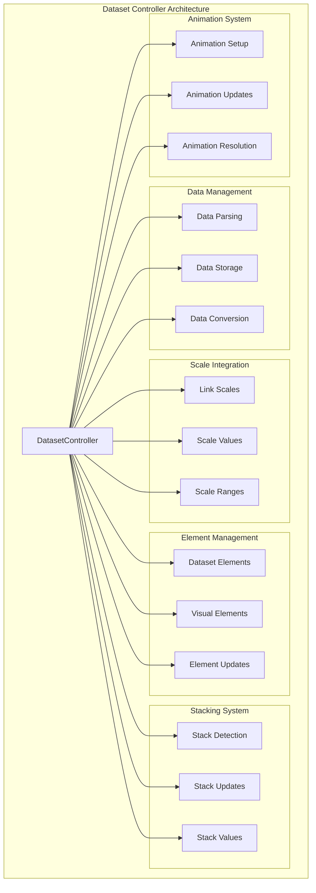
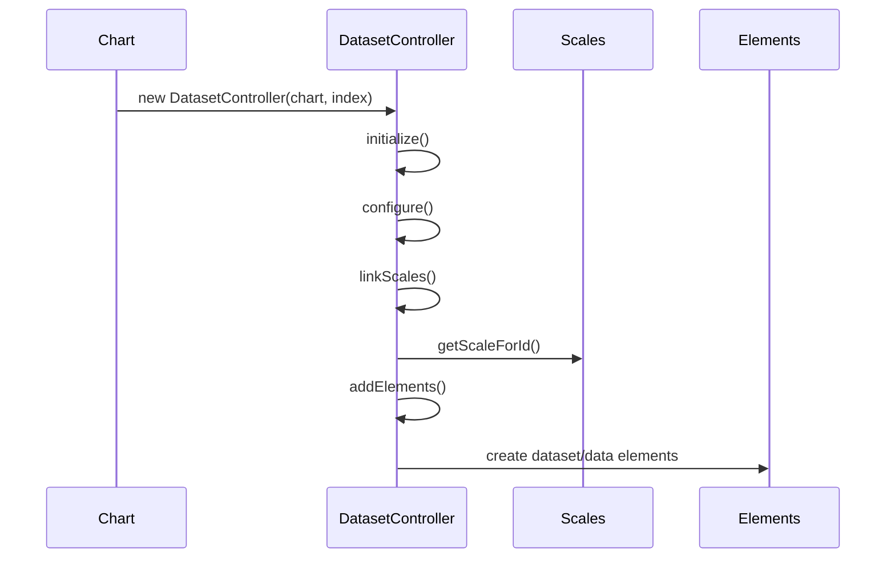
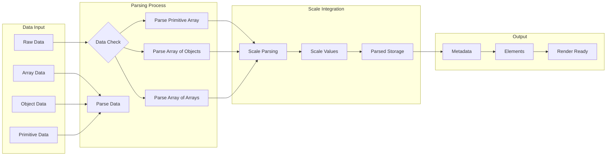
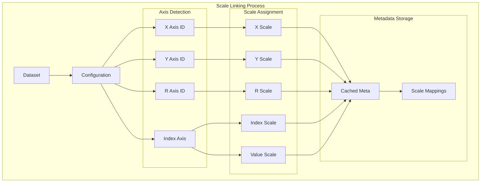
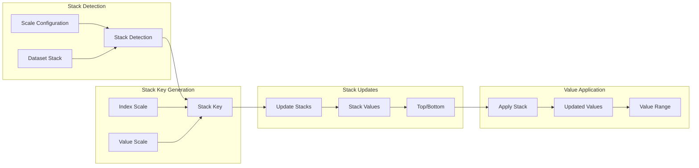
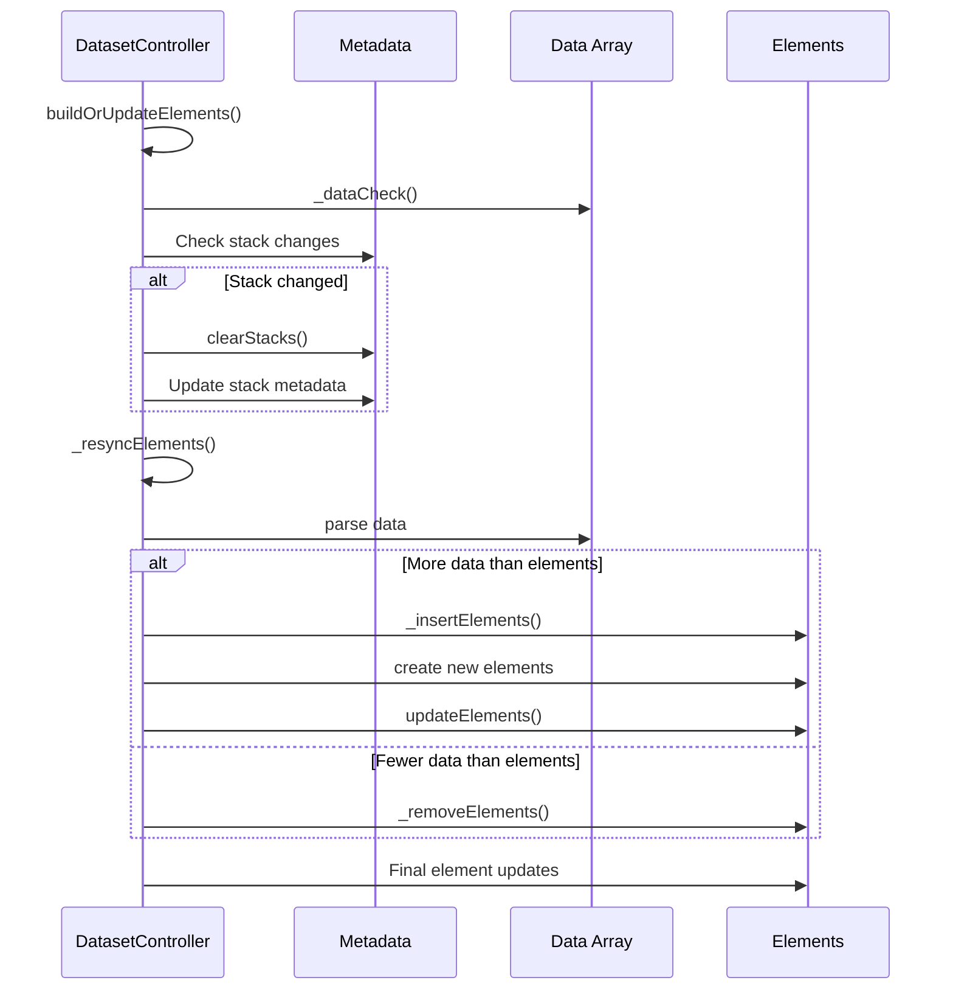
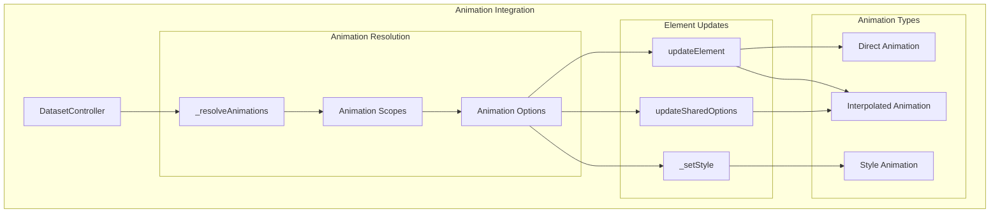
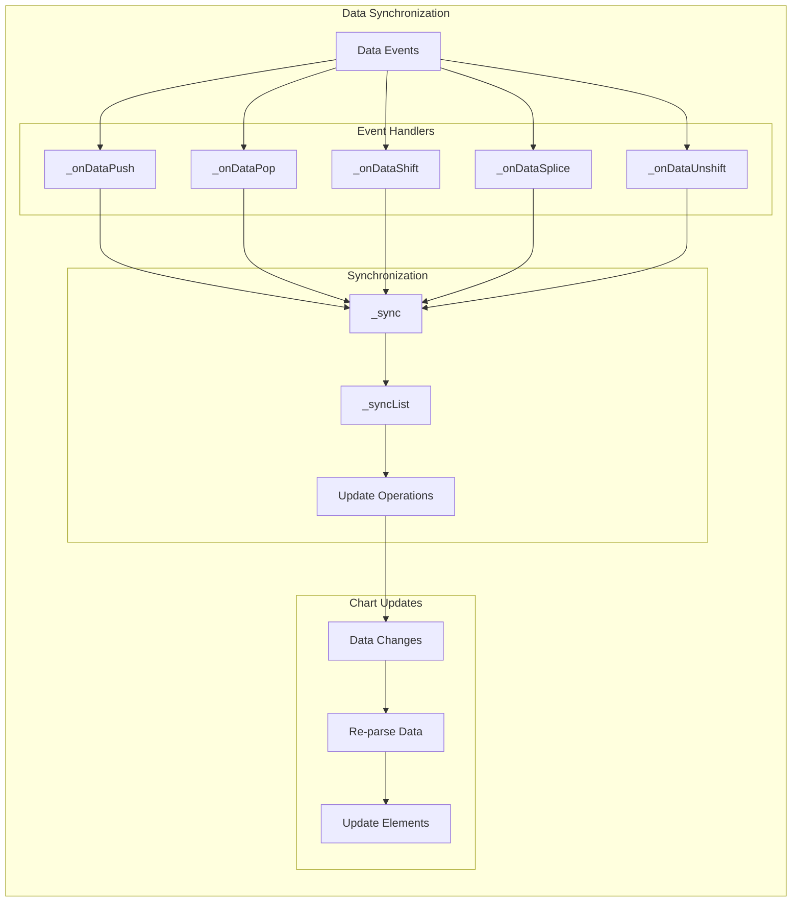
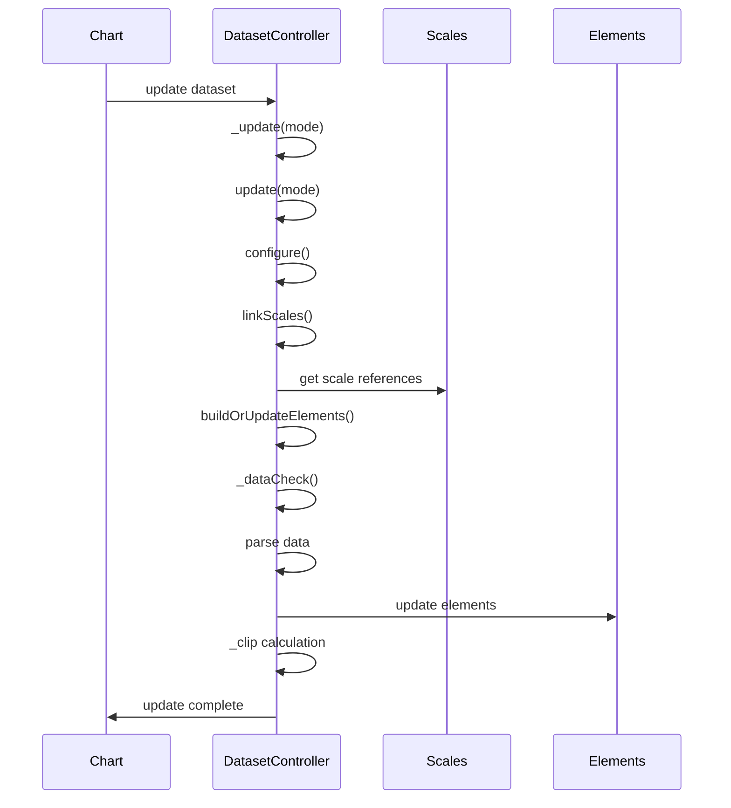
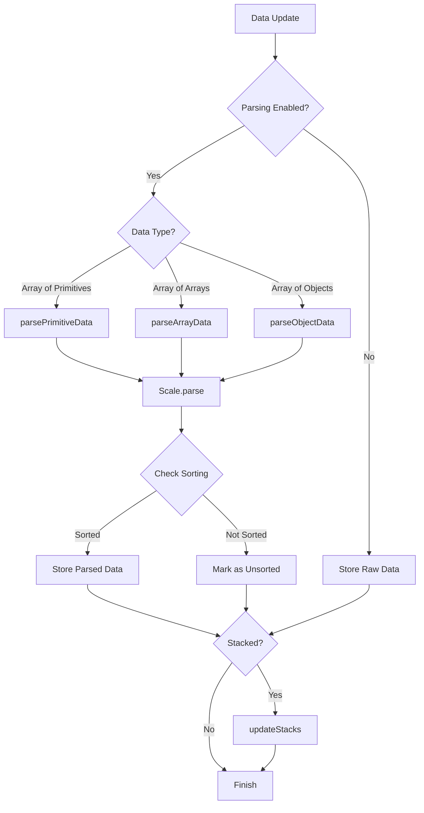

# Dataset Controller Module

## Introduction

The Dataset Controller module is a fundamental component of Chart.js that manages individual datasets within a chart. It serves as the bridge between raw data and visual representation, handling data parsing, scaling, stacking, and element management. This module provides the base class that all specific chart type controllers (line, bar, pie, etc.) extend to implement their unique behaviors.

## Architecture Overview

The DatasetController acts as an abstract base class that orchestrates the relationship between data, scales, and visual elements. It manages the complete lifecycle of dataset rendering, from initial data parsing through final visual representation.



## Core Components

### DatasetController Class

The `DatasetController` class is the central component that manages dataset operations. It provides a comprehensive API for data manipulation, scale integration, and element lifecycle management.

#### Key Properties

- **chart**: Reference to the parent chart instance
- **_cachedMeta**: Cached metadata about the dataset
- **_data**: The actual dataset data
- **options**: Merged dataset configuration options
- **_parsing**: Parsing configuration for data transformation
- **datasetElementType**: Type of element for dataset representation
- **dataElementType**: Type of element for individual data points

#### Constructor and Initialization



## Data Flow Architecture

### Data Processing Pipeline

The dataset controller implements a sophisticated data processing pipeline that handles various data formats and ensures proper integration with scales.



### Data Parsing Methods

The controller supports three primary data parsing strategies:

1. **Primitive Data Parsing**: Handles simple arrays of values
2. **Array Data Parsing**: Processes arrays of coordinate pairs
3. **Object Data Parsing**: Manages complex objects with configurable property keys

## Scale Integration

### Scale Linking System

The dataset controller automatically links datasets to appropriate scales based on axis configuration and chart type.



### Scale Range Calculation

The controller calculates appropriate scale ranges by analyzing parsed data values and applying stacking logic when enabled.

## Stacking System

### Stack Detection and Management

The stacking system automatically detects when datasets should be stacked and manages stack values across multiple datasets.



### Stack Value Calculation

The system supports multiple stacking modes including single-mode stacking and maintains visual stack values for proper rendering.

## Element Lifecycle Management

### Element Creation and Updates

The controller manages the complete lifecycle of visual elements, from creation through updates and removal.



### Element Options Resolution

The controller implements a sophisticated options resolution system that merges dataset-level options with element-specific configurations and applies animations appropriately.

## Animation Integration

### Animation System Integration

The dataset controller integrates with the animation system to provide smooth transitions during data updates and interactions.



## Configuration System Integration

### Options Merging and Resolution

The controller works with the configuration system to merge user-supplied options with defaults and resolve them appropriately for different contexts.

See [configuration-system.md](configuration-system.md) for detailed information about the configuration system.

## Registry System Integration

### Controller Registration

Dataset controllers are managed through the registry system, allowing for dynamic registration and retrieval of controller types.

See [registry-system.md](registry-system.md) for detailed information about the registry system.

## Data Synchronization

### Array Event Handling

The controller implements sophisticated array event handling to detect data changes and synchronize the internal state accordingly.



## Interaction with Other Modules

### Scale System Integration

The dataset controller works closely with the scale system to ensure proper data mapping and range calculation.

See [scale-system.md](scale-system.md) for detailed information about scales.

### Animation System Integration

The controller leverages the animation system for smooth transitions during data updates and state changes.

See [animation-system.md](animation-system.md) for detailed information about animations.

### Element System Integration

The controller manages element creation and updates, working with the element system to provide visual representations.

See [elements.md](elements.md) for detailed information about elements.

## Process Flows

### Dataset Update Process



### Data Parsing Process



## Key Features

### Automatic Scale Detection

The controller automatically detects and links to appropriate scales based on dataset configuration and chart type.

### Flexible Data Parsing

Supports multiple data formats including primitive arrays, coordinate arrays, and complex objects with configurable property mapping.

### Intelligent Stacking

Automatically detects stacking requirements and manages stack values across multiple datasets with support for different stacking modes.

### Real-time Data Updates

Provides comprehensive array event handling for real-time data updates with proper synchronization and animation support.

### Context-Aware Options

Implements sophisticated options resolution that considers dataset context, element state, and animation requirements.

### Performance Optimization

Includes multiple optimization strategies such as option sharing, caching mechanisms, and efficient update algorithms.

## Usage Patterns

### Extending DatasetController

Specific chart types extend the base DatasetController to implement their unique behaviors:

```javascript
export default class CustomController extends DatasetController {
  static defaults = {
    // Custom defaults
  };
  
  static datasetElementType = CustomDatasetElement;
  static dataElementType = CustomDataElement;
  
  update(mode) {
    // Custom update logic
  }
  
  updateElements(elements, start, count, mode) {
    // Custom element updates
  }
}
```

### Data Format Support

The controller supports various data formats through its parsing system:

- **Primitive arrays**: `[1, 2, 3, 4]`
- **Coordinate arrays**: `[[1, 2], [3, 4]]`
- **Object arrays**: `[{x: 1, y: 2}, {x: 3, y: 4}]`
- **Object mapping**: `{"label1": 10, "label2": 20}`

This comprehensive data handling makes the DatasetController a versatile foundation for all chart types in the Chart.js ecosystem.