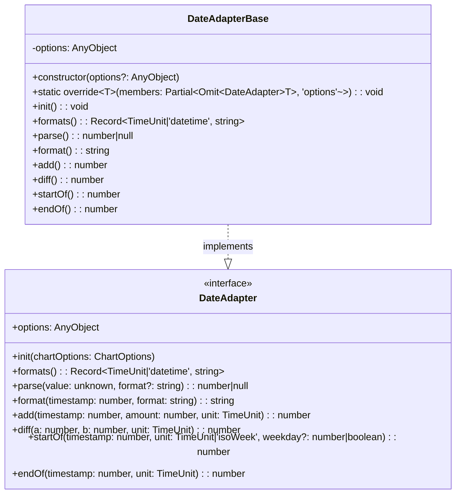
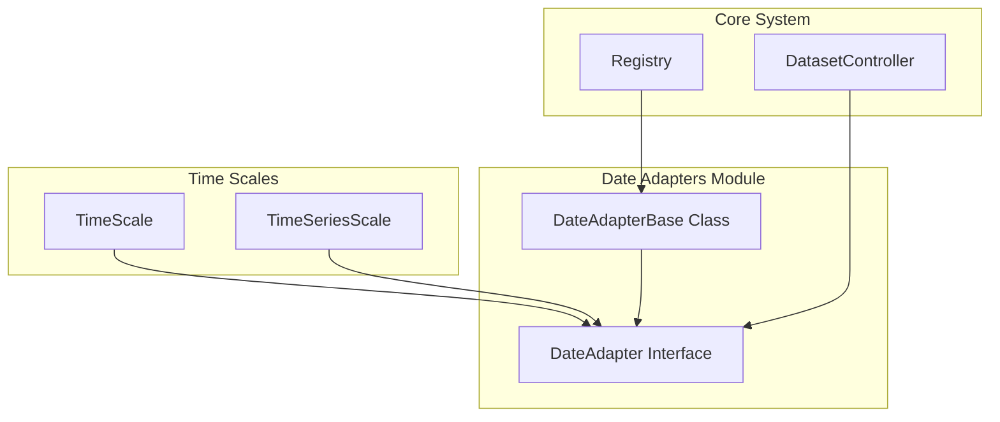
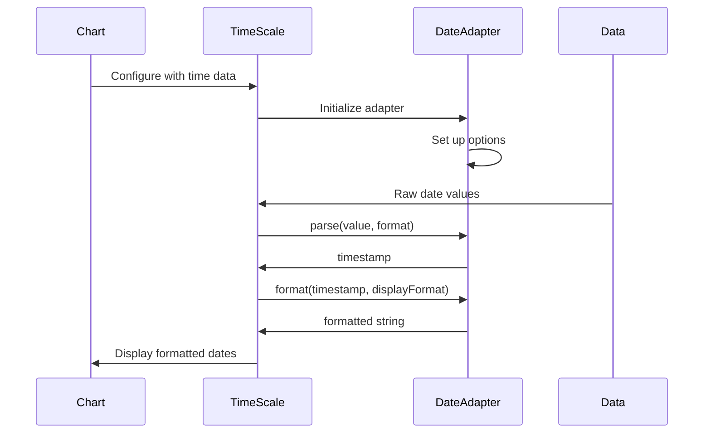
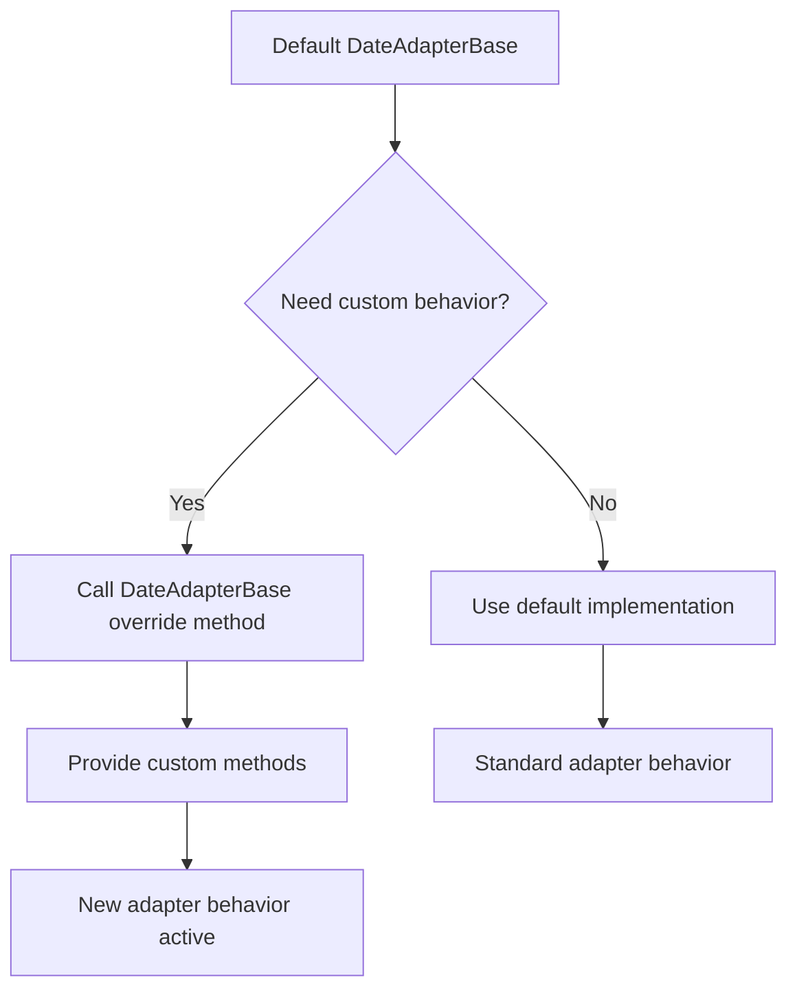

# Date Adapters Module Documentation

## Introduction

The date_adapters module provides a flexible and extensible system for handling date and time operations within Chart.js. It serves as an abstraction layer that allows the charting library to work with different date parsing and formatting libraries while maintaining a consistent interface. This module is essential for time-based scales and ensures that Chart.js can handle various date formats and operations regardless of the underlying date manipulation library being used.

## Module Overview

The date_adapters module consists of two core components:
- **DateAdapterBase**: An abstract base class that defines the contract for date operations
- **DateAdapter**: The interface that concrete implementations must follow

## Core Components

### DateAdapter Interface

The `DateAdapter` interface defines the contract that all date adapters must implement. It provides a comprehensive set of methods for date manipulation, parsing, and formatting operations.

**Key Methods:**
- `init(chartOptions)`: Initializes the adapter with chart configuration
- `formats()`: Returns available time format strings
- `parse(value, format)`: Parses date values into timestamps
- `format(timestamp, format)`: Formats timestamps into display strings
- `add(timestamp, amount, unit)`: Adds time units to timestamps
- `diff(a, b, unit)`: Calculates differences between timestamps
- `startOf(timestamp, unit)`: Gets the start of a time period
- `endOf(timestamp, unit)`: Gets the end of a time period

### DateAdapterBase Class

The `DateAdapterBase` class serves as the foundation for all date adapter implementations. It provides:

- **Abstract Methods**: All core date operations are defined as abstract methods that throw errors if not implemented
- **Static Override Method**: Allows customization of the base adapter through the `override()` method
- **Options Management**: Handles adapter-specific configuration options
- **Extensibility**: Can be extended to create custom date adapters

## Architecture

### Component Structure



### Module Integration



## Data Flow

### Date Processing Pipeline



### Adapter Override Process



## Dependencies

### Internal Dependencies

The date_adapters module has minimal internal dependencies:

- **Types**: Uses `AnyObject` from `../types/basic.js` for flexible typing
- **Chart Options**: References `ChartOptions` from `../types/index.js` for configuration

### External Integration Points

The module integrates with several other Chart.js components:

- **[Time Scale](scales.md#TimeScale)**: Primary consumer of date adapter functionality
- **[TimeSeries Scale](scales.md#TimeSeriesScale)**: Extended time scale requiring date operations
- **[Dataset Controller](core_engine.md#DatasetController)**: May use adapters for data processing
- **[Registry](core_engine.md#Registry)**: Manages adapter registration and retrieval

## Usage Patterns

### Basic Adapter Usage

```typescript
// Default adapter usage
const adapter = new DateAdapterBase(options);
const timestamp = adapter.parse('2023-01-01', 'YYYY-MM-DD');
const formatted = adapter.format(timestamp, 'MMM DD, YYYY');
```

### Custom Adapter Implementation

```typescript
// Override default behavior
DateAdapterBase.override({
  parse(value: unknown, format?: string): number | null {
    // Custom parsing logic
    return customParse(value, format);
  },
  
  format(timestamp: number, format: string): string {
    // Custom formatting logic
    return customFormat(timestamp, format);
  }
});
```

## Time Units Support

The module supports the following time units:
- `millisecond`
- `second`
- `minute`
- `hour`
- `day`
- `week`
- `month`
- `quarter`
- `year`

## Error Handling

The module implements a robust error handling strategy:

- **Abstract Method Protection**: All unimplemented methods throw descriptive errors
- **Type Safety**: Uses TypeScript interfaces to ensure method signatures are correct
- **Null Safety**: Parse operations can return null for invalid inputs

## Extension Points

### Creating Custom Adapters

Developers can create custom date adapters by:

1. **Extending DateAdapterBase**: Create a subclass with implemented methods
2. **Using the Override Method**: Modify the base class behavior globally
3. **Implementing DateAdapter Interface**: Create completely custom implementations

### Integration with External Libraries

The adapter system is designed to work with popular date libraries:
- Moment.js (legacy)
- Day.js
- Luxon
- date-fns
- Native JavaScript Date

## Best Practices

### Adapter Selection
- Choose adapters based on your date manipulation needs
- Consider bundle size when selecting date libraries
- Ensure consistent date formats across your application

### Performance Considerations
- Cache parsed dates when possible
- Minimize format conversions in rendering loops
- Use appropriate time units for your data granularity

### Error Prevention
- Always validate date inputs before parsing
- Handle null returns from parse operations
- Test with various date formats and edge cases

## Related Documentation

- [Time Scale Documentation](scales.md#TimeScale) - Primary consumer of date adapters
- [TimeSeries Scale Documentation](scales.md#TimeSeriesScale) - Advanced time-based scaling
- [Core Engine Documentation](core_engine.md) - System-wide architecture overview
- [Registry Documentation](core_engine.md#Registry) - Component registration system

## API Reference

### DateAdapter Interface

Complete interface definition for implementing custom date adapters.

### DateAdapterBase Class

Base implementation providing the foundation for all date adapters with override capabilities.

### TimeUnit Type

Enumeration of supported time units for date operations.

---

*This documentation covers the core functionality of the date_adapters module. For specific implementation details and advanced usage patterns, refer to the source code and related module documentation.*