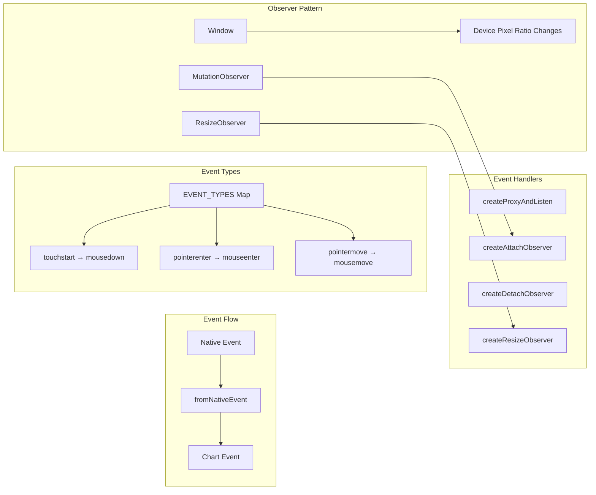
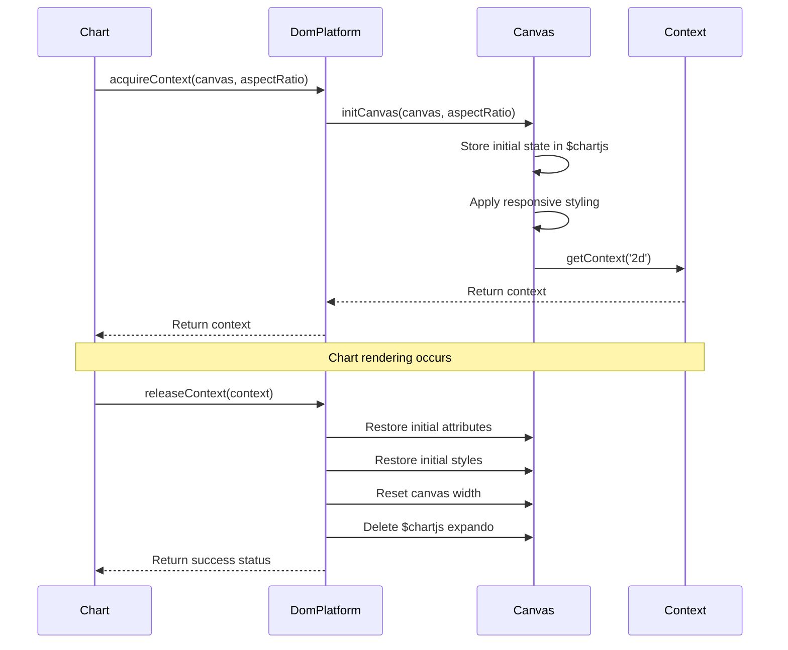
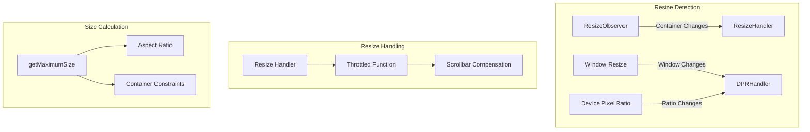
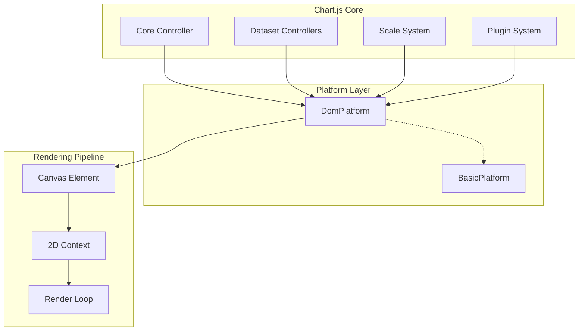

# DOM Platform Module Documentation

## Introduction

The DOM Platform module provides the browser-specific implementation of Chart.js's platform abstraction layer. It handles all DOM-related operations including canvas management, event handling, responsive resizing, and device pixel ratio management. This module enables Chart.js to function seamlessly in web browser environments by providing the necessary interface between the chart library and the browser's DOM APIs.

## Architecture Overview

The DOM Platform module extends the BasePlatform to provide browser-specific functionality. It serves as the bridge between Chart.js core components and the browser environment, managing canvas contexts, DOM events, and responsive behavior.

```mermaid
graph TB
    subgraph "Platform Layer"
        BP[BasePlatform]
        DP[DomPlatform]
        BP --> DP
    end
    
    subgraph "DOM Operations"
        IC[initCanvas]
        GRP[getRelativePosition]
        SUS[supportsEventListenerOptions]
        RUS[readUsedSize]
        GMS[getMaximumSize]
        DP --> IC
        DP --> GRP
        DP --> SUS
        DP --> RUS
        DP --> GMS
    end
    
    subgraph "Event System"
        ET[EVENT_TYPES]
        CPL[createProxyAndListen]
        CAO[createAttachObserver]
        CDO[createDetachObserver]
        CRO[createResizeObserver]
        DP --> ET
        DP --> CPL
        DP --> CAO
        DP --> CDO
        DP --> CRO
    end
    
    subgraph "Browser APIs"
        Canvas[HTMLCanvasElement]
        Context[CanvasRenderingContext2D]
        Window[window]
        Document[document]
        RO[ResizeObserver]
        MO[MutationObserver]
        
        DP --> Canvas
        DP --> Context
        DP --> Window
        DP --> Document
        DP --> RO
        DP --> MO
    end
    
    subgraph "Chart.js Core"
        Chart[Chart]
        CC[Core Controller]
        Chart --> DP
        CC --> DP
    end
```



## Core Components

### DomPlatform Class

The `DomPlatform` class is the main export of this module, extending `BasePlatform` to provide browser-specific implementations of platform methods.

#### Key Responsibilities:
- Canvas context acquisition and release
- DOM event handling and normalization
- Responsive resize management
- Device pixel ratio handling
- Canvas attachment detection

#### Methods:

**acquireContext(canvas, aspectRatio)**
- Acquires a 2D rendering context from the canvas element
- Initializes canvas styling and sizing
- Handles canvas fingerprinting protection scenarios
- Returns `CanvasRenderingContext2D` or `null`

**releaseContext(context)**
- Restores canvas to its original state
- Removes Chart.js-specific modifications
- Cleans up the expando key (`$chartjs`)
- Returns boolean indicating success

**addEventListener(chart, type, listener)**
- Adds event listeners for chart interactions
- Supports special event types: `attach`, `detach`, `resize`
- Creates appropriate observers or proxy functions
- Manages listener lifecycle

**removeEventListener(chart, type)**
- Removes previously added event listeners
- Cleans up observers and proxies
- Handles special event types appropriately

**getDevicePixelRatio()**
- Returns the current device pixel ratio from `window.devicePixelRatio`

**getMaximumSize(canvas, width, height, aspectRatio)**
- Calculates maximum available size for the canvas
- Considers container constraints and aspect ratio

**isAttached(canvas)**
- Determines if the canvas is attached to the DOM
- Uses parent node connection status

## Event System Architecture

The DOM Platform implements a sophisticated event system that normalizes browser events and provides chart-specific functionality.



### Event Normalization

The platform maps touch and pointer events to mouse events for consistent cross-device behavior:

```javascript
const EVENT_TYPES = {
  touchstart: 'mousedown',
  touchmove: 'mousemove',
  touchend: 'mouseup',
  pointerenter: 'mouseenter',
  pointerdown: 'mousedown',
  pointermove: 'mousemove',
  pointerup: 'mouseup',
  pointerleave: 'mouseout',
  pointerout: 'mouseout'
};
```

### Observer Management

The platform uses several observer patterns:

1. **MutationObserver**: Monitors DOM attachment/detachment
2. **ResizeObserver**: Tracks container size changes
3. **Device Pixel Ratio**: Listens for DPR changes via window resize

## Canvas Management

The platform provides comprehensive canvas lifecycle management:



### Canvas Initialization Process

1. **State Preservation**: Stores original canvas attributes and styles
2. **Responsive Setup**: Applies CSS for proper responsive behavior
3. **Size Calculation**: Determines appropriate render dimensions
4. **Aspect Ratio Handling**: Maintains proportions when dimensions are unspecified

## Responsive Design Integration

The platform implements sophisticated responsive behavior:



### Throttling and Performance

All resize operations are throttled to prevent performance issues:
- Resize events are debounced using requestAnimationFrame
- Device pixel ratio changes are batched
- Scrollbar appearance is detected and compensated

## Dependencies

The DOM Platform module relies on several helper modules:

### Core Dependencies
- **[base-platform](base-platform.md)**: Provides the base platform interface
- **[helpers.dom](helpers.dom.md)**: DOM manipulation utilities
- **[helpers.extras](helpers.extras.md)**: Throttling and utility functions
- **[helpers.core](helpers.core.md)**: Core helper functions

### Browser API Dependencies
- **HTMLCanvasElement**: For rendering context
- **CanvasRenderingContext2D**: For 2D drawing operations
- **ResizeObserver**: For container size monitoring
- **MutationObserver**: For DOM change detection
- **window**: For device pixel ratio and global events
- **document**: For DOM traversal and manipulation

## Integration with Chart.js Ecosystem

The DOM Platform integrates with the broader Chart.js architecture:



### Platform Selection

Chart.js automatically selects the appropriate platform based on the environment:
- **DomPlatform**: Used in browser environments with DOM access
- **BasicPlatform**: Used in headless or non-DOM environments

## Error Handling and Edge Cases

The platform implements robust error handling for various scenarios:

### Canvas Fingerprinting Protection
- Detects when `getContext` is undefined (common with privacy extensions)
- Gracefully handles canvas access restrictions
- Provides fallback behavior

### Cross-Origin and Iframe Scenarios
- Handles canvas elements within iframes
- Manages cross-origin restrictions
- Uses flexible type checking instead of strict instanceof

### Memory Management
- Properly cleans up observers and event listeners
- Removes expando properties to prevent memory leaks
- Manages resize listener lifecycle

## Performance Considerations

### Optimization Strategies
1. **Throttling**: All resize and event operations are throttled
2. **Lazy Initialization**: Resources are loaded only when needed
3. **Observer Reuse**: Observers are shared where possible
4. **Passive Listeners**: Uses passive event listeners when supported

### Memory Efficiency
- Expandos are cleaned up on context release
- Observers are disconnected when no longer needed
- Event listeners are properly removed

## Browser Compatibility

The platform supports modern browsers with graceful degradation:

### Modern Features
- **ResizeObserver**: For efficient resize detection
- **MutationObserver**: For DOM change monitoring
- **Passive Event Listeners**: For improved scroll performance

### Fallbacks
- Window resize events for ResizeObserver fallback
- Traditional event handling for older browsers
- Polyfill-friendly implementation

## Usage Examples

### Basic Canvas Acquisition
```javascript
const platform = new DomPlatform();
const canvas = document.getElementById('myChart');
const ctx = platform.acquireContext(canvas, 16/9);
```

### Event Listener Management
```javascript
platform.addEventListener(chart, 'resize', (size) => {
  console.log('Chart resized:', size);
});
```

### Responsive Configuration
```javascript
platform.addEventListener(chart, 'resize', (width, height) => {
  chart.resize(width, height);
});
```

## Conclusion

The DOM Platform module serves as the critical bridge between Chart.js and the browser environment. It provides a robust, performant, and feature-rich implementation that handles the complexities of DOM manipulation, event management, and responsive behavior. Through careful abstraction and optimization, it enables Chart.js to deliver smooth, interactive charting experiences across a wide range of web browsers and devices.