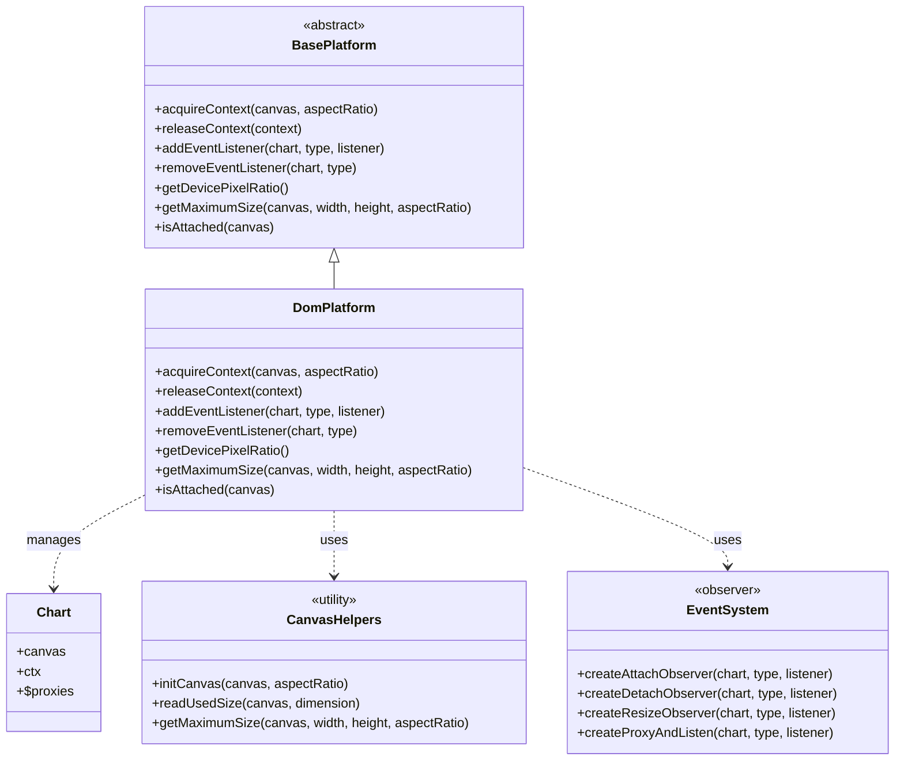
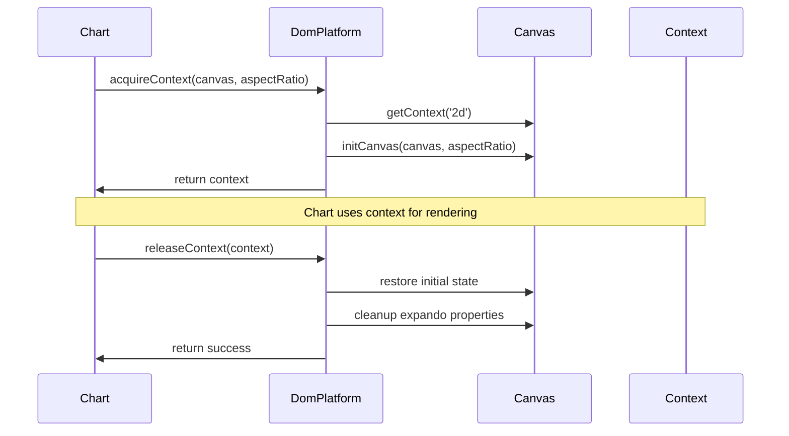
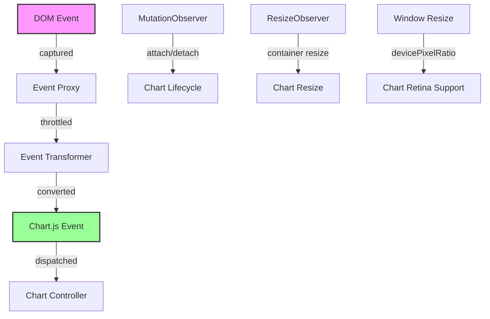
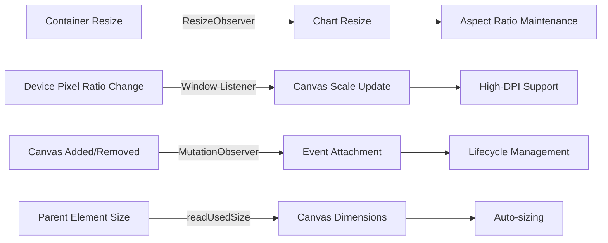
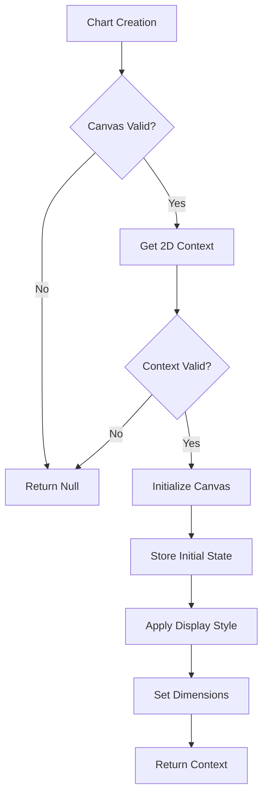
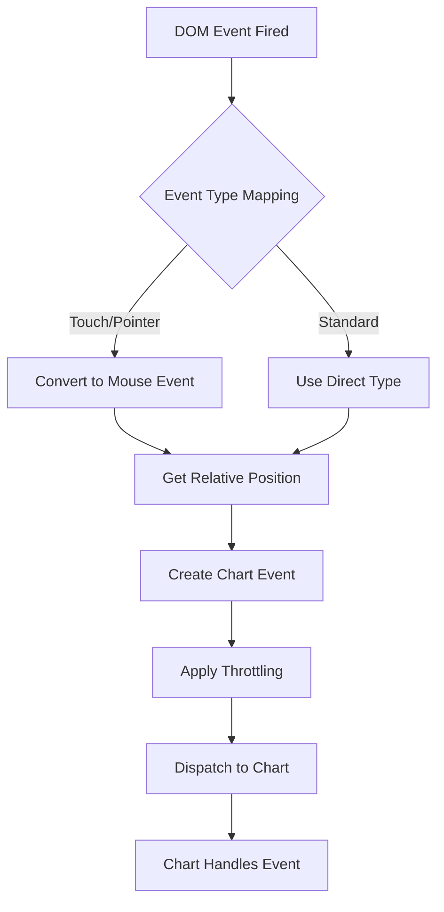
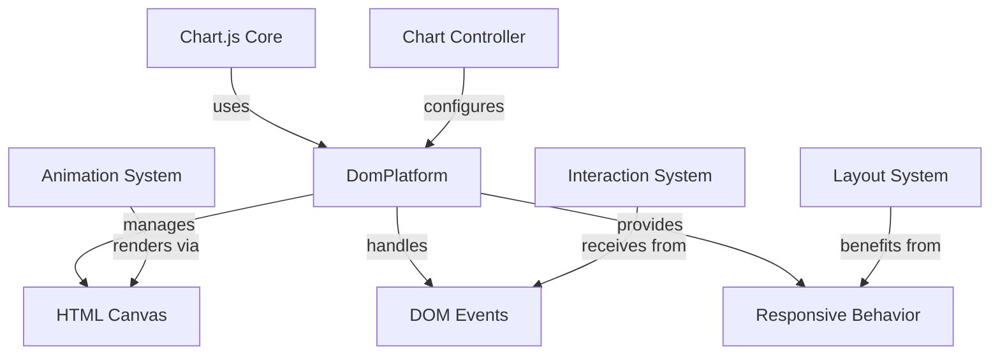

# DOM Platform Module Documentation

## Introduction

The DOM Platform module provides the web browser-specific implementation of Chart.js's platform abstraction layer. It handles all DOM-related operations including canvas management, event handling, responsive resizing, and device pixel ratio management. This module serves as the bridge between Chart.js charts and the web browser environment, enabling charts to interact with HTML canvas elements and respond to browser events.

## Architecture Overview

The DOM Platform module extends the BasePlatform to provide browser-specific functionality for Chart.js. It manages the complete lifecycle of chart rendering in web browsers, from canvas initialization to event handling and responsive behavior.

## Core Components

### DomPlatform Class

The `DomPlatform` class is the main component that extends `BasePlatform` to provide browser-specific functionality. It handles:

- **Canvas Context Management**: Acquisition and release of 2D rendering contexts
- **Event Handling**: DOM event listening and Chart.js event dispatching
- **Responsive Behavior**: Automatic chart resizing based on container changes
- **Device Pixel Ratio**: High-DPI display support
- **Canvas Lifecycle**: Initialization and cleanup of canvas elements

## Key Features

### 1. Canvas Context Acquisition and Management

The platform manages the complete lifecycle of canvas contexts, ensuring proper initialization and cleanup:

### 2. Event System Architecture

The DOM Platform implements a sophisticated event system that bridges DOM events with Chart.js events:

### 3. Responsive Design Support

The platform provides comprehensive responsive behavior through multiple mechanisms:

## Component Dependencies

The DOM Platform module relies on several helper modules:

### Internal Dependencies

- **BasePlatform**: Provides the abstract interface that DomPlatform implements
- **DOM Helpers**: Utility functions for DOM manipulation and measurement
- **Core Helpers**: General utility functions for type checking and throttling

### External Dependencies

- **Browser APIs**: ResizeObserver, MutationObserver, Canvas 2D Context
- **DOM Events**: Mouse, touch, and pointer events
- **Window Object**: Device pixel ratio and resize events

## Data Flow

### Canvas Initialization Flow

### Event Handling Flow

## Configuration and Options

The DOM Platform supports several configuration options that affect its behavior:

### Canvas Configuration
- **Aspect Ratio**: Maintains proportional dimensions during resizing
- **Responsive**: Enables automatic resizing based on container size
- **Device Pixel Ratio**: Automatic scaling for high-DPI displays

### Event Configuration
- **Event Listener Options**: Uses passive listeners for better performance
- **Throttling**: Prevents excessive event processing
- **Event Mapping**: Converts touch/pointer events to mouse events

## Performance Considerations

### Optimization Strategies

1. **Throttled Event Handling**: All event handlers are throttled to prevent performance degradation
2. **Passive Event Listeners**: Uses passive listeners where supported for better scroll performance
3. **Observer Pattern**: Uses ResizeObserver and MutationObserver for efficient DOM monitoring
4. **Device Pixel Ratio Caching**: Caches and batches DPR changes across all charts

### Memory Management

- **Expando Properties**: Stores initial canvas state for proper cleanup
- **Observer Cleanup**: Properly disconnects observers when charts are destroyed
- **Event Listener Removal**: Ensures all event listeners are removed on chart destruction
- **Proxy Cleanup**: Removes throttled proxies to prevent memory leaks

## Browser Compatibility

The DOM Platform is designed to work across modern browsers with fallbacks for older environments:

### Supported Features
- **Canvas 2D Context**: Core rendering capability
- **ResizeObserver**: For efficient resize detection (with fallbacks)
- **MutationObserver**: For DOM change detection
- **Passive Event Listeners**: For improved performance

### Graceful Degradation
- **Event Listener Options**: Falls back to standard listeners
- **Observer APIs**: Provides alternative resize detection methods
- **Context Validation**: Handles canvas fingerprinting protection

## Integration with Chart.js

The DOM Platform integrates seamlessly with the Chart.js ecosystem:

## Error Handling

The DOM Platform implements robust error handling for common browser scenarios:

- **Canvas Fingerprinting**: Handles cases where getContext is undefined
- **Iframe Environments**: Works around instanceof checks in protected environments
- **Missing Canvas**: Gracefully handles null or invalid canvas elements
- **Context Loss**: Manages canvas context restoration scenarios

## Best Practices

### For Developers
1. Always ensure canvas elements are properly attached to the DOM before chart creation
2. Use appropriate aspect ratios to maintain chart proportions during resizing
3. Consider device pixel ratio for crisp rendering on high-DPI displays
4. Properly destroy charts to ensure cleanup of observers and event listeners

### For Performance
1. Minimize chart resize operations by using appropriate container sizing
2. Use throttling configuration to balance responsiveness and performance
3. Consider disabling animations for better performance in data-intensive scenarios
4. Use CSS containment to improve resize observer performance

## Related Documentation

- [Base Platform](base_platform.md) - Abstract platform interface
- [Basic Platform](basic_platform.md) - Minimal platform implementation
- [Core Controller](core_engine.md) - Main chart controller that uses the platform
- [Animation System](animation.md) - Rendering system that utilizes the platform

## Conclusion

The DOM Platform module is a critical component of Chart.js that enables seamless chart rendering in web browsers. Its comprehensive event handling, responsive design support, and performance optimizations make it suitable for production applications across various devices and browsers. The module's architecture ensures proper separation of concerns while providing the necessary browser-specific functionality for Chart.js to operate effectively in web environments.