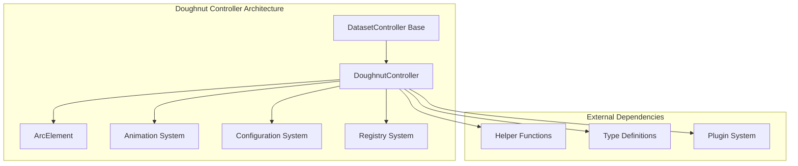
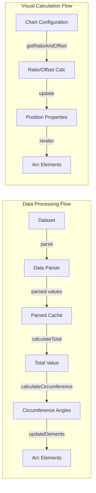
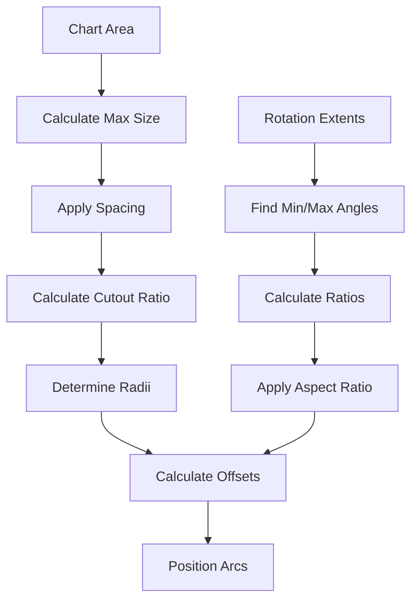
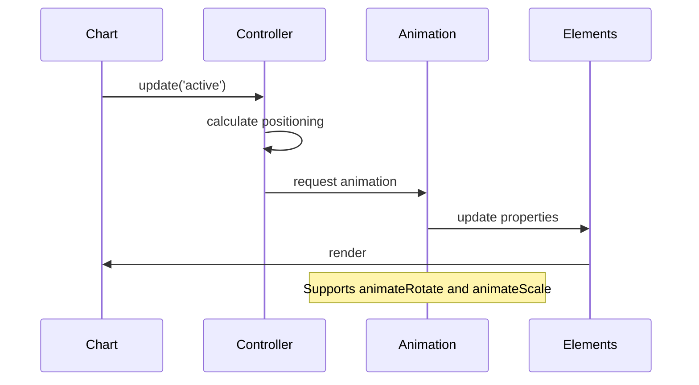
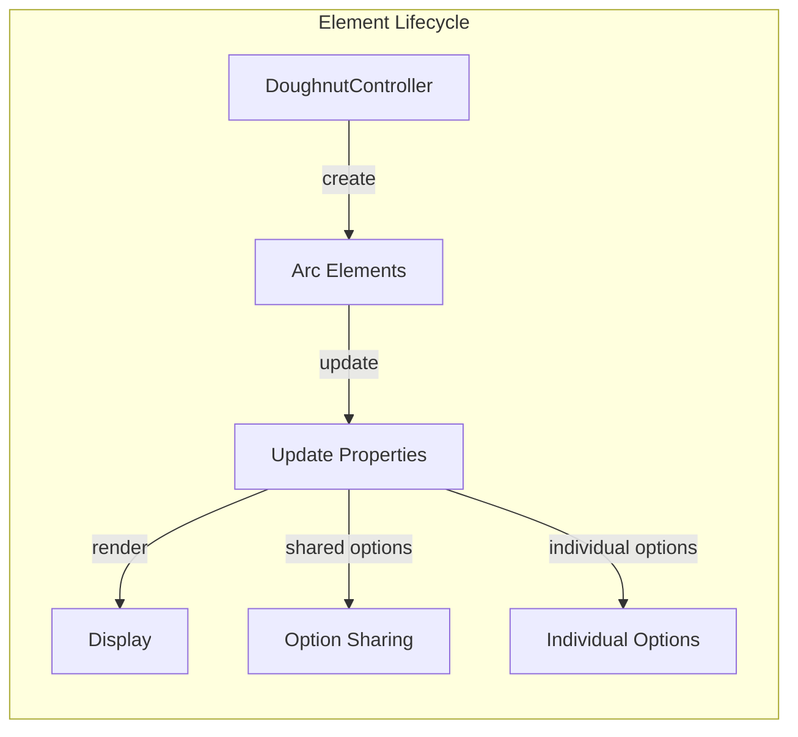
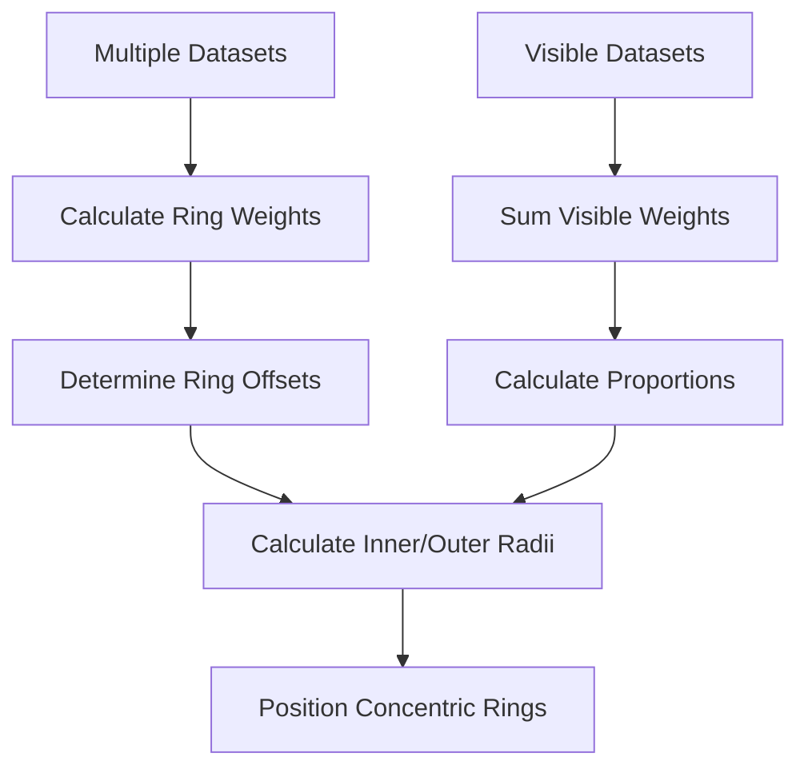

# Doughnut Controller Module

## Introduction

The Doughnut Controller module is a specialized chart controller in the Chart.js library that handles the creation, rendering, and interaction of doughnut and pie charts. It extends the base DatasetController to provide circular chart functionality with configurable cutout centers, making it suitable for creating both full pie charts and doughnut charts with hollow centers.

## Architecture Overview

The DoughnutController is built on top of the core dataset controller architecture and specializes in managing circular data visualization. It handles data parsing, element positioning, animation, and user interactions for doughnut-type charts.



## Core Components

### DoughnutController Class

The `DoughnutController` class is the main component that extends `DatasetController` to provide doughnut chart functionality. It manages the lifecycle of doughnut chart elements and handles all chart-specific operations.

**Key Properties:**
- `static id = 'doughnut'` - Controller identifier for registry
- `innerRadius` - Calculated inner radius for doughnut cutout
- `outerRadius` - Calculated outer radius
- `offsetX/Y` - Position offsets for proper centering
- `enableOptionSharing` - Enables option sharing between elements

**Key Methods:**
- `update(mode)` - Updates chart elements and calculates positioning
- `parse(start, count)` - Parses data values from dataset
- `calculateTotal()` - Computes the sum of all visible data values
- `calculateCircumference(value)` - Converts data values to angular measurements
- `getLabelAndValue(index)` - Retrieves formatted labels and values

## Data Flow Architecture



## Configuration System

The DoughnutController provides extensive configuration options through its static defaults and overrides:

### Default Configuration
```javascript
{
  datasetElementType: false,
  dataElementType: 'arc',
  animation: {
    animateRotate: true,
    animateScale: false
  },
  animations: {
    numbers: {
      type: 'number',
      properties: ['circumference', 'endAngle', 'innerRadius', 'outerRadius', 'startAngle', 'x', 'y', 'offset', 'borderWidth', 'spacing']
    }
  },
  cutout: '50%',
  rotation: 0,
  circumference: 360,
  radius: '100%',
  spacing: 0,
  indexAxis: 'r'
}
```

### Legend Integration
The controller provides custom legend generation and interaction handling, allowing users to toggle data visibility by clicking legend items.

## Mathematical Calculations

### Radius and Positioning Calculations

The controller performs complex geometric calculations to determine proper arc positioning:



### Key Mathematical Functions

**getRatioAndOffset(rotation, circumference, cutout)**
- Calculates aspect ratio corrections for non-full-circle charts
- Determines proper scaling factors and center offsets
- Handles edge cases for partial circles

**Circumference Calculation**
- Converts data values to angular measurements based on total sum
- Handles null/NaN values gracefully
- Supports both visible and hidden data points

## Animation System Integration

The DoughnutController integrates with the animation system to provide smooth transitions:



### Animation Properties
- **animateRotate**: Controls rotation animation during updates
- **animateScale**: Controls scaling animation from center
- **Number animations**: Smooth transitions for radius, angle, and position properties

## Element Management

### Arc Element Creation and Updates

The controller manages ArcElement instances that represent individual data segments:



### Element Properties
Each arc element receives calculated properties:
- `x, y`: Center position with offsets
- `startAngle, endAngle`: Angular boundaries
- `circumference`: Arc length in radians
- `innerRadius, outerRadius`: Radial boundaries
- `options`: Styling and interaction options

## Data Visibility and Interaction

### Visibility Management
The controller implements sophisticated visibility handling:

- **Data Visibility**: Individual data points can be toggled
- **Dataset Visibility**: Entire datasets can be shown/hidden
- **Legend Integration**: Click-to-toggle functionality
- **Weight Calculation**: Proper handling of weighted datasets

### Ring Weight System
For multi-dataset doughnut charts, the controller implements a ring weight system:



## Integration with Core Systems

### DatasetController Inheritance
The DoughnutController extends the base DatasetController, inheriting:
- Data parsing and caching mechanisms
- Element update and rendering pipelines
- Option resolution and sharing systems
- Scale integration (though doughnut charts don't use scales)

### Registry Integration
Registered with the chart registry system using the 'doughnut' identifier, allowing automatic controller resolution based on chart type.

### Plugin System Compatibility
Works seamlessly with core plugins:
- **Legend**: Custom label generation and interaction
- **Tooltip**: Data point information display
- **Filler**: Background fill support
- **Title**: Chart title rendering

## Dependencies

### Core Dependencies
- [DatasetController](../dataset-controller.md) - Base controller class
- [Animation System](../animation-system.md) - Animation support
- [Configuration System](../configuration-system.md) - Default configuration
- [Registry System](../registry-system.md) - Controller registration

### Helper Dependencies
- **helpers.core.js**: Object manipulation and value resolution
- **helpers.intl.js**: Number formatting for internationalization
- **helpers.math.js**: Mathematical utilities for angle calculations

### Element Dependencies
- [ArcElement](../elements.md) - Visual representation of data segments

## Usage Examples

### Basic Doughnut Chart
```javascript
const config = {
  type: 'doughnut',
  data: {
    labels: ['Red', 'Blue', 'Yellow'],
    datasets: [{
      data: [300, 50, 100],
      backgroundColor: ['red', 'blue', 'yellow']
    }]
  },
  options: {
    cutout: '50%' // Creates doughnut hole
  }
};
```

### Pie Chart (No Cutout)
```javascript
const config = {
  type: 'doughnut',
  data: { /* data */ },
  options: {
    cutout: 0 // Full pie chart
  }
};
```

### Multi-ring Doughnut
```javascript
const config = {
  type: 'doughnut',
  data: {
    datasets: [
      { data: [10, 20, 30], weight: 2 },
      { data: [15, 25, 35], weight: 1 }
    ]
  }
};
```

## Performance Considerations

### Optimization Strategies
- **Option Sharing**: Reduces memory footprint by sharing options between elements
- **Parsed Data Caching**: Avoids repeated data parsing operations
- **Visibility Tracking**: Only processes visible data points
- **Efficient Calculations**: Minimizes trigonometric operations through caching

### Scaling Considerations
- Handles large datasets efficiently through data parsing optimization
- Supports data decimation for improved performance with many data points
- Implements efficient border width and offset calculations

## Error Handling

### Data Validation
- Handles null and NaN values gracefully
- Provides fallbacks for missing configuration options
- Validates percentage and dimension calculations

### Edge Cases
- Empty datasets
- Single data points
- All-zero values
- Invalid cutout percentages
- Missing labels or data

This comprehensive documentation provides developers with a complete understanding of the DoughnutController module's architecture, functionality, and integration within the Chart.js ecosystem.