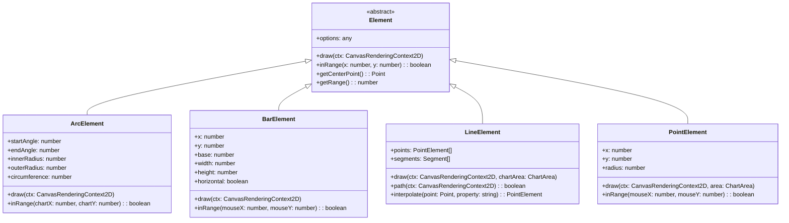
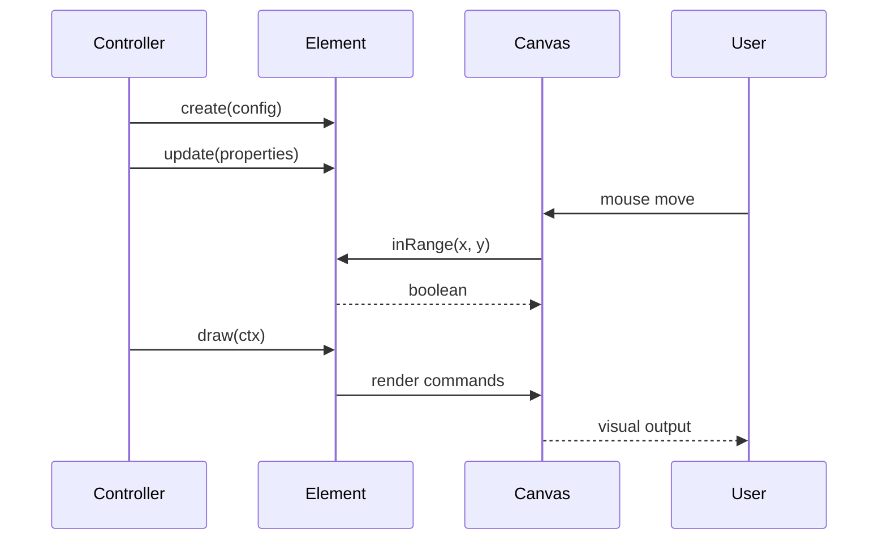

# Elements Module Documentation

## Overview

The Elements module is a core component of the Chart.js library that provides the fundamental building blocks for rendering chart visualizations. It defines the basic geometric shapes and visual elements that can be drawn on charts, including arcs (for pie/doughnut charts), bars (for bar charts), lines (for line charts), and points (for scatter plots and data points).

## Architecture

The Elements module follows an object-oriented design pattern where each element type extends a base `Element` class from the core module. This inheritance structure provides common functionality while allowing each element type to implement its own specific rendering and interaction logic.

## Module Structure

The Elements module is organized into four main element types, each serving specific visualization purposes:

### 1. [Arc Element](arc-element.md)
**Purpose**: Renders circular and annular segments for pie charts, doughnut charts, and polar area charts.

**Key Features**:
- Supports both full circles and partial arcs
- Configurable inner and outer radii for creating ring/doughnut shapes
- Advanced border radius support for rounded corners
- Self-joining capability for seamless circular segments
- Clipping functionality for proper border rendering

**Core Components**:
- `ArcProps`: Interface defining arc properties (startAngle, endAngle, innerRadius, outerRadius, circumference)
- `ArcElement`: Main class implementing arc rendering and interaction logic

### 2. [Bar Element](bar-element.md)
**Purpose**: Renders rectangular bars for bar charts, column charts, and histograms.

**Key Features**:
- Supports both vertical and horizontal orientations
- Configurable border radius for rounded corners
- Border skipping functionality for selective border rendering
- Inflation amount control for visual effects
- Hit detection for mouse interactions

**Core Components**:
- `BarElement`: Main class implementing bar rendering and bounds calculation
- Helper functions for border parsing and bounds calculation

### 3. [Line Element](line-element.md)
**Purpose**: Renders line segments for line charts, area charts, and trend visualizations.

**Key Features**:
- Multiple interpolation modes (linear, stepped, bezier curves)
- Support for monotone cubic interpolation
- Segment-based rendering for performance optimization
- Path2D caching for improved rendering performance
- Span gaps functionality for handling missing data points

**Core Components**:
- `LineElement`: Main class implementing line rendering and interpolation
- Helper functions for different line interpolation methods

### 4. [Point Element](point-element.md)
**Purpose**: Renders individual data points for scatter plots, line chart markers, and data point indicators.

**Key Features**:
- Multiple point styles (circle, square, triangle, etc.)
- Configurable radius and hit radius for interaction
- Hover state support with different styling
- Area-based visibility checking
- Range calculation for interaction detection

**Core Components**:
- `PointProps`: Interface defining point properties (x, y coordinates)
- `PointElement`: Main class implementing point rendering and interaction

## Data Flow and Interactions

## Integration with Other Modules

The Elements module integrates closely with several other Chart.js modules:

- **[Core Module](core.md)**: All elements extend the base `Element` class from the core module
- **[Controllers Module](controllers.md)**: Controllers use elements to render chart data (e.g., BarController uses BarElement)
- **[Scales Module](scales.md)**: Elements receive scaled coordinates from scale calculations
- **[Types Module](types.md)**: Element options and properties are defined in the types module

## Key Design Patterns

### 1. Inheritance and Polymorphism
All elements inherit from the base `Element` class, providing consistent interfaces while allowing specialized implementations.

### 2. Configuration-Driven Rendering
Each element supports extensive configuration options through `defaults` and `defaultRoutes` static properties.

### 3. Performance Optimization
- Path2D caching for complex shapes
- Segment-based rendering for lines
- Efficient hit detection algorithms
- Canvas state management

### 4. Extensibility
The module design allows for easy addition of new element types by extending the base `Element` class and implementing required methods.

## Usage Examples

Elements are typically not used directly but are instantiated and managed by their corresponding controllers. However, understanding their structure is crucial for:

- Creating custom chart types
- Implementing custom element behaviors
- Optimizing rendering performance
- Extending Chart.js functionality

## Performance Considerations

- **Arc Elements**: Complex border radius calculations can impact performance with many segments
- **Bar Elements**: Border radius and inflation add computational overhead
- **Line Elements**: Use `spanGaps: false` and appropriate interpolation modes for large datasets
- **Point Elements**: Consider reducing hit radius for better interaction performance with many points

## Future Enhancements

Potential areas for enhancement include:
- WebGL rendering support for improved performance
- Additional element types (polygons, curves)
- Advanced animation capabilities
- Better accessibility features