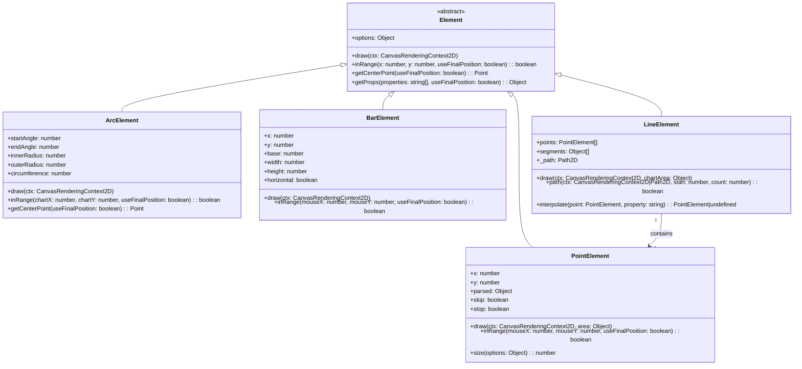
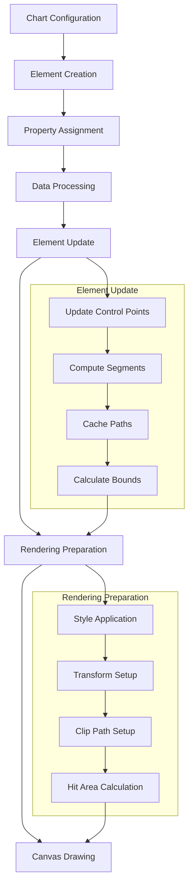
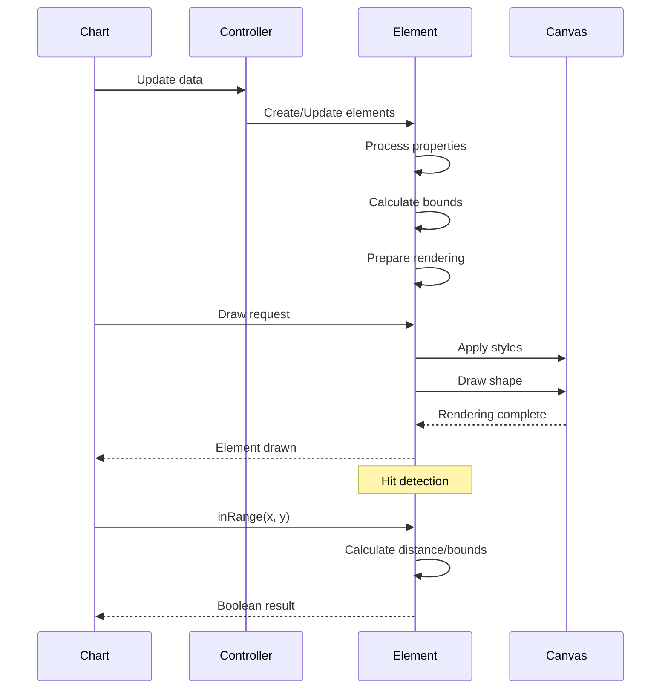

# Elements Module Documentation

## Introduction

The Elements module is a fundamental component of the Chart.js library that provides the visual building blocks for creating charts. It defines four core element types: ArcElement, BarElement, LineElement, and PointElement, each representing different visual primitives used across various chart types. These elements handle their own rendering, hit detection, and styling, serving as the foundation for more complex chart visualizations.

## Architecture Overview

The Elements module follows an object-oriented design pattern where all element types inherit from a common base Element class. Each element is responsible for its own rendering logic, hit detection, and visual properties management.

```mermaid
classDiagram
    class Element {
        <<abstract>>
        +options: Object
        +draw(ctx: CanvasRenderingContext2D)
        +inRange(x: number, y: number, useFinalPosition: boolean): boolean
        +getCenterPoint(useFinalPosition: boolean): Point
        +getProps(properties: string[], useFinalPosition: boolean): Object
    }
    
    class ArcElement {
        +startAngle: number
        +endAngle: number
        +innerRadius: number
        +outerRadius: number
        +circumference: number
        +draw(ctx: CanvasRenderingContext2D)
        +inRange(chartX: number, chartY: number, useFinalPosition: boolean): boolean
        +getCenterPoint(useFinalPosition: boolean): Point
    }
    
    class BarElement {
        +x: number
        +y: number
        +base: number
        +width: number
        +height: number
        +horizontal: boolean
        +draw(ctx: CanvasRenderingContext2D)
        +inRange(mouseX: number, mouseY: number, useFinalPosition: boolean): boolean
    }
    
    class LineElement {
        +points: PointElement[]
        +segments: Object[]
        +_path: Path2D
        +draw(ctx: CanvasRenderingContext2D, chartArea: Object)
        +path(ctx: CanvasRenderingContext2D|Path2D, start: number, count: number): boolean
        +interpolate(point: PointElement, property: string): PointElement|undefined
    }
    
    class PointElement {
        +x: number
        +y: number
        +parsed: Object
        +skip: boolean
        +stop: boolean
        +draw(ctx: CanvasRenderingContext2D, area: Object)
        +inRange(mouseX: number, mouseY: number, useFinalPosition: boolean): boolean
        +size(options: Object): number
    }
    
    Element <|-- ArcElement
    Element <|-- BarElement
    Element <|-- LineElement
    Element <|-- PointElement
    LineElement "1" --> "*" PointElement : contains
```

## Core Components

### ArcElement

The ArcElement represents circular or arc-shaped visual elements, commonly used in pie charts, doughnut charts, and polar area charts. It handles complex arc rendering with support for inner/outer radii, start/end angles, and border styling.

**Key Features:**
- Supports both full circles and partial arcs
- Configurable inner and outer radii for creating ring shapes
- Advanced border handling with different alignment options
- Border radius support for rounded corners
- Self-joining capability for seamless arc connections

**Properties:**
- `startAngle`: Starting angle of the arc in radians
- `endAngle`: Ending angle of the arc in radians
- `innerRadius`: Inner radius of the arc (0 for pie charts)
- `outerRadius`: Outer radius of the arc
- `circumference`: Total arc length in radians
- `fullCircles`: Number of complete circles

**Dependencies:**
- [Core Element](core_engine.md#element)
- [Math Helpers](core_engine.md#math-helpers)
- [Canvas Helpers](core_engine.md#canvas-helpers)

### BarElement

The BarElement represents rectangular shapes used in bar charts, column charts, and histograms. It handles both horizontal and vertical orientations with sophisticated border and radius management.

**Key Features:**
- Supports both horizontal and vertical orientations
- Configurable border width and radius
- Inflation amount for visual effects
- Border skipping for specific sides
- Hit detection optimized for rectangular shapes

**Properties:**
- `x`, `y`: Center coordinates of the bar
- `base`: Base position (bottom for vertical, left for horizontal)
- `width`, `height`: Dimensions of the bar
- `horizontal`: Orientation flag
- `inflateAmount`: Amount to inflate the bar for visual effects

**Dependencies:**
- [Core Element](core_engine.md#element)
- [Canvas Helpers](core_engine.md#canvas-helpers)
- [Options Helpers](core_engine.md#options-helpers)

### LineElement

The LineElement represents line segments and curves used in line charts, scatter plots, and area charts. It supports various interpolation methods and handles complex path generation with optimization for performance.

**Key Features:**
- Multiple interpolation modes (linear, stepped, bezier, monotone)
- Support for gaps and discontinuous data
- Path2D caching for performance optimization
- Segment-based rendering for complex line patterns
- Bezier curve support with tension control

**Properties:**
- `points`: Array of PointElement instances
- `segments`: Computed line segments
- `_path`: Cached Path2D object
- `_decimated`: Flag for data decimation
- `_pointsUpdated`: Flag for control point updates

**Dependencies:**
- [Core Element](core_engine.md#element)
- [PointElement](#pointelement)
- [Interpolation Helpers](core_engine.md#interpolation-helpers)
- [Segment Helpers](core_engine.md#segment-helpers)
- [Canvas Helpers](core_engine.md#canvas-helpers)

### PointElement

The PointElement represents individual data points used in scatter plots, line charts, and bubble charts. It handles various point styles and provides precise hit detection for user interactions.

**Key Features:**
- Multiple point styles (circle, square, triangle, etc.)
- Configurable radius and hit radius
- Hover state support with different styling
- Rotation support for asymmetric point styles
- Efficient hit detection using distance calculations

**Properties:**
- `x`, `y`: Coordinates of the point
- `parsed`: Parsed data values
- `skip`: Flag to skip rendering
- `stop`: Flag to stop line continuation

**Dependencies:**
- [Core Element](core_engine.md#element)
- [Canvas Helpers](core_engine.md#canvas-helpers)

## Data Flow and Rendering Pipeline

```mermaid
flowchart TD
    A[Chart Configuration] --> B[Element Creation]
    B --> C[Property Assignment]
    C --> D[Data Processing]
    D --> E[Element Update]
    E --> F[Rendering Preparation]
    F --> G[Canvas Drawing]
    
    subgraph "Element Update"
        E1[Update Control Points]
        E2[Compute Segments]
        E3[Cache Paths]
        E4[Calculate Bounds]
    end
    
    subgraph "Rendering Preparation"
        F1[Style Application]
        F2[Transform Setup]
        F3[Clip Path Setup]
        F4[Hit Area Calculation]
    end
    
    E --> E1
    E1 --> E2
    E2 --> E3
    E3 --> E4
    E4 --> F
    F --> F1
    F1 --> F2
    F2 --> F3
    F3 --> F4
    F4 --> G
```

## Component Interactions

```mermaid
sequenceDiagram
    participant Chart
    participant Controller
    participant Element
    participant Canvas
    
    Chart->>Controller: Update data
    Controller->>Element: Create/Update elements
    Element->>Element: Process properties
    Element->>Element: Calculate bounds
    Element->>Element: Prepare rendering
    Chart->>Element: Draw request
    Element->>Canvas: Apply styles
    Element->>Canvas: Draw shape
    Canvas-->>Element: Rendering complete
    Element-->>Chart: Element drawn
    
    Note over Element: Hit detection
    Chart->>Element: inRange(x, y)
    Element->>Element: Calculate distance/bounds
    Element-->>Chart: Boolean result
```

## Integration with Chart System

The Elements module integrates with the broader Chart.js ecosystem through several key interfaces:

### Controller Integration
Elements are created and managed by chart controllers, which handle data processing and coordinate element updates. Each controller type (BarController, LineController, etc.) works with specific element types to create the final visualization.

### Scale Integration
Elements receive their positioning data from scales, which convert data values to pixel coordinates. The element's `getProps` method can retrieve both data values and pixel positions based on scale calculations.

### Plugin Integration
Elements interact with the plugin system for features like tooltips, legends, and animations. The `inRange` method enables plugins to determine which elements are under the mouse cursor, while the `getCenterPoint` method provides positioning information for tooltips.

### Animation Integration
Elements support animation through the core animation system. The `getProps` method can return intermediate values during animations, allowing smooth transitions between states.

## Performance Optimizations

The Elements module implements several performance optimizations:

### Path Caching
LineElement caches Path2D objects to avoid recalculating complex paths on every frame. The cache is invalidated when points or options change.

### Fast Path Rendering
LineElement includes a fast path for simple line segments that don't require complex interpolation or styling. This significantly improves performance for large datasets.

### Decimation Support
LineElement supports data decimation to reduce the number of points rendered when displaying large datasets at small scales.

### Efficient Hit Detection
Each element type implements optimized hit detection algorithms specific to its geometry, avoiding unnecessary calculations.

## Configuration and Defaults

Each element type provides sensible defaults while allowing extensive customization:

### ArcElement Defaults
- Border width: 2px
- Border color: #fff
- Border radius: 0
- Circular: true
- Self-join: false

### BarElement Defaults
- Border width: 0
- Border radius: 0
- Border skipped: 'start'
- Inflate amount: 'auto'

### LineElement Defaults
- Border width: 3px
- Tension: 0
- Stepped: false
- Fill: false
- Span gaps: false

### PointElement Defaults
- Radius: 3px
- Hit radius: 1px
- Point style: 'circle'
- Border width: 1px

## Error Handling and Edge Cases

The Elements module handles various edge cases:

### Invalid Dimensions
Elements check for invalid dimensions (negative radii, zero dimensions) and skip rendering when appropriate.

### Missing Data
Elements gracefully handle missing or invalid data points, providing fallback behavior or skipping rendering entirely.

### Canvas State Management
All elements properly save and restore canvas state to prevent interference between different rendering operations.

### Coordinate System Boundaries
Elements handle edge cases where coordinates fall outside expected ranges, clamping values or adjusting rendering as needed.

## Testing and Quality Assurance

The Elements module is designed for testability with:

### Isolated Components
Each element type can be tested independently with mock data and canvas contexts.

### Predictable Behavior
Element methods have well-defined inputs and outputs, making them suitable for unit testing.

### Visual Regression Testing
The rendering output can be captured and compared against reference images to detect visual regressions.

## Future Enhancements

Potential areas for future development include:

### WebGL Support
Adding WebGL rendering backends for improved performance with large datasets.

### Advanced Styling
Support for gradients, patterns, and more complex visual effects.

### Accessibility
Enhanced accessibility features for screen readers and keyboard navigation.

### Performance Monitoring
Built-in performance metrics and optimization suggestions.

## Related Documentation

- [Core Engine](core_engine.md) - Base Element class and core functionality
- [Controllers](controllers.md) - Chart controllers that use elements
- [Scales](scales.md) - Positioning and data conversion
- [Animation](animation.md) - Element animation and transitions
- [Plugins](plugins.md) - Element interaction and plugin integration