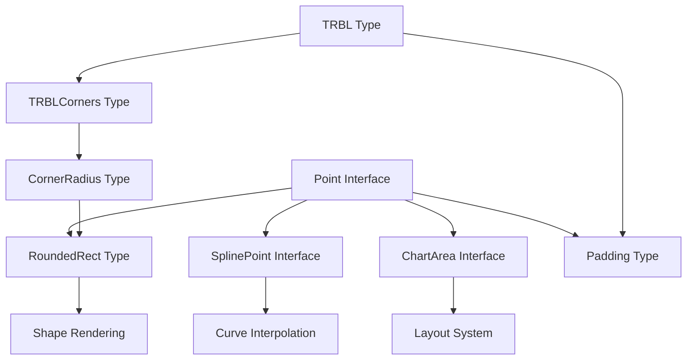
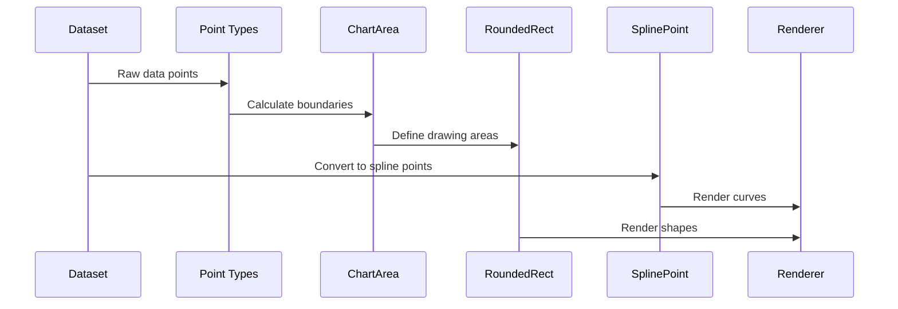
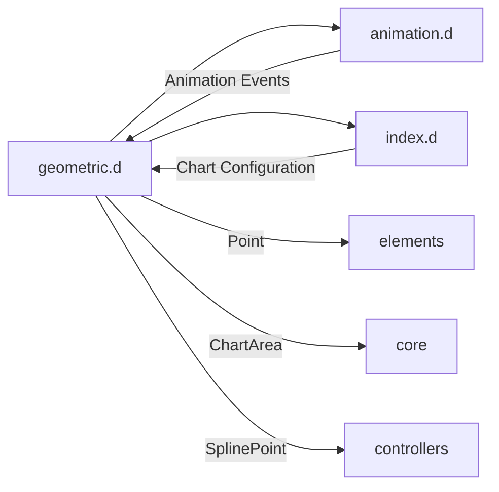

# Geometric Types Module Documentation

## Introduction

The `geometric.d` module provides the fundamental geometric type definitions for Chart.js, serving as the mathematical foundation for all chart positioning, sizing, and coordinate calculations. This module defines the core interfaces that enable precise spatial calculations and rendering across the entire charting system.

## Module Overview

The geometric.d module is a TypeScript definition module that exports essential geometric interfaces and type aliases used throughout the Chart.js library. It provides the building blocks for:

- **Coordinate Systems**: Point positioning and spatial relationships
- **Layout Management**: Chart area definitions and boundary calculations
- **Shape Rendering**: Rectangle and corner radius specifications
- **Curve Interpolation**: Spline point definitions for smooth line charts

## Core Components

### Point Interface

The `Point` interface represents a basic 2D coordinate in the chart coordinate system.

```typescript
interface Point {
  x: number;
  y: number;
}
```

**Purpose**: Defines the fundamental coordinate structure used throughout Chart.js for positioning elements, calculating distances, and managing spatial relationships.

**Usage Context**:
- Data point positioning in scatter and bubble charts
- Control point definitions for curve interpolation
- Mouse event coordinate handling
- Element positioning calculations

### ChartArea Interface

The `ChartArea` interface defines the rectangular region where chart content is rendered.

```typescript
interface ChartArea {
  top: number;
  left: number;
  right: number;
  bottom: number;
  width: number;
  height: number;
}
```

**Purpose**: Encapsulates the dimensions and boundaries of the chart's drawing area, excluding axes, legends, and other peripheral elements.

**Key Features**:
- Absolute positioning (top, left, right, bottom)
- Derived dimensions (width, height)
- Boundary calculations for clipping and hit detection
- Coordinate system transformations

### SplinePoint Interface

The `SplinePoint` interface extends the basic Point with curve interpolation control points.

```typescript
interface SplinePoint {
  x: number;
  y: number;
  skip?: boolean;
  cp1x?: number;
  cp1y?: number;
  cp2x?: number;
  cp2y?: number;
}
```

**Purpose**: Enables smooth curve rendering in line charts by defining control points for Bezier and monotone cubic interpolation algorithms.

**Advanced Features**:
- **Skip Flag**: Allows data points to be excluded from rendering
- **Control Points**: Dual control point system (cp1x/cp1y, cp2x/cp2y) for cubic Bezier curves
- **Interpolation Support**: Compatible with both Bezier and monotone interpolation methods

## Type Definitions

### TRBL (Top-Right-Bottom-Left)

```typescript
type TRBL = {
  top: number;
  right: number;
  bottom: number;
  left: number;
}
```

Represents directional spacing or positioning values, commonly used for margins, padding, and borders.

### TRBLCorners

```typescript
type TRBLCorners = {
  topLeft: number;
  topRight: number;
  bottomLeft: number;
  bottomRight: number;
};
```

Defines individual corner radius values for rounded rectangles.

### CornerRadius

```typescript
type CornerRadius = number | Partial<TRBLCorners>;
```

Flexible corner radius specification supporting uniform radius (number) or individual corner customization.

### RoundedRect

```typescript
type RoundedRect = {
  x: number;
  y: number;
  w: number;
  h: number;
  radius?: CornerRadius
}
```

Complete rounded rectangle definition with position, dimensions, and optional corner radius.

### Padding

```typescript
type Padding = Partial<TRBL> | number | Point;
```

Flexible padding specification supporting:
- Uniform padding (number)
- Directional padding (TRBL)
- Point-based padding (x/y)

## Architecture

### Component Relationships



### Data Flow



## Integration with Other Modules

### Core Module Dependencies

The geometric types serve as foundational building blocks for multiple Chart.js modules:

- **[Core Module](core.md)**: ChartArea used by Chart controller for layout management
- **[Elements Module](elements.md)**: Point interface extended by element positioning systems
- **[Scales Module](scales.md)**: Coordinate transformations between data and pixel space
- **[Controllers Module](controllers.md)**: SplinePoint used for line chart interpolation

### Type System Integration



## Usage Examples

### Basic Point Operations

```typescript
// Distance calculation between two points
function distance(p1: Point, p2: Point): number {
  const dx = p2.x - p1.x;
  const dy = p2.y - p1.y;
  return Math.sqrt(dx * dx + dy * dy);
}

// Point translation
function translate(point: Point, dx: number, dy: number): Point {
  return { x: point.x + dx, y: point.y + dy };
}
```

### ChartArea Boundary Calculations

```typescript
// Check if point is within chart area
function isPointInChartArea(point: Point, area: ChartArea): boolean {
  return point.x >= area.left && 
         point.x <= area.right && 
         point.y >= area.top && 
         point.y <= area.bottom;
}

// Calculate center point of chart area
function getChartAreaCenter(area: ChartArea): Point {
  return {
    x: area.left + area.width / 2,
    y: area.top + area.height / 2
  };
}
```

### Spline Point Interpolation

```typescript
// Create smooth curve through data points
function createSplinePoints(points: Point[]): SplinePoint[] {
  return points.map((point, index) => ({
    x: point.x,
    y: point.y,
    // Calculate control points based on neighboring points
    cp1x: index > 0 ? (point.x + points[index - 1].x) / 2 : point.x,
    cp1y: index > 0 ? (point.y + points[index - 1].y) / 2 : point.y,
    cp2x: index < points.length - 1 ? (point.x + points[index + 1].x) / 2 : point.x,
    cp2y: index < points.length - 1 ? (point.y + points[index + 1].y) / 2 : point.y
  }));
}
```

## Performance Considerations

### Memory Efficiency

- **Interface-based Design**: TypeScript interfaces provide zero runtime overhead
- **Optional Properties**: Control points in SplinePoint are optional to minimize memory usage
- **Type Aliases**: Efficient type composition without runtime cost

### Calculation Optimization

- **Cached Dimensions**: ChartArea includes pre-calculated width/height to avoid repeated calculations
- **Coordinate Transformations**: Centralized geometric types enable optimized transformation pipelines
- **Boundary Checking**: Efficient point-in-area tests using pre-computed boundaries

## Best Practices

### Type Safety

```typescript
// Prefer specific geometric types over generic objects
function processPoint(point: Point) { /* ... */ } // Good
function processPoint(point: { x: number; y: number }) { /* ... */ } // Avoid

// Use type guards for runtime validation
function isValidPoint(obj: any): obj is Point {
  return obj && typeof obj.x === 'number' && typeof obj.y === 'number';
}
```

### Coordinate System Consistency

```typescript
// Always document coordinate system expectations
/**
 * @param point - Point in canvas pixel coordinates
 * @param dataArea - ChartArea in canvas pixel coordinates
 */
function transformToDataCoordinates(point: Point, dataArea: ChartArea): Point {
  // Implementation
}
```

## Future Considerations

### Potential Enhancements

- **3D Support**: Extension to support z-coordinate for future 3D chart types
- **Transform Matrices**: Addition of transformation matrix support for complex coordinate transformations
- **Polar Coordinates**: Native support for polar coordinate systems in radar and polar area charts

### Compatibility Notes

The geometric types are designed to be forward-compatible with potential future enhancements while maintaining backward compatibility with existing chart implementations.

## Related Documentation

- [Animation Types](animation.d.md) - For animation-related geometric transformations
- [Core Module](core.md) - For ChartArea usage in core chart functionality
- [Elements Module](elements.md) - For geometric element positioning
- [Controllers Module](controllers.md) - For spline interpolation in line charts