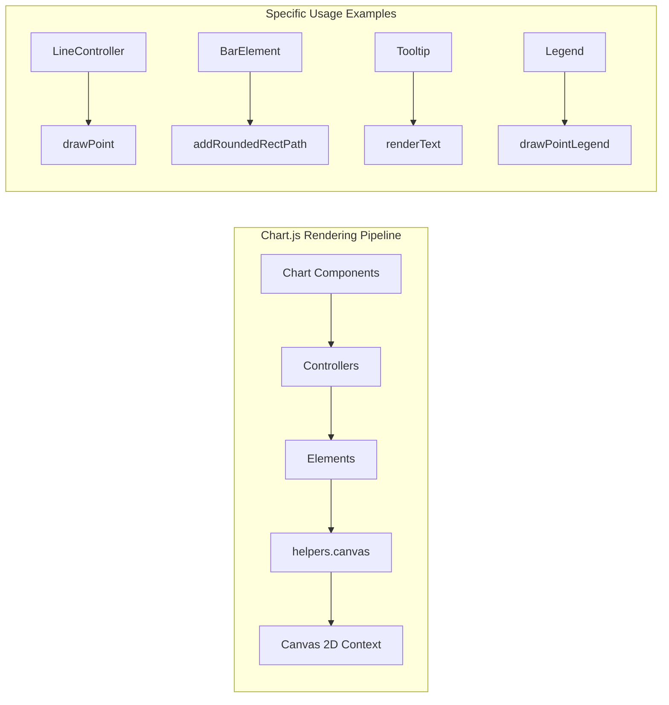
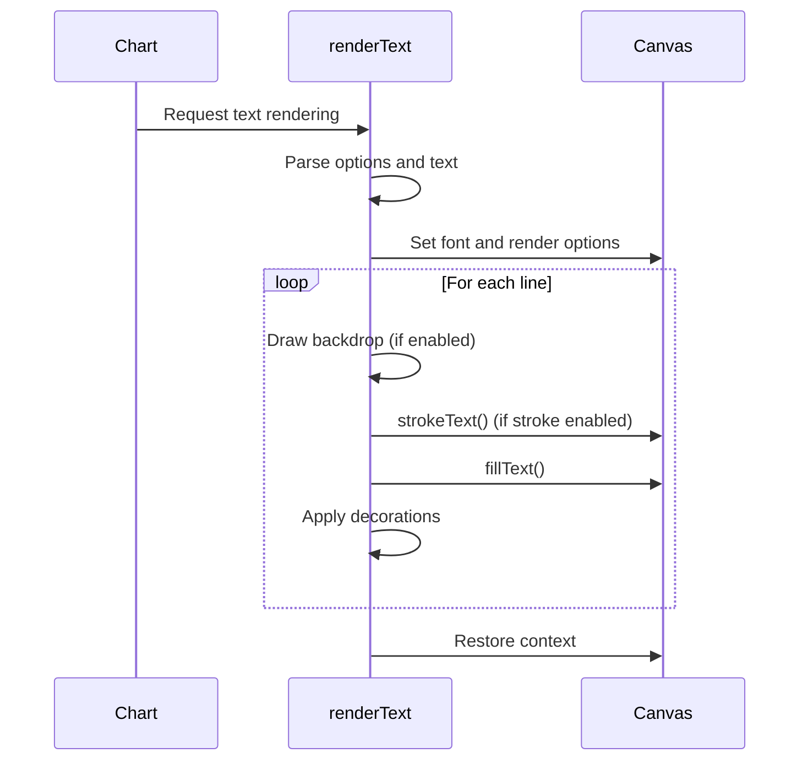
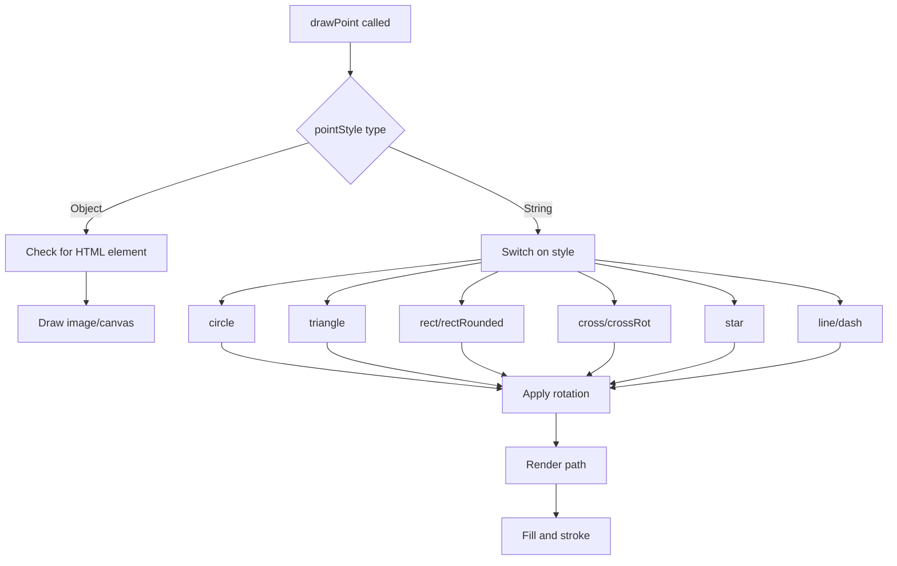

# helpers.canvas Module Documentation

## Overview

The `helpers.canvas` module provides essential canvas rendering utilities for Chart.js, offering low-level drawing operations, text rendering, point styling, and geometric calculations. This module serves as the foundation for all canvas-based visual rendering throughout the Chart.js library, providing both primitive drawing functions and higher-level convenience methods.

## Purpose and Core Functionality

The primary purpose of the helpers.canvas module is to:

- **Provide Canvas 2D Context Utilities**: Abstract common canvas operations with optimized implementations
- **Handle Text Rendering**: Offer advanced text rendering with styling options (strokes, decorations, backdrops)
- **Manage Point Styling**: Implement various point styles (circles, triangles, stars, custom images) used in data visualization
- **Optimize Performance**: Include caching mechanisms for text measurement and pixel alignment
- **Support Geometric Operations**: Provide clipping, area testing, and path drawing utilities

## Architecture and Component Relationships

### Module Architecture

```mermaid
graph TB
    subgraph "helpers.canvas Module"
        DC[DrawPointOptions]
        TF[Text Functions]
        PF[Point Functions]
        GF[Geometric Functions]
        CF[Canvas Functions]
        
        TF --> TF1[toFontString]
        TF --> TF2[_measureText]
        TF --> TF3[_longestText]
        TF --> TF4[renderText]
        
        PF --> PF1[drawPoint]
        PF --> PF2[drawPointLegend]
        
        GF --> GF1[_isPointInArea]
        GF --> GF2[clipArea]
        GF --> GF3[unclipArea]
        GF --> GF4[_steppedLineTo]
        GF --> GF5[_bezierCurveTo]
        GF --> GF6[addRoundedRectPath]
        
        CF --> CF1[_alignPixel]
        CF --> CF2[clearCanvas]
    end
    
    subgraph "Dependencies"
        T[Index Types]
        M[Math Helpers]
        C[Core Helpers]
    end
    
    DC -.-> T
    TF -.-> T
    TF -.-> C
    PF -.-> M
    GF -.-> T
    CF -.-> T
```



### Integration with Chart.js Ecosystem



## Core Components

### DrawPointOptions Interface

The `DrawPointOptions` interface defines the configuration for rendering styled points on the canvas:

```typescript
export interface DrawPointOptions {
  pointStyle: PointStyle;  // Style of the point (circle, triangle, star, etc.)
  rotation?: number;       // Rotation angle in degrees
  radius: number;          // Radius of the point
  borderWidth: number;     // Width of the border stroke
}
```

This interface is used throughout Chart.js for rendering data points, legend items, and interactive elements.

## Key Functions and Their Usage

### Text Rendering Functions

#### `toFontString(font: FontSpec)`
Converts a font specification object into a CSS font string for canvas operations.

**Usage Context**: Used internally by all text rendering functions to ensure consistent font formatting.

#### `_measureText(ctx, data, gc, longest, string)`
Measures text width with caching optimization to avoid repeated canvas measurements.

**Performance Impact**: Significantly improves rendering performance for charts with many text labels.

#### `_longestText(ctx, font, arrayOfThings, cache)`
Finds the longest text string in an array, with support for nested arrays and caching.

**Use Case**: Essential for calculating optimal layout dimensions for labels and legends.

#### `renderText(ctx, text, x, y, font, opts)`
Advanced text rendering with support for:
- Multi-line text
- Text decorations (strikethrough, underline)
- Backdrop rendering
- Stroke and fill combinations
- Rotation and translation

### Point Drawing Functions

#### `drawPoint(ctx, options, x, y)`
Renders a styled point at the specified coordinates using the provided options.

#### `drawPointLegend(ctx, options, x, y, w)`
Extended version of `drawPoint` with support for elliptical shapes (used in legend rendering).

**Supported Point Styles**:
- **Geometric Shapes**: circle, triangle, rect, rectRounded, rectRot
- **Cross Styles**: cross, crossRot
- **Complex Shapes**: star
- **Line Styles**: line, dash
- **Custom**: HTMLImageElement, HTMLCanvasElement
- **Disabled**: false (renders nothing)

### Geometric Utility Functions

#### `_isPointInArea(point, area, margin)`
Tests if a point lies within a rectangular area with optional margin tolerance.

**Application**: Critical for hit detection and interaction handling.

#### `clipArea(ctx, area)` / `unclipArea(ctx)`
Manages canvas clipping regions to constrain rendering to specific areas.

**Usage Pattern**: Used to ensure chart elements don't overflow their designated areas.

#### `_steppedLineTo(ctx, previous, target, flip, mode)`
Creates stepped line connections between points (useful for step charts).

**Modes**: 'middle', 'after', and default stepping patterns.

#### `_bezierCurveTo(ctx, previous, target, flip)`
Renders smooth Bézier curves between spline points.

#### `addRoundedRectPath(ctx, rect)`
Adds a rounded rectangle path to the current canvas path with customizable corner radii.

### Canvas Utility Functions

#### `_alignPixel(chart, pixel, width)`
Aligns pixel values to device pixel ratio boundaries to prevent anti-aliasing blur.

**Performance Impact**: Ensures crisp rendering on high-DPI displays.

#### `clearCanvas(canvas, ctx)`
Efficiently clears the entire canvas, accounting for current transform state.

## Data Flow and Process Flows

### Text Rendering Flow



### Point Drawing Flow



## Performance Optimizations

### Text Measurement Caching
The module implements sophisticated caching for text measurements:
- **Font-based cache invalidation**: Cache is cleared when font changes
- **Garbage collection**: Removes unused measurements to prevent memory growth
- **Nested array support**: Handles complex label structures efficiently

### Pixel Alignment
Automatic pixel alignment based on device pixel ratio ensures:
- **Crisp rendering**: Prevents anti-aliasing blur
- **Consistent appearance**: Across different display densities
- **Performance**: Reduces unnecessary sub-pixel calculations

## Integration with Other Modules

### Dependencies
- **[helpers.core](helpers.core.md)**: Provides utility functions (`isArray`, `isNullOrUndef`)
- **[helpers.math](helpers.math.md)**: Supplies mathematical constants (PI, TAU, etc.)
- **[types.index](types.index.md)**: TypeScript type definitions for all parameters
- **[types.geometric](types.geometric.md)**: Geometric type definitions

### Usage by Other Modules
- **[controllers](controllers.md)**: Use `drawPoint` for data point rendering
- **[elements](elements.md)**: Leverage geometric functions for shape rendering
- **[plugins](plugins.md)**: Utilize text rendering for labels and tooltips
- **[core](core.md)**: Depend on canvas utilities for chart rendering

## Best Practices and Usage Guidelines

### Performance Considerations
1. **Text Caching**: Reuse font strings and take advantage of built-in caching
2. **Batch Operations**: Group similar drawing operations when possible
3. **Clipping**: Use `clipArea` to limit rendering to necessary regions
4. **Pixel Alignment**: Always use `_alignPixel` for position calculations

### Common Patterns
```typescript
// Text rendering with backdrop
renderText(ctx, label, x, y, font, {
  backdrop: {
    left: x - padding,
    top: y - font.size,
    width: textWidth + 2 * padding,
    height: font.size + 2 * padding,
    color: 'rgba(0,0,0,0.8)'
  }
});

// Point drawing with rotation
drawPoint(ctx, {
  pointStyle: 'star',
  rotation: 45,
  radius: 6,
  borderWidth: 2
}, x, y);

// Clipped rendering
clipArea(ctx, chartArea);
// ... drawing operations
unclipArea(ctx);
```

## Error Handling and Edge Cases

The module includes robust handling for:
- **Invalid radius values**: NaN or negative radius values are ignored
- **Missing canvas context**: Graceful degradation when context is unavailable
- **Invalid font specifications**: Returns null for incomplete font objects
- **Undefined/null text**: Skips rendering for invalid text content

## Browser Compatibility

All functions are designed to work across modern browsers with special attention to:
- **Canvas 2D API**: Uses widely supported features
- **TextMetrics**: Leverages extended TextMetrics where available
- **High-DPI displays**: Automatic devicePixelRatio handling
- **Context state**: Proper save/restore patterns to prevent state leakage

This module forms the rendering foundation of Chart.js, providing the essential building blocks for creating rich, interactive data visualizations while maintaining optimal performance across different platforms and use cases.