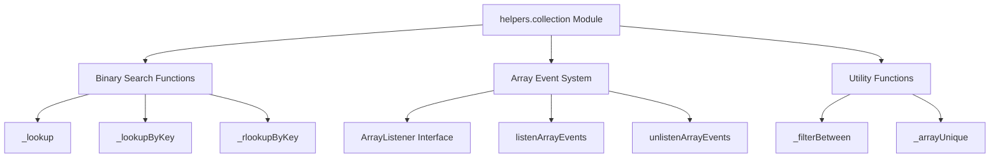
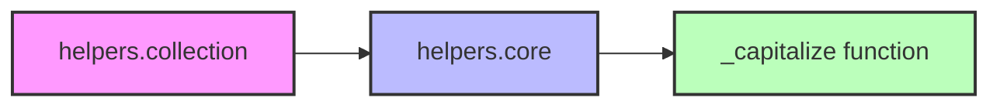
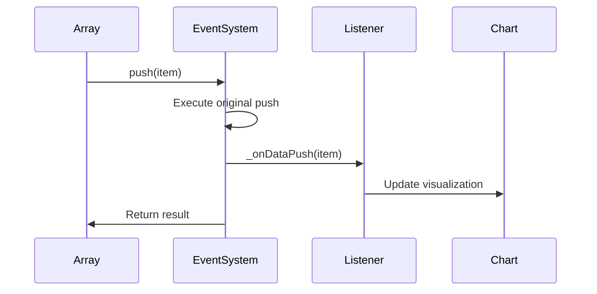
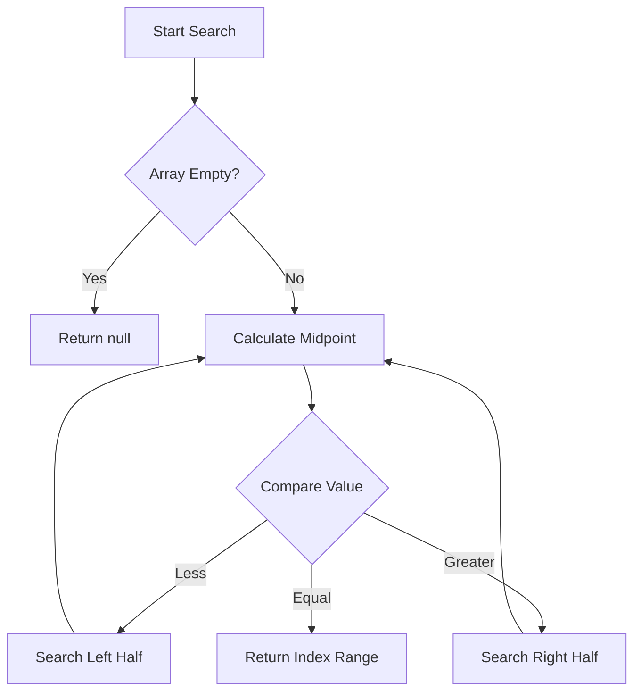
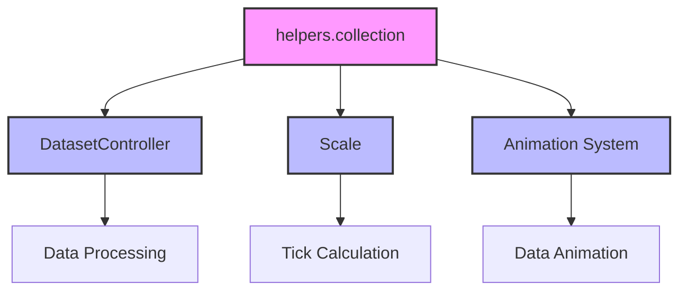
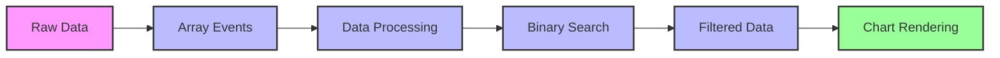
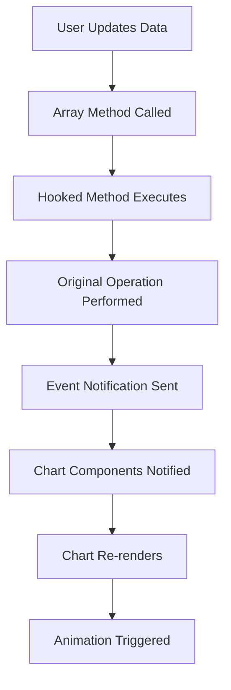
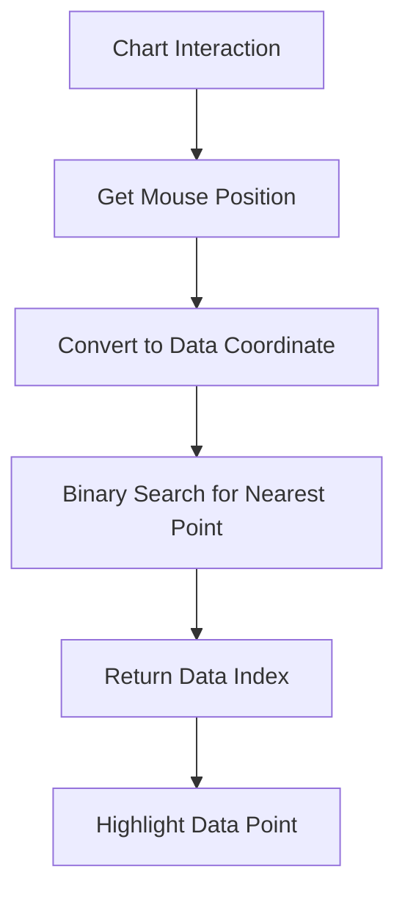

# helpers.collection Module Documentation

## Overview

The `helpers.collection` module provides essential utility functions for array manipulation, binary search operations, and array event listening. This module serves as a foundational component in the Chart.js ecosystem, offering efficient data structure operations that are critical for chart data processing and management.

## Purpose and Core Functionality

The module specializes in three main areas:

1. **Binary Search Operations**: Efficient searching in sorted arrays and objects
2. **Array Event Listening**: Reactive array manipulation with event hooks
3. **Array Utilities**: Common array operations like filtering and deduplication

These utilities are particularly important for handling large datasets in charts, where performance is crucial for smooth user interactions and real-time data updates.

## Architecture

### Component Structure



### Dependencies



The module depends on the [`helpers.core`](helpers.core.md) module for the `_capitalize` function, which is used to transform method names for the array event system.

## Core Components

### ArrayListener Interface

The `ArrayListener` interface defines the contract for objects that want to listen to array manipulation events:

```typescript
interface ArrayListener<T> {
  _onDataPush?(...item: T[]): void;
  _onDataPop?(): void;
  _onDataShift?(): void;
  _onDataSplice?(index: number, deleteCount: number, ...items: T[]): void;
  _onDataUnshift?(...item: T[]): void;
}
```

### Binary Search Functions

#### `_lookup`
Performs binary search on sorted arrays with customizable comparison function.

#### `_lookupByKey`
Searches objects in an array by a specific key value, useful for finding data points in chart datasets.

#### `_rlookupByKey`
Reverse binary search for finding the rightmost occurrence of a value.

### Array Event System

#### `listenArrayEvents`
Hooks into array mutation methods (`push`, `pop`, `shift`, `splice`, `unshift`) and notifies listeners after modifications. This is crucial for reactive chart updates when data changes.

#### `unlistenArrayEvents`
Removes event listeners and cleans up attached properties when no listeners remain.

## Data Flow

### Array Event Flow



### Binary Search Flow



## Integration with Chart.js Ecosystem

### Relationship to Core Components



The collection helpers are used throughout the Chart.js system:

- **[`DatasetController`](core.md#dataset-controller)**: Uses binary search for efficient data point lookup during rendering and interaction
- **[`Scale`](core.md#scale-system)**: Utilizes `_filterBetween` for determining visible data ranges
- **[Animation System](core.md#animation-system)**: Leverages array events for reactive data updates during animations

### Usage in Data Processing



## Process Flows

### Data Update with Array Events



### Efficient Data Lookup



## Performance Considerations

### Binary Search Optimization
- O(log n) time complexity for data lookup
- Essential for large datasets (thousands of points)
- Reduces rendering time for data-intensive charts

### Array Event System
- Minimal overhead when no listeners attached
- Only hooks methods when listeners are present
- Automatic cleanup prevents memory leaks

### Memory Management
- `_arrayUnique` uses Set for efficient deduplication
- Event listeners are properly cleaned up
- No circular references in hooked arrays

## Best Practices

### When to Use Binary Search
- Sorted data arrays
- Frequent lookup operations
- Large datasets where O(n) is prohibitive

### Array Event Usage
- Listen to data changes for reactive updates
- Always unlisten when component is destroyed
- Use for coordinating multiple chart components

### Performance Tips
- Use `_filterBetween` for viewport-based rendering
- Implement `_arrayUnique` before processing duplicate data
- Consider array event overhead for high-frequency updates

## Related Documentation

- [`helpers.core`](helpers.core.md) - Core utility functions including string manipulation
- [`core.datasetController`](core.md#dataset-controller) - Uses collection helpers for data management
- [`core.scale`](core.md#scale-system) - Leverages binary search for tick calculation
- [`core.animation`](core.md#animation-system) - Integrates with array events for smooth transitions

## API Reference

### Functions

#### `_lookup(table, value, cmp?)`
Performs binary search on a sorted array.

**Parameters:**
- `table`: Sorted array to search
- `value`: Value to find
- `cmp`: Optional comparison function

**Returns:** Object with `lo` and `hi` indices

#### `_lookupByKey(table, key, value, last?)`
Searches objects by key value.

**Parameters:**
- `table`: Array of objects
- `key`: Property name to search by
- `value`: Value to find
- `last`: Whether to find last occurrence

**Returns:** Object with `lo` and `hi` indices

#### `listenArrayEvents(array, listener)`
Hooks array methods for event notification.

**Parameters:**
- `array`: Array to hook
- `listener`: Object implementing ArrayListener interface

#### `unlistenArrayEvents(array, listener)`
Removes array event hooks.

**Parameters:**
- `array`: Array with hooks
- `listener`: Listener to remove

#### `_filterBetween(values, min, max)`
Filters array to values within range.

**Parameters:**
- `values`: Sorted array
- `min`: Minimum value
- `max`: Maximum value

**Returns:** Filtered array

#### `_arrayUnique(items)`
Removes duplicates from array.

**Parameters:**
- `items`: Array with potential duplicates

**Returns:** Array with unique values