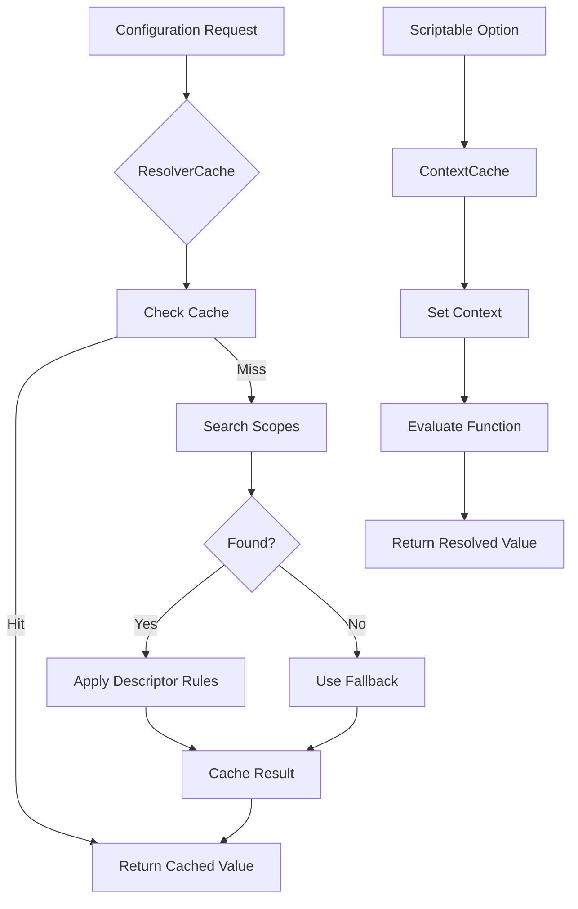
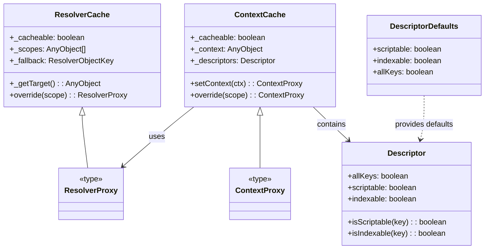
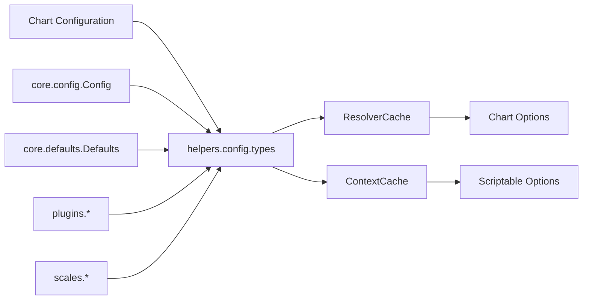
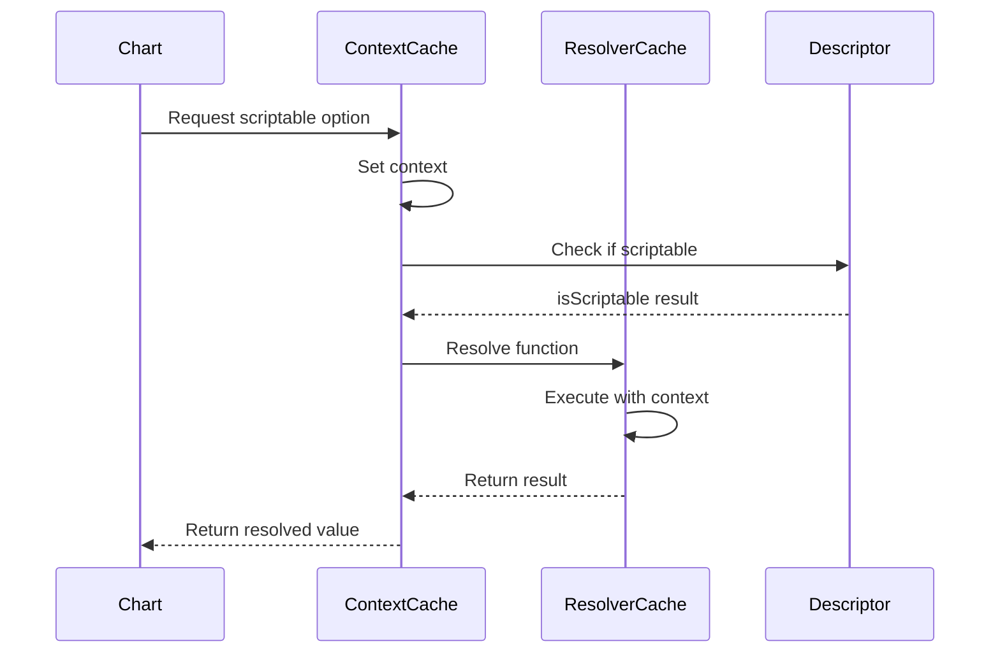

# helpers.config.types Module Documentation

## Introduction

The `helpers.config.types` module provides the foundational type definitions and interfaces for Chart.js's configuration resolution system. This module is essential for handling dynamic configuration resolution, context-aware property access, and scriptable options within the Chart.js library. It defines the core types that enable flexible configuration management across charts, scales, and plugins.

## Module Overview

The module exports four main interfaces that work together to create a powerful configuration resolution system:

- **ResolverCache**: Manages cached configuration resolution with fallback mechanisms
- **Descriptor**: Defines property access rules (scriptable, indexable, allKeys)
- **ContextCache**: Handles context-aware configuration resolution
- **DescriptorDefaults**: Provides default values for descriptor properties

## Core Components

### ResolverCache Interface

The `ResolverCache` interface is the backbone of the configuration resolution system. It manages a hierarchical scope chain for resolving configuration properties with caching capabilities.

```typescript
export interface ResolverCache<
  T extends AnyObject[] = AnyObject[],
  R extends AnyObject[] = T
> {
  [Symbol.toStringTag]: 'Object';
  _cacheable: boolean;
  _scopes: T;
  _rootScopes: T | R;
  _fallback: ResolverObjectKey;
  _keys?: string[];
  _scriptable?: boolean;
  _indexable?: boolean;
  _allKeys?: boolean;
  _storage?: T[number];
  _getTarget(): T[number];
  override<S extends AnyObject>(scope: S): ResolverProxy<(T[number] | S)[], T | R>
}
```

**Key Properties:**
- `_cacheable`: Controls whether resolution results are cached
- `_scopes`: Array of configuration objects to search through
- `_rootScopes`: Root scopes for fallback resolution
- `_fallback`: Fallback key for property resolution
- `_keys`: Cached keys for performance optimization
- `_scriptable`/_`indexable`: Control property access behavior

### ResolverProxy Type

```typescript
export type ResolverProxy<
  T extends AnyObject[] = AnyObject[],
  R extends AnyObject[] = T
> = Merge<T[number]> & ResolverCache<T, R>
```

The `ResolverProxy` type combines the resolved configuration object with the resolver cache, providing both the merged configuration and resolution capabilities.

### Descriptor Interface

The `Descriptor` interface defines rules for property access within the configuration system:

```typescript
export interface Descriptor {
  allKeys: boolean;
  scriptable: boolean;
  indexable: boolean;
  isScriptable(key: string): boolean;
  isIndexable(key: string): boolean;
}
```

**Key Methods:**
- `isScriptable(key)`: Determines if a property can be scriptable (function-based)
- `isIndexable(key)`: Determines if a property can be indexed (array-based)

### ContextCache Interface

The `ContextCache` interface extends the resolution system with context awareness:

```typescript
export interface ContextCache<
  T extends AnyObject[] = AnyObject[],
  R extends AnyObject[] = T
> {
  _cacheable: boolean;
  _proxy: ResolverProxy<T, R>;
  _context: AnyObject;
  _subProxy: ResolverProxy<T, R>;
  _stack: Set<string>;
  _descriptors: Descriptor
  setContext(ctx: AnyObject): ContextProxy<T, R>
  override<S extends AnyObject>(scope: S): ContextProxy<(T[number] | S)[], T | R>
}
```

**Key Properties:**
- `_context`: The current context for scriptable options
- `_stack`: Prevents circular references during resolution
- `_descriptors`: Property access rules for this context

### ContextProxy Type

```typescript
export type ContextProxy<
  T extends AnyObject[] = AnyObject[],
  R extends AnyObject[] = T
> = Merge<T[number]> & ContextCache<T, R>
```

## Architecture

### Configuration Resolution Flow



### Component Relationships



## Integration with Chart.js System

### Configuration Resolution in Charts

The helpers.config.types module integrates with the broader Chart.js configuration system:



### Data Flow for Scriptable Options



## Usage Patterns

### Basic Configuration Resolution

The module enables hierarchical configuration resolution where properties are searched through multiple scope levels:

1. **Dataset level** - Specific dataset configurations
2. **Chart level** - Chart-wide configurations  
3. **Defaults level** - Library default configurations
4. **Fallback** - Final fallback values

### Scriptable Options

Scriptable options are functions that receive a context parameter and return dynamic values:

```typescript
// Example of scriptable option resolution
const color = (context) => {
  if (context.parsed.y > 50) return 'red';
  return 'blue';
};
```

### Context-Aware Resolution

The ContextCache enables resolution based on the current chart context, including:
- Data point values
- Dataset information
- Chart state
- Interaction state

## Performance Considerations

### Caching Strategy

- **ResolverCache**: Caches resolved property values to avoid repeated scope traversal
- **ContextCache**: Maintains context-specific caches for scriptable options
- **Key optimization**: Uses `_keys` array to optimize property enumeration

### Memory Management

- **Storage optimization**: Optional `_storage` property for efficient value access
- **Stack tracking**: Prevents circular references during complex resolutions
- **Cache invalidation**: Controlled via `_cacheable` flag

## Dependencies

This module has minimal dependencies:

- `../types/basic.js`: Provides `AnyObject` type definition
- `../types/utils.js`: Provides `Merge` utility type

## Related Modules

The helpers.config.types module works closely with:

- [core.config](core.config.md): Core configuration management
- [core.defaults](core.defaults.md): Default value handling
- [helpers.core](helpers.core.md): Core helper utilities including `MergeOptions`

## Type Safety

The module uses TypeScript generics extensively to maintain type safety:

- **Generic constraints**: `T extends AnyObject[]` ensures proper object structure
- **Type merging**: `Merge<T[number]>` combines multiple configuration objects
- **Flexible typing**: Supports both strict and loose typing scenarios

## Best Practices

1. **Use appropriate descriptors**: Set `scriptable` and `indexable` flags based on expected usage
2. **Leverage caching**: Enable caching for frequently accessed configurations
3. **Handle fallbacks**: Always provide meaningful fallback values
4. **Context awareness**: Use ContextCache for dynamic, data-driven configurations
5. **Type safety**: Leverage TypeScript generics for better type inference

## Conclusion

The helpers.config.types module provides the essential infrastructure for Chart.js's flexible configuration system. By defining clear interfaces for resolution caching, context management, and property access rules, it enables powerful features like scriptable options, hierarchical configuration, and dynamic property resolution while maintaining excellent performance through strategic caching.