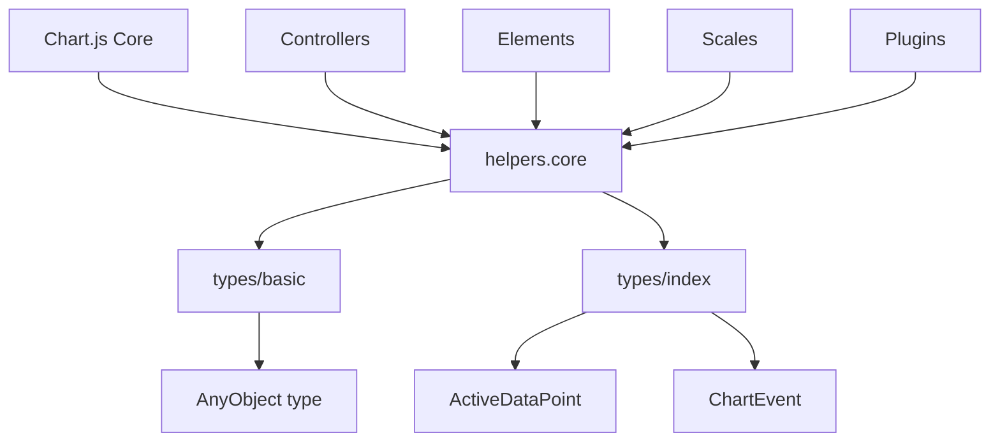
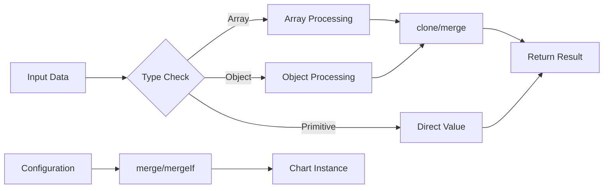
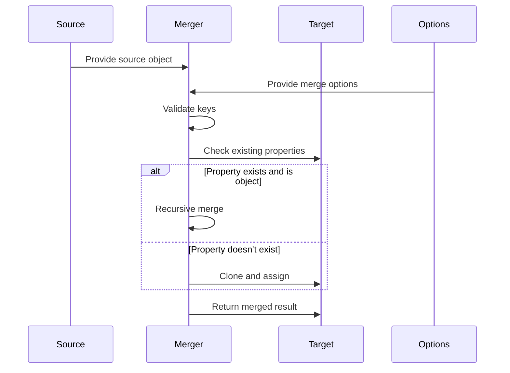

# helpers.core Module Documentation

## Introduction

The `helpers.core` module provides fundamental utility functions and type checking utilities that form the backbone of the Chart.js library. This module contains essential helper functions for type validation, object manipulation, merging, and other core operations that are used throughout the entire Chart.js ecosystem.

## Module Overview

The helpers.core module is a collection of pure utility functions that provide:
- **Type checking utilities** for runtime type validation
- **Object manipulation functions** for deep cloning and merging
- **Array and object iteration helpers** with performance optimizations
- **Value validation and default handling** functions
- **Object key resolution** for nested property access
- **Event handling utilities** for chart interactions

## Core Components

### MergeOptions Interface
```typescript
export interface MergeOptions {
  merger?: (key: string, target: AnyObject, source: AnyObject, options?: AnyObject) => void;
}
```

The `MergeOptions` interface defines the configuration options for the merge operations, allowing custom merger functions to be specified for specialized merging behavior.

## Key Functions

### Type Checking Utilities

#### `isNullOrUndef(value: unknown): value is null | undefined`
Tests if a value is null or undefined.

#### `isArray<T = unknown>(value: unknown): value is T[]`
Tests if a value is an array, including typed arrays.

#### `isObject(value: unknown): value is AnyObject`
Tests if a value is a plain object (excluding null).

#### `isFinite(value: unknown): value is number`
Tests if a value is a finite number.

#### `isFunction(value: unknown): value is (...args: any[]) => any`
Tests if a value is a function.

### Value Handling Functions

#### `valueOrDefault<T>(value: T | undefined, defaultValue: T)`
Returns the value if defined, otherwise returns the default value.

#### `finiteOrDefault(value: unknown, defaultValue: number)`
Returns the value if finite, otherwise returns the default value.

#### `toPercentage(value: number | string, dimension: number)`
Converts a value to a percentage (0-1) based on the provided dimension.

#### `toDimension(value: number | string, dimension: number)`
Converts a value to an absolute dimension, handling percentage strings.

### Object Manipulation

#### `clone<T>(source: T): T`
Creates a deep copy of the source object without maintaining references.

#### `merge<T>(target: T, source: AnyObject[], options?: MergeOptions): AnyObject`
Recursively deep copies source properties into target with customizable merging behavior.

#### `mergeIf<T>(target: T, source: AnyObject[]): AnyObject`
Merges source properties into target only if they don't already exist in target.

### Iteration Utilities

#### `each<T, TA>(loopable: T[] | Record<string, T>, fn: (this: TA, v: T, i: any) => void, thisArg?: TA, reverse?: boolean): void`
Iterates over arrays or objects with optional reverse iteration and context binding.

#### `callback<T extends (this: TA, ...restArgs: unknown[]) => R, TA, R>(fn: T | undefined, args: unknown[], thisArg?: TA): R | undefined`
Safely calls a function with the provided arguments and optional context.

### Object Key Resolution

#### `resolveObjectKey(obj: AnyObject, key: string): any`
Resolves nested object properties using dot notation (e.g., "data.value").

### Event Handling

#### `_isClickEvent(e: ChartEvent): boolean`
Determines if an event is a click-related event (mouseup, click, or contextmenu).

### Utility Functions

#### `noop(): void`
An empty function used for optional callbacks.

#### `uid(): number`
Returns a sequentially generated unique ID.

#### `setsEqual<T>(a: Set<T>, b: Set<T>): boolean`
Compares two sets for equality.

#### `_capitalize(str: string): string`
Capitalizes the first letter of a string.

## Architecture

### Module Dependencies



### Function Flow Diagram



### Data Flow for Merge Operations



## Integration with Chart.js Ecosystem

### Configuration System Integration

The helpers.core module is extensively used by the [configuration-system](configuration-system.md) for:
- Merging user-provided configuration with defaults
- Deep cloning configuration objects to prevent reference issues
- Validating configuration values and applying defaults

### Registry System Integration

The [registry-system](registry-system.md) relies on helpers.core for:
- Merging registry entries
- Type checking registered components
- Object manipulation for registry operations

### Scale System Integration

The [scale-system](scale-system.md) uses helpers.core functions for:
- Merging scale configurations
- Type validation for scale options
- Object cloning for scale instances

### Dataset Controller Integration

The [dataset-controller](dataset-controller.md) module utilizes helpers.core for:
- Merging dataset configurations
- Type checking data points
- Object manipulation for dataset operations

## Usage Examples

### Basic Type Checking
```typescript
import { isArray, isObject, isNullOrUndef } from 'src/helpers/helpers.core';

const data = [1, 2, 3];
if (isArray(data)) {
  console.log('Data is an array');
}

const config = { type: 'line' };
if (isObject(config)) {
  console.log('Config is an object');
}
```

### Configuration Merging
```typescript
import { merge, mergeIf } from 'src/helpers/helpers.core';

const defaultConfig = { responsive: true, maintainAspectRatio: true };
const userConfig = { responsive: false };

// Merge with override
const finalConfig = merge(defaultConfig, userConfig);
// Result: { responsive: false, maintainAspectRatio: true }

// Merge only if not defined
const finalConfig2 = mergeIf(defaultConfig, userConfig);
// Result: { responsive: true, maintainAspectRatio: true }
```

### Object Cloning
```typescript
import { clone } from 'src/helpers/helpers.core';

const original = { data: [1, 2, 3], nested: { value: 42 } };
const copy = clone(original);

// Modify copy without affecting original
copy.data.push(4);
copy.nested.value = 100;
```

### Nested Property Access
```typescript
import { resolveObjectKey } from 'src/helpers/helpers.core';

const data = {
  datasets: [{
    data: [10, 20, 30]
  }]
};

const firstDatasetData = resolveObjectKey(data, 'datasets.0.data');
// Result: [10, 20, 30]
```

## Performance Considerations

### Iteration Performance
The `each` function includes performance optimizations:
- Uses native for loops for better performance
- Avoids function calls in tight loops when possible
- Supports reverse iteration for specific use cases

### Memory Management
- The `clone` function creates deep copies to prevent reference issues
- Merge operations modify the target object in-place to reduce memory allocation
- Key resolvers are cached to avoid repeated string parsing

### Type Checking Optimizations
- Uses native Array.isArray when available
- Employs Object.prototype.toString for reliable type detection
- Caches frequently used type check results

## Error Handling

The module includes several safety mechanisms:
- Validates object keys to prevent prototype pollution (`isValidKey` function)
- Handles undefined and null values gracefully
- Provides fallback behaviors for invalid inputs

## Best Practices

1. **Use appropriate merge function**: Choose between `merge` and `mergeIf` based on whether you want to override existing properties
2. **Leverage type checking**: Use the provided type checking functions instead of manual type comparisons
3. **Consider performance**: Use the `each` function for iteration when the loopable type is unknown, but prefer native loops in performance-critical code
4. **Handle defaults properly**: Use `valueOrDefault` and `finiteOrDefault` for handling optional values
5. **Clone when necessary**: Use `clone` to prevent unintended mutations of shared objects

## Related Modules

- [configuration-system](configuration-system.md) - Uses helpers.core for configuration management
- [registry-system](registry-system.md) - Relies on helpers.core for registry operations
- [scale-system](scale-system.md) - Utilizes helpers.core for scale configuration
- [dataset-controller](dataset-controller.md) - Depends on helpers.core for dataset handling
- [animation-system](animation-system.md) - Uses helpers.core for animation configuration

## API Reference

For detailed API documentation, see the TypeScript definitions in the source code. The module exports all functions at the top level, making them easily accessible throughout the Chart.js library.