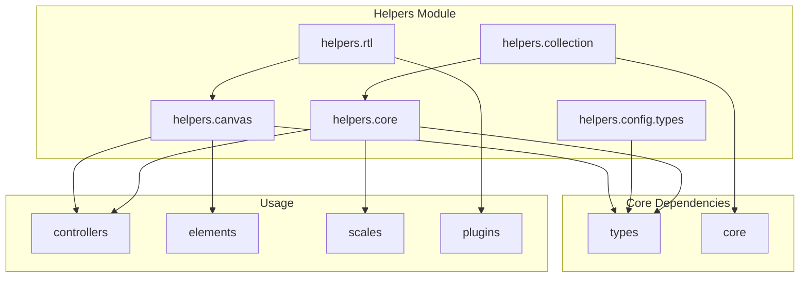

# Helpers Module Documentation

## Overview

The helpers module is a comprehensive utility library that provides essential functionality for Chart.js. It serves as the foundation layer, offering a wide range of utility functions and helper classes that support various aspects of chart rendering, configuration management, data processing, and platform-specific operations.

## Purpose

The helpers module acts as a central utility hub that:
- Provides canvas drawing utilities for rendering chart elements
- Manages data collection and array operations
- Handles configuration resolution and merging
- Offers core utility functions for type checking and object manipulation
- Supports right-to-left (RTL) text rendering
- Enables cross-platform compatibility

## Architecture



## Sub-modules

### 1. [Canvas Helpers](helpers.canvas.md)
Provides comprehensive canvas drawing utilities including:
- Point rendering with various styles (circle, triangle, star, cross, etc.)
- Text rendering with advanced formatting options
- Canvas manipulation functions (clipping, pixel alignment)
- Geometric shape drawing (rounded rectangles, bezier curves)
- Font and typography utilities

**Key Components:**
- `DrawPointOptions` - Configuration interface for point rendering

### 2. [Collection Helpers](helpers.collection.md)
Manages data collection operations and array manipulation:
- Binary search algorithms for efficient data lookup
- Array event listening and notification system
- Data filtering and unique value extraction
- Collection management utilities

**Key Components:**
- `ArrayListener` - Interface for array change notifications

### 3. [Configuration Types](helpers.config.types.md)
Defines type-safe configuration resolution system:
- Resolver cache interfaces for efficient property resolution
- Context proxy types for configuration management
- Descriptor interfaces for type validation
- Merge and override functionality

**Key Components:**
- `ResolverCache` - Caching mechanism for property resolution
- `Descriptor` - Type validation and property descriptors
- `ContextCache` - Context-aware configuration caching
- `DescriptorDefaults` - Default descriptor settings

### 4. [Core Helpers](helpers.core.md)
Provides fundamental utility functions:
- Type checking and validation utilities
- Object merging and cloning operations
- Function callback management
- Object key resolution and manipulation
- Element comparison utilities

**Key Components:**
- `MergeOptions` - Configuration for object merging operations

### 5. [RTL Helpers](helpers.rtl.md)
Supports right-to-left text rendering and layout:
- RTL adapter interface for coordinate transformation
- Text direction management
- Bidirectional text support
- Platform-specific RTL handling

**Key Components:**
- `RTLAdapter` - Interface for RTL coordinate transformation

## Key Features

### Cross-Platform Compatibility
The helpers module provides abstraction layers that enable Chart.js to work across different platforms (DOM, Canvas, Node.js) through platform-specific implementations while maintaining a consistent API.

### Performance Optimization
- Efficient binary search algorithms for large datasets
- Caching mechanisms for configuration resolution
- Canvas optimization techniques (pixel alignment, text measurement caching)
- Memory management through garbage collection

### Type Safety
Comprehensive TypeScript support with:
- Strict type definitions for all utility functions
- Generic interfaces for flexible data handling
- Type-safe configuration merging and resolution
- Compile-time error detection

### Extensibility
The modular design allows for:
- Easy addition of new helper functions
- Plugin-friendly architecture
- Custom merger functions for specialized use cases
- Configurable behavior through options objects

## Integration with Other Modules

The helpers module serves as a foundational layer that other Chart.js modules depend on:

- **Controllers**: Use canvas helpers for rendering chart elements and core helpers for data processing
- **Elements**: Leverage canvas utilities for drawing geometric shapes and handling visual properties
- **Scales**: Utilize collection helpers for data lookup and core helpers for configuration merging
- **Plugins**: Depend on various helper functions for plugin-specific functionality

## Usage Patterns

### Canvas Operations
```typescript
// Drawing points with different styles
drawPoint(ctx, { pointStyle: 'star', radius: 5, borderWidth: 2 }, x, y);

// Rendering text with advanced options
renderText(ctx, 'Chart Title', x, y, font, { color: 'red', backdrop: true });
```

### Data Processing
```typescript
// Binary search for efficient data lookup
const result = _lookup(sortedData, targetValue);

// Array event listening
listenArrayEvents(dataArray, listener);
```

### Configuration Management
```typescript
// Merging configuration objects
const mergedConfig = merge(defaultConfig, userConfig, { merger: customMerger });

// Resolving nested object properties
const value = resolveObjectKey(config, 'scales.x.grid.display');
```

## Best Practices

1. **Performance**: Use binary search functions for large datasets instead of linear search
2. **Memory Management**: Always unlisten array events when they're no longer needed
3. **Type Safety**: Leverage TypeScript interfaces for configuration objects
4. **Canvas Optimization**: Use pixel alignment functions to avoid anti-aliasing issues
5. **Cross-Platform**: Test RTL functionality when developing internationally-used charts

## Dependencies

The helpers module has minimal external dependencies, primarily relying on:
- Type definitions from the [types module](types.md)
- Core Chart.js interfaces and enums
- Platform-specific implementations for canvas operations

This design ensures that the helpers module remains lightweight and can be used independently or as part of the larger Chart.js ecosystem.