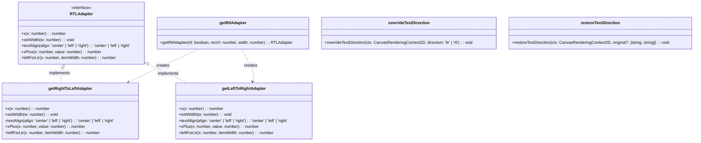
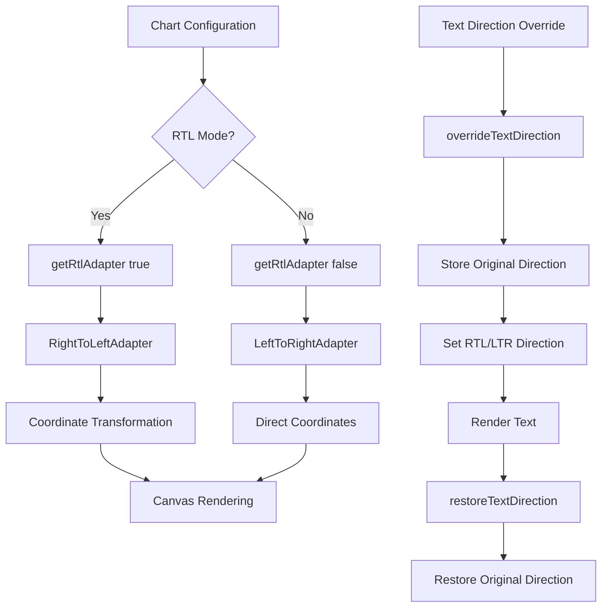
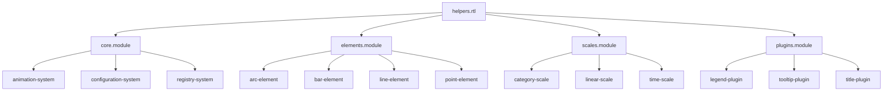
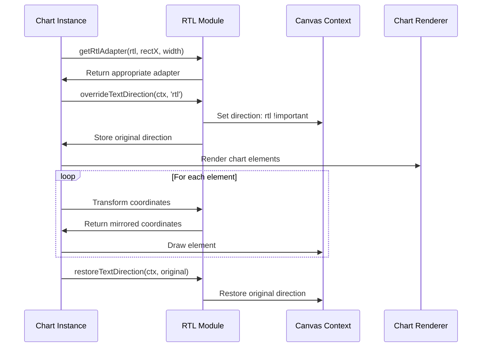

# helpers.rtl Module Documentation

## Overview

The `helpers.rtl` module provides essential functionality for handling Right-to-Left (RTL) text direction support in Chart.js. This module enables charts to properly display and position elements for languages that read from right to left (such as Arabic, Hebrew, Persian, and Urdu), ensuring that visual elements are correctly mirrored and positioned.

## Purpose and Core Functionality

The module serves as a bridge between LTR (Left-to-Right) and RTL rendering contexts by providing:

1. **Coordinate Transformation**: Adapts x-coordinates and positioning logic for RTL layouts
2. **Text Alignment Management**: Handles proper text alignment in RTL contexts
3. **Canvas Direction Control**: Manages CSS direction properties for canvas elements
4. **Layout Mirroring**: Provides the mathematical foundation for mirroring chart layouts

## Architecture

### Component Structure



### Data Flow Architecture



## Core Components

### RTLAdapter Interface

The `RTLAdapter` interface defines the contract for coordinate transformation and text alignment handling:

- **`x(x: number): number`**: Transforms x-coordinates based on text direction
- **`setWidth(w: number): void`**: Updates the width context for transformations
- **`textAlign(align)`: Transforms text alignment for RTL contexts
- **`xPlus(x, value)`: Performs addition/subtraction based on text direction
- **`leftForLtr(x, itemWidth)`: Calculates left position for LTR items in RTL context

### Adapter Implementations

#### RightToLeftAdapter

Implements RTL-specific coordinate transformations:

```typescript
// Mirrors x-coordinates across the canvas center
x(x) => rectX + rectX + width - x

// Inverts text alignment (right becomes left, left becomes right)
textAlign(align) => align === 'right' ? 'left' : 'right'

// Inverts addition for RTL layout
xPlus(x, value) => x - value
```

#### LeftToRightAdapter

Provides identity transformations for standard LTR rendering:

```typescript
// Pass-through for LTR
x(x) => x
textAlign(align) => align
xPlus(x, value) => x + value
```

### Text Direction Management

#### overrideTextDirection

Temporarily sets the canvas direction property while preserving the original state:

```typescript
// Stores original direction and priority
original = [style.getPropertyValue('direction'), style.getPropertyPriority('direction')]

// Sets new direction with high priority
style.setProperty('direction', direction, 'important')
```

#### restoreTextDirection

Restores the original canvas direction state:

```typescript
// Restores original direction and priority
ctx.canvas.style.setProperty('direction', original[0], original[1])
```

## Integration with Chart.js Ecosystem

### Dependency Relationships



### Usage Patterns

The RTL module is typically used in the following scenarios:

1. **Chart Layout**: Positioning chart elements (title, legend, axes)
2. **Text Rendering**: Aligning labels, tooltips, and titles
3. **Coordinate Systems**: Transforming data point positions
4. **Plugin Integration**: Ensuring plugins respect RTL layout

## Process Flow

### RTL Chart Rendering Process



## Key Features

### 1. Coordinate Mirroring

The module provides mathematical transformations to mirror coordinates across the vertical axis, ensuring that chart elements appear in the correct positions for RTL layouts.

### 2. Text Alignment Inversion

Automatically inverts text alignment properties (left becomes right, right becomes left) while preserving center alignment.

### 3. Canvas State Management

Safely manages canvas direction properties without affecting the global state, using a restore mechanism to return to the original configuration.

### 4. Adapter Pattern Implementation

Uses the adapter pattern to provide a consistent interface regardless of text direction, allowing the rest of the Chart.js codebase to remain direction-agnostic.

## Best Practices

### Usage Guidelines

1. **Always Restore State**: Use `restoreTextDirection` after `overrideTextDirection`
2. **Adapter Caching**: Cache RTLAdapter instances when possible to avoid repeated creation
3. **Coordinate Transformation**: Apply transformations at the rendering level, not data level
4. **Testing**: Test with both LTR and RTL configurations

### Performance Considerations

- Adapter creation is lightweight but should be minimized
- Text direction changes affect canvas performance, use sparingly
- Coordinate transformations are applied per-element during rendering

## Related Documentation

- [core.module](core.md) - Core Chart.js functionality
- [elements.module](elements.md) - Chart element rendering
- [scales.module](scales.md) - Scale and axis handling
- [plugins.module](plugins.md) - Plugin system integration

## Conclusion

The `helpers.rtl` module is a critical component for internationalization support in Chart.js, providing the necessary abstractions to handle RTL text direction without complicating the core rendering logic. Its adapter-based design ensures that RTL support can be seamlessly integrated throughout the Chart.js ecosystem while maintaining clean separation of concerns.