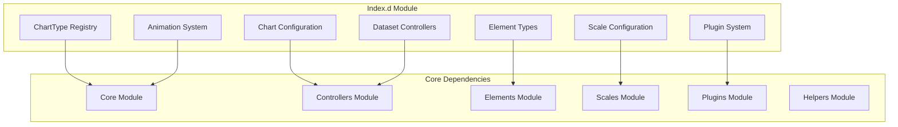
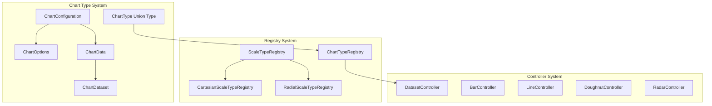
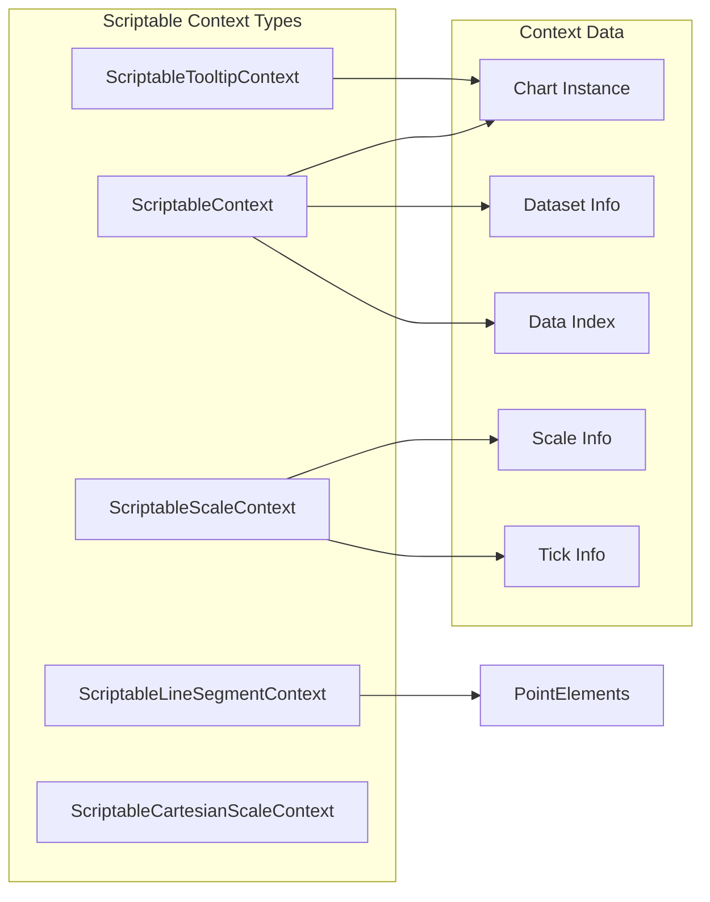
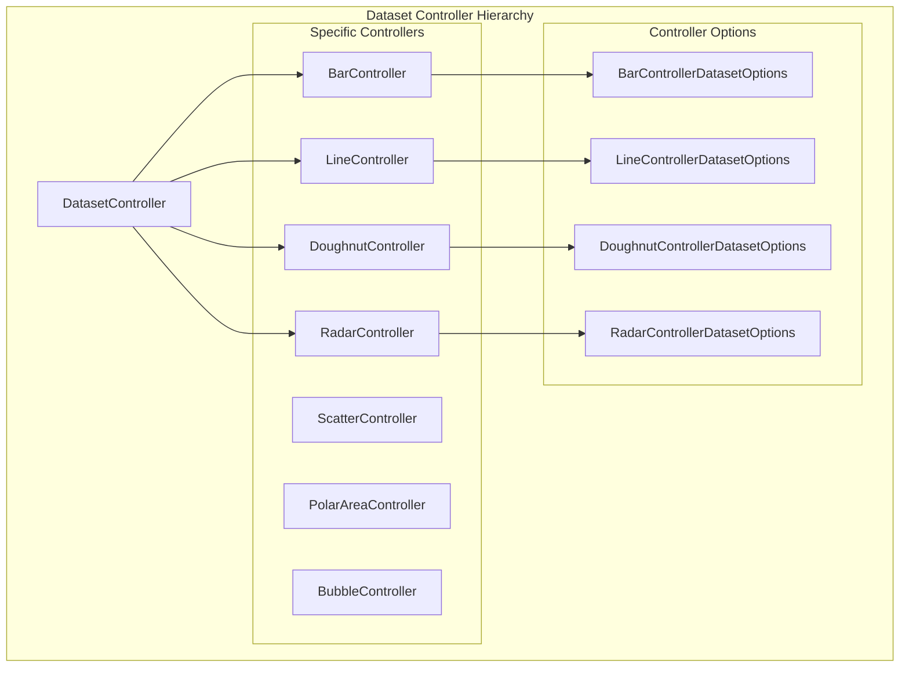
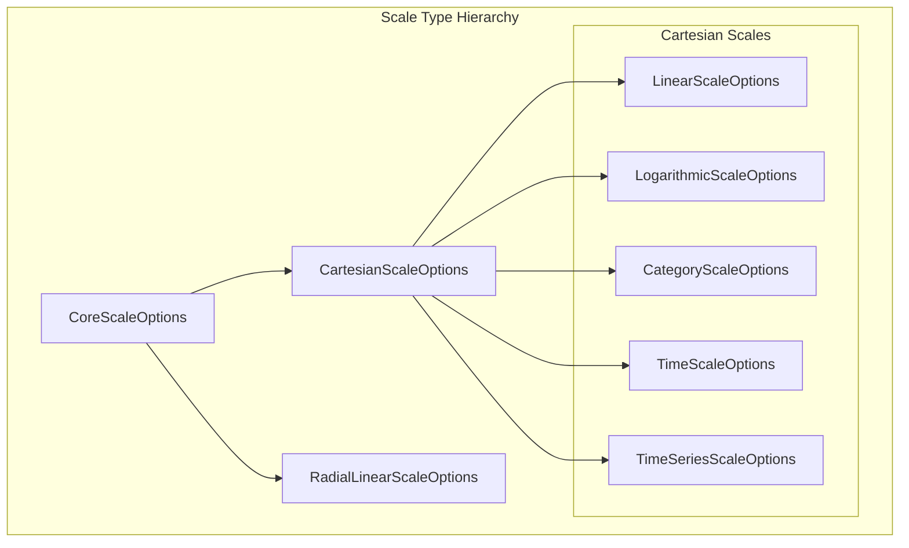
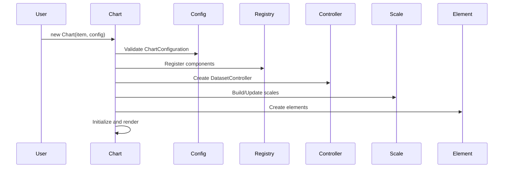
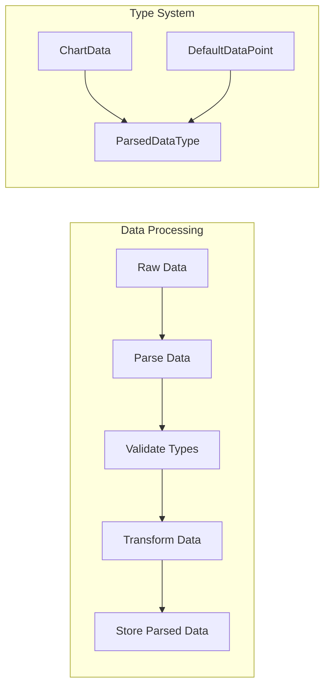

# Index.d Module Documentation

## Overview

The `index.d` module serves as the central TypeScript definition file for Chart.js, providing comprehensive type definitions for the entire charting library. This module defines the core interfaces, types, and configurations that enable type-safe chart creation and manipulation across all Chart.js components.

## Purpose and Core Functionality

The index.d module fulfills several critical roles:

1. **Type Safety**: Provides complete TypeScript type definitions for all Chart.js components
2. **Configuration Management**: Defines configuration interfaces for charts, datasets, scales, and plugins
3. **Component Registry**: Establishes the type system for chart components (controllers, elements, scales, plugins)
4. **Data Type Definitions**: Specifies data structures for different chart types and their parsed representations
5. **Scriptable Context**: Enables dynamic, context-aware property configuration

## Architecture and Component Relationships

### High-Level Architecture



### Type System Hierarchy



## Key Components and Interfaces

### 1. Chart Type Registry System

The module defines a comprehensive type registry that maps chart types to their specific configurations:

```typescript
interface ChartTypeRegistry {
  bar: {
    chartOptions: BarControllerChartOptions;
    datasetOptions: BarControllerDatasetOptions;
    defaultDataPoint: number | [number, number] | null;
    metaExtensions: {};
    parsedDataType: BarParsedData;
    scales: keyof CartesianScaleTypeRegistry;
  };
  line: {
    chartOptions: LineControllerChartOptions;
    datasetOptions: LineControllerDatasetOptions & FillerControllerDatasetOptions;
    defaultDataPoint: ScatterDataPoint | number | null;
    metaExtensions: {};
    parsedDataType: CartesianParsedData;
    scales: keyof CartesianScaleTypeRegistry;
  };
  // ... additional chart types
}
```

### 2. Scriptable Context System

The module implements a sophisticated scriptable context system that allows dynamic property configuration:



### 3. Dataset Controller Architecture

Dataset controllers form the backbone of chart data management:



### 4. Scale Type System

The module defines comprehensive scale configurations:



## Data Flow and Component Interaction

### Chart Creation Flow



### Data Processing Pipeline



## Integration with Other Modules

### Dependencies on Core Module

The index.d module heavily depends on the [core module](core.md) for:
- Base element definitions (`Element`)
- Animation system types (`Animation`, `Animations`, `Animator`)
- Registry implementation (`Registry`, `TypedRegistry`)
- Scale base class (`Scale`)
- Dataset controller base class (`DatasetController`)

### Dependencies on Controllers Module

Chart-specific controllers are defined in the [controllers module](controllers.md):
- `BarController` and `BarControllerDatasetOptions`
- `LineController` and `LineControllerDatasetOptions`
- `DoughnutController` and `DoughnutControllerDatasetOptions`
- `RadarController` and `RadarControllerDatasetOptions`

### Dependencies on Elements Module

Visual elements are imported from the [elements module](elements.md):
- `ArcElement` and `ArcProps`
- `PointElement` and `PointProps`
- Element-specific options interfaces

### Dependencies on Scales Module

Scale implementations come from the [scales module](scales.md):
- `CategoryScale` and `CategoryScaleOptions`
- `LinearScale` and `LinearScaleOptions`
- `TimeScale` and `TimeScaleOptions`
- `RadialLinearScale` and `RadialLinearScaleOptions`

### Dependencies on Plugins Module

Plugin types are integrated from the [plugins module](plugins.md):
- `Legend` and `LegendOptions`
- `Title` and `TitleOptions`
- `Tooltip` and `TooltipOptions`
- `ColorsPluginOptions`

## Key Features and Capabilities

### 1. Type-Safe Chart Configuration

The module provides comprehensive type safety for chart configurations:

```typescript
interface ChartConfiguration<TType extends ChartType, TData, TLabel> {
  type: TType;
  data: ChartData<TType, TData, TLabel>;
  options?: ChartOptions<TType>;
  plugins?: Plugin<TType>[];
  platform?: typeof BasePlatform;
}
```

### 2. Scriptable Options

Dynamic property configuration based on context:

```typescript
type Scriptable<T, TContext> = T | ((ctx: TContext, options: AnyObject) => T | undefined);
```

### 3. Plugin System Integration

Comprehensive plugin hook system with TypeScript support:

```typescript
interface Plugin<TType extends ChartType = ChartType, O = AnyObject> {
  id: string;
  beforeInit?(chart: Chart<TType>, args: EmptyObject, options: O): void;
  afterUpdate?(chart: Chart<TType>, args: { mode: UpdateMode }, options: O): void;
  // ... additional hooks
}
```

### 4. Animation System Types

Type-safe animation configuration:

```typescript
type AnimationOptions<TType extends ChartType> = {
  animation: false | AnimationSpec<TType> & {
    onProgress?: (this: Chart, event: AnimationEvent) => void;
    onComplete?: (this: Chart, event: AnimationEvent) => void;
  };
  animations: AnimationsSpec<TType>;
  transitions: TransitionsSpec<TType>;
};
```

## Usage Examples

### Basic Chart Configuration

```typescript
import { Chart, ChartConfiguration, ChartType } from 'chart.js';

const config: ChartConfiguration<'line'> = {
  type: 'line',
  data: {
    labels: ['January', 'February', 'March'],
    datasets: [{
      label: 'My Dataset',
      data: [10, 20, 30],
      borderColor: 'rgb(75, 192, 192)',
      tension: 0.1
    }]
  },
  options: {
    responsive: true,
    plugins: {
      legend: {
        display: true
      }
    }
  }
};
```

### Scriptable Options

```typescript
const config: ChartConfiguration<'bar'> = {
  type: 'bar',
  data: chartData,
  options: {
    backgroundColor: (context: ScriptableContext<'bar'>) => {
      return context.datasetIndex === 0 ? 'red' : 'blue';
    }
  }
};
```

## Summary

The index.d module serves as the comprehensive TypeScript definition system for Chart.js, providing:

1. **Complete Type Coverage**: Every component, option, and data structure is fully typed
2. **Flexible Configuration**: Scriptable options allow dynamic behavior based on context
3. **Extensible Architecture**: Plugin system and registry pattern enable easy extension
4. **Type Safety**: Compile-time checking prevents runtime errors
5. **Developer Experience**: IntelliSense and auto-completion support in IDEs

This module is essential for TypeScript developers using Chart.js, ensuring type safety while maintaining the flexibility that makes Chart.js powerful for creating interactive, responsive charts.