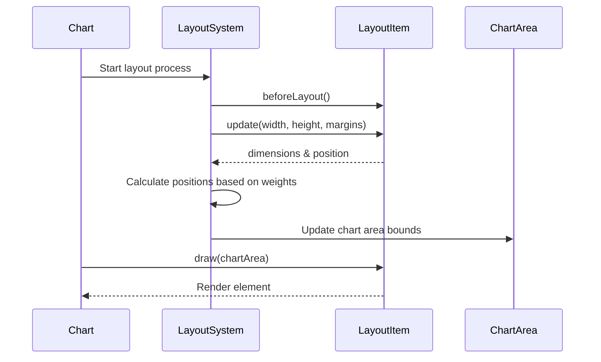
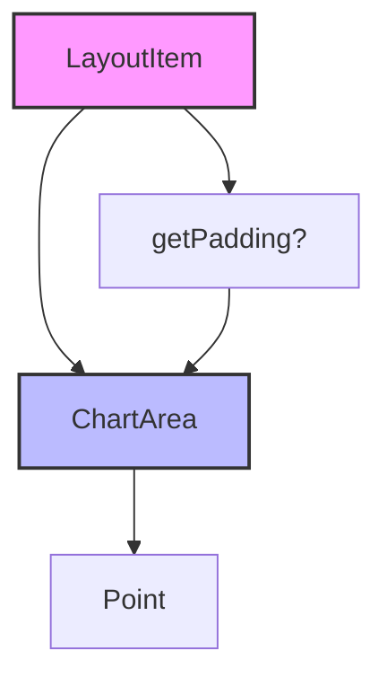
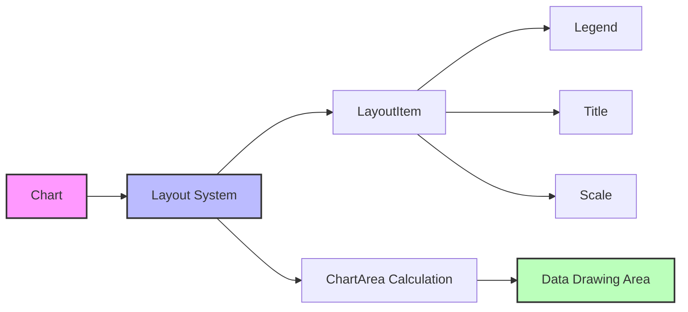
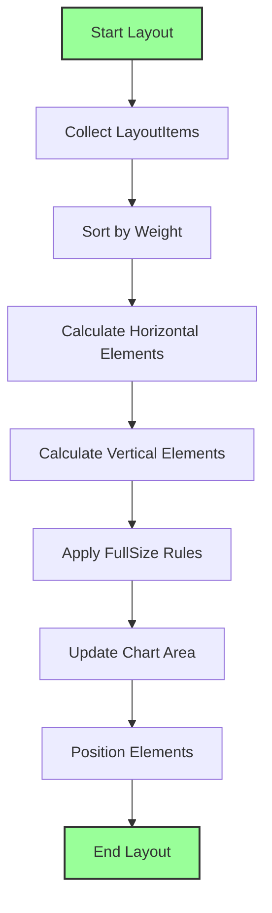

# Layout System Documentation

## Introduction

The layout.d module defines the foundational layout system for Chart.js, providing the core interface and type definitions for managing the positioning and sizing of chart elements. This module establishes how different components (legends, titles, scales, etc.) are arranged within the chart area, ensuring proper spacing, alignment, and responsive behavior.

## Core Architecture

### LayoutItem Interface

The `LayoutItem` interface is the central abstraction that defines how any chart component can participate in the layout system. It provides a contract for components to specify their positioning requirements and respond to layout calculations.

```typescript
interface LayoutItem {
  position: LayoutPosition;
  weight: number;
  fullSize: boolean;
  width: number;
  height: number;
  left: number;
  top: number;
  right: number;
  bottom: number;
  
  beforeLayout?(): void;
  draw(chartArea: ChartArea): void;
  getPadding?(): ChartArea;
  isHorizontal(): boolean;
  update(width: number, height: number, margins?: ChartArea): void;
}
```

## Layout Positioning System

### Position Types

The `LayoutPosition` type defines where elements can be placed within the chart:

- **Standard Positions**: `'left' | 'top' | 'right' | 'bottom' | 'center'`
- **Chart Area**: `'chartArea'` - places the element within the main chart plotting area
- **Scale-based**: `{[scaleId: string]: number}` - allows positioning relative to specific scales

### Layout Algorithm

The layout system uses a weight-based approach to arrange elements:

1. **Weight System**: Higher weight values push elements further from the chart area
2. **Full Size Handling**: Horizontal elements with `fullSize: true` push vertical elements down
3. **Two-phase Layout**: 
   - First phase: Calculate dimensions and positions
   - Second phase: Draw elements within their allocated space

## Component Integration

### Layout-Aware Components

Several chart components implement the `LayoutItem` interface:

- **Legend Plugin**: [Legend Documentation](legend-plugin.md)
- **Title Plugin**: [Title Documentation](title-plugin.md)
- **Scale System**: [Scale System Documentation](scale-system.md)

### Layout Process Flow



## Data Flow and Dependencies

### Geometric Dependencies

The layout system depends on geometric types defined in [types.geometric.d](types.geometric.d.md):



### Integration with Chart System



## Layout Calculation Process

### Phase 1: Dimension Calculation



### Phase 2: Drawing Process

After layout calculation, each `LayoutItem` is drawn within its allocated bounds:

1. **Chart Area Clipping**: Elements draw only within their assigned area
2. **Coordinate Transformation**: Chart area coordinates are provided to drawing methods
3. **Z-order Management**: Elements are drawn in weight order (higher weights on top)

## Responsive Layout Behavior

### Automatic Sizing

The layout system automatically handles:

- **Container Size Changes**: Recalculates all positions when chart dimensions change
- **Content Adaptation**: Elements can adjust their size based on available space
- **Margin Preservation**: Maintains proper spacing between elements

### Padding and Margins

```typescript
interface ChartArea {
  left: number;
  top: number;
  right: number;
  bottom: number;
}
```

Elements can specify padding through `getPadding()`, which affects the available space for the chart area.

## Implementation Guidelines

### Creating Layout-Aware Components

To create a component that participates in the layout system:

1. **Implement LayoutItem**: Provide all required properties and methods
2. **Define Position**: Choose appropriate position based on component purpose
3. **Set Weight**: Use appropriate weight to control positioning priority
4. **Handle Updates**: Implement `update()` to calculate dimensions
5. **Draw Properly**: Use provided `chartArea` in `draw()` method

### Best Practices

- **Weight Assignment**: Use consistent weight values across similar components
- **Padding Consideration**: Always account for padding in dimension calculations
- **Performance**: Minimize calculations in `update()` method
- **Error Handling**: Handle edge cases like zero or negative dimensions

## Integration with Other Systems

### Configuration System

Layout behavior can be configured through the [configuration system](configuration-system.md):

- Position settings
- Weight values
- Padding options
- Responsive behavior flags

### Animation System

Layout changes can be animated through the [animation system](animation-system.md):

- Smooth transitions during resize
- Position interpolation
- Size animations

### Plugin Integration

Plugins that implement `LayoutItem` automatically participate in layout:

- [Legend Plugin](legend-plugin.md)
- [Title Plugin](title-plugin.md)
- [Tooltip Plugin](tooltip-plugin.md)

## Type Definitions

### LayoutItem Properties

| Property | Type | Description |
|----------|------|-------------|
| `position` | `LayoutPosition` | Position within chart layout |
| `weight` | `number` | Priority for layout ordering |
| `fullSize` | `boolean` | Whether element takes full width/height |
| `width` | `number` | Calculated width |
| `height` | `number` | Calculated height |
| `left` | `number` | Calculated left position |
| `top` | `number` | Calculated top position |
| `right` | `number` | Calculated right position |
| `bottom` | `number` | Calculated bottom position |

### LayoutItem Methods

| Method | Parameters | Returns | Description |
|--------|------------|---------|-------------|
| `beforeLayout` | - | `void` | Called before layout starts |
| `draw` | `chartArea: ChartArea` | `void` | Renders the element |
| `getPadding` | - | `ChartArea` | Returns element padding |
| `isHorizontal` | - | `boolean` | Checks if element is horizontal |
| `update` | `width: number, height: number, margins?: ChartArea` | `void` | Updates element dimensions |

## Summary

The layout.d module provides the essential infrastructure for positioning and sizing chart components. Through the `LayoutItem` interface, it enables flexible, responsive layouts that automatically adapt to different chart sizes and configurations. The weight-based positioning system ensures consistent behavior across all chart types while allowing for complex layouts with multiple elements.