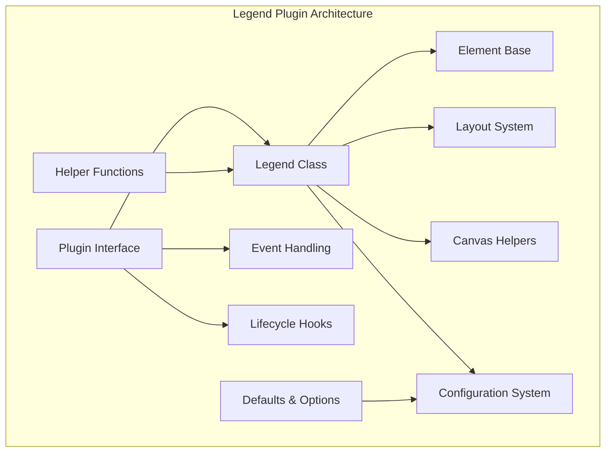
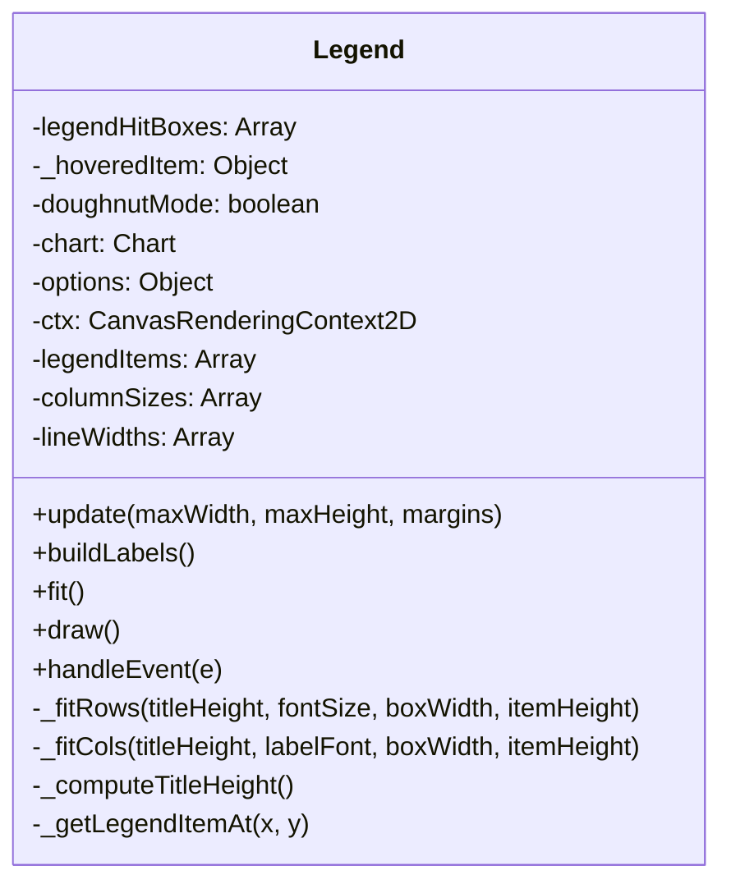
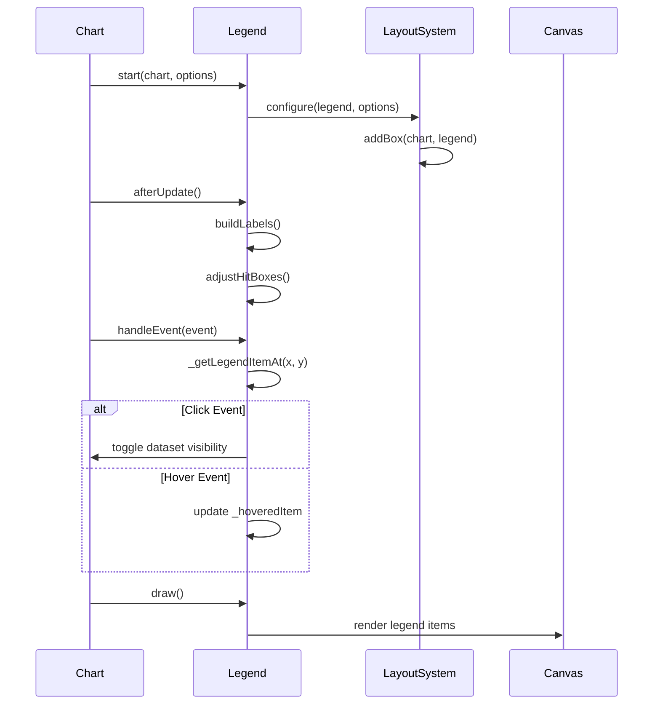
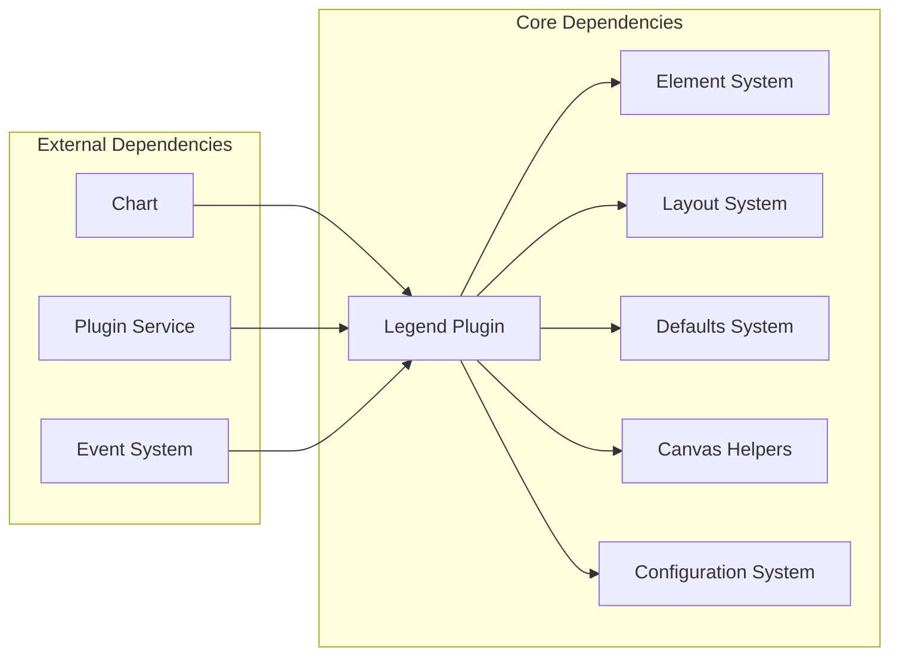
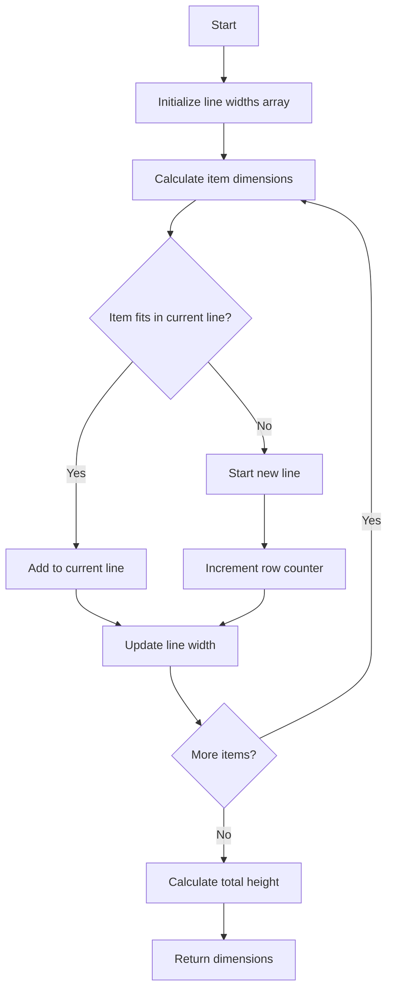
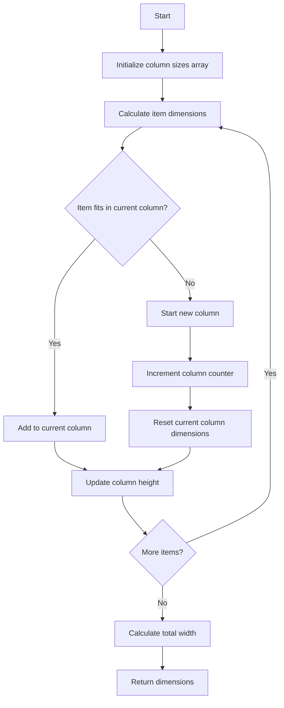
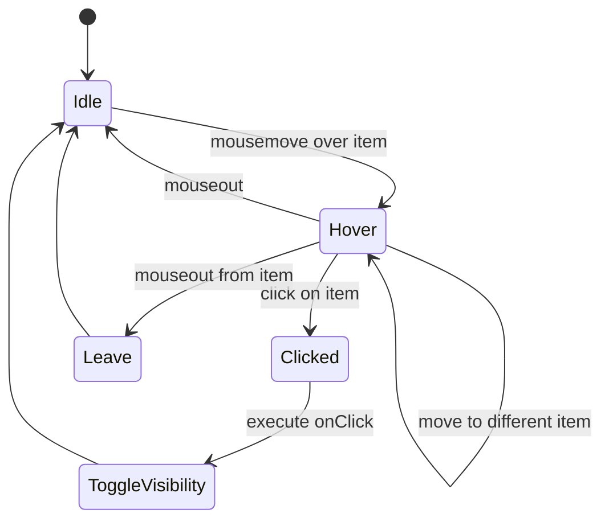
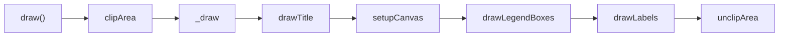

# Legend Plugin Module

## Introduction

The Legend Plugin is a core Chart.js plugin that provides interactive legend functionality for charts. It displays a visual representation of chart datasets with clickable items that can toggle dataset visibility, supports multiple layout orientations (horizontal/vertical), and offers extensive customization options for styling and behavior.

## Architecture Overview

The Legend Plugin follows a modular architecture with clear separation of concerns:



## Core Components

### Legend Class (`src.plugins.plugin.legend.Legend`)

The main Legend class extends Element and manages all legend functionality:



### Key Features

1. **Layout Management**: Supports both horizontal and vertical orientations with automatic sizing
2. **Interactive Elements**: Click-to-toggle dataset visibility, hover effects, and event handling
3. **Styling Options**: Customizable colors, fonts, borders, and point styles
4. **RTL Support**: Full right-to-left text direction support
5. **Responsive Design**: Adapts to available space with intelligent wrapping

## Data Flow



## Component Interactions

### Integration with Core Systems



### Helper Functions Integration

The Legend plugin leverages multiple helper systems:

- **Canvas Helpers**: `drawPointLegend`, `renderText`, `addRoundedRectPath` for rendering
- **Text Helpers**: RTL support, text alignment, and direction handling
- **Configuration Helpers**: Font parsing, padding calculation, and option merging
- **Geometric Helpers**: Hit detection and positioning calculations

## Configuration System

### Default Configuration Structure

```javascript
{
  display: true,
  position: 'top',
  align: 'center',
  fullSize: true,
  reverse: false,
  weight: 1000,
  onClick: function(e, legendItem, legend) { /* toggle visibility */ },
  onHover: null,
  onLeave: null,
  labels: {
    color: (ctx) => ctx.chart.options.color,
    boxWidth: 40,
    padding: 10,
    generateLabels: function(chart) { /* generate legend items */ },
    filter: null,
    sort: null
  },
  title: {
    color: (ctx) => ctx.chart.options.color,
    display: false,
    position: 'center',
    text: ''
  }
}
```

### Scriptable Options

The plugin supports scriptable options through descriptors:

```javascript
descriptors: {
  _scriptable: (name) => !name.startsWith('on'),
  labels: {
    _scriptable: (name) => !['generateLabels', 'filter', 'sort'].includes(name),
  }
}
```

## Layout Algorithm

### Horizontal Layout (`_fitRows`)



### Vertical Layout (`_fitCols`)



## Event Handling

### Mouse Interaction Flow



### Event Types Supported

- **mousemove**: Triggers hover effects and `onHover` callback
- **mouseout**: Triggers `onLeave` callback and clears hover state
- **click**: Executes dataset visibility toggle via `onClick` callback
- **mouseup**: Alternative click event support

## Rendering Pipeline

### Drawing Sequence



### Legend Item Rendering

Each legend item consists of:
1. **Box/Symbol**: Colored rectangle or point style representing the dataset
2. **Text Label**: Dataset name with optional strikethrough for hidden items
3. **Spacing**: Configurable padding and margins

## Performance Considerations

### Optimization Strategies

1. **Hit Box Caching**: Pre-calculated hit boxes for efficient mouse interaction
2. **Layout Caching**: Column and line size information cached during fit
3. **Conditional Rendering**: Early exit when display is false
4. **Text Measurement Caching**: Font and text dimensions calculated once per update

### Memory Management

- Hit boxes and layout data are recalculated on each update
- Canvas state is properly saved and restored during drawing
- Event listeners are managed through the plugin lifecycle

## Integration with Other Modules

### Related Modules

- **[core-system](core-system.md)**: Base Element class and core functionality
- **[configuration-system](configuration-system.md)**: Defaults and configuration management
- **[layout-system](layout-system.md)**: Layout integration and box management
- **[canvas-helpers](canvas-helpers.md)**: Canvas rendering utilities

### Plugin Service Integration

The Legend plugin integrates with Chart.js's plugin service through standardized lifecycle hooks:

- **start**: Plugin initialization and registration
- **stop**: Plugin cleanup and removal
- **beforeUpdate**: Layout configuration updates
- **afterUpdate**: Label rebuilding and hit box adjustment
- **afterEvent**: Event handling and interaction processing

## Usage Examples

### Basic Configuration

```javascript
const chart = new Chart(ctx, {
  type: 'line',
  data: data,
  options: {
    plugins: {
      legend: {
        display: true,
        position: 'top'
      }
    }
  }
});
```

### Custom Legend Items

```javascript
options: {
  plugins: {
    legend: {
      labels: {
        generateLabels: function(chart) {
          // Custom label generation logic
          return chart.data.datasets.map((dataset, i) => ({
            text: dataset.label,
            fillStyle: dataset.backgroundColor,
            hidden: !chart.isDatasetVisible(i),
            datasetIndex: i
          }));
        }
      }
    }
  }
}
```

### Event Handling

```javascript
options: {
  plugins: {
    legend: {
      onClick: function(e, legendItem, legend) {
        // Custom click handling
        console.log('Legend item clicked:', legendItem.text);
      },
      onHover: function(e, legendItem, legend) {
        // Custom hover handling
        legendItem.fontColor = 'red';
      }
    }
  }
}
```

## API Reference

### Legend Class Methods

- `update(maxWidth, maxHeight, margins)`: Updates legend dimensions and layout
- `buildLabels()`: Generates legend items from chart datasets
- `fit()`: Calculates optimal legend size based on content
- `draw()`: Renders the legend on canvas
- `handleEvent(e)`: Processes mouse events for interaction

### Plugin Interface

- `start(chart, args, options)`: Initializes legend instance
- `stop(chart)`: Cleans up legend instance
- `beforeUpdate(chart, args, options)`: Pre-update configuration
- `afterUpdate(chart)`: Post-update label rebuilding
- `afterEvent(chart, args)`: Event processing

## Troubleshooting

### Common Issues

1. **Legend not displaying**: Check `display: true` in options
2. **Incorrect positioning**: Verify `position` option and chart layout
3. **Click events not working**: Ensure event handling is enabled in chart options
4. **Styling issues**: Check color and font configurations

### Debug Information

The Legend plugin provides internal state that can be inspected:

- `legend.legendItems`: Array of current legend items
- `legend.legendHitBoxes`: Hit detection boxes for interaction
- `legend._hoveredItem`: Currently hovered item reference
- `legend.width/height`: Calculated dimensions

## Future Enhancements

### Potential Improvements

1. **Animation Support**: Smooth transitions for visibility changes
2. **Multi-line Labels**: Better support for wrapped text
3. **Icon Support**: Custom icons beyond point styles
4. **Grouping**: Logical grouping of legend items
5. **Search/Filter**: Interactive filtering of legend items