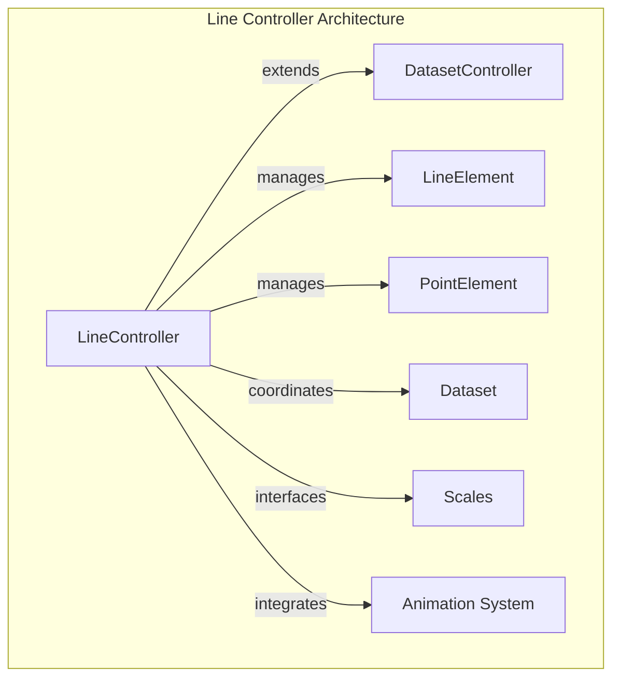
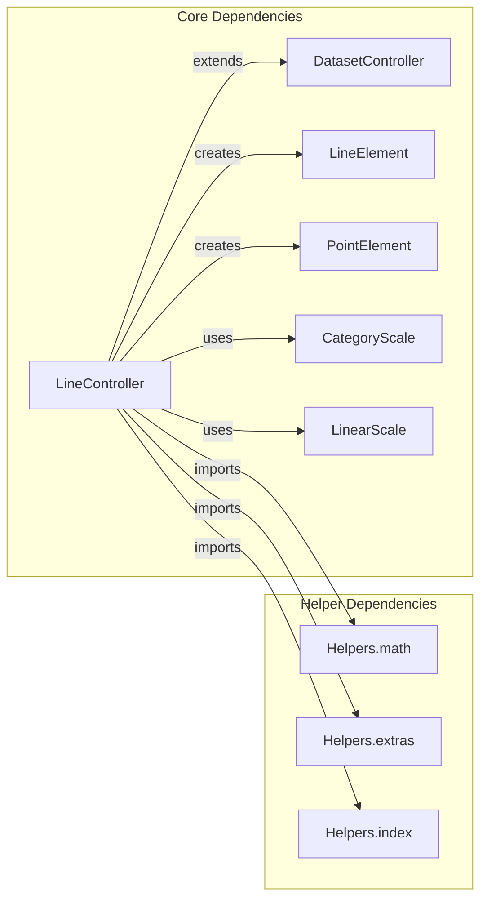
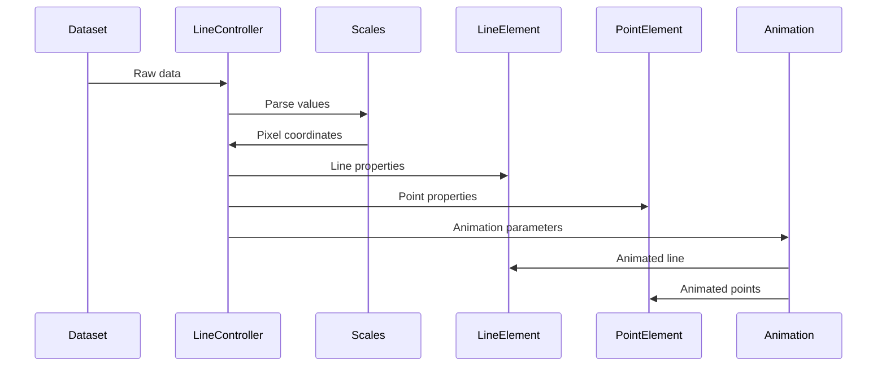
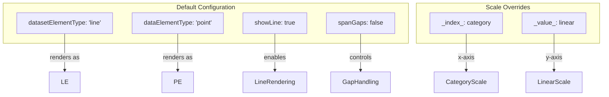
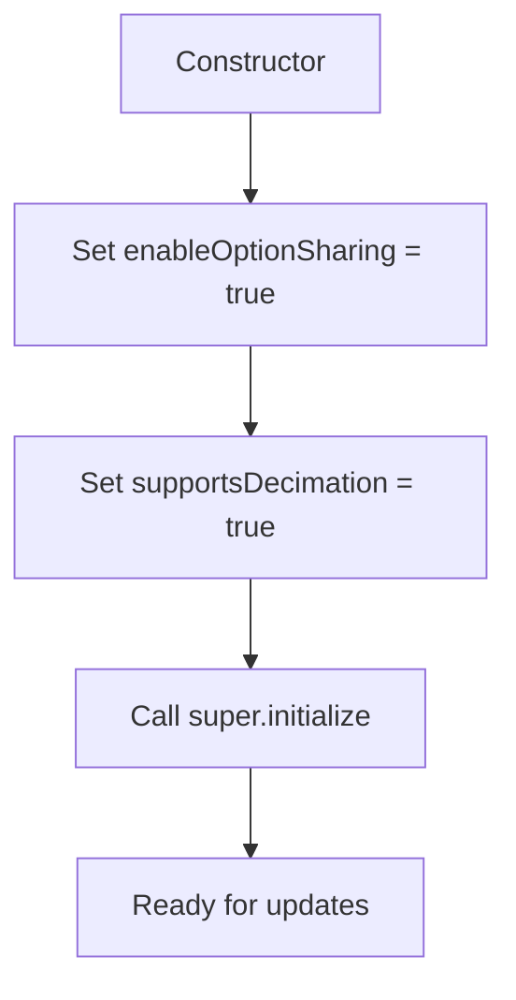
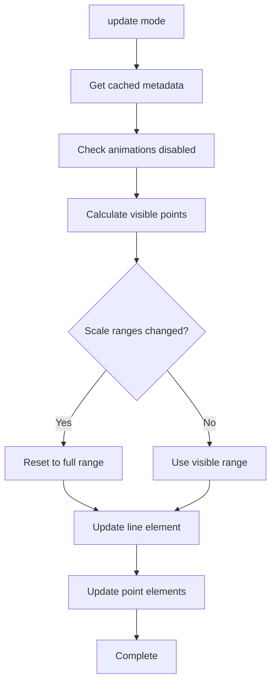
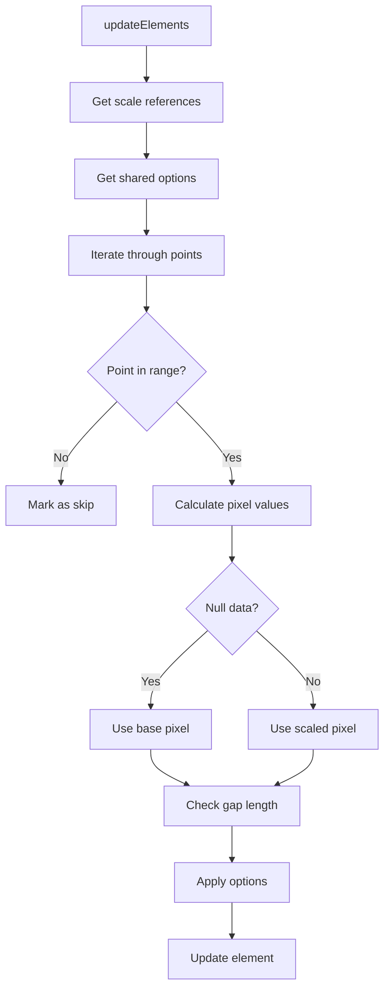

# Line Controller Module Documentation

## Introduction

The Line Controller module is a specialized chart controller within the Chart.js ecosystem that handles the rendering and management of line charts. It extends the base DatasetController to provide line-specific functionality including point management, line drawing, gap handling, and animation support. This controller is responsible for coordinating between datasets, scales, and visual elements to produce smooth, interactive line charts.

## Architecture Overview

The LineController serves as the central orchestrator for line chart visualization, managing the relationship between data points, line elements, and chart scales. It inherits core dataset management capabilities from DatasetController while adding line-specific features like span gap handling, point visibility optimization, and line segment control.

## Component Dependencies

The LineController has several key dependencies that work together to create the complete line chart experience:

## Data Flow Architecture

The LineController manages a complex data flow from raw dataset values to rendered visual elements:

## Configuration and Defaults

The LineController comes with sensible defaults optimized for line chart visualization:

## Key Features and Capabilities

### Point Visibility Optimization
The controller implements intelligent point visibility management to improve performance:

- **Visible Point Detection**: Uses `_getStartAndCountOfVisiblePoints()` to determine which points are within the visible range
- **Scale Range Monitoring**: Tracks scale changes via `_scaleRangesChanged()` to update visibility when needed
- **Drawing Optimization**: Sets `_drawStart` and `_drawCount` to limit rendering to visible points only

### Gap Handling
Sophisticated gap management for handling missing or invalid data:

- **Span Gaps**: Configurable gap spanning with `spanGaps` option
- **Null Data Detection**: Automatically identifies and handles null/undefined values
- **Gap Length Control**: Supports numeric gap length thresholds
- **Point Skipping**: Intelligently skips points that exceed gap thresholds

### Animation Integration
Seamless integration with the animation system:

- **Animation State Detection**: Checks `chart._animationsDisabled` to optimize rendering
- **Animated Updates**: Supports animated transitions for both lines and points
- **Mode-based Updates**: Different update behaviors based on animation mode ('reset', 'none', etc.)

## Process Flow

### Initialization Process

### Update Process

### Point Update Process

## Integration with Other Modules

### Dataset Controller Integration
The LineController extends the base DatasetController, inheriting core functionality while adding line-specific features. See [dataset-controller.md](dataset-controller.md) for base controller documentation.

### Scale System Integration
Works closely with the scale system for data-to-pixel coordinate transformation:
- **Category Scale**: Used for the x-axis (index scale) by default
- **Linear Scale**: Used for the y-axis (value scale) by default
- **Scale Interface**: Leverages scale methods like `getPixelForValue()` and `getBasePixel()`

### Element System Integration
Manages two types of visual elements:
- **LineElement**: Represents the line connecting data points
- **PointElement**: Represents individual data points

### Animation System Integration
Integrates with the animation system for smooth transitions:
- **Animation Detection**: Checks if animations are enabled
- **Animated Properties**: Supports animated updates for positions and styles
- **Mode Support**: Handles different animation modes appropriately

## Performance Optimizations

### Visibility Culling
- Only processes and renders points within the visible range
- Reduces computational overhead for large datasets
- Automatically adjusts when scales change

### Decimation Support
- Explicitly supports data decimation via `supportsDecimation = true`
- Works with decimation plugins to reduce data density
- Maintains visual fidelity while improving performance

### Direct Update Mode
- Supports direct (non-animated) updates for maximum performance
- Automatically detected based on animation state and update mode
- Bypasses animation calculations when not needed

## Error Handling and Edge Cases

### Null/Undefined Data
- Gracefully handles missing data points
- Automatically assigns base pixel positions for null values
- Prevents rendering of invalid points

### Scale Edge Cases
- Handles scale range changes dynamically
- Recalculates visibility when scales are modified
- Maintains data integrity across scale transformations

### Animation Edge Cases
- Properly handles disabled animations
- Manages reset mode for complete data refreshes
- Supports mode-based update strategies

## Extension Points

The LineController provides several extension points for customization:

- **Dataset Element Options**: Customize line appearance and behavior
- **Data Element Options**: Customize point appearance and behavior
- **Segment Options**: Advanced line segment control
- **Scale Configuration**: Override default scale types and settings
- **Animation Options**: Customize animation behavior and timing

## Related Documentation

- [Dataset Controller](dataset-controller.md) - Base controller functionality
- [Animation System](animation-system.md) - Animation and transition management
- [Scale System](scale-system.md) - Scale configuration and data mapping
- [Element System](element-system.md) - Visual element management
- [Configuration System](configuration-system.md) - Configuration and defaults management