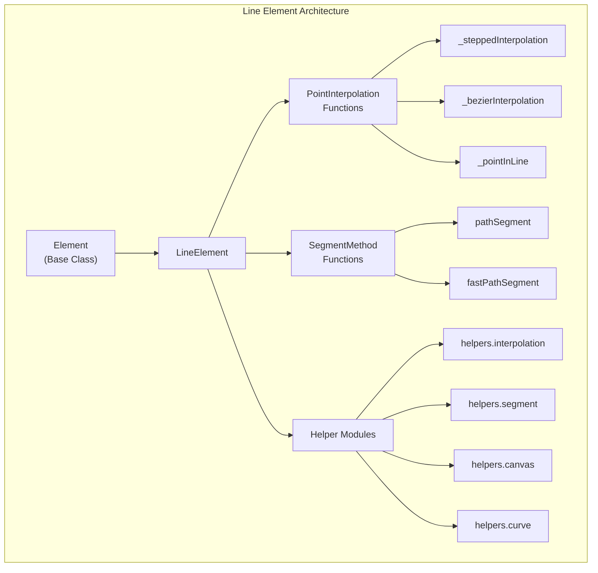
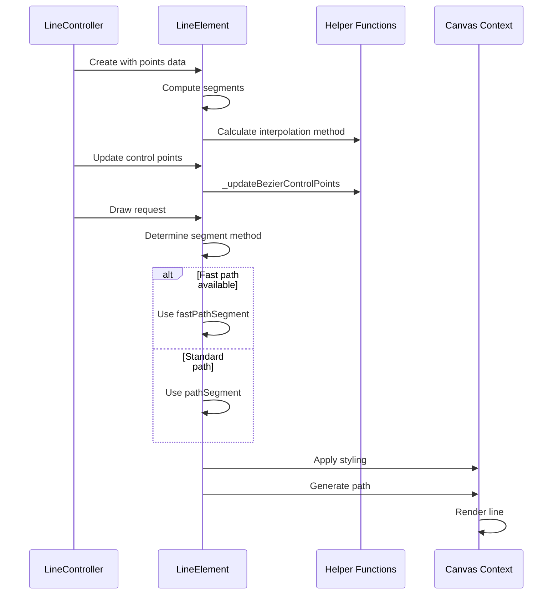
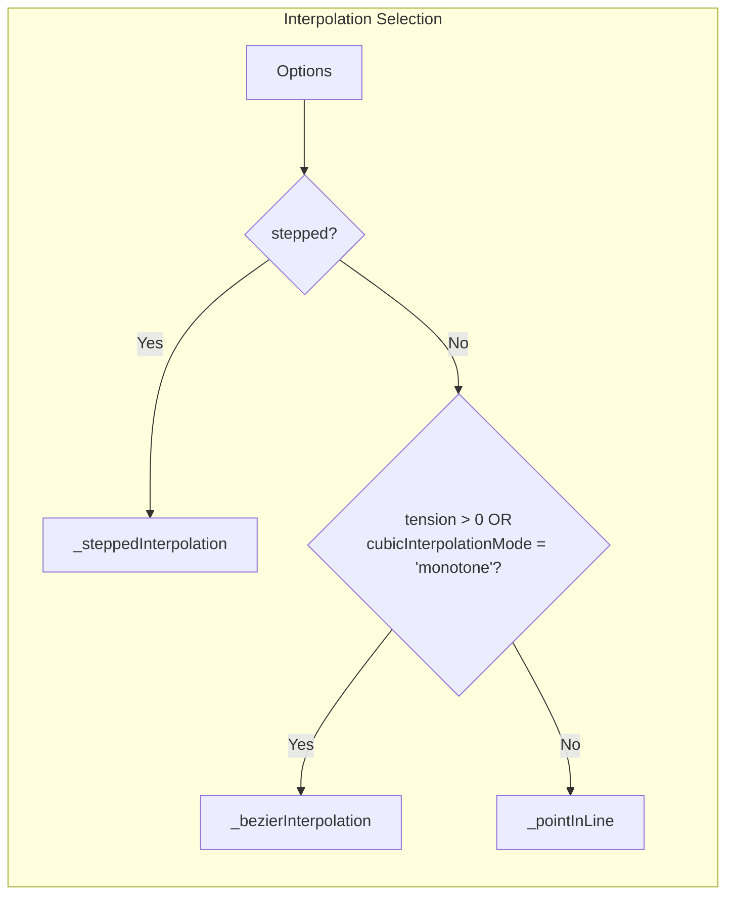
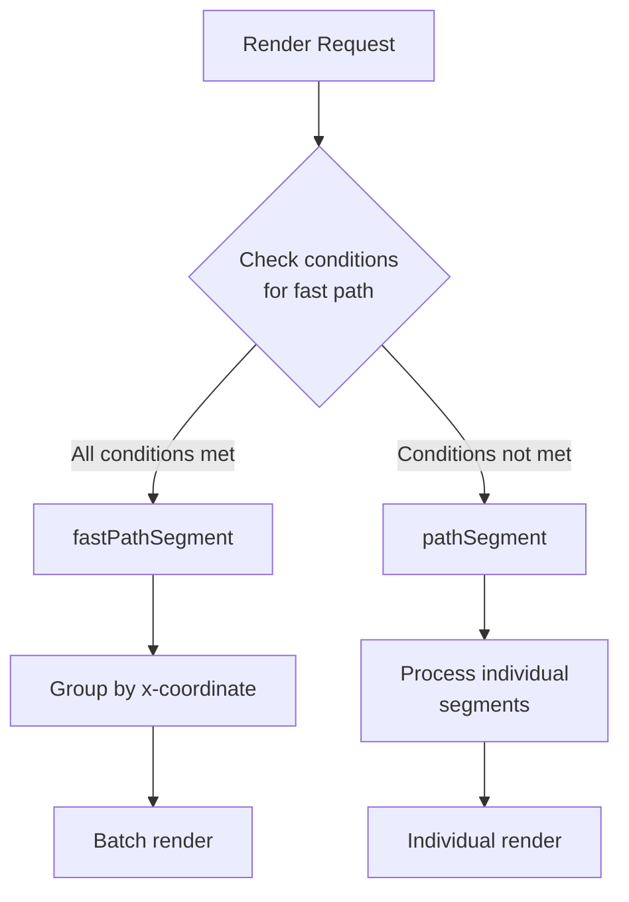
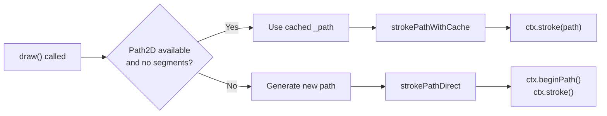

# Line Element Module

## Introduction

The line-element module provides the core functionality for rendering line charts in Chart.js. It implements the `LineElement` class, which is responsible for drawing line segments, handling different interpolation methods, and managing line styling and animation. This module serves as a fundamental building block for line charts and is utilized by the [line-controller](line-controller.md) to create complete line chart visualizations.

## Architecture Overview

The LineElement extends the base Element class and provides specialized functionality for rendering lines with various styling options, interpolation methods, and performance optimizations.



## Core Components

### LineElement Class

The `LineElement` class is the primary component of this module, extending the base `Element` class to provide line-specific functionality.

**Key Properties:**
- `animated`: Boolean flag indicating if the line is animated
- `options`: Line styling and behavior options
- `_points`: Array of point elements that define the line
- `_segments`: Computed line segments for efficient rendering
- `_path`: Cached Path2D object for performance optimization
- `_decimated`: Flag indicating if the line uses data decimation

**Key Methods:**
- `updateControlPoints()`: Updates bezier control points for smooth curves
- `interpolate()`: Interpolates points along the line
- `path()`: Generates the complete path for the line
- `draw()`: Renders the line on the canvas

## Data Flow



## Interpolation Methods

The module supports three different interpolation methods for connecting points:



1. **Stepped Interpolation**: Creates stepped/angled connections between points
2. **Bezier Interpolation**: Creates smooth curved lines using bezier curves
3. **Linear Interpolation**: Direct straight lines between points

## Rendering Optimization

The module implements two rendering strategies for performance optimization:

### Fast Path Rendering
- Used when: No decimation, no loops, no tension, no monotone interpolation, no stepped lines, no border dash
- Groups points by x-coordinate for efficient batch rendering
- Significantly faster for large datasets

### Standard Path Rendering
- Used for complex styling requirements
- Handles individual segments with custom styling
- Supports all line features



## Path2D Caching

The module utilizes Path2D caching for improved performance:



## Dependencies

The line-element module depends on several helper modules and core components:

### Core Dependencies
- [Element](core.md#element): Base class for all chart elements
- [PointElement](point-element.md): Individual point elements that compose the line

### Helper Module Dependencies
- `helpers.interpolation`: Provides interpolation algorithms
- `helpers.segment`: Segment computation and boundary calculations
- `helpers.canvas`: Canvas drawing utilities
- `helpers.curve`: Bezier curve control point calculations

### Integration with Controllers
- [LineController](line-controller.md): Uses LineElement to render line charts
- Coordinates with scales for data mapping
- Manages dataset-level properties and styling

## Configuration Options

The LineElement supports extensive configuration options:

| Option | Type | Default | Description |
|--------|------|---------|-------------|
| `borderCapStyle` | string | 'butt' | Line cap style |
| `borderDash` | number[] | [] | Border dash pattern |
| `borderDashOffset` | number | 0 | Border dash offset |
| `borderJoinStyle` | string | 'miter' | Line join style |
| `borderWidth` | number | 3 | Border width |
| `cubicInterpolationMode` | string | 'default' | Cubic interpolation mode |
| `fill` | boolean/string | false | Fill configuration |
| `spanGaps` | boolean | false | Whether to span gaps |
| `stepped` | boolean | false | Whether to use stepped interpolation |
| `tension` | number | 0 | Bezier curve tension |

## Usage Examples

### Basic Line Rendering
```javascript
const lineElement = new LineElement({
  points: pointElements,
  options: {
    borderColor: 'rgb(75, 192, 192)',
    borderWidth: 2
  }
});

lineElement.draw(ctx, chartArea);
```

### Smooth Curved Line
```javascript
const lineElement = new LineElement({
  points: pointElements,
  options: {
    tension: 0.4,
    cubicInterpolationMode: 'monotone'
  }
});
```

### Stepped Line
```javascript
const lineElement = new LineElement({
  points: pointElements,
  options: {
    stepped: true
  }
});
```

## Performance Considerations

1. **Fast Path Optimization**: Automatically enabled for simple lines with large datasets
2. **Path2D Caching**: Cached paths are invalidated when points or options change
3. **Segment Computation**: Segments are computed lazily and cached
4. **Control Point Updates**: Only updated when necessary (tension or monotone mode)

## Integration with Animation System

The line-element integrates with the [animation-system](animation-system.md) to provide smooth transitions:

- Animated flag controls caching behavior
- Control points and paths are recalculated during animation
- Supports interpolation between animation states

## Error Handling

The module includes several safety checks:
- Validates point data before rendering
- Handles skipped points in segments
- Gracefully handles empty datasets
- Manages edge cases in interpolation calculations