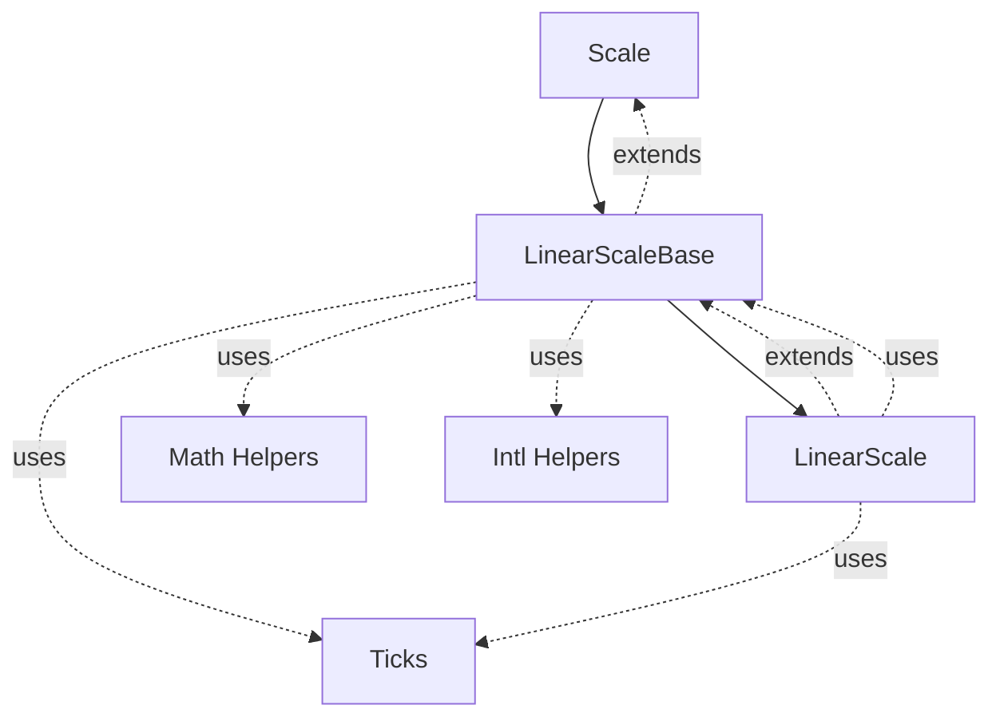
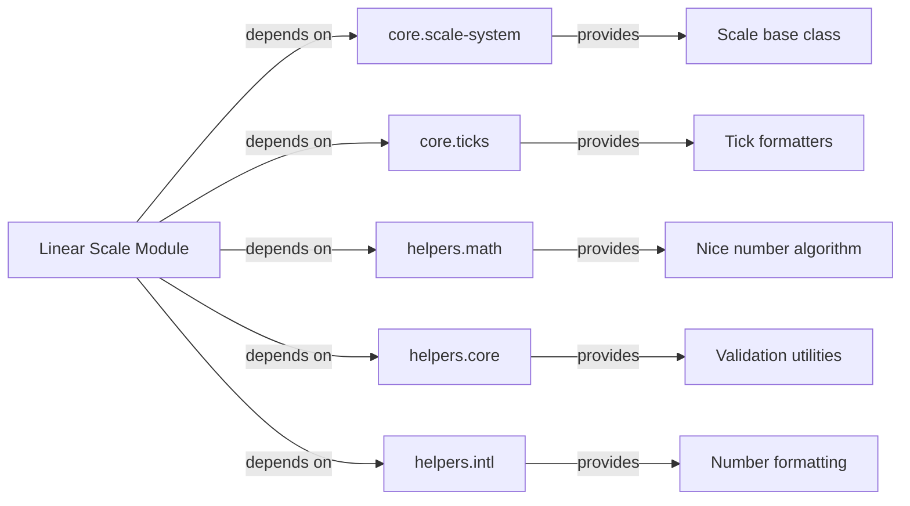
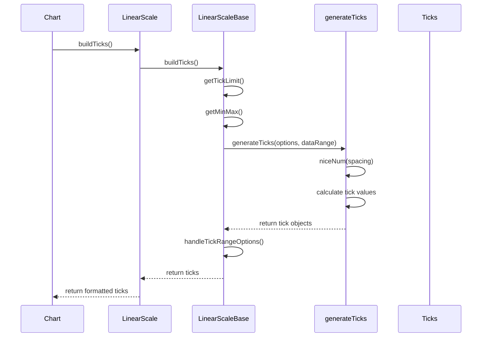
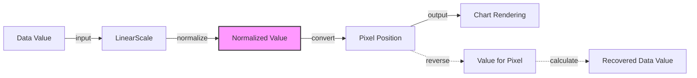
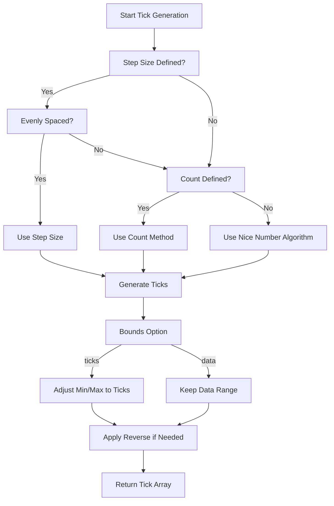
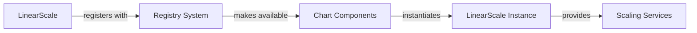

# Linear Scale Module

## Introduction

The Linear Scale module provides linear scaling functionality for Chart.js, handling the mapping between data values and pixel positions on chart axes. It implements a continuous, evenly-spaced scale system that supports automatic tick generation, value-to-pixel conversion, and various configuration options for customizing scale behavior.

## Architecture

### Core Components

The Linear Scale module consists of two primary components:

1. **LinearScaleBase** - Abstract base class providing core linear scaling logic
2. **LinearScale** - Concrete implementation with specific linear scale behavior

### Component Hierarchy



### Dependencies



## Data Flow

### Tick Generation Process



### Value-to-Pixel Conversion



## Component Details

### LinearScaleBase

The abstract base class that provides core linear scaling functionality:

- **Tick Generation**: Implements sophisticated tick generation algorithm using the "nice number" approach
- **Value Parsing**: Converts raw data values to numeric format with validation
- **Range Handling**: Manages min/max values and handles edge cases like `beginAtZero`
- **Label Formatting**: Provides locale-aware number formatting

#### Key Methods:

- `parse(raw, index)`: Converts raw data to numeric values
- `buildTicks()`: Generates tick marks based on data range and options
- `handleTickRangeOptions()`: Applies special range handling (beginAtZero, etc.)
- `getLabelForValue(value)`: Formats values for display

### LinearScale

The concrete implementation that extends LinearScaleBase with specific linear scale behavior:

- **Data Limits**: Determines appropriate min/max values from dataset
- **Tick Limit Calculation**: Computes optimal number of ticks based on available space
- **Pixel Conversion**: Provides bidirectional value-to-pixel mapping

#### Key Methods:

- `determineDataLimits()`: Analyzes data to set scale boundaries
- `computeTickLimit()`: Calculates maximum ticks based on dimensions
- `getPixelForValue(value)`: Converts data values to pixel coordinates
- `getValueForPixel(pixel)`: Converts pixel coordinates back to data values

## Tick Generation Algorithm

The module implements a sophisticated tick generation algorithm that handles multiple scenarios:



## Configuration Options

### Linear Scale Defaults

```javascript
{
  ticks: {
    callback: Ticks.formatters.numeric  // Default numeric formatter
  }
}
```

### Inherited Options from LinearScaleBase

- `min`, `max`: Explicit scale boundaries
- `beginAtZero`: Force scale to start at zero
- `ticks.stepSize`: Fixed step size between ticks
- `ticks.count`: Target number of ticks
- `ticks.precision`: Decimal precision for tick values
- `bounds`: 'data' or 'ticks' - whether to fit to data or tick boundaries

## Integration with Chart System

### Scale Registration



### Usage in Controllers

Linear scales are used by various chart controllers for their axes:

- [Line Controller](line-controller.md) - typically uses linear scales for Y-axis
- [Bar Controller](bar-controller.md) - uses linear scales for value axes
- [Scatter Controller](scatter-controller.md) - uses linear scales for both axes

## Performance Considerations

### Tick Limiting

The module implements several mechanisms to prevent excessive tick generation:

1. **Spatial Limits**: `computeTickLimit()` calculates maximum ticks based on available space
2. **Hard Limits**: Maximum of 1000 ticks when step size is specified
3. **Configurable Limits**: `maxTicksLimit` option for user-defined limits

### Optimization Strategies

- **Caching**: Scale configuration and tick generation results are cached
- **Lazy Calculation**: Ticks are only regenerated when necessary
- **Efficient Algorithms**: The nice number algorithm ensures optimal tick spacing

## Error Handling

### Edge Cases

- **Infinite Values**: Filtered out during parsing to prevent scale corruption
- **Null/Undefined**: Handled gracefully with appropriate fallback values
- **Zero Range**: Special handling when min equals max
- **Invalid Step Size**: Reverts to automatic tick generation

### Validation

- **Numeric Validation**: Ensures all parsed values are finite numbers
- **Range Validation**: Verifies that min < max after processing
- **Option Validation**: Validates configuration options before application

## Extension Points

### Customization Options

The linear scale module can be extended through:

- **Custom Tick Callbacks**: Override the default numeric formatter
- **Inherited Configuration**: Leverage options from the base Scale class
- **Method Overrides**: Extend LinearScaleBase for custom behavior

### Related Modules

For different scaling needs, consider these alternatives:

- [Category Scale](category-scale.md) - for discrete categories
- [Logarithmic Scale](logarithmic-scale.md) - for exponential data
- [Time Scale](time-scale.md) - for temporal data
- [Radial Linear Scale](radial-linear-scale.md) - for radial charts

## API Reference

### LinearScale Methods

| Method | Description | Parameters | Returns |
|--------|-------------|------------|---------|
| `determineDataLimits()` | Analyzes data to set scale boundaries | none | void |
| `computeTickLimit()` | Calculates maximum ticks based on dimensions | none | number |
| `getPixelForValue(value)` | Converts data value to pixel coordinate | `value: number` | number |
| `getValueForPixel(pixel)` | Converts pixel coordinate to data value | `pixel: number` | number |

### LinearScaleBase Methods

| Method | Description | Parameters | Returns |
|--------|-------------|------------|---------|
| `parse(raw, index)` | Converts raw data to numeric format | `raw: any`, `index: number` | number \| null |
| `buildTicks()` | Generates tick marks | none | Tick[] |
| `handleTickRangeOptions()` | Applies range handling options | none | void |
| `getLabelForValue(value)` | Formats value for display | `value: number` | string |