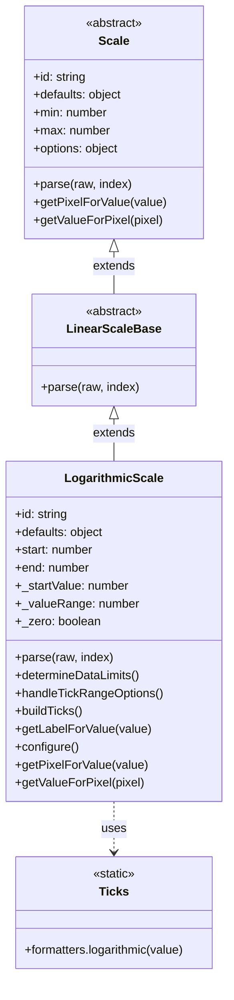
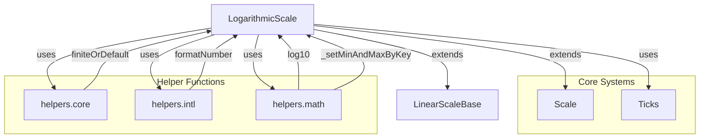
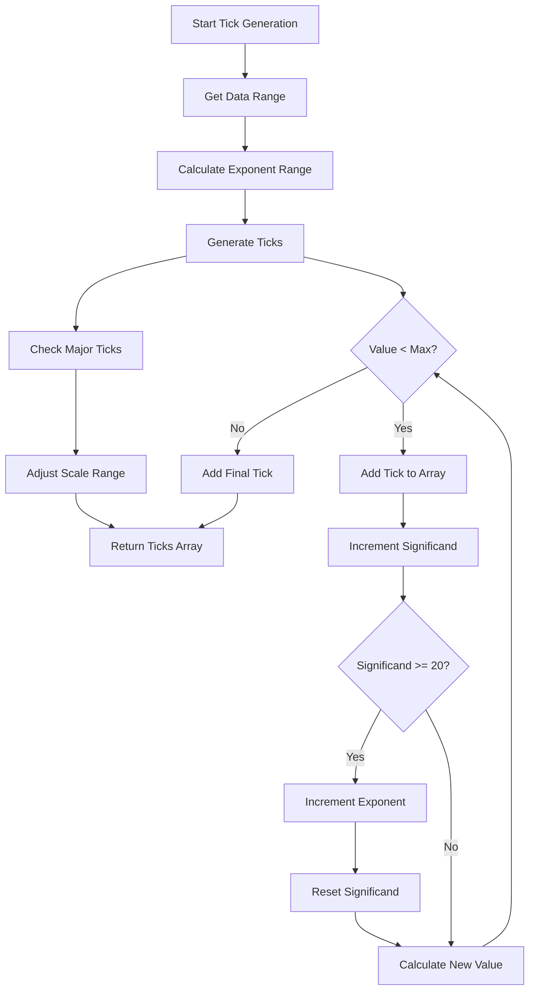
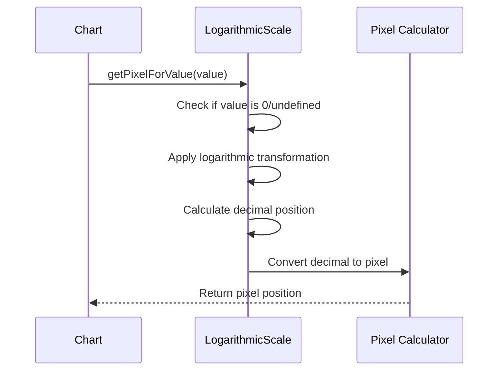
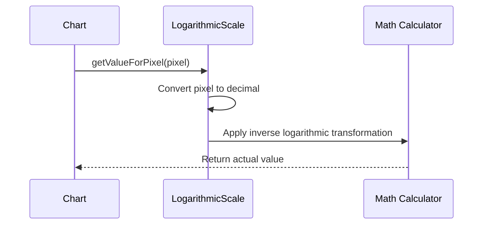
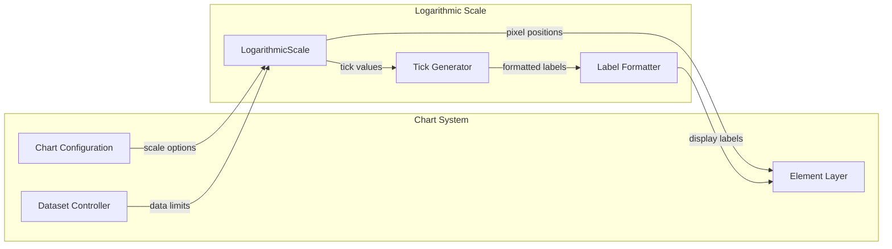

# Logarithmic Scale Module

## Introduction

The logarithmic-scale module provides specialized scaling functionality for data visualization, implementing a logarithmic scale that handles data spanning multiple orders of magnitude. This scale type is essential for displaying exponential growth patterns, scientific data, financial charts, and any datasets where values range from very small to very large numbers.

## Architecture Overview

The LogarithmicScale extends the base Scale class and inherits from LinearScaleBase, providing logarithmic transformations for data visualization. The module implements sophisticated tick generation algorithms that create meaningful logarithmic intervals while maintaining visual clarity.



## Component Dependencies

The logarithmic-scale module integrates with several core systems:



## Core Functionality

### Data Parsing and Validation

The LogarithmicScale implements specialized parsing logic to handle logarithmic data requirements:

```javascript
parse(raw, index) {
    const value = LinearScaleBase.prototype.parse.apply(this, [raw, index]);
    if (value === 0) {
        this._zero = true;
        return undefined;
    }
    return isFinite(value) && value > 0 ? value : null;
}
```

**Key behaviors:**
- Zero values are flagged and converted to `undefined` (logarithm of zero is undefined)
- Only positive finite values are accepted (logarithm requires positive numbers)
- Invalid values return `null` for proper handling

### Tick Generation Algorithm

The module implements a sophisticated tick generation system that creates meaningful logarithmic intervals:



### Scale Configuration

The logarithmic scale configures itself based on data characteristics:

```javascript
configure() {
    const start = this.min;
    super.configure();
    this._startValue = log10(start);
    this._valueRange = log10(this.max) - log10(start);
}
```

This establishes the logarithmic baseline for pixel-to-value conversions.

## Data Flow

### Value-to-Pixel Conversion



### Pixel-to-Value Conversion



## Integration with Chart System

The LogarithmicScale integrates with the broader chart ecosystem through several key interfaces:



## Key Features

### 1. Automatic Range Handling
- Handles zero and negative values gracefully
- Automatically adjusts range based on data distribution
- Supports `beginAtZero` option for special cases

### 2. Intelligent Tick Generation
- Creates logarithmically spaced ticks (1, 2, 3, ..., 10, 20, 30, ..., 100, etc.)
- Identifies major ticks (powers of 10) for emphasis
- Adapts tick density based on scale range

### 3. Internationalization Support
- Uses `formatNumber` helper for locale-aware number formatting
- Supports custom formatting through options

### 4. Flexible Bounds Handling
- Supports different bound modes ('ticks', 'data')
- Handles reversed scales
- Maintains consistent behavior across different data ranges

## Usage Patterns

### Basic Configuration
```javascript
{
    type: 'logarithmic',
    ticks: {
        callback: function(value) {
            return value.toExponential();
        }
    }
}
```

### Scientific Data Visualization
The logarithmic scale excels at displaying:
- Exponential growth/decay data
- Data spanning multiple orders of magnitude
- Scientific measurements (pH, decibels, earthquake magnitudes)
- Financial data (stock prices, market caps)

## Error Handling

The module implements robust error handling for edge cases:

1. **Zero Values**: Converted to `undefined` since log(0) is mathematically undefined
2. **Negative Values**: Return `null` to prevent logarithm of negative numbers
3. **Infinite Values**: Filtered out during data limit determination
4. **Empty Datasets**: Default to reasonable ranges (1-10)

## Performance Considerations

- Tick generation algorithm is optimized for large data ranges
- Uses mathematical operations sparingly in hot paths
- Caches calculated values where possible
- Efficiently handles both small and large datasets

## Related Modules

- [linear-scale](linear-scale.md) - Linear scaling implementation
- [scale-system](scale-system.md) - Base scale functionality
- [core.ticks](core.ticks.md) - Tick formatting utilities
- [helpers.math](helpers.math.md) - Mathematical utility functions

## API Reference

### Constructor Options
- `min`: Minimum scale value
- `max`: Maximum scale value
- `beginAtZero`: Force scale to start at zero (special handling)
- `ticks.callback`: Custom tick formatting function
- `ticks.major.enabled`: Enable major tick emphasis

### Methods
- `parse(raw, index)`: Parse and validate data values
- `determineDataLimits()`: Calculate scale range from data
- `buildTicks()`: Generate logarithmic tick marks
- `getPixelForValue(value)`: Convert data value to pixel position
- `getValueForPixel(pixel)`: Convert pixel position to data value
- `getLabelForValue(value)`: Format value for display