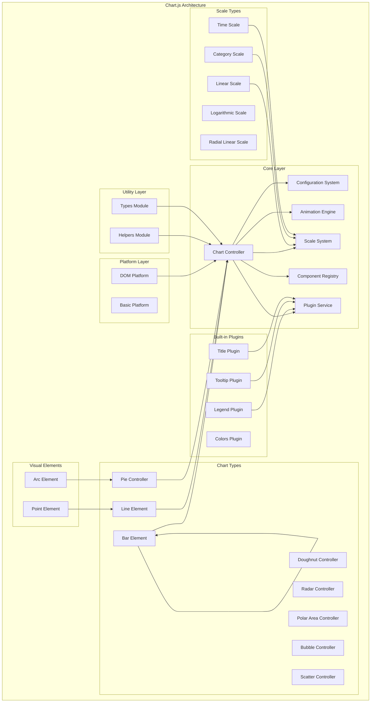

# Chart.js Repository Overview

Chart.js is a flexible, community-maintained JavaScript charting library that renders data visualizations on the HTML5 `<canvas>` element. It provides a simple yet powerful API for creating responsive, animated, and interactive charts with minimal code.

## Purpose

Chart.js aims to make data visualization accessible to developers by providing:
- **Easy Integration**: Simple API that works with minimal configuration
- **Responsive Design**: Charts automatically resize to fit their containers
- **Animation Support**: Smooth, configurable animations for all chart types
- **Extensibility**: Plugin system for adding custom functionality
- **TypeScript Support**: Full type definitions for type-safe development
- **Cross-Platform**: Works in browsers, Node.js, and other JavaScript environments

## End-to-End Architecture

## Core Modules Documentation

### [Core Module](core.md)
The foundational layer providing essential infrastructure for chart creation, configuration, animation, and data management. It includes:
- **Chart Controller**: Central orchestrator managing chart lifecycle
- **Configuration System**: Hierarchical option resolution and defaults management
- **Animation Engine**: Smooth 60fps animations with requestAnimationFrame
- **Scale System**: Base scale functionality for axis management
- **Component Registry**: Central registration system for all Chart.js components
- **Plugin Service**: Manages plugin lifecycle and hooks

### [Controllers Module](controllers.md)
Implements chart-type specific controllers that extend the base DatasetController:
- **Bar Controller**: Vertical/horizontal bar charts with grouping and stacking
- **Line Controller**: Line and area charts with gap support
- **Pie/Doughnut Controllers**: Circular data visualization
- **Radar Controller**: Multi-dimensional data comparison
- **Polar Area Controller**: Radial data representation
- **Bubble Controller**: Three-dimensional data (x, y, radius)
- **Scatter Controller**: X-Y coordinate data points

### [Elements Module](elements.md)
Provides fundamental visual building blocks:
- **Arc Element**: Circular segments for pie/doughnut charts
- **Bar Element**: Rectangular bars for bar charts
- **Line Element**: Line segments with multiple interpolation modes
- **Point Element**: Data points with various styles and sizes

### [Scales Module](scales.md)
Handles data-to-pixel mapping and axis management:
- **Category Scale**: Discrete categorical data
- **Linear Scale**: Continuous numeric data
- **Logarithmic Scale**: Data spanning multiple orders of magnitude
- **Time Scale**: Temporal data with automatic unit selection
- **Time Series Scale**: Optimized for irregular time intervals
- **Radial Linear Scale**: Linear scale for radial/polar charts

### [Plugins Module](plugins.md)
Extensible functionality through built-in and custom plugins:
- **Legend Plugin**: Interactive dataset toggling and display
- **Tooltip Plugin**: Rich interactive tooltips with positioning modes
- **Title Plugin**: Multi-line chart titles with positioning
- **Colors Plugin**: Automatic color assignment for datasets
- **Filler Plugin**: Area filling between datasets

### [Platform Module](platform.md)
Abstraction layer for cross-platform compatibility:
- **DomPlatform**: Full browser support with DOM events and responsive handling
- **BasicPlatform**: Minimal implementation for limited environments
- **Canvas Context Management**: Proper resource handling and cleanup
- **Device Pixel Ratio**: High-DPI display support

### [Helpers Module](helpers.md)
Comprehensive utility library providing:
- **Canvas Helpers**: Drawing utilities for points, text, and shapes
- **Collection Helpers**: Array operations and binary search
- **Configuration Helpers**: Type-safe configuration resolution
- **Core Helpers**: Type checking and object manipulation
- **RTL Helpers**: Right-to-left text support

### [Types Module](types.md)
Complete TypeScript type definitions ensuring:
- **Type Safety**: Full coverage for all configurations and options
- **IntelliSense**: Enhanced development experience
- **Extensibility**: Support for custom chart types and plugins
- **Chart Type Registry**: Sophisticated type mapping system

## Key Features

- **8 Built-in Chart Types**: Bar, Line, Pie, Doughnut, Radar, Polar Area, Bubble, Scatter
- **Responsive by Default**: Automatic resizing and mobile optimization
- **Animation System**: Configurable animations with easing functions
- **Plugin Architecture**: Extensible through custom plugins
- **Mixed Chart Types**: Combine different chart types in a single chart
- **Accessibility**: ARIA support and keyboard navigation
- **Performance**: Optimized for large datasets with decimation
- **Internationalization**: RTL support and locale-aware formatting