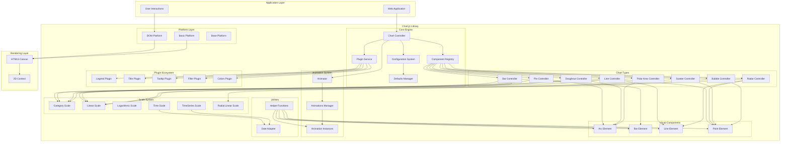

# Chart.js Repository Overview

## Purpose

Chart.js is a flexible, open-source JavaScript charting library that renders interactive, animated charts using HTML5 Canvas. It provides a simple yet powerful API for creating responsive, accessible, and performant data visualizations across web applications. The library supports a wide variety of chart types including line, bar, pie, doughnut, radar, polar area, bubble, and scatter charts, with extensive customization options and plugin architecture for extensibility.

## End-to-End Architecture

```mermaid
graph TB
    subgraph "Application Layer"
        App[Web Application]
        User[User Interactions]
    end
    
    subgraph "Chart.js Library"
        subgraph "Core Engine"
            Chart[Chart Controller]
            Registry[Component Registry]
            Config[Configuration System]
            Defaults[Defaults Manager]
            PluginService[Plugin Service]
        end
        
        subgraph "Chart Types"
            BarC[Bar Controller]
            LineC[Line Controller]
            PieC[Pie Controller]
            DoughnutC[Doughnut Controller]
            RadarC[Radar Controller]
            ScatterC[Scatter Controller]
            BubbleC[Bubble Controller]
            PolarC[Polar Area Controller]
        end
        
        subgraph "Visual Components"
            Arc[Arc Element]
            Bar[Bar Element]
            Line[Line Element]
            Point[Point Element]
        end
        
        subgraph "Scale System"
            Category[Category Scale]
            Linear[Linear Scale]
            Logarithmic[Logarithmic Scale]
            Time[Time Scale]
            TimeSeries[TimeSeries Scale]
            RadialLinear[Radial Linear Scale]
        end
        
        subgraph "Animation System"
            Animator[Animator]
            Animations[Animations Manager]
            Animation[Animation Instances]
        end
        
        subgraph "Plugin Ecosystem"
            Legend[Legend Plugin]
            Title[Title Plugin]
            Tooltip[Tooltip Plugin]
            Filler[Filler Plugin]
            Colors[Colors Plugin]
        end
        
        subgraph "Platform Layer"
            DomPlatform[DOM Platform]
            BasicPlatform[Basic Platform]
            BasePlatform[Base Platform]
        end
        
        subgraph "Utilities"
            DateAdapter[Date Adapter]
            Helpers[Helper Functions]
        end
    end
    
    subgraph "Rendering Layer"
        Canvas[HTML5 Canvas]
        Context[2D Context]
    end
    
    App --> Chart
    User --> DomPlatform
    
    Chart --> Registry
    Chart --> Config
    Chart --> PluginService
    Chart --> Animator
    
    Registry --> BarC
    Registry --> LineC
    Registry --> PieC
    Registry --> DoughnutC
    Registry --> RadarC
    Registry --> ScatterC
    Registry --> BubbleC
    Registry --> PolarC
    
    BarC --> Bar
    LineC --> Line
    LineC --> Point
    PieC --> Arc
    DoughnutC --> Arc
    RadarC --> Line
    RadarC --> Point
    ScatterC --> Point
    BubbleC --> Point
    PolarC --> Arc
    
    BarC --> Category
    BarC --> Linear
    LineC --> Category
    LineC --> Linear
    PieC --> Category
    DoughnutC --> Category
    RadarC --> RadialLinear
    ScatterC --> Linear
    BubbleC --> Linear
    Time --> DateAdapter
    TimeSeries --> DateAdapter
    
    PluginService --> Legend
    PluginService --> Title
    PluginService --> Tooltip
    PluginService --> Filler
    PluginService --> Colors
    
    Animator --> Animations
    Animations --> Animation
    
    DomPlatform --> Canvas
    BasicPlatform --> Canvas
    Canvas --> Context
    
    Config --> Defaults
    Helpers --> Animation
    Helpers --> Bar
    Helpers --> Line
    Helpers --> Point
    Helpers --> Arc
```

## Core Module Documentation References

- **[Core Engine](core_engine.md)** - Central orchestration system managing chart lifecycle, data processing, rendering, and interactivity
- **[Animation Module](animation.md)** - Smooth, configurable animations for chart transitions and updates
- **[Controllers Module](controllers.md)** - Specialized dataset controllers for different chart types (Bar, Line, Pie, Doughnut, Radar, Scatter, Bubble, Polar Area)
- **[Elements Module](elements.md)** - Visual building blocks (Arc, Bar, Line, Point elements) for chart rendering
- **[Scales Module](scales.md)** - Mathematical foundation for mapping data values to visual positions (Category, Linear, Logarithmic, Time, TimeSeries, Radial Linear)
- **[Plugins Module](plugins.md)** - Essential chart enhancements including legends, titles, tooltips, data filling, and automatic color assignment
- **[Platform Module](platform.md)** - Abstraction layer for platform-specific operations across different environments
- **[Date Adapters](date_adapters.md)** - Flexible system for handling date and time operations with different libraries