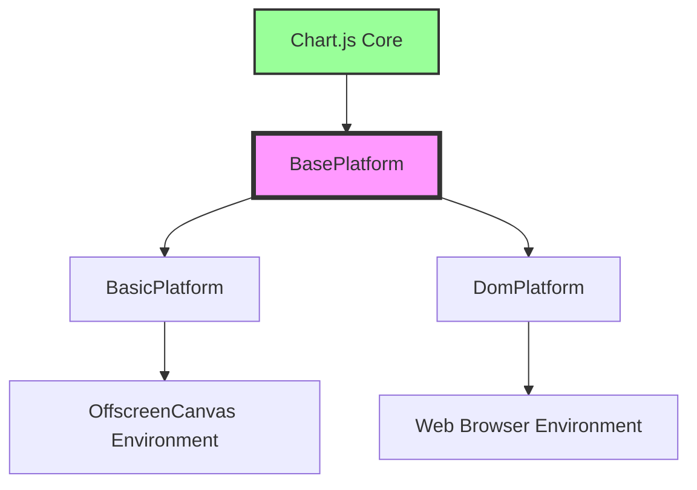
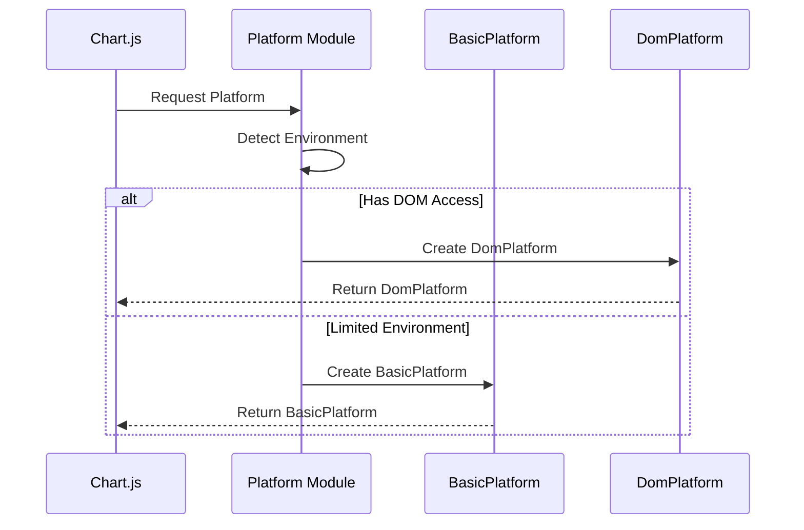

# Platform Module Documentation

## Overview

The Platform module is a critical abstraction layer in Chart.js that handles platform-specific operations and dependencies. It provides a unified interface for different execution environments (web browsers, Node.js, OffscreenCanvas, etc.) while abstracting away platform-specific implementation details from the core charting logic.

## Purpose

The Platform module serves as the bridge between Chart.js and the underlying execution environment, handling:

- **Canvas Context Management**: Acquiring and releasing 2D rendering contexts
- **Event Handling**: Managing user interactions and DOM events
- **Device Pixel Ratio**: Handling high-DPI displays and responsive scaling
- **Canvas Sizing**: Managing canvas dimensions and aspect ratios
- **Platform Detection**: Determining the appropriate platform implementation

## Architecture



### Core Components

#### 1. BasePlatform ([`src.platform.platform.base.BasePlatform`](base-platform.md))
The abstract base class that defines the platform interface contract. All platform implementations must extend this class and implement its methods.

**Key Responsibilities:**
- Define the platform API contract
- Provide default implementations for common operations
- Handle basic canvas sizing calculations

#### 2. BasicPlatform ([`src.platform.platform.basic.BasicPlatform`](basic-platform.md))
A minimal platform implementation designed for environments with limited DOM access, such as OffscreenCanvas or Node.js environments.

**Key Responsibilities:**
- Basic canvas context acquisition
- Disable animations for performance
- Minimal platform capabilities

#### 3. DomPlatform ([`src.platform.platform.dom.DomPlatform`](dom-platform.md))
The full-featured platform implementation for web browsers with complete DOM access and event handling capabilities.

**Key Responsibilities:**
- Advanced canvas context management
- DOM event handling and normalization
- Responsive resize handling
- Device pixel ratio management
- Canvas lifecycle management

## Platform Selection Process



## Key Features

### 1. Canvas Context Management
The platform module handles the acquisition and release of 2D rendering contexts, ensuring proper cleanup and resource management.

### 2. Event System Integration
DomPlatform provides sophisticated event handling including:
- Touch event normalization
- Pointer event support
- Resize observation
- Canvas attachment/detachment detection

### 3. Responsive Design Support
Automatic handling of canvas resizing, device pixel ratio changes, and container size modifications.

### 4. Cross-Platform Compatibility
Abstracts platform differences, allowing Chart.js to run in various environments without modification.

## Integration with Other Modules

The Platform module interacts with several other Chart.js modules:

- **[Core Module](core.md)**: Provides the foundation for chart rendering and configuration
- **[Helpers Module](helpers.md)**: Utilizes DOM helpers and utility functions
- **[Types Module](types.md)**: Defines platform-related TypeScript interfaces

## Usage Examples

### Basic Platform Usage
```javascript
// Platform is automatically selected based on environment
const chart = new Chart(ctx, {
  type: 'line',
  data: data,
  options: options
});
```

### Custom Platform Implementation
```javascript
class CustomPlatform extends BasePlatform {
  acquireContext(canvas, aspectRatio) {
    // Custom context acquisition logic
  }
  
  releaseContext(context) {
    // Custom cleanup logic
  }
  
  // Implement other required methods...
}
```

## Performance Considerations

- **BasicPlatform**: Optimized for performance by disabling animations
- **DomPlatform**: Includes throttling for resize events to prevent performance issues
- **Device Pixel Ratio**: Automatically handles high-DPI displays for crisp rendering

## Browser Compatibility

The DomPlatform includes specific handling for:
- Modern browsers with ResizeObserver support
- Legacy browsers with fallback mechanisms
- Touch and pointer event normalization
- Canvas fingerprinting protection

## Platform-Specific Behaviors

### Web Browser (DomPlatform)
- Full event handling capabilities
- Responsive resize handling
- High-DPI display support
- DOM mutation observation

### Limited Environment (BasicPlatform)
- Minimal event handling
- Disabled animations
- Basic context management
- No DOM dependencies

This modular design ensures Chart.js can adapt to various deployment scenarios while maintaining consistent API behavior across platforms.